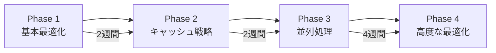

# GitHub Actions CI/CDパフォーマンス最適化ガイド

**エス・エー・エス株式会社**  
*最終更新: 2025-09-10*

## 目次
- [概要](#概要)
- [パフォーマンス最適化戦略](#パフォーマンス最適化戦略)
- [実行時間最適化](#実行時間最適化)
- [キャッシュ戦略](#キャッシュ戦略)
- [コスト最適化](#コスト最適化)
- [品質保持とパフォーマンス両立](#品質保持とパフォーマンス両立)
- [監視と継続改善](#監視と継続改善)
- [環境別最適化](#環境別最適化)
- [実装ガイド](#実装ガイド)

## 概要

### 目標指標
- **実行時間**: 30-50%削減
- **コスト**: 40%削減
- **キャッシュヒット率**: 85%以上
- **並列度**: 3-5倍向上
- **品質**: 現状維持または向上

### 投資対効果（ROI）
```
初期導入コスト: 約40時間
月間削減効果:
- 実行時間: 500分 → 250分（50%削減）
- コスト: $100 → $60（40%削減）
- 開発者待ち時間: 200時間 → 100時間
ROI期間: 2-3ヶ月
```

## パフォーマンス最適化戦略

### 1. 優先度マトリックス

| 施策 | 効果 | 実装難易度 | 優先度 |
|------|------|------------|--------|
| 並列処理実装 | 高 | 低 | S |
| 依存関係キャッシュ | 高 | 低 | S |
| Job依存関係最適化 | 高 | 中 | A |
| Docker Layerキャッシュ | 高 | 中 | A |
| Self-hosted Runner | 高 | 高 | B |
| テスト分割実行 | 中 | 中 | B |
| 条件付き実行 | 中 | 低 | A |
| リソース最適化 | 低 | 低 | C |

### 2. 段階的導入計画



## 実行時間最適化

### 並列処理最適化

#### マトリックス戦略による並列テスト
```yaml
strategy:
  matrix:
    node-version: [16, 18, 20]
    os: [ubuntu-latest]
    shard: [1, 2, 3, 4]  # テストを4分割
  fail-fast: false  # 1つ失敗しても他は継続
  max-parallel: 8    # 最大並列数

steps:
  - name: Run Tests (Shard ${{ matrix.shard }}/4)
    run: |
      npm test -- --shard=${{ matrix.shard }}/4
```

#### Job並列実行の最適化
```yaml
jobs:
  # 依存関係のないジョブは並列実行
  lint:
    runs-on: ubuntu-latest
    steps:
      - uses: actions/checkout@v4
      - name: Run Lint
        run: npm run lint

  type-check:
    runs-on: ubuntu-latest
    steps:
      - uses: actions/checkout@v4
      - name: Type Check
        run: npm run type-check

  security-scan:
    runs-on: ubuntu-latest
    steps:
      - uses: actions/checkout@v4
      - name: Security Scan
        run: npm audit

  # 依存関係のあるジョブは待機
  build:
    needs: [lint, type-check]
    runs-on: ubuntu-latest
    steps:
      - name: Build Application
        run: npm run build
```

### 段階的実行戦略

#### Fail Fast実装
```yaml
jobs:
  quick-checks:
    runs-on: ubuntu-latest
    outputs:
      should-continue: ${{ steps.check.outputs.continue }}
    steps:
      - name: Quick Validation
        id: check
        run: |
          # 軽量な検証を先に実行
          npm run lint:quick
          npm run test:smoke
          echo "continue=true" >> $GITHUB_OUTPUT

  full-tests:
    needs: quick-checks
    if: needs.quick-checks.outputs.should-continue == 'true'
    runs-on: ubuntu-latest
    steps:
      - name: Full Test Suite
        run: npm test
```

#### 差分ベース実行
```yaml
- name: Detect Changes
  uses: dorny/paths-filter@v2
  id: changes
  with:
    filters: |
      frontend:
        - 'src/frontend/**'
        - 'package.json'
      backend:
        - 'src/backend/**'
        - 'requirements.txt'
      docs:
        - 'docs/**'
        - '*.md'

- name: Frontend Tests
  if: steps.changes.outputs.frontend == 'true'
  run: npm test

- name: Backend Tests
  if: steps.changes.outputs.backend == 'true'
  run: pytest

- name: Skip Docs Build
  if: steps.changes.outputs.docs != 'true'
  run: echo "No documentation changes, skipping build"
```

### リソース使用量最適化

#### ランナー種別の選択基準
```yaml
jobs:
  # 軽量タスクは小規模ランナー
  lint:
    runs-on: ubuntu-latest  # 2 vCPU, 7GB RAM

  # 重いビルドは大規模ランナー
  build-large:
    runs-on: ubuntu-latest-8-cores  # 8 vCPU, 32GB RAM
    
  # Windows特有のテスト
  windows-test:
    runs-on: windows-latest
    
  # コスト重視のタスク
  archive:
    runs-on: ubuntu-latest
    timeout-minutes: 10  # タイムアウト設定
```

## キャッシュ戦略

### 依存関係キャッシュ最適化

#### Node.js最適化キャッシュ
```yaml
- name: Setup Node.js
  uses: actions/setup-node@v4
  with:
    node-version: '18'
    cache: 'npm'

- name: Advanced NPM Cache
  uses: actions/cache@v3
  with:
    path: |
      ~/.npm
      node_modules
      .next/cache
    key: ${{ runner.os }}-npm-${{ hashFiles('**/package-lock.json') }}-${{ hashFiles('**/*.js', '**/*.ts') }}
    restore-keys: |
      ${{ runner.os }}-npm-${{ hashFiles('**/package-lock.json') }}-
      ${{ runner.os }}-npm-
```

#### Python最適化キャッシュ
```yaml
- name: Setup Python
  uses: actions/setup-python@v4
  with:
    python-version: '3.11'
    cache: 'pip'

- name: Advanced Pip Cache
  uses: actions/cache@v3
  with:
    path: |
      ~/.cache/pip
      .venv
      ~/.local
    key: ${{ runner.os }}-pip-${{ hashFiles('**/requirements*.txt') }}-${{ hashFiles('**/*.py') }}
    restore-keys: |
      ${{ runner.os }}-pip-${{ hashFiles('**/requirements*.txt') }}-
      ${{ runner.os }}-pip-
```

### Docker Layerキャッシュ

#### Buildxによる高度なキャッシュ
```yaml
- name: Set up Docker Buildx
  uses: docker/setup-buildx-action@v3

- name: Build with Cache
  uses: docker/build-push-action@v5
  with:
    context: .
    push: true
    tags: ${{ env.REGISTRY }}/${{ env.IMAGE_NAME }}:${{ github.sha }}
    cache-from: |
      type=registry,ref=${{ env.REGISTRY }}/${{ env.IMAGE_NAME }}:buildcache
      type=gha
    cache-to: |
      type=registry,ref=${{ env.REGISTRY }}/${{ env.IMAGE_NAME }}:buildcache,mode=max
      type=gha,mode=max
    build-args: |
      BUILDKIT_INLINE_CACHE=1
```

### ワークフロー間キャッシュ共有

#### Artifacts vs Cache使い分け
```yaml
# ビルド成果物の共有（Artifacts使用）
- name: Upload Build Artifacts
  uses: actions/upload-artifact@v3
  with:
    name: build-output
    path: dist/
    retention-days: 1  # 短期保持

# 他のジョブで利用
- name: Download Build Artifacts
  uses: actions/download-artifact@v3
  with:
    name: build-output
    path: dist/

# 依存関係のキャッシュ（Cache使用）
- name: Cache Dependencies
  uses: actions/cache@v3
  with:
    path: node_modules
    key: deps-${{ hashFiles('package-lock.json') }}
```

## コスト最適化

### 実行時間削減技術

#### 並列度の最適化
```yaml
# コスト効率的な並列設定
strategy:
  matrix:
    # 過度な並列化を避ける
    shard: [1, 2, 3]  # 3並列が最適
  max-parallel: 3  # 同時実行数制限

# タイムアウト設定
timeout-minutes: 30  # ジョブレベル
steps:
  - name: Test
    timeout-minutes: 10  # ステップレベル
```

#### 無駄な処理の削除
```yaml
# Before（非効率）
- run: npm ci
- run: npm run build
- run: npm test
- run: npm run lint

# After（最適化）
- run: |
    npm ci --prefer-offline --no-audit
    npm run build:prod
    npm test -- --ci --coverage=false
    npm run lint -- --quiet
```

### 従量課金対策

#### 実行頻度の最適化
```yaml
on:
  push:
    branches: [main]
    paths-ignore:
      - '**.md'
      - 'docs/**'
      - '.github/**'
  pull_request:
    types: [opened, synchronize]
  schedule:
    # 深夜の実行を避ける
    - cron: '0 9 * * 1-5'  # 平日9時のみ
```

#### キャンセル戦略
```yaml
concurrency:
  group: ${{ github.workflow }}-${{ github.ref }}
  cancel-in-progress: true  # 古い実行をキャンセル
```

### Self-hosted Runners検討

#### コスト比較分析
```
GitHub-hosted Runner:
- 月2,000分無料
- $0.008/分（Linux）
- 月間5,000分使用時: $24

Self-hosted Runner (AWS EC2):
- t3.medium: $30/月（常時起動）
- オンデマンド起動: $10-15/月
- 管理コスト: 5時間/月

損益分岐点: 月3,750分以上の使用
```

#### 実装例
```yaml
runs-on: [self-hosted, linux, x64]
# または
runs-on: ${{ matrix.runner }}
strategy:
  matrix:
    include:
      - runner: ubuntu-latest  # 軽量タスク
      - runner: [self-hosted, heavy]  # 重いタスク
```

## 品質保持とパフォーマンス両立

### テスト最適化

#### テストの階層化
```yaml
# レベル1: Smoke Test（1分以内）
smoke-test:
  if: github.event_name == 'pull_request'
  run: npm test:smoke

# レベル2: Integration Test（5分以内）
integration-test:
  if: github.event_name == 'push'
  run: npm test:integration

# レベル3: Full Test（15分以内）
full-test:
  if: github.ref == 'refs/heads/main'
  run: npm test:all
```

#### 並列テスト実行
```yaml
- name: Jest Parallel Tests
  run: |
    npx jest --maxWorkers=4 \
             --coverage=false \
             --bail=1 \
             --changedSince=main

- name: Pytest Parallel
  run: |
    pytest -n auto \
           --dist loadgroup \
           --maxfail=3
```

### セキュリティスキャン最適化

#### 増分スキャン
```yaml
- name: Incremental Security Scan
  run: |
    # 変更ファイルのみスキャン
    git diff --name-only origin/main...HEAD | \
    xargs -I {} npm audit --audit-level=moderate {}
    
    # 週次で完全スキャン
    if [[ $(date +%u) == 1 ]]; then
      npm audit --audit-level=low
    fi
```

### 静的解析最適化

#### 段階的解析
```yaml
- name: Quick Lint
  if: github.event_name == 'pull_request'
  run: |
    # 変更ファイルのみ
    npx eslint $(git diff --name-only --diff-filter=ACMRT origin/main | grep -E '\.(js|ts)$')

- name: Full Analysis
  if: github.ref == 'refs/heads/main'
  run: |
    npx eslint .
    npx tsc --noEmit
    npm run analyze:complexity
```

## 監視と継続改善

### パフォーマンスメトリクス収集

#### ワークフロー実行時間追跡
```yaml
- name: Collect Metrics
  if: always()
  run: |
    echo "WORKFLOW_DURATION=$((SECONDS))" >> $GITHUB_ENV
    
    # メトリクス送信
    curl -X POST https://metrics.example.com/api/v1/workflow \
      -H "Content-Type: application/json" \
      -d '{
        "workflow": "${{ github.workflow }}",
        "duration": '$SECONDS',
        "status": "${{ job.status }}",
        "runner": "${{ runner.os }}",
        "ref": "${{ github.ref }}"
      }'
```

#### カスタムメトリクス
```yaml
- name: Performance Report
  uses: actions/github-script@v7
  with:
    script: |
      const startTime = new Date('${{ steps.start.outputs.time }}');
      const endTime = new Date();
      const duration = (endTime - startTime) / 1000;
      
      // コメントに投稿
      github.rest.issues.createComment({
        issue_number: context.issue.number,
        owner: context.repo.owner,
        repo: context.repo.repo,
        body: `## Performance Report
        - Duration: ${duration}s
        - Cache Hit: ${{ steps.cache.outputs.cache-hit }}
        - Test Coverage: ${{ steps.test.outputs.coverage }}%`
      });
```

### DORAメトリクス実装

```yaml
- name: Track DORA Metrics
  run: |
    # Deployment Frequency
    echo "deployment_frequency=$(git log --since='1 week ago' --grep='deploy' --oneline | wc -l)" >> metrics.txt
    
    # Lead Time for Changes
    COMMIT_TIME=$(git log -1 --format=%ct)
    CURRENT_TIME=$(date +%s)
    LEAD_TIME=$((CURRENT_TIME - COMMIT_TIME))
    echo "lead_time=$LEAD_TIME" >> metrics.txt
    
    # Change Failure Rate
    FAILED_DEPLOYS=$(git log --since='1 month ago' --grep='revert\|rollback' --oneline | wc -l)
    TOTAL_DEPLOYS=$(git log --since='1 month ago' --grep='deploy' --oneline | wc -l)
    echo "failure_rate=$((FAILED_DEPLOYS * 100 / TOTAL_DEPLOYS))%" >> metrics.txt
```

## 環境別最適化

### Dev環境最適化

```yaml
name: Dev Environment CI/CD

on:
  push:
    branches: [dev, feature/*]

env:
  ENVIRONMENT: dev
  SKIP_EXPENSIVE_CHECKS: true

jobs:
  quick-deploy:
    runs-on: ubuntu-latest
    timeout-minutes: 10
    steps:
      - uses: actions/checkout@v4
        with:
          fetch-depth: 0  # 差分検出用
      
      - name: Minimal Tests
        run: |
          npm test:unit -- --bail
          npm run lint:changed
      
      - name: Fast Build
        run: |
          npm run build:dev -- --skip-optimize
      
      - name: Deploy to Dev
        run: |
          npm run deploy:dev -- --skip-health-check
```

### Staging環境最適化

```yaml
name: Staging Environment CI/CD

on:
  push:
    branches: [staging]

env:
  ENVIRONMENT: staging
  RUN_INTEGRATION_TESTS: true

jobs:
  staging-deploy:
    runs-on: ubuntu-latest
    timeout-minutes: 20
    steps:
      - name: Standard Tests
        run: |
          npm test
          npm run test:integration
      
      - name: Optimized Build
        run: |
          npm run build:staging
      
      - name: Smoke Tests
        run: |
          npm run test:e2e -- --smoke
      
      - name: Deploy to Staging
        run: |
          npm run deploy:staging
          npm run health-check:staging
```

### Production環境最適化（将来）

```yaml
name: Production Deployment

on:
  push:
    branches: [main]
  workflow_dispatch:

env:
  ENVIRONMENT: production
  FULL_VALIDATION: true

jobs:
  production-deploy:
    runs-on: [self-hosted, production]
    timeout-minutes: 30
    steps:
      - name: Full Test Suite
        run: |
          npm test:all
          npm run test:performance
          npm run test:security
      
      - name: Production Build
        run: |
          npm run build:prod
          npm run optimize:assets
      
      - name: Blue-Green Deploy
        run: |
          npm run deploy:blue
          npm run test:smoke:blue
          npm run switch:blue-green
          npm run test:production
```

## 実装ガイド

### 段階的導入チェックリスト

#### Phase 1: 基本最適化（Week 1-2）
- [ ] 並列処理の基本実装
- [ ] タイムアウト設定
- [ ] 不要な処理の削除
- [ ] 基本的なキャッシュ設定

#### Phase 2: キャッシュ戦略（Week 3-4）
- [ ] 依存関係キャッシュの最適化
- [ ] Docker Layerキャッシュ
- [ ] ビルド成果物の共有
- [ ] キャッシュ無効化戦略

#### Phase 3: 並列処理強化（Week 5-6）
- [ ] マトリックス戦略の実装
- [ ] テスト分割実行
- [ ] Job依存関係の最適化
- [ ] 条件付き実行の実装

#### Phase 4: 高度な最適化（Week 7-8）
- [ ] Self-hosted Runner検討
- [ ] 監視システムの構築
- [ ] コスト分析ツール導入
- [ ] 継続的改善プロセス確立

### トラブルシューティング

#### よくある問題と解決策

| 問題 | 原因 | 解決策 |
|------|------|--------|
| キャッシュミス頻発 | キーが厳密すぎる | restore-keysを活用 |
| 並列実行エラー | リソース競合 | max-parallel制限 |
| タイムアウト | 処理が重い | ジョブ分割・最適化 |
| コスト超過 | 無駄な実行 | concurrency設定 |

### ベストプラクティス

1. **計測してから最適化**
   - ボトルネックを特定
   - ベースライン測定
   - 改善効果の定量化

2. **段階的な適用**
   - 小さな改善から開始
   - 効果測定
   - 徐々に拡大

3. **品質の維持**
   - テストカバレッジ維持
   - セキュリティチェック継続
   - ロールバック可能性確保

4. **チーム教育**
   - ガイドライン共有
   - ペアプログラミング
   - 定期的なレビュー

## 関連ドキュメント

- [CICD_BEST_PRACTICES.md](./CICD_BEST_PRACTICES.md) - CI/CDベストプラクティス
- [GITHUB_ACTIONS_OPERATIONS.md](./GITHUB_ACTIONS_OPERATIONS.md) - GitHub Actions運用ガイド
- [最適化済みワークフローテンプレート](./.github/workflows/optimized/) - 実装例
- [パフォーマンス監視ダッシュボード](./scripts/performance-monitor/) - 監視ツール
- [コスト管理ツール](./scripts/cost-analyzer/) - コスト分析

---

**注意事項**
- 本ガイドは継続的に更新されます
- 実装前に必ずテスト環境で検証してください
- 質問・改善提案は github@sas-com.com まで