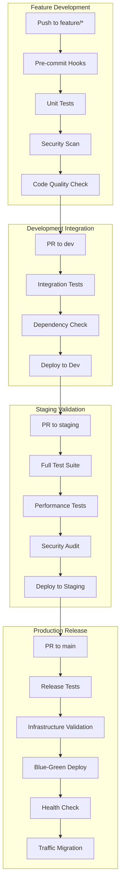

# CI/CDワークフロー設計書

**エス・エー・エス株式会社**  
**SAS Flow対応CI/CDパイプライン設計**

## 1. 概要

### 1.1 設計思想
- **自動化優先**: 手動作業を最小限に抑制
- **段階的品質保証**: 環境間での段階的テスト強化
- **高速フィードバック**: 早期の問題検出と迅速な修正
- **セキュリティファースト**: すべての段階でセキュリティチェック
- **可観測性**: 全プロセスの可視化と監視

### 1.2 パイプライン構成


## 2. 環境別パイプライン設計

### 2.1 開発環境（dev）パイプライン
```yaml
# .github/workflows/dev-pipeline.yml
name: Development Pipeline

on:
  push:
    branches: [dev]
  pull_request:
    branches: [dev]

env:
  ENVIRONMENT: development
  REGISTRY: ghcr.io/sas-com
  KUBERNETES_NAMESPACE: sas-dev

jobs:
  code-quality:
    runs-on: ubuntu-latest
    timeout-minutes: 10
    steps:
      - uses: actions/checkout@v4
      - name: Setup Node.js
        uses: actions/setup-node@v4
        with:
          node-version: '18'
          cache: 'npm'
      
      - name: Install dependencies
        run: npm ci
      
      - name: Lint
        run: npm run lint
      
      - name: Format check
        run: npm run format:check
      
      - name: Type check
        run: npm run type:check

  unit-tests:
    runs-on: ubuntu-latest
    timeout-minutes: 15
    strategy:
      matrix:
        service: [user-service, order-service, payment-service]
    steps:
      - uses: actions/checkout@v4
      
      - name: Run unit tests
        run: |
          cd services/${{ matrix.service }}
          npm ci
          npm run test:unit -- --coverage
      
      - name: Upload coverage
        uses: codecov/codecov-action@v3
        with:
          file: ./services/${{ matrix.service }}/coverage/lcov.info
          flags: ${{ matrix.service }}

  security-scan:
    runs-on: ubuntu-latest
    timeout-minutes: 20
    steps:
      - uses: actions/checkout@v4
      
      - name: Secret scan
        uses: trufflesecurity/trufflehog@main
        with:
          path: ./
          base: main
          head: HEAD
      
      - name: Dependency vulnerability scan
        run: npm audit --audit-level=high
      
      - name: SAST scan
        uses: securecodewarrior/github-action-add-sarif@v1
        with:
          sarif-file: 'security-scan-results.sarif'

  integration-tests:
    needs: [code-quality, unit-tests, security-scan]
    runs-on: ubuntu-latest
    timeout-minutes: 30
    services:
      postgres:
        image: postgres:15
        env:
          POSTGRES_PASSWORD: postgres
        options: >-
          --health-cmd pg_isready
          --health-interval 10s
          --health-timeout 5s
          --health-retries 5
    
    steps:
      - uses: actions/checkout@v4
      
      - name: Setup test environment
        run: |
          docker-compose -f docker-compose.test.yml up -d
          ./scripts/wait-for-services.sh
      
      - name: Run integration tests
        run: |
          npm run test:integration
          npm run test:contract
      
      - name: Cleanup
        run: docker-compose -f docker-compose.test.yml down

  deploy-dev:
    needs: integration-tests
    runs-on: ubuntu-latest
    if: github.ref == 'refs/heads/dev'
    environment: development
    steps:
      - uses: actions/checkout@v4
      
      - name: Setup kubectl
        uses: azure/setup-kubectl@v1
      
      - name: Deploy to development
        run: |
          kubectl config use-context dev-cluster
          kubectl apply -f k8s/dev/ -n ${{ env.KUBERNETES_NAMESPACE }}
          kubectl rollout status deployment -n ${{ env.KUBERNETES_NAMESPACE }}
      
      - name: Smoke tests
        run: ./scripts/smoke-tests.sh dev
```

### 2.2 ステージング環境（staging）パイプライン
```yaml
# .github/workflows/staging-pipeline.yml
name: Staging Pipeline

on:
  push:
    branches: [staging]
  pull_request:
    branches: [staging]

env:
  ENVIRONMENT: staging
  KUBERNETES_NAMESPACE: sas-staging

jobs:
  full-test-suite:
    runs-on: ubuntu-latest
    timeout-minutes: 45
    strategy:
      matrix:
        test-type: [unit, integration, contract, e2e]
    steps:
      - uses: actions/checkout@v4
      
      - name: Setup test environment
        run: |
          docker-compose -f docker-compose.staging.yml up -d
          ./scripts/setup-test-data.sh staging
      
      - name: Run ${{ matrix.test-type }} tests
        run: npm run test:${{ matrix.test-type }}
      
      - name: Generate test report
        uses: dorny/test-reporter@v1
        with:
          name: ${{ matrix.test-type }}-tests
          path: test-results/*.xml
          reporter: jest-junit

  performance-tests:
    needs: full-test-suite
    runs-on: ubuntu-latest
    timeout-minutes: 30
    steps:
      - uses: actions/checkout@v4
      
      - name: Setup K6
        run: |
          sudo apt-key adv --keyserver hkp://keyserver.ubuntu.com:80 --recv-keys C5AD17C747E3415A3642D57D77C6C491D6AC1D69
          echo "deb https://dl.k6.io/deb stable main" | sudo tee /etc/apt/sources.list.d/k6.list
          sudo apt-get update
          sudo apt-get install k6
      
      - name: Run load tests
        run: |
          k6 run --out json=results.json tests/performance/load-test.js
          k6 run --out json=spike-results.json tests/performance/spike-test.js
      
      - name: Performance regression check
        run: |
          python scripts/performance-regression-check.py \
            --current results.json \
            --baseline performance-baseline.json \
            --threshold 10

  security-audit:
    needs: full-test-suite
    runs-on: ubuntu-latest
    timeout-minutes: 25
    steps:
      - uses: actions/checkout@v4
      
      - name: Container security scan
        run: |
          docker build -t staging-image .
          docker run --rm -v /var/run/docker.sock:/var/run/docker.sock \
            -v $PWD:/root/.cache/ aquasec/trivy:latest image \
            --exit-code 1 --severity HIGH,CRITICAL staging-image
      
      - name: Infrastructure security scan
        run: |
          terraform init
          terraform plan -out=tfplan
          terraform show -json tfplan | tfsec --stdin-json
      
      - name: Runtime security check
        run: ./scripts/runtime-security-check.sh staging

  deploy-staging:
    needs: [performance-tests, security-audit]
    runs-on: ubuntu-latest
    if: github.ref == 'refs/heads/staging'
    environment: staging
    steps:
      - uses: actions/checkout@v4
      
      - name: Deploy to staging
        run: |
          kubectl config use-context staging-cluster
          helm upgrade --install sas-app ./helm-charts/sas-app \
            --namespace ${{ env.KUBERNETES_NAMESPACE }} \
            --values helm-charts/values-staging.yaml \
            --wait --timeout=10m
      
      - name: Post-deployment validation
        run: |
          ./scripts/health-check.sh staging
          ./scripts/acceptance-tests.sh staging
```

### 2.3 本番環境（main）パイプライン
```yaml
# .github/workflows/production-pipeline.yml
name: Production Pipeline

on:
  push:
    branches: [main]
  pull_request:
    branches: [main]

env:
  ENVIRONMENT: production
  KUBERNETES_NAMESPACE: sas-prod

jobs:
  release-validation:
    runs-on: ubuntu-latest
    timeout-minutes: 20
    steps:
      - uses: actions/checkout@v4
      
      - name: Validate semantic versioning
        run: |
          CURRENT_VERSION=$(git tag --sort=-version:refname | head -n1)
          NEXT_VERSION=$(./scripts/calculate-next-version.sh)
          echo "Current: $CURRENT_VERSION, Next: $NEXT_VERSION"
      
      - name: Generate changelog
        run: |
          ./scripts/generate-changelog.sh > CHANGELOG.md
          git add CHANGELOG.md
      
      - name: Validate release notes
        run: |
          if [ ! -f "release-notes/$(date +%Y-%m-%d).md" ]; then
            echo "Release notes missing"
            exit 1
          fi

  infrastructure-validation:
    needs: release-validation
    runs-on: ubuntu-latest
    timeout-minutes: 15
    steps:
      - uses: actions/checkout@v4
      
      - name: Terraform validation
        run: |
          terraform init -backend-config="bucket=sas-terraform-state"
          terraform validate
          terraform plan -out=prod-plan
      
      - name: Infrastructure drift detection
        run: |
          terraform refresh
          terraform show -no-color > current-state.txt
          if [ -s infrastructure-drift.txt ]; then
            echo "Infrastructure drift detected"
            exit 1
          fi

  blue-green-deploy:
    needs: infrastructure-validation
    runs-on: ubuntu-latest
    if: github.ref == 'refs/heads/main'
    environment: production
    timeout-minutes: 45
    steps:
      - uses: actions/checkout@v4
      
      - name: Create green environment
        run: |
          kubectl config use-context prod-cluster
          helm upgrade --install sas-app-green ./helm-charts/sas-app \
            --namespace sas-green \
            --values helm-charts/values-production.yaml \
            --set image.tag=${{ github.sha }} \
            --wait --timeout=15m
      
      - name: Green environment validation
        run: |
          ./scripts/health-check.sh green
          ./scripts/smoke-tests.sh green
          ./scripts/critical-path-tests.sh green
      
      - name: Traffic migration (5%)
        run: |
          kubectl apply -f k8s/traffic-split-5-95.yaml
          sleep 300 # 5分間監視
          ./scripts/error-rate-check.sh
      
      - name: Traffic migration (50%)
        run: |
          kubectl apply -f k8s/traffic-split-50-50.yaml
          sleep 600 # 10分間監視
          ./scripts/comprehensive-health-check.sh
      
      - name: Complete traffic migration
        run: |
          kubectl apply -f k8s/traffic-split-100-0.yaml
          sleep 300
          ./scripts/final-validation.sh
      
      - name: Cleanup blue environment
        run: |
          helm uninstall sas-app-blue -n sas-blue
          kubectl delete namespace sas-blue

  post-deployment:
    needs: blue-green-deploy
    runs-on: ubuntu-latest
    steps:
      - uses: actions/checkout@v4
      
      - name: Create release tag
        run: |
          VERSION=$(./scripts/calculate-next-version.sh)
          git tag -a $VERSION -m "Release $VERSION"
          git push origin $VERSION
      
      - name: Update monitoring dashboards
        run: ./scripts/update-monitoring-dashboards.sh $VERSION
      
      - name: Send deployment notification
        run: |
          ./scripts/send-teams-notification.sh \
            "✅ Production deployment successful: $VERSION"
```

## 3. 緊急対応パイプライン

### 3.1 ホットフィックスパイプライン
```yaml
# .github/workflows/hotfix-pipeline.yml
name: Hotfix Pipeline

on:
  push:
    branches: ['hotfix/**']

jobs:
  hotfix-validation:
    runs-on: ubuntu-latest
    timeout-minutes: 15
    steps:
      - uses: actions/checkout@v4
      
      - name: Validate hotfix branch
        run: |
          BRANCH_NAME=${{ github.ref_name }}
          if [[ ! $BRANCH_NAME =~ ^hotfix/(critical|high|medium|low)/.+/SAS-[0-9]{4}-[0-9]{3}$ ]]; then
            echo "Invalid hotfix branch name format"
            exit 1
          fi
      
      - name: Extract severity level
        run: |
          SEVERITY=$(echo ${{ github.ref_name }} | cut -d'/' -f2)
          echo "SEVERITY=$SEVERITY" >> $GITHUB_ENV
      
      - name: Run essential tests only
        run: |
          npm run test:critical-path
          npm run test:security-essentials

  emergency-deploy:
    needs: hotfix-validation
    runs-on: ubuntu-latest
    if: contains(github.ref_name, 'hotfix/critical/') || contains(github.ref_name, 'hotfix/high/')
    environment: production
    steps:
      - uses: actions/checkout@v4
      
      - name: Emergency deployment
        run: |
          # Skip normal validation for critical issues
          kubectl config use-context prod-cluster
          kubectl set image deployment/sas-app \
            app=${{ env.REGISTRY }}/sas-app:${{ github.sha }} \
            -n sas-prod
          kubectl rollout status deployment/sas-app -n sas-prod
      
      - name: Immediate health check
        run: ./scripts/critical-health-check.sh
      
      - name: Emergency notification
        run: |
          ./scripts/send-emergency-notification.sh \
            "🚨 Emergency hotfix deployed: ${{ github.ref_name }}"
```

## 4. マイクロサービス依存関係管理

### 4.1 依存関係検証ワークフロー
```yaml
# .github/workflows/dependency-check.yml
name: Microservice Dependency Check

on:
  pull_request:
    paths: ['services/*/package.json', 'dependency-matrix.yaml']

jobs:
  dependency-validation:
    runs-on: ubuntu-latest
    steps:
      - uses: actions/checkout@v4
      
      - name: Validate dependency matrix
        run: |
          python scripts/validate-dependency-matrix.py \
            --matrix dependency-matrix.yaml \
            --services services/
      
      - name: Check for circular dependencies
        run: |
          ./scripts/check-circular-dependencies.sh
          if [ -f circular-deps.txt ]; then
            echo "Circular dependencies detected:"
            cat circular-deps.txt
            exit 1
          fi
      
      - name: Version compatibility check
        run: |
          python scripts/version-compatibility-check.py \
            --changes ${{ github.event.pull_request.changed_files }}
```

### 4.2 統合テスト最適化
```yaml
# .github/workflows/optimized-integration-tests.yml  
name: Optimized Integration Tests

on:
  push:
    branches: [dev, staging]

jobs:
  detect-changes:
    runs-on: ubuntu-latest
    outputs:
      changed-services: ${{ steps.changes.outputs.services }}
    steps:
      - uses: actions/checkout@v4
        with:
          fetch-depth: 0
      
      - name: Detect changed services
        id: changes
        run: |
          CHANGED_SERVICES=$(git diff --name-only HEAD~1 HEAD | \
            grep '^services/' | \
            cut -d'/' -f2 | \
            sort -u | \
            jq -R -s -c 'split("\n")[:-1]')
          echo "services=$CHANGED_SERVICES" >> $GITHUB_OUTPUT

  targeted-integration-tests:
    needs: detect-changes
    runs-on: ubuntu-latest
    strategy:
      matrix:
        service: ${{ fromJson(needs.detect-changes.outputs.changed-services) }}
    steps:
      - uses: actions/checkout@v4
      
      - name: Run service-specific integration tests
        run: |
          # 変更されたサービスと依存サービスのテストのみ実行
          DEPENDENT_SERVICES=$(python scripts/get-dependent-services.py ${{ matrix.service }})
          for service in ${{ matrix.service }} $DEPENDENT_SERVICES; do
            npm run test:integration --prefix services/$service
          done

  contract-tests:
    needs: detect-changes
    runs-on: ubuntu-latest
    steps:
      - uses: actions/checkout@v4
      
      - name: Run consumer-driven contract tests
        run: |
          # Pact テストの実行
          npm run test:pact:consumer
          npm run test:pact:provider
          
          # Contract の検証とアップデート
          ./scripts/verify-contracts.sh
```

## 5. 共通ライブラリ管理

### 5.1 共通ライブラリ更新パイプライン
```yaml
# .github/workflows/shared-library-update.yml
name: Shared Library Update

on:
  push:
    paths: ['shared/libraries/**']

jobs:
  library-validation:
    runs-on: ubuntu-latest
    steps:
      - uses: actions/checkout@v4
      
      - name: Run library tests
        run: |
          cd shared/libraries
          npm ci
          npm run test
          npm run build
      
      - name: Semantic version bump
        run: |
          cd shared/libraries
          npm run semantic-release
          NEW_VERSION=$(npm list --depth=0 | grep shared-lib | cut -d'@' -f2)
          echo "NEW_VERSION=$NEW_VERSION" >> $GITHUB_ENV

  impact-analysis:
    needs: library-validation
    runs-on: ubuntu-latest
    outputs:
      affected-services: ${{ steps.analysis.outputs.services }}
    steps:
      - uses: actions/checkout@v4
      
      - name: Analyze impact on services
        id: analysis
        run: |
          AFFECTED_SERVICES=$(python scripts/analyze-library-impact.py \
            --library shared-lib \
            --version ${{ env.NEW_VERSION }} \
            --services-dir services/)
          echo "services=$AFFECTED_SERVICES" >> $GITHUB_OUTPUT

  gradual-rollout:
    needs: [library-validation, impact-analysis]
    runs-on: ubuntu-latest
    strategy:
      matrix:
        service: ${{ fromJson(needs.impact-analysis.outputs.affected-services) }}
    steps:
      - name: Update service dependency
        run: |
          cd services/${{ matrix.service }}
          npm install shared-lib@${{ env.NEW_VERSION }}
          npm run test
          
          # Create PR for service update
          gh pr create \
            --title "chore(${{ matrix.service }}): update shared-lib to ${{ env.NEW_VERSION }}" \
            --body "Auto-generated PR for shared library update"
```

## 6. 監視・メトリクス

### 6.1 CI/CDメトリクス収集
```yaml
# .github/workflows/metrics-collection.yml
name: CI/CD Metrics Collection

on:
  workflow_run:
    workflows: ["Development Pipeline", "Staging Pipeline", "Production Pipeline"]
    types: [completed]

jobs:
  collect-metrics:
    runs-on: ubuntu-latest
    steps:
      - name: Calculate metrics
        run: |
          # Deployment frequency
          DEPLOYMENT_COUNT=$(gh api "repos/:owner/:repo/deployments" \
            --jq '.[] | select(.created_at >= "'"$(date -d '7 days ago' --iso-8601)"'") | .id' \
            | wc -l)
          echo "deployment_frequency_weekly=$DEPLOYMENT_COUNT" >> metrics.env
          
          # Lead time calculation
          LEAD_TIME=$(gh api "repos/:owner/:repo/pulls" --state closed \
            --jq '.[] | select(.merged_at != null) | (.merged_at | strptime("%Y-%m-%dT%H:%M:%SZ") | mktime) - (.created_at | strptime("%Y-%m-%dT%H:%M:%SZ") | mktime)' \
            | awk '{sum+=$1; count++} END {print sum/count/3600}')
          echo "lead_time_hours=$LEAD_TIME" >> metrics.env
      
      - name: Send metrics to monitoring system
        run: |
          source metrics.env
          curl -X POST "$METRICS_ENDPOINT" \
            -H "Authorization: Bearer $METRICS_TOKEN" \
            -d @metrics.env
```

### 6.2 パイプライン健全性監視
```yaml
# .github/workflows/pipeline-health.yml
name: Pipeline Health Monitoring

on:
  schedule:
    - cron: '0 */6 * * *' # 6時間ごと

jobs:
  health-check:
    runs-on: ubuntu-latest
    steps:
      - name: Check pipeline success rates
        run: |
          SUCCESS_RATE=$(gh api "repos/:owner/:repo/actions/runs" \
            --jq '.workflow_runs | map(select(.created_at >= "'"$(date -d '24 hours ago' --iso-8601)"'")) | group_by(.conclusion) | map({conclusion: .[0].conclusion, count: length}) | from_entries | .success / (.success + .failure + .cancelled) * 100')
          
          if [ $(echo "$SUCCESS_RATE < 95" | bc -l) -eq 1 ]; then
            ./scripts/send-alert.sh "Pipeline success rate below 95%: $SUCCESS_RATE%"
          fi
      
      - name: Check average build time
        run: |
          AVG_BUILD_TIME=$(gh api "repos/:owner/:repo/actions/runs" \
            --jq '.workflow_runs | map(select(.created_at >= "'"$(date -d '7 days ago' --iso-8601)"'" and .conclusion == "success")) | map((.updated_at | strptime("%Y-%m-%dT%H:%M:%SZ") | mktime) - (.created_at | strptime("%Y-%m-%dT%H:%M:%SZ") | mktime)) | add / length / 60')
          
          if [ $(echo "$AVG_BUILD_TIME > 30" | bc -l) -eq 1 ]; then
            ./scripts/send-alert.sh "Average build time exceeding 30 minutes: ${AVG_BUILD_TIME} minutes"
          fi
```

## 7. セキュリティ統合

### 7.1 セキュリティゲート
```yaml
security_gates:
  development:
    - secret_scan: "trufflehog"
    - dependency_check: "npm audit"
    - sast: "semgrep"
  
  staging:
    - container_scan: "trivy"
    - infrastructure_scan: "tfsec"
    - runtime_security: "falco"
  
  production:
    - penetration_test: "manual"
    - compliance_check: "automated"
    - security_review: "required"
```

## 8. 災害復旧・ロールバック

### 8.1 自動ロールバック
```yaml
# .github/workflows/auto-rollback.yml
name: Auto Rollback

on:
  workflow_run:
    workflows: ["Production Pipeline"]
    types: [completed]

jobs:
  monitor-deployment:
    if: ${{ github.event.workflow_run.conclusion == 'success' }}
    runs-on: ubuntu-latest
    steps:
      - name: Monitor health for 15 minutes
        run: |
          for i in {1..15}; do
            if ! ./scripts/health-check.sh production; then
              echo "Health check failed, initiating rollback"
              ./scripts/rollback.sh
              exit 1
            fi
            sleep 60
          done
```

---

**更新履歴**
- 2025-09-10: 初版作成（v1.0.0）

**承認者**: GitHub管理チーム, DevOpsチーム  
**関連ドキュメント**: 
- [SAS_FLOW_SPECIFICATION.md](/home/kurosawa/github-guidelines/SAS_FLOW_SPECIFICATION.md)
- [BRANCH_MANAGEMENT_RULES.md](/home/kurosawa/github-guidelines/BRANCH_MANAGEMENT_RULES.md)