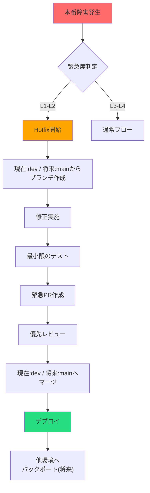
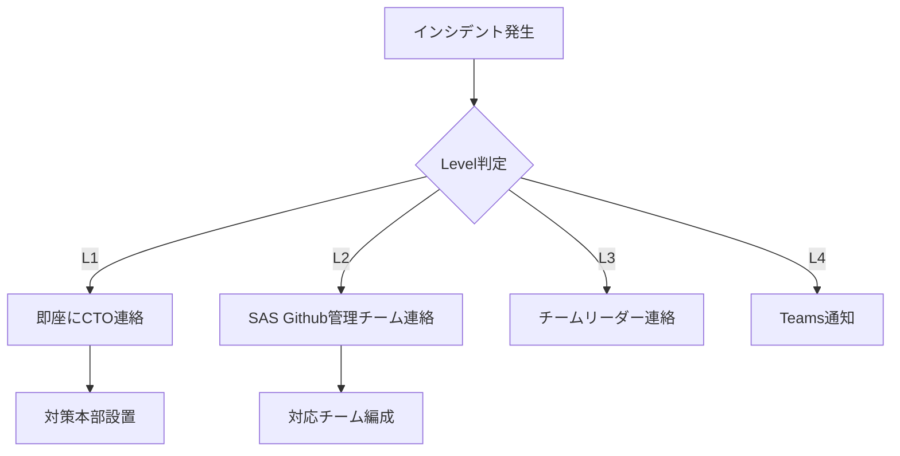

# GitHub 緊急時対応マニュアル

**エス・エー・エス株式会社**  
*最終更新: 2025年9月5日*  
*バージョン: 1.0.0*

## 🚨 このマニュアルについて

本マニュアルは、GitHub関連の緊急事態が発生した際の対応手順を定めたものです。
全開発者は本マニュアルの内容を把握し、緊急時に適切な対応ができるようにしてください。

---

## 🔴 緊急度レベル定義

| レベル | 名称 | 定義 | 初動時間 | 対応者 |
|--------|------|------|----------|--------|
| **L1** | Critical | システム停止・情報漏洩 | 即座（15分以内） | CTO + セキュリティチーム |
| **L2** | High | 重大な機能障害 | 1時間以内 | SAS Github管理チーム |
| **L3** | Medium | 部分的な機能障害 | 4時間以内 | SAS Github管理チーム |
| **L4** | Low | 軽微な問題 | 翌営業日 | SAS Github管理チーム |

---

## 📋 緊急時チェックリスト

### 即座に確認すること

```markdown
## 初動確認（5分以内）
- [ ] 影響範囲の特定
- [ ] 緊急度レベルの判定
- [ ] 関係者への初報連絡
- [ ] 証拠保全（スクリーンショット、ログ）

## 詳細確認（15分以内）
- [ ] 根本原因の調査開始
- [ ] 暫定対応の検討
- [ ] クライアントへの影響確認
- [ ] 対応体制の確立
```

---

## 🔒 セキュリティインシデント

### 1. 認証情報の漏洩

#### 状況
- APIキー、パスワード、秘密鍵などがコミットされた
- Publicリポジトリに機密情報が露出した

#### 対応手順

```bash
# 1. 即座に認証情報を無効化（5分以内）
# 該当サービスの管理画面から無効化

# 2. リポジトリをPrivateに変更（Public の場合）
# Settings → Danger Zone → Change visibility

# 3. 履歴から削除（BFG Repo-Cleanerを使用）
# BFGのダウンロード（Windows）
# https://rtyley.github.io/bfg-repo-cleaner/ からbfg-x.x.x.jar をダウンロード

# リポジトリのクローン
git clone --mirror git@github.com:sas-com/[repository].git

# WSL2で実行
# 機密情報を含むファイルを削除
java -jar bfg-x.x.x.jar --delete-files [filename] [repository].git
# またはテキストを削除
java -jar bfg-x.x.x.jar --replace-text passwords.txt [repository].git

# 履歴のクリーンアップ
cd [repository].git
git reflog expire --expire=now --all
git gc --prune=now --aggressive

# 強制プッシュ
git push --force

# 4. 新しい認証情報を発行・設定
```

#### 報告テンプレート

```markdown
## セキュリティインシデント報告

**発生日時**: 2025/09/05 14:30
**発見者**: 山田太郎
**緊急度**: L1 (Critical)

### 漏洩内容
- 種類: [APIキー/パスワード/秘密鍵]
- サービス: [AWS/GitHub/Database等]
- 影響範囲: [本番(今後)/ステージング(今後)/開発(現在)]

### 実施済み対応
- [ ] 認証情報の無効化（完了時刻: ）
- [ ] リポジトリの非公開化（該当する場合）
- [ ] 履歴からの削除
- [ ] 新認証情報の発行

### 影響調査
- アクセスログの確認結果:
- 不正利用の形跡: [あり/なし]

### 再発防止策
- 
```

### 2. リポジトリの誤Public化

#### 対応手順

```markdown
## 即座対応（1分以内）
1. Settings → Danger Zone
2. Change visibility → Private を選択
3. 確認ダイアログで変更を確定

## 事後対応
1. アクセスログの確認
2. クローン/フォークの確認
3. 外部サービス連携の確認
4. クライアントへの報告
```

### 3. 不正アクセス検知

#### 兆候
- 見覚えのないコミット
- 権限の不正な変更
- 大量のデータダウンロード

#### 対応手順

```markdown
## 緊急封じ込め
1. 該当アカウントの無効化
2. すべてのアクセストークン無効化
3. 2FA の強制リセット

## 調査
1. Audit log の確認（Enterprise版）
2. コミット履歴の精査
3. アクセスパターンの分析

## 復旧
1. 不正な変更のリバート
2. 正規アカウントの復活
3. セキュリティ強化策の実施
```

---

## 💥 システム障害

### 1. 本番環境への誤デプロイ（将来のケース）

#### 対応手順

```bash
# 1. 即座にロールバック
git revert [問題のコミットハッシュ]
# 将来: mainブランチにプッシュ
git push origin main --force-with-lease

# 2. デプロイパイプラインの停止
# GitHub Actions の場合
# Actions → 実行中のワークフロー → Cancel

# 3. 本番環境の状態確認
# 監視ツールでエラー率、レスポンスタイムを確認

# 4. 必要に応じて以前のDockerイメージでロールバック
kubectl rollout undo deployment/[deployment-name]
```

### 2. 重要ブランチの破壊（現在はdev、将来はmain）

#### 対応手順

```bash
# 1. 保護を一時解除（管理者権限必要）
# Settings → Branches → Protection rules → Edit

# 2. バックアップから復元
# 現在はdevブランチを復旧
git checkout dev  # 将来はmain
git reset --hard [最後の正常なコミット]
git push origin dev --force-with-lease  # 将来はmain

# 3. ブランチ保護を再設定
# Settings → Branches → Protection rules → 再度有効化

# 4. 全開発者に通知
# Teamsで周知: @here devブランチを復旧しました。最新をpullしてください
```

### 3. 大規模マージコンフリクト

#### 対応手順

```bash
# 1. 作業ブランチのバックアップ
git branch backup-[date]

# 2. コンフリクト解決
git checkout dev
git pull origin dev
git checkout feature/[branch]
git rebase dev  # または merge

# 3. 手動でコンフリクト解決
# VSCode等のマージツールを使用

# 4. チームで分担して解決
# 各モジュール担当者を招集
```

---

## 🔥 Hotfixフロー

### 緊急修正フロー



### Hotfixコマンド

```bash
# Hotfixブランチ作成
# 現在はdevブランチから作成
git checkout dev  # 将来はmain
git pull origin dev  # 将来はmain
git checkout -b hotfix/999-critical-bug

# 修正実施
# ... 修正作業 ...

# コミット
git add .
git commit -m "hotfix: [緊急度L1] クリティカルバグを修正

問題: ログイン機能が完全に停止
原因: 認証サーバーのURLタイポ
対応: URLを修正

Fixes #999"

# プッシュとPR
git push origin hotfix/999-critical-bug

# マージ後の処理（将来は他環境へのバックポート）
# 現在はdev環境のみのためスキップ
```

---

## 📞 緊急連絡網

### エスカレーションフロー



### 連絡先リスト

| 役職 | 担当範囲 | 連絡方法 | 対応可能時間 |
|------|----------|----------|-------------|
| **管理責任者** | 全体統括 | SAS Github管理チーム (github@sas-com.com) | 24時間 |
| **技術責任者** | 技術対応 | SAS Github管理チーム (github@sas-com.com) | 24時間 |
| **セキュリティ責任者** | セキュリティ | SAS Github管理チーム (github@sas-com.com) | 24時間 |
| **プロジェクトマネージャー** | クライアント対応 | SAS Github管理チーム (github@sas-com.com) | 営業時間内 |

### 外部連絡先

| サービス | 用途 | 連絡先 | 備考 |
|---------|------|--------|------|
| **GitHub Support** | 技術サポート | https://support.github.com | Enterprise契約 |
| **AWS Support** | インフラ障害 | AWSコンソール | Business Support |
| **セキュリティベンダー** | インシデント対応 | SAS Github管理チーム経由 | 24時間対応 |

---

## 📝 事後対応

### ポストモーテム作成

インシデント解決後、48時間以内に作成：

```markdown
# ポストモーテム: [インシデント名]

## 概要
- **発生日時**: 2025/09/05 14:30 - 16:45
- **影響時間**: 2時間15分
- **影響範囲**: 全ユーザーのログイン機能
- **緊急度**: L1 (Critical)

## タイムライン
- 14:30 - アラート検知
- 14:35 - 初動対応開始
- 14:45 - 原因特定
- 15:00 - 修正着手
- 15:30 - 修正完了
- 16:00 - デプロイ完了
- 16:45 - 正常動作確認

## 根本原因
[5 Whys分析]
1. なぜ障害が発生したか？
2. なぜ事前に検知できなかったか？
3. なぜテストで見つからなかったか？
4. なぜレビューで指摘されなかったか？
5. なぜそのような実装になったか？

## 対応内容
1. 
2. 
3. 

## 今後の改善アクション
- [ ] [担当者] [内容] [期限]
- [ ] [担当者] [内容] [期限]
- [ ] [担当者] [内容] [期限]

## 学んだこと
- 
- 
- 

## 称賛
迅速な対応をしてくれたメンバー:
- 
```

### 再発防止策の実施

```markdown
## 技術的対策
- [ ] 自動テストの追加
- [ ] 監視項目の追加
- [ ] デプロイプロセスの改善
- [ ] ロールバック手順の自動化

## プロセス改善
- [ ] レビューチェックリストの更新
- [ ] 緊急時手順書の更新
- [ ] トレーニングの実施
- [ ] 定期的な訓練の計画

## 体制強化
- [ ] オンコール体制の見直し
- [ ] 権限管理の見直し
- [ ] バックアップ体制の確認
```

---

## 🛠️ 予防措置

### 日常的なセキュリティ対策

```yaml
日次:
- Dependabot アラートの確認
- セキュリティアラートの確認

週次:
- アクセス権限のレビュー
- 不要なブランチの削除
- セキュリティスキャンの実施

月次:
- 全権限の棚卸し
- バックアップの確認
- 緊急時手順の見直し

四半期:
- セキュリティ監査
- ペネトレーションテスト
- 緊急時訓練の実施
```

### 自動化による予防

```yaml
GitHub Actions:
- secrets scanning
- dependency scanning
- code scanning
- branch protection
- automated backups
```

---

## 📚 参考情報

### チェックリスト集

- [セキュリティインシデント対応チェックリスト](#セキュリティインシデント)
- [Hotfixリリースチェックリスト](#hotfixフロー)
- [ロールバック手順書](#システム障害)
- [バックアップ復元手順書](#システム障害)

### ツール・スクリプト

```bash
# 緊急時用スクリプト置き場
/emergency-tools/
├── rollback.sh          # ロールバックスクリプト
├── backup-restore.sh    # バックアップ復元
├── security-check.sh    # セキュリティチェック
└── notification.sh      # 一斉通知
```

### トレーニング資料

- 緊急時対応トレーニング資料
- セキュリティ意識向上研修
- GitHub危機管理

---

## 🔄 定期訓練

### 訓練スケジュール

| 種別 | 頻度 | 内容 | 参加者 |
|------|------|------|--------|
| **机上訓練** | 月次 | シナリオベース討議 | リーダー以上 |
| **部分訓練** | 四半期 | 特定機能の障害対応 | 開発チーム |
| **総合訓練** | 半年 | 全体的な障害対応 | 全員 |

### 訓練シナリオ例

1. **セキュリティインシデント**: APIキーの漏洩を想定
2. **システム障害**: 環境の全面停止を想定
3. **データ損失**: 重要ブランチの破壊を想定
4. **外部攻撃**: 不正アクセスを想定

---

## 📋 改訂履歴

| バージョン | 日付 | 変更内容 | 承認者 |
|-----------|------|---------|--------|
| 1.0.0 | 2025-09-05 | 初版作成 | 管理責任者 |

---

## ⚠️ 重要な注意事項

1. **本マニュアルは機密文書です**
2. **定期的に内容を確認し、最新状態を保ってください**
3. **緊急時は冷静に、しかし迅速に対応してください**
4. **判断に迷った場合は、上位者に相談してください**
5. **すべての対応は記録を残してください**

---

**緊急時連絡先: SAS Github管理チーム (github@sas-com.com)**

**© 2025 エス・エー・エス株式会社 - Confidential**