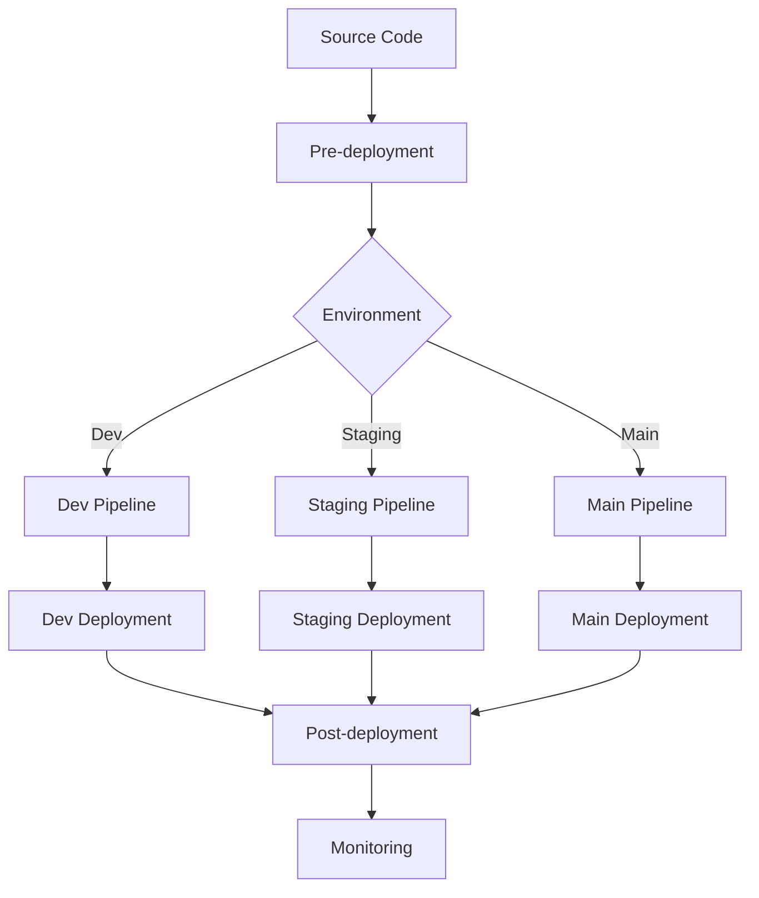
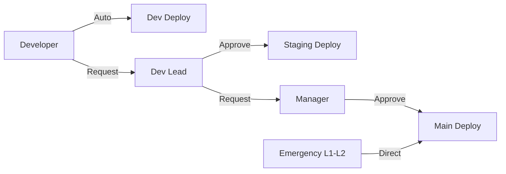

# 環境別デプロイ戦略

**エス・エー・エス株式会社**  
*GitHub運用ガイドライン - 環境別デプロイ戦略詳細*

## 目次

- [概要](#概要)
- [環境別デプロイ戦略](#環境別デプロイ戦略)
  - [Dev環境（開発環境）](#dev環境開発環境)
  - [Staging環境（ステージング環境）](#staging環境ステージング環境)
  - [Main環境（本番環境）](#main環境本番環境)
- [デプロイパイプライン設計](#デプロイパイプライン設計)
- [承認・ガバナンス](#承認ガバナンス)
- [セキュリティ・コンプライアンス](#セキュリティコンプライアンス)
- [監視・運用・災害復旧](#監視運用災害復旧)
- [パフォーマンス・コスト最適化](#パフォーマンスコスト最適化)
- [段階的移行計画](#段階的移行計画)

## 概要

エス・エー・エス株式会社のGitHub環境における包括的なデプロイ戦略です。現在のdev環境から将来の3環境構成（dev/staging/main）への段階的移行を考慮し、セキュリティ、効率性、運用性を重視した設計となっています。

### 基本方針

- **段階的移行**: 現在のdev環境から3環境への無理のない移行
- **セキュリティファースト**: 全段階でのセキュリティチェック実装
- **自動化優先**: 人的ミスを最小化する高度な自動化
- **緊急時対応**: L1-L4レベルに応じた柔軟な対応フロー
- **監査対応**: 完全なトレーサビリティと監査ログ

## 環境別デプロイ戦略

### Dev環境（開発環境）

**目的と位置づけ**
- 機能開発の初期検証
- 開発者による品質確認
- 統合前の動作確認

**デプロイ特性**

| 項目 | 設定値 | 理由 |
|------|--------|------|
| デプロイトリガー | feature → dev マージ | 開発効率最大化 |
| 承認プロセス | 自動承認 | 迅速なフィードバック |
| デプロイ頻度 | 1日複数回 | アジャイル開発支援 |
| ロールバック | 完全自動（3分以内） | 開発継続性確保 |
| 稼働率要件 | 90%以上 | 開発に支障ない程度 |

**技術実装**

```yaml
# デプロイ戦略: Recreate
deployment_strategy: recreate
resource_limits:
  cpu: 0.5 cores
  memory: 1GB
health_check:
  initial_delay: 10s
  timeout: 5s
  retries: 3
```

**セキュリティ設定**
- 基本的なSASTスキャン
- 依存関係脆弱性チェック
- コンテナセキュリティスキャン（警告レベル）

### Staging環境（ステージング環境）

**目的と位置づけ**
- 統合テストの実行
- 受け入れテストの実施
- 本番リハーサル

**デプロイ特性**

| 項目 | 設定値 | 理由 |
|------|--------|------|
| デプロイトリガー | dev → staging マージ | 品質確保段階 |
| 承認プロセス | 開発リーダー承認必須 | 統制された品質管理 |
| デプロイ頻度 | 日次〜週次 | 安定性重視 |
| ロールバック | 半自動（10分以内） | 慎重な復旧手順 |
| 稼働率要件 | 95%以上 | 本番に近い安定性 |

**技術実装**

```yaml
# デプロイ戦略: Rolling Update
deployment_strategy: rolling_update
max_unavailable: 1
max_surge: 1
resource_limits:
  cpu: 1 core
  memory: 2GB
health_check:
  initial_delay: 30s
  timeout: 10s
  retries: 5
```

**セキュリティ設定**
- 包括的なSAST/DASTスキャン
- インフラストラクチャスキャン
- シークレット検出
- コンプライアンスチェック

### Main環境（本番環境）

**目的と位置づけ**
- 本番サービス提供
- 最高レベルの可用性
- ビジネス価値の実現

**デプロイ特性**

| 項目 | 設定値 | 理由 |
|------|--------|------|
| デプロイトリガー | staging → main マージ | 最終品質確認 |
| 承認プロセス | 複数段階承認必須 | 最高レベルの統制 |
| デプロイ頻度 | 週次〜月次 | 計画的リリース |
| ロールバック | 手動承認必須（5分以内） | 慎重な判断を要求 |
| 稼働率要件 | 99.9%以上 | ビジネス継続性確保 |

**技術実装**

```yaml
# デプロイ戦略: Blue-Green
deployment_strategy: blue_green
canary_percentage: 10
resource_limits:
  cpu: 2 cores
  memory: 4GB
health_check:
  initial_delay: 60s
  timeout: 15s
  retries: 10
```

**セキュリティ設定**
- 最高レベルのセキュリティスキャン
- ランタイムセキュリティ監視
- WAF統合
- DDoS保護

## デプロイパイプライン設計

### パイプライン全体構成



### Pre-deployment（デプロイ前処理）

**品質チェック段階**

1. **ソースコード品質**
   - ESLint/Prettier（コードスタイル）
   - SonarQube（コード品質）
   - Unit Test実行
   - カバレッジチェック（80%以上）

2. **セキュリティチェック**
   - SAST（静的解析）: CodeQL, Semgrep
   - 依存関係スキャン: Snyk, Dependabot
   - シークレット検出: TruffleHog
   - ライセンスコンプライアンス

3. **インフラストラクチャチェック**
   - Terraform Validate
   - Security Policy Check（OPA）
   - Resource Limits Validation

### Deployment（デプロイ実行）

**環境別デプロイ戦略**

| 環境 | 戦略 | 特徴 | 実行時間 |
|------|------|------|----------|
| Dev | Recreate | シンプル・高速 | 2-3分 |
| Staging | Rolling Update | 無停止・段階的 | 5-8分 |
| Main | Blue-Green | 完全無停止・即時切り戻し | 10-15分 |

**共通実装要素**
- ヘルスチェック統合
- データベースマイグレーション
- 設定値検証
- サービスメッシュ統合（該当環境）

### Post-deployment（デプロイ後処理）

**検証項目**

1. **サービス正常性確認**
   - Readiness Probe
   - Liveness Probe
   - カスタムヘルスチェック

2. **パフォーマンス監視**
   - レスポンス時間
   - エラー率
   - スループット

3. **統合確認**
   - 外部API接続
   - データベース接続
   - キャッシュ動作

## 承認・ガバナンス

### 承認マトリックス



**詳細承認ルール**

| 環境 | 通常時 | 緊急時（L1-L2） | 緊急時（L3-L4） |
|------|--------|-----------------|-----------------|
| Dev | 自動承認 | 自動承認 | 自動承認 |
| Staging | 開発リーダー | 開発リーダー | 開発リーダー |
| Main | リーダー + マネージャー | マネージャーのみ | 標準フロー |

### 緊急時対応フロー

**L1（Critical - 1時間以内）**
```yaml
emergency_level: L1
approval_bypass: manager_only
notification: immediate
rollback_authority: automatic
communication: all_stakeholders
```

**L2（High - 4時間以内）**
```yaml
emergency_level: L2
approval_bypass: manager_only
notification: within_15_minutes
rollback_authority: lead_approval
communication: technical_team
```

## セキュリティ・コンプライアンス

### 認証・認可設計

**GitHub Environment Protection**

```yaml
environments:
  development:
    protection_rules:
      required_reviewers: 0
      wait_timer: 0
    deployment_branch_policy:
      protected_branches: false
      custom_branch_policies: true

  staging:
    protection_rules:
      required_reviewers: 1
      wait_timer: 0
    deployment_branch_policy:
      protected_branches: true
      custom_branch_policies: false

  production:
    protection_rules:
      required_reviewers: 2
      wait_timer: 5 # 5分間の待機
    deployment_branch_policy:
      protected_branches: true
      custom_branch_policies: false
```

### シークレット管理

**階層的シークレット管理**

```yaml
secrets_hierarchy:
  organization_level:
    - CONTAINER_REGISTRY_TOKEN
    - SECURITY_SCANNER_TOKEN
    - NOTIFICATION_WEBHOOK
    
  repository_level:
    - APP_SIGNING_KEY
    - DATABASE_ENCRYPTION_KEY
    
  environment_level:
    development:
      - DEV_DATABASE_URL
      - DEV_API_ENDPOINT
    staging:
      - STAGING_DATABASE_URL
      - STAGING_API_ENDPOINT
    production:
      - PROD_DATABASE_URL
      - PROD_API_ENDPOINT
```

### セキュリティスキャン設定

**段階的セキュリティチェック**

| チェック項目 | Dev | Staging | Main | ツール |
|-------------|-----|---------|------|-------|
| SAST | 基本 | 包括的 | 厳格 | CodeQL, Semgrep |
| DAST | - | 基本 | 包括的 | OWASP ZAP |
| 依存関係スキャン | 警告 | エラー | ブロック | Snyk, Dependabot |
| コンテナスキャン | 基本 | 厳格 | 最高 | Trivy, Clair |
| シークレット検出 | 有効 | 有効 | 有効 | TruffleHog |

## 監視・運用・災害復旧

### 監視戦略

**メトリクス定義**

```yaml
deployment_metrics:
  # DORA Metrics
  deployment_frequency:
    dev: daily
    staging: weekly
    main: monthly
    
  lead_time_for_changes:
    target: < 2 hours
    measurement: commit to production
    
  change_failure_rate:
    target: < 5%
    measurement: rollback_required / total_deployments
    
  time_to_restore_service:
    target: < 5 minutes
    measurement: incident to recovery
```

**アラート設定**

```yaml
alerts:
  deployment_failure:
    severity: high
    channels: [teams, email]
    escalation: 15_minutes
    
  performance_degradation:
    severity: medium
    threshold: response_time > 500ms
    channels: [teams]
    
  security_incident:
    severity: critical
    channels: [teams, email, sms]
    escalation: immediate
```

### ログ・監視統合

**構造化ログ設定**

```yaml
logging:
  format: json
  fields:
    - timestamp
    - level
    - service
    - version
    - trace_id
    - user_id
    - request_id
    - environment
    
  retention:
    dev: 7_days
    staging: 30_days
    main: 90_days
```

### 災害復旧計画

**RTO/RPOの設定**

| 環境 | RTO（復旧目標時間） | RPO（データ損失許容） |
|------|-------------------|----------------------|
| Dev | 30分 | 4時間 |
| Staging | 15分 | 1時間 |
| Main | 5分 | 15分 |

**バックアップ戦略**

```yaml
backup_strategy:
  database:
    frequency: hourly
    retention: 30_days
    cross_region: true
    
  application_data:
    frequency: daily
    retention: 90_days
    encryption: aes_256
    
  configuration:
    frequency: on_change
    retention: unlimited
    version_control: true
```

## パフォーマンス・コスト最適化

### リソース最適化

**環境別リソース配分**

```yaml
resource_allocation:
  development:
    compute:
      cpu: 0.5_cores
      memory: 1GB
      storage: 10GB
    scaling:
      min_replicas: 1
      max_replicas: 2
      
  staging:
    compute:
      cpu: 1_core
      memory: 2GB
      storage: 50GB
    scaling:
      min_replicas: 2
      max_replicas: 5
      
  production:
    compute:
      cpu: 2_cores
      memory: 4GB
      storage: 100GB
    scaling:
      min_replicas: 3
      max_replicas: 10
```

### コスト最適化戦略

**スケジューリング最適化**

```yaml
cost_optimization:
  dev_environment:
    schedule: business_hours_only
    weekend_shutdown: true
    holiday_shutdown: true
    
  staging_environment:
    schedule: extended_hours
    weekend_reduced_capacity: true
    
  production_environment:
    schedule: always_on
    auto_scaling: true
    reserved_capacity: base_load
```

## 段階的移行計画

### フェーズ1: 現在の状態（Dev環境のみ）

**期間**: 現在
**目標**: 現在のdev環境の最適化と標準化

```yaml
current_state:
  environments: [dev]
  deployment_automation: partial
  security_scanning: basic
  monitoring: limited
```

**実装項目**
- GitHub Actions workflow標準化
- 基本的なセキュリティスキャン導入
- デプロイメント監視の実装

### フェーズ2: Staging環境追加

**期間**: 3-6ヶ月後
**目標**: Staging環境の構築と統合テスト環境確立

```yaml
target_state_phase2:
  environments: [dev, staging]
  deployment_automation: advanced
  security_scanning: comprehensive
  monitoring: intermediate
```

**実装項目**
- Staging環境のインフラ構築
- 承認フロー実装
- 包括的テスト環境構築

### フェーズ3: Production環境追加

**期間**: 6-12ヶ月後
**目標**: 3環境完全運用とエンタープライズレベル実現

```yaml
target_state_phase3:
  environments: [dev, staging, production]
  deployment_automation: enterprise
  security_scanning: maximum
  monitoring: comprehensive
```

**実装項目**
- Production環境構築
- 高可用性・災害復旧実装
- エンタープライズ監視システム統合

### 移行チェックリスト

**技術的準備**
- [ ] インフラストラクチャ as Code実装
- [ ] セキュリティポリシー定義
- [ ] 監視・アラート設定
- [ ] バックアップ・復旧手順確立

**組織的準備**
- [ ] 責任者・承認者の明確化
- [ ] 運用手順書作成
- [ ] 緊急時対応手順確立
- [ ] チーム向けトレーニング実施

**運用準備**
- [ ] 監視ダッシュボード構築
- [ ] インシデント対応体制確立
- [ ] 定期的な復旧訓練実施
- [ ] パフォーマンス最適化

---

## 関連ドキュメント

- [SAS Flow仕様書](./SAS_FLOW_SPECIFICATION.md)
- [CI/CD デプロイ戦略](./CICD_DEPLOYMENT_STRATEGY.md)
- [セキュリティ・リスク管理](./SECURITY_RISK_MATRIX.md)
- [緊急時対応マニュアル](./EMERGENCY_RESPONSE.md)
- [GitHub Actions運用ガイド](./GITHUB_ACTIONS_OPERATIONS.md)

---

**作成者**: エス・エー・エス株式会社 GitHub管理チーム  
**最終更新**: 2024年9月10日  
**バージョン**: 1.0.0