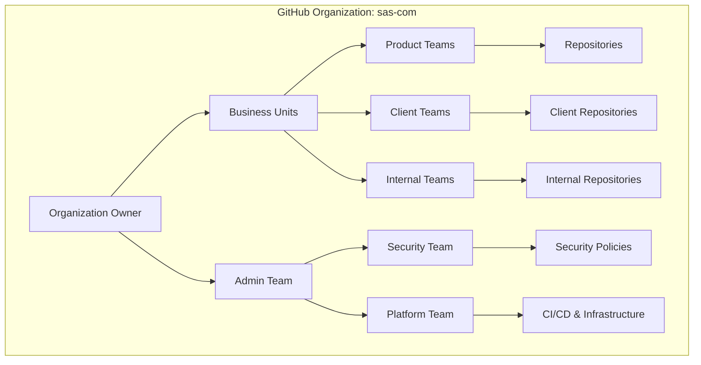
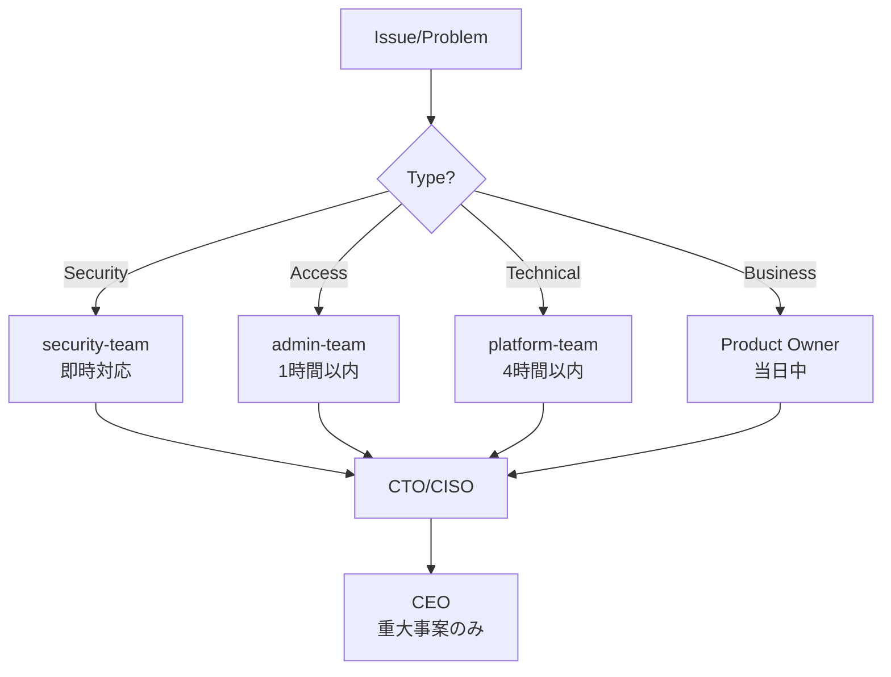

# GitHub組織アーキテクチャ設計書

**エス・エー・エス株式会社 (sas-com)**  
*最終更新日: 2025年9月10日*  
*バージョン: 1.0.0*

## 📊 組織構造全体設計



## 🏗️ リポジトリ分類戦略

### 1. リポジトリカテゴリー構造

```yaml
sas-com/
├── products/           # プロダクト系
│   ├── saas-platform/  # SaaSプラットフォーム
│   ├── mobile-apps/    # モバイルアプリ
│   └── web-services/   # Webサービス
│
├── clients/           # クライアント案件
│   ├── enterprise/    # エンタープライズ
│   ├── mid-market/    # 中規模企業
│   └── startup/       # スタートアップ
│
├── internal/          # 社内システム
│   ├── tools/         # 開発ツール
│   ├── infrastructure/# インフラ
│   └── documentation/ # ドキュメント
│
└── templates/         # テンプレート
    ├── project-templates/
    └── ci-cd-templates/
```

### 2. リポジトリ命名規則

#### 命名パターン詳細

```
[カテゴリ]-[サブカテゴリ]-[プロジェクト名]-[コンポーネント]

カテゴリ:
  - prod: プロダクト
  - client: クライアント案件
  - internal: 社内システム
  - template: テンプレート
  - lib: 共有ライブラリ
  - infra: インフラストラクチャ

サブカテゴリ:
  - クライアント略称 (2-4文字)
  - プロダクト略称
  - チーム略称

コンポーネント:
  - frontend: フロントエンド
  - backend: バックエンド
  - api: API
  - mobile: モバイルアプリ
  - admin: 管理画面
  - docs: ドキュメント
  - infra: インフラ設定
```

#### 命名例

```bash
# プロダクト系
prod-saas-platform-frontend       # SaaSプラットフォームのフロントエンド
prod-saas-platform-backend        # SaaSプラットフォームのバックエンド
prod-saas-platform-api           # SaaSプラットフォームのAPI
prod-mobile-ios                  # iOSアプリ
prod-mobile-android               # Androidアプリ

# クライアント案件
client-abc-ecsite-frontend       # ABC社ECサイトのフロントエンド
client-abc-ecsite-backend        # ABC社ECサイトのバックエンド
client-xyz-portal-api            # XYZ社ポータルのAPI
client-def-mobile-app            # DEF社モバイルアプリ

# 社内システム
internal-hr-system               # 人事システム
internal-dev-tools               # 開発ツール
internal-monitoring-dashboard    # 監視ダッシュボード

# 共有ライブラリ
lib-ui-components               # UI コンポーネントライブラリ
lib-auth-module                 # 認証モジュール
lib-data-validation             # データ検証ライブラリ

# インフラ
infra-terraform-aws             # AWS Terraform設定
infra-kubernetes-configs        # Kubernetes設定
infra-ci-cd-pipelines          # CI/CDパイプライン
```

### 3. リポジトリメタデータ管理

```yaml
# 各リポジトリに必須のtopics設定
topics:
  category: [prod|client|internal|template|lib|infra]
  status: [active|maintenance|archived|deprecated]
  environment: [production|staging|development]
  tech-stack: [nodejs|python|go|java|react|vue|angular]
  team: [team-alpha|team-beta|team-gamma]
  client: [client-code] # クライアント案件のみ
  security-level: [public|internal|confidential|restricted]
```

## 👥 Team構造とRole設定

### 1. 組織階層とTeam構成

```yaml
Organization Owners (2-3名):
  - CEO/CTO
  - 技術統括責任者
  権限: 組織全体の最高権限

Core Teams:
  ├── admin-team (3-5名)
  │   役割: 組織全体の管理
  │   権限: Admin権限（Ownersを除く全権限）
  │
  ├── security-team (2-3名)
  │   役割: セキュリティ監査・ポリシー管理
  │   権限: 全リポジトリのRead + Security alerts管理
  │
  └── platform-team (3-5名)
      役割: CI/CD・インフラ管理
      権限: インフラ系リポジトリのAdmin

Product Teams:
  ├── product-core-team (5-10名)
  │   役割: プロダクト開発のコアチーム
  │   権限: prod-*リポジトリのMaintain/Write
  │
  ├── product-frontend-team (5-8名)
  │   役割: フロントエンド開発
  │   権限: *-frontendリポジトリのWrite
  │
  └── product-backend-team (5-8名)
      役割: バックエンド開発
      権限: *-backend, *-apiリポジトリのWrite

Client Teams:
  ├── client-[abc]-team (3-5名/クライアント)
  │   役割: 特定クライアント案件担当
  │   権限: client-abc-*リポジトリのMaintain
  │
  └── client-support-team (3-5名)
      役割: クライアントサポート
      権限: 全client-*リポジトリのRead

Internal Teams:
  ├── internal-dev-team (3-5名)
  │   役割: 社内システム開発
  │   権限: internal-*リポジトリのWrite
  │
  └── qa-team (3-5名)
      役割: 品質保証
      権限: 全リポジトリのRead + Issue/PR作成

External Collaborators:
  └── contractor-[name] (個別設定)
      役割: 外部協力者
      権限: 特定リポジトリ・期間限定のWrite
```

### 2. Role権限マトリックス

| Role | Read | Triage | Write | Maintain | Admin | 用途 |
|------|------|--------|-------|----------|-------|------|
| **Admin** | ✅ | ✅ | ✅ | ✅ | ✅ | 組織管理者 |
| **Maintain** | ✅ | ✅ | ✅ | ✅ | ❌ | リポジトリ管理者 |
| **Write** | ✅ | ✅ | ✅ | ❌ | ❌ | 開発者 |
| **Triage** | ✅ | ✅ | ❌ | ❌ | ❌ | サポート・QA |
| **Read** | ✅ | ❌ | ❌ | ❌ | ❌ | 閲覧のみ |

### 3. Team別権限設定

```yaml
# プロダクト開発チーム
product-core-team:
  prod-*: Maintain
  lib-*: Write
  template-*: Read

# クライアントチーム
client-abc-team:
  client-abc-*: Maintain
  lib-*: Read
  template-*: Read

# セキュリティチーム
security-team:
  全リポジトリ: Read + Security alerts
  infra-security-*: Admin

# QAチーム
qa-team:
  全リポジトリ: Triage
```

## 🔒 ブランチ保護ルール

### 1. 環境別保護設定

#### Production環境 (main branch)
```yaml
main:
  protection_rules:
    - required_reviews: 2
    - dismiss_stale_reviews: true
    - require_code_owner_reviews: true
    - required_status_checks:
        - ci/build
        - ci/test
        - security/scan
        - quality/sonarqube
    - enforce_admins: true
    - restrictions:
        users: []
        teams: [admin-team, product-core-team]
    - allow_force_pushes: false
    - allow_deletions: false
    - required_conversation_resolution: true
    - lock_branch: false
    - allow_fork_syncing: false
```

#### Staging環境 (staging branch)
```yaml
staging:
  protection_rules:
    - required_reviews: 1
    - dismiss_stale_reviews: true
    - required_status_checks:
        - ci/build
        - ci/test
        - ci/integration-test
    - enforce_admins: false
    - allow_force_pushes: false
    - allow_deletions: false
```

#### Development環境 (dev branch)
```yaml
dev:
  protection_rules:
    - required_reviews: 1
    - required_status_checks:
        - ci/build
        - ci/test
    - allow_force_pushes: false
    - allow_deletions: false
```

### 2. リポジトリタイプ別ルール

```yaml
# プロダクト系リポジトリ
product_repositories:
  branch_protection:
    main: strict_protection
    staging: medium_protection
    dev: basic_protection
    feature/*: no_protection
    hotfix/*: expedited_review

# クライアント案件リポジトリ
client_repositories:
  branch_protection:
    main: strict_protection
    dev: basic_protection
    client-review: read_only_for_client

# 内部ツールリポジトリ
internal_repositories:
  branch_protection:
    main: basic_protection
    dev: minimal_protection
```

## 🛡️ セキュリティポリシー

### 1. 組織レベルセキュリティ設定

```yaml
organization_security:
  # 認証設定
  authentication:
    two_factor_requirement: enforced
    saml_sso: enabled
    allowed_ip_ranges:
      - "オフィスIPレンジ"
      - "VPN IPレンジ"
  
  # セキュリティ機能
  security_features:
    dependency_graph: enabled
    dependabot_alerts: enabled
    dependabot_security_updates: enabled
    secret_scanning: enabled
    secret_scanning_push_protection: enabled
    code_scanning: enabled
    private_vulnerability_reporting: enabled
  
  # 監査設定
  audit:
    audit_log_retention: 180_days
    api_request_logs: enabled
    git_events_logs: enabled
```

### 2. リポジトリセキュリティ分類

```yaml
security_levels:
  restricted:
    description: "最高機密・限定アクセス"
    access: "Need-to-know basis only"
    requirements:
      - mandatory_code_review: 2
      - security_scan: critical
      - access_review: monthly
    examples:
      - "金融系クライアント案件"
      - "個人情報処理システム"
  
  confidential:
    description: "機密・社内限定"
    access: "Internal teams only"
    requirements:
      - mandatory_code_review: 1
      - security_scan: high
      - access_review: quarterly
    examples:
      - "一般クライアント案件"
      - "社内システム"
  
  internal:
    description: "内部使用"
    access: "All employees"
    requirements:
      - code_review: recommended
      - security_scan: medium
      - access_review: semi-annual
    examples:
      - "開発ツール"
      - "ドキュメント"
  
  public:
    description: "公開可能"
    access: "Public or OSS"
    requirements:
      - code_review: optional
      - security_scan: basic
      - license_check: required
    examples:
      - "OSSライブラリ"
      - "技術ブログコード"
```

### 3. シークレット管理

```yaml
secrets_management:
  # GitHub Secrets階層
  organization_secrets:
    - AWS_ACCESS_KEY_ID
    - AWS_SECRET_ACCESS_KEY
    - DOCKER_REGISTRY_TOKEN
    - SONARQUBE_TOKEN
  
  repository_secrets:
    - DATABASE_URL
    - API_KEY
    - JWT_SECRET
  
  environment_secrets:
    production:
      - PROD_DATABASE_URL
      - PROD_API_ENDPOINT
    staging:
      - STAGING_DATABASE_URL
      - STAGING_API_ENDPOINT
    development:
      - DEV_DATABASE_URL
      - DEV_API_ENDPOINT
  
  # ローテーションポリシー
  rotation_policy:
    critical_secrets: 30_days
    standard_secrets: 90_days
    low_risk_secrets: 180_days
```

### 4. コンプライアンス要件

```yaml
compliance:
  # データ保護
  data_protection:
    - gdpr_compliance: required
    - data_residency: japan
    - encryption_at_rest: enabled
    - encryption_in_transit: tls_1.3
  
  # アクセス管理
  access_management:
    - regular_access_review: quarterly
    - inactive_user_removal: 30_days
    - contractor_time_limit: project_based
    - privilege_escalation_approval: required
  
  # 監査要件
  audit_requirements:
    - change_tracking: all_production_changes
    - approval_records: 2_years_retention
    - incident_reports: 5_years_retention
    - compliance_reports: monthly
```

## 🚀 実装ステップバイステップ計画

### Phase 1: 基盤構築（1-2週間）

```markdown
Week 1:
□ Day 1-2: 組織設定
  - [ ] Organization Owners設定
  - [ ] 2FA強制有効化
  - [ ] 基本セキュリティ設定
  - [ ] 監査ログ有効化

□ Day 3-4: Core Teams作成
  - [ ] admin-team作成・権限設定
  - [ ] security-team作成・権限設定
  - [ ] platform-team作成・権限設定

□ Day 5: セキュリティポリシー
  - [ ] Organization security policy作成
  - [ ] Secret scanning有効化
  - [ ] Dependabot有効化

Week 2:
□ Day 1-2: リポジトリ整理
  - [ ] 既存リポジトリの分類
  - [ ] 命名規則に従ったリネーム
  - [ ] Topics設定

□ Day 3-4: テンプレート作成
  - [ ] プロジェクトテンプレート
  - [ ] CI/CDテンプレート
  - [ ] Issue/PRテンプレート

□ Day 5: ドキュメント整備
  - [ ] 組織運用ガイド作成
  - [ ] オンボーディング資料
  - [ ] セキュリティガイドライン
```

### Phase 2: チーム展開（2-3週間）

```markdown
Week 3-4:
□ Product Teams構築
  - [ ] product-core-team作成
  - [ ] product-frontend-team作成
  - [ ] product-backend-team作成
  - [ ] 権限設定・メンバー追加

□ ブランチ保護設定
  - [ ] main branch保護ルール
  - [ ] staging branch保護ルール（準備）
  - [ ] dev branch保護ルール

□ CI/CD基盤
  - [ ] GitHub Actions設定
  - [ ] 環境変数・Secrets設定
  - [ ] デプロイパイプライン構築

Week 5:
□ Client Teams設定
  - [ ] アクティブクライアント別Team作成
  - [ ] リポジトリアクセス権限設定
  - [ ] クライアント向けドキュメント作成
```

### Phase 3: 運用最適化（2-4週間）

```markdown
Week 6-7:
□ 自動化設定
  - [ ] 自動Issue割り当て
  - [ ] 自動ラベリング
  - [ ] PR自動レビュアー設定
  - [ ] Stale PR/Issue自動クローズ

□ 監視・アラート
  - [ ] セキュリティアラート設定
  - [ ] パフォーマンス監視
  - [ ] コスト監視

Week 8-9:
□ 品質管理
  - [ ] Code scanning設定
  - [ ] SonarQube統合
  - [ ] テストカバレッジ測定

□ レビュー・改善
  - [ ] 初期運用レビュー
  - [ ] フィードバック収集
  - [ ] プロセス改善
```

### Phase 4: 完全移行（1-2週間）

```markdown
Week 10:
□ 本番環境準備
  - [ ] main branchへの移行準備
  - [ ] staging環境構築
  - [ ] 本番デプロイプロセス確立

□ 最終確認
  - [ ] セキュリティ監査
  - [ ] アクセス権限監査
  - [ ] ドキュメント最終確認

□ 移行実施
  - [ ] 段階的な本番移行
  - [ ] モニタリング強化
  - [ ] インシデント対応準備
```

## 📈 スケーラビリティ考慮事項

### 1. 成長に応じた拡張計画

```yaml
current_scale: # 現在
  repositories: ~10
  team_members: ~20
  teams: ~5

6_months: # 6ヶ月後
  repositories: ~50
  team_members: ~50
  teams: ~10
  considerations:
    - Team階層の細分化
    - CODEOWNERS活用強化
    - 自動化ツール導入

1_year: # 1年後
  repositories: ~100
  team_members: ~100
  teams: ~20
  considerations:
    - サブ組織の検討
    - Enterprise版への移行
    - 専任DevOpsチーム設立

2_years: # 2年後
  repositories: ~200
  team_members: ~200
  teams: ~40
  considerations:
    - マルチ組織構造
    - GitHub Enterprise Server検討
    - グローバル展開対応
```

### 2. ボトルネック対策

```yaml
potential_bottlenecks:
  pr_review:
    problem: "レビュー待ち時間の増加"
    solutions:
      - CODEOWNERS自動割り当て
      - レビュアーローテーション
      - 部分的な承認権限委譲
  
  ci_cd_pipeline:
    problem: "ビルド時間の増加"
    solutions:
      - 並列実行の最適化
      - キャッシュ戦略改善
      - Self-hosted runners導入
  
  access_management:
    problem: "権限管理の複雑化"
    solutions:
      - IaC（Terraform）による管理
      - SAML/SCIM統合
      - 定期的な権限棚卸し自動化
```

### 3. コスト最適化

```yaml
cost_optimization:
  # Actions使用量管理
  github_actions:
    - Self-hosted runners活用
    - ワークフロー最適化
    - 不要なジョブの削除
  
  # ストレージ管理
  storage:
    - Git LFS適切な使用
    - 古いアーティファクト削除
    - リポジトリアーカイブ
  
  # ライセンス最適化
  licenses:
    - 定期的なユーザー棚卸し
    - 適切なライセンスタイプ選択
    - 外部協力者の管理
```

## 🔄 継続的改善プロセス

### 1. KPI設定とモニタリング

```yaml
key_metrics:
  security:
    - security_incidents: < 1/month
    - vulnerability_resolution_time: < 48h
    - 2fa_adoption: 100%
  
  productivity:
    - pr_review_time: < 4h
    - ci_success_rate: > 95%
    - deployment_frequency: daily
  
  quality:
    - code_coverage: > 80%
    - bug_escape_rate: < 5%
    - technical_debt_ratio: < 10%
```

### 2. 定期レビュースケジュール

```markdown
## 月次レビュー
- [ ] セキュリティインシデント確認
- [ ] アクセス権限棚卸し
- [ ] 未使用リポジトリ確認

## 四半期レビュー
- [ ] Team構成見直し
- [ ] ブランチ戦略評価
- [ ] ツール・プロセス改善

## 年次レビュー
- [ ] 組織構造全体見直し
- [ ] セキュリティポリシー更新
- [ ] 次年度計画策定
```

## 📞 エスカレーションパス



## 📚 関連ドキュメント

- [GUIDELINES_DETAIL.md](./GUIDELINES_DETAIL.md) - 詳細運用ガイドライン
- [EMERGENCY_RESPONSE.md](./EMERGENCY_RESPONSE.md) - 緊急時対応
- [SECURITY_POLICY.md](./SECURITY_POLICY.md) - セキュリティポリシー（作成予定）
- [ONBOARDING.md](./ONBOARDING.md) - 新規参画者ガイド

---

**© 2025 エス・エー・エス株式会社 - GitHub組織アーキテクチャ設計書**