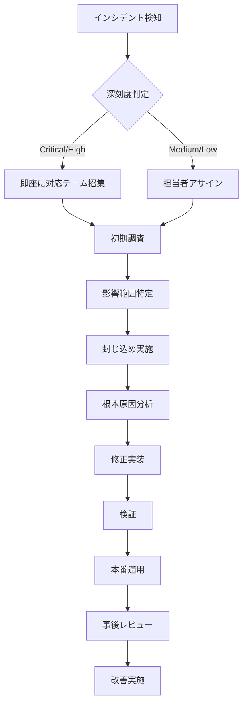

# GitHub セキュリティベストプラクティスガイド

**エス・エー・エス株式会社**  
*エンタープライズ環境向けGitHubセキュリティ設定の包括的ガイドライン*

## 目次

1. [組織レベルセキュリティ設定](#1-組織レベルセキュリティ設定)
2. [リポジトリセキュリティポリシー](#2-リポジトリセキュリティポリシー)
3. [アクセス制御と権限管理](#3-アクセス制御と権限管理)
4. [コードセキュリティ](#4-コードセキュリティ)
5. [シークレット管理](#5-シークレット管理)
6. [依存関係セキュリティ](#6-依存関係セキュリティ)
7. [監査とコンプライアンス](#7-監査とコンプライアンス)
8. [インシデント対応](#8-インシデント対応)

---

## 1. 組織レベルセキュリティ設定

### 1.1 必須セキュリティ設定

#### Two-Factor Authentication (2FA)
```yaml
設定場所: Settings > Security > Two-factor authentication
必須設定: Require two-factor authentication for everyone in the organization
実装期限: 即座に適用
例外処理: セキュリティチームの承認が必要
```

#### デフォルトリポジトリ可視性
```yaml
設定場所: Settings > Member privileges > Repository creation
デフォルト設定: Private
Public repository作成: 管理者承認必須
Internal repository: 組織内共有時のみ使用
```

#### Third-party application アクセス
```yaml
設定場所: Settings > Third-party access
OAuth App access: Restricted
GitHub App access: Admin approval required
承認済みアプリ:
  - CI/CD ツール (GitHub Actions, Jenkins)
  - セキュリティスキャナー (Dependabot, CodeQL)
  - 監視ツール (Datadog, New Relic)
```

### 1.2 組織ポリシー設定

```yaml
# 組織セキュリティポリシー
organization_policies:
  security:
    enforce_2fa: true
    default_repository_permission: read
    members_can_create_repositories: false
    members_can_create_public_repositories: false
    members_can_create_private_repositories: true
    members_can_fork_private_repositories: false
    
  compliance:
    dependency_graph_enabled: true
    vulnerability_alerts_enabled: true
    automated_security_fixes: true
    secret_scanning_enabled: true
    code_scanning_enabled: true
    
  access_control:
    allow_members_to_delete_issues: false
    allow_members_to_delete_repositories: false
    allow_force_pushes: false
    allow_deletions: false
```

### 1.3 セキュリティアドバイザリー設定

```yaml
security_advisories:
  private_vulnerability_reporting: enabled
  security_policy_visibility: public
  coordinated_disclosure: 90_days
  bug_bounty_program: 
    enabled: true
    scope: critical_vulnerabilities
    rewards: performance_based
```

---

## 2. リポジトリセキュリティポリシー

### 2.1 Branch Protection Rules

#### Main/Master ブランチ保護
```yaml
branch_protection_rules:
  patterns: ["main", "master", "release/*"]
  
  required_status_checks:
    strict: true  # 最新コミットでのチェック必須
    contexts:
      - continuous-integration/github-actions
      - security/code-scanning
      - security/dependency-review
      - test-coverage
      
  required_pull_request_reviews:
    required_approving_review_count: 2
    dismiss_stale_pull_request_approvals: true
    require_code_owner_reviews: true
    required_review_from_codeowners: true
    
  restrictions:
    users: ["security-team", "devops-team"]
    teams: ["maintainers"]
    apps: ["dependabot", "github-actions"]
    
  additional_settings:
    enforce_admins: true
    allow_force_pushes: false
    allow_deletions: false
    required_conversation_resolution: true
    require_signed_commits: true
    lock_branch: false
    allow_fork_syncing: false
```

#### Development/Feature ブランチ保護
```yaml
branch_protection_rules:
  patterns: ["dev", "develop", "feature/*"]
  
  required_status_checks:
    contexts:
      - continuous-integration/github-actions
      - security/code-scanning
      
  required_pull_request_reviews:
    required_approving_review_count: 1
    dismiss_stale_pull_request_approvals: true
    
  additional_settings:
    allow_force_pushes: false
    allow_deletions: false
```

### 2.2 セキュリティポリシーファイル

```markdown
# .github/SECURITY.md

## セキュリティポリシー

### サポートされているバージョン

| バージョン | サポート状況 | セキュリティ更新 |
|---------|------------|--------------|
| 2.x.x   | ✅ 対象     | 即座に提供     |
| 1.x.x   | ⚠️ 限定的   | Critical のみ  |
| < 1.0   | ❌ 対象外   | 提供なし       |

### 脆弱性の報告

セキュリティ脆弱性を発見した場合:

1. **報告先**: security@sas-com.com
2. **報告内容**:
   - 脆弱性の詳細説明
   - 再現手順
   - 影響範囲
   - 修正案（あれば）
3. **対応時間**: 
   - 初回応答: 24時間以内
   - 影響評価: 72時間以内
   - 修正提供: 深刻度により決定

### 情報開示ポリシー

- 90日間の調整開示期間
- 修正パッチ公開後に詳細公開
- 報告者への謝辞掲載（希望者のみ）
```

---

## 3. アクセス制御と権限管理

### 3.1 チームベースアクセス制御

```yaml
team_structure:
  administrators:
    description: "組織管理者"
    permissions: admin
    members: ["cto", "security-lead"]
    
  security-team:
    description: "セキュリティチーム"
    permissions: maintain
    repositories: all
    additional_permissions:
      - security_alerts
      - vulnerability_management
      - audit_log_access
      
  developers:
    description: "開発チーム"
    permissions: write
    repositories: 
      - development_repos
      - staging_repos
    restricted_from:
      - production_repos
      - security_configs
      
  contractors:
    description: "外部協力者"
    permissions: read
    repositories: specific_projects
    restrictions:
      - no_admin_access
      - no_delete_permissions
      - time_limited_access
```

### 3.2 権限マトリックス

| 役割 | Read | Write | Admin | Security | Audit |
|-----|------|-------|-------|----------|-------|
| 管理者 | ✅ | ✅ | ✅ | ✅ | ✅ |
| セキュリティチーム | ✅ | ✅ | ❌ | ✅ | ✅ |
| 開発者 | ✅ | ✅ | ❌ | 閲覧のみ | ❌ |
| QAチーム | ✅ | Issue作成 | ❌ | 閲覧のみ | ❌ |
| 外部協力者 | 限定的 | PR作成 | ❌ | ❌ | ❌ |

### 3.3 アクセスレビュープロセス

```yaml
access_review:
  frequency: quarterly
  
  review_items:
    - active_users_list
    - permission_levels
    - external_collaborators
    - deployed_keys
    - personal_access_tokens
    - oauth_apps
    - github_apps
    
  actions:
    - remove_inactive_users: 90_days
    - rotate_access_tokens: 180_days
    - review_admin_permissions: monthly
    - audit_external_access: monthly
```

---

## 4. コードセキュリティ

### 4.1 GitHub Advanced Security 設定

#### Code Scanning (CodeQL)
```yaml
code_scanning:
  enabled: true
  
  languages:
    - javascript
    - typescript
    - python
    - java
    - go
    - csharp
    
  query_suites:
    - security-extended
    - security-and-quality
    
  schedule:
    push:
      branches: [main, develop]
    pull_request:
      branches: [main]
    schedule:
      cron: "0 2 * * 1"  # 毎週月曜日 2:00
      
  severity_thresholds:
    error: [critical, high]
    warning: [medium]
    note: [low]
```

#### Secret Scanning
```yaml
secret_scanning:
  enabled: true
  push_protection: true
  
  custom_patterns:
    - name: "SAS API Key"
      pattern: 'sas-api-[a-zA-Z0-9]{32}'
      
    - name: "Internal Token"
      pattern: 'token_[a-zA-Z0-9]{40}'
      
    - name: "Database Connection"
      pattern: 'mongodb\+srv://[^/\s]+@[^/\s]+'
      
  alert_notifications:
    - security-team@sas-com.com
    - repository-admins
    
  remediation:
    auto_revoke: true
    create_issue: true
    block_push: true
```

### 4.2 カスタムセキュリティルール

```yaml
custom_security_rules:
  sql_injection:
    languages: [javascript, python, java]
    severity: critical
    patterns:
      - ".*\\$\\{.*\\}.*SQL.*"
      - ".*\\+.*SELECT.*FROM.*"
      
  xss_vulnerabilities:
    languages: [javascript, typescript]
    severity: high
    patterns:
      - "innerHTML\\s*=\\s*[^'\"]*\\$"
      - "document\\.write\\([^)]*\\$"
      
  hardcoded_credentials:
    languages: all
    severity: critical
    patterns:
      - "password\\s*=\\s*['\"][^'\"]{8,}"
      - "api[_-]?key\\s*=\\s*['\"][^'\"]+"
```

---

## 5. シークレット管理

### 5.1 シークレット管理ポリシー

```yaml
secret_management:
  storage:
    production_secrets: "GitHub Secrets + External Vault"
    development_secrets: "GitHub Secrets"
    
  rotation_policy:
    api_keys: 90_days
    passwords: 60_days
    certificates: 365_days
    ssh_keys: 180_days
    
  access_control:
    environment_protection: true
    required_reviewers: 2
    deployment_branches: [main, release/*]
```

### 5.2 GitHub Secrets 設定

```yaml
# Organization Secrets
organization_secrets:
  SONAR_TOKEN:
    visibility: all_repositories
    
  DOCKER_REGISTRY_TOKEN:
    visibility: selected_repositories
    repositories: ["backend-api", "frontend-app"]
    
  AWS_ACCESS_KEY_ID:
    visibility: private
    environments: ["production"]

# Repository Secrets
repository_secrets:
  DATABASE_URL:
    environments: ["development", "staging", "production"]
    
  API_KEY:
    environments: ["production"]
    required_reviewers: ["security-team"]
```

### 5.3 シークレットスキャンワークフロー

```yaml
name: Secret Scan
on:
  push:
  pull_request:
  schedule:
    - cron: '0 0 * * *'

jobs:
  secret-scan:
    runs-on: ubuntu-latest
    steps:
      - uses: actions/checkout@v3
      
      - name: TruffleHog Scan
        uses: trufflesecurity/trufflehog@main
        with:
          path: ./
          
      - name: Gitleaks Scan
        uses: gitleaks/gitleaks-action@v2
        
      - name: Custom Pattern Scan
        run: |
          grep -r "password.*=" . || true
          grep -r "api[_-]key.*=" . || true
```

---

## 6. 依存関係セキュリティ

### 6.1 Dependabot 設定

```yaml
# .github/dependabot.yml
version: 2

updates:
  # JavaScript/Node.js
  - package-ecosystem: "npm"
    directory: "/"
    schedule:
      interval: "daily"
      time: "09:00"
      timezone: "Asia/Tokyo"
    open-pull-requests-limit: 10
    reviewers:
      - "security-team"
    labels:
      - "dependencies"
      - "security"
    commit-message:
      prefix: "deps"
      include: "scope"
    milestone: 4
    
  # Python
  - package-ecosystem: "pip"
    directory: "/"
    schedule:
      interval: "weekly"
      day: "monday"
    security-updates-only: true
    
  # Docker
  - package-ecosystem: "docker"
    directory: "/"
    schedule:
      interval: "weekly"
    reviewers:
      - "devops-team"
      
  # GitHub Actions
  - package-ecosystem: "github-actions"
    directory: "/"
    schedule:
      interval: "monthly"
```

### 6.2 依存関係レビューポリシー

```yaml
dependency_review:
  vulnerability_check:
    fail_on_severity: moderate
    
  license_check:
    allowed_licenses:
      - mit
      - apache-2.0
      - bsd-3-clause
      - isc
    denied_licenses:
      - gpl-3.0
      - agpl-3.0
      
  dependency_submission:
    api_enabled: true
    snapshot_warnings: true
```

### 6.3 Software Bill of Materials (SBOM)

```yaml
sbom_generation:
  formats:
    - spdx
    - cyclonedx
    
  frequency: "on_release"
  
  storage:
    location: "releases/sbom/"
    retention: "indefinite"
    
  validation:
    signature_required: true
    hash_verification: true
```

---

## 7. 監査とコンプライアンス

### 7.1 監査ログ設定

```yaml
audit_logging:
  enabled: true
  
  events_tracked:
    - repository_creation
    - repository_deletion
    - permission_changes
    - branch_protection_changes
    - secret_access
    - security_alert_dismissal
    - member_additions
    - member_removals
    
  retention:
    duration: 2_years
    storage: "encrypted_s3_bucket"
    
  export:
    format: "json"
    frequency: "monthly"
    destination: "siem_system"
```

### 7.2 コンプライアンスチェック

```yaml
compliance_checks:
  standards:
    - owasp_asvs_4.0
    - nist_csf
    - iso_27001
    - soc2_type_ii
    
  automated_checks:
    - signed_commits_enforcement
    - 2fa_compliance
    - access_review_completion
    - vulnerability_remediation_sla
    
  reporting:
    frequency: "quarterly"
    recipients: ["compliance@sas-com.com"]
    format: "pdf_with_evidence"
```

### 7.3 定期セキュリティ評価

```yaml
security_assessments:
  internal_audit:
    frequency: "quarterly"
    scope:
      - access_controls
      - security_configurations
      - incident_response
      - vulnerability_management
      
  external_audit:
    frequency: "annually"
    provider: "certified_auditor"
    
  penetration_testing:
    frequency: "bi-annually"
    scope:
      - application_security
      - infrastructure_security
      - social_engineering
```

---

## 8. インシデント対応

### 8.1 インシデント分類

```yaml
incident_classification:
  critical:
    description: "本番環境への不正アクセス、データ漏洩"
    response_time: "15分以内"
    escalation: "immediate"
    
  high:
    description: "脆弱性の悪用、認証バイパス"
    response_time: "1時間以内"
    escalation: "within_1_hour"
    
  medium:
    description: "設定ミス、権限昇格の可能性"
    response_time: "4時間以内"
    escalation: "within_4_hours"
    
  low:
    description: "ポリシー違反、軽微な設定問題"
    response_time: "翌営業日"
    escalation: "next_business_day"
```

### 8.2 インシデント対応フロー



### 8.3 連絡体制

```yaml
incident_contacts:
  primary:
    security_team: "security@sas-com.com"
    on_call: "+81-XXX-XXXX-XXXX"
    
  escalation_chain:
    level_1: "security-lead@sas-com.com"
    level_2: "cto@sas-com.com"
    level_3: "executive-team@sas-com.com"
    
  external:
    legal: "legal@sas-com.com"
    pr: "pr@sas-com.com"
    customers: "support@sas-com.com"
```

---

## 実装チェックリスト

### 初期設定（必須）
- [ ] 組織の2FA必須化
- [ ] デフォルトPrivateリポジトリ設定
- [ ] Branch Protection Rules設定
- [ ] GitHub Advanced Security有効化
- [ ] Dependabot有効化

### セキュリティ強化（推奨）
- [ ] カスタムセキュリティルール設定
- [ ] Secret Scanningカスタムパターン追加
- [ ] SBOM生成パイプライン構築
- [ ] 監査ログエクスポート設定
- [ ] インシデント対応体制確立

### 継続的改善
- [ ] 四半期ごとのアクセスレビュー
- [ ] 月次セキュリティレポート作成
- [ ] 年次ペネトレーションテスト
- [ ] セキュリティトレーニング実施
- [ ] ポリシー見直しと更新

---

## 関連ドキュメント

- [SAST/DAST統合実装ガイド](./SAST_DAST_INTEGRATION_GUIDE.md)
- [緊急時対応マニュアル](./EMERGENCY_RESPONSE.md)
- [GitHub Actions セキュリティワークフロー](./.github/workflows/)
- [セキュリティポリシーテンプレート](./.github/SECURITY.md)

---

**最終更新**: 2025-09-10  
**次回レビュー**: 2025-12-10  
**承認者**: セキュリティチーム