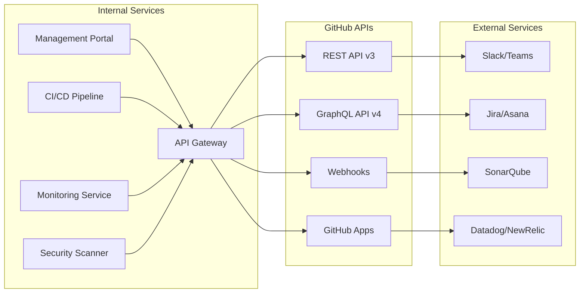

# GitHub組織管理 技術実装ガイド

**エス・エー・エス株式会社 (sas-com)**  
*最終更新日: 2025年9月10日*  
*バージョン: 1.0.0*

## 🔌 API設計とサービス統合

### 1. GitHub API統合アーキテクチャ



### 2. 組織管理API エンドポイント設計

#### Repository Management API

```yaml
# リポジトリ作成
POST /api/v1/repositories
Content-Type: application/json
Authorization: Bearer {token}

Request:
{
  "name": "client-abc-ecsite-frontend",
  "description": "ABC社ECサイトフロントエンド",
  "private": true,
  "category": "client",
  "team_ids": ["client-abc-team"],
  "template_id": "react-typescript-template",
  "branch_protection": {
    "main": "strict",
    "dev": "standard"
  },
  "topics": ["client-abc", "frontend", "react", "typescript"],
  "security_level": "confidential"
}

Response: 201 Created
{
  "id": "repo_123456",
  "name": "client-abc-ecsite-frontend",
  "full_name": "sas-com/client-abc-ecsite-frontend",
  "url": "https://github.com/sas-com/client-abc-ecsite-frontend",
  "clone_url": "git@github.com:sas-com/client-abc-ecsite-frontend.git",
  "created_at": "2025-09-10T10:00:00Z",
  "settings": {
    "branch_protection": ["main", "dev"],
    "secrets_configured": false,
    "actions_enabled": true
  }
}

# リポジトリ一覧取得
GET /api/v1/repositories?category=client&team=client-abc-team&status=active
Authorization: Bearer {token}

Response: 200 OK
{
  "repositories": [
    {
      "id": "repo_123456",
      "name": "client-abc-ecsite-frontend",
      "category": "client",
      "status": "active",
      "last_activity": "2025-09-10T09:30:00Z",
      "open_prs": 3,
      "open_issues": 5
    }
  ],
  "total": 15,
  "page": 1,
  "per_page": 20
}

# リポジトリアーカイブ
POST /api/v1/repositories/{repo_id}/archive
Authorization: Bearer {token}

Request:
{
  "reason": "Project completed",
  "archive_date": "2025-09-10",
  "backup_location": "s3://backups/client-abc/ecsite"
}

Response: 200 OK
{
  "status": "archived",
  "archived_at": "2025-09-10T10:00:00Z",
  "backup_completed": true
}
```

#### Team Management API

```yaml
# チーム作成
POST /api/v1/teams
Content-Type: application/json
Authorization: Bearer {token}

Request:
{
  "name": "client-xyz-team",
  "description": "XYZ社プロジェクトチーム",
  "privacy": "closed",
  "parent_team_id": "client-teams",
  "members": [
    {"username": "developer1", "role": "maintainer"},
    {"username": "developer2", "role": "member"}
  ],
  "repositories": [
    {"name": "client-xyz-portal-api", "permission": "push"},
    {"name": "client-xyz-portal-frontend", "permission": "push"}
  ],
  "expiration_date": "2025-12-31"
}

Response: 201 Created
{
  "id": "team_789",
  "name": "client-xyz-team",
  "slug": "client-xyz-team",
  "members_count": 2,
  "repos_count": 2,
  "created_at": "2025-09-10T10:00:00Z",
  "expires_at": "2025-12-31T23:59:59Z"
}

# メンバー権限変更
PATCH /api/v1/teams/{team_id}/members/{username}
Authorization: Bearer {token}

Request:
{
  "role": "maintainer",
  "repositories": {
    "add": ["client-xyz-portal-admin"],
    "remove": ["client-xyz-portal-docs"]
  }
}

Response: 200 OK
{
  "username": "developer1",
  "role": "maintainer",
  "updated_at": "2025-09-10T10:00:00Z",
  "effective_permissions": [
    {"repository": "client-xyz-portal-api", "permission": "admin"},
    {"repository": "client-xyz-portal-frontend", "permission": "push"},
    {"repository": "client-xyz-portal-admin", "permission": "push"}
  ]
}
```

#### Security & Compliance API

```yaml
# セキュリティスキャン実行
POST /api/v1/security/scan
Authorization: Bearer {token}

Request:
{
  "repository_id": "repo_123456",
  "scan_types": ["secrets", "dependencies", "code_quality", "licenses"],
  "branch": "main",
  "deep_scan": true
}

Response: 202 Accepted
{
  "scan_id": "scan_abc123",
  "status": "queued",
  "estimated_time": 300,
  "webhook_url": "https://api.sas-com.com/webhooks/scan/scan_abc123"
}

# コンプライアンスレポート取得
GET /api/v1/compliance/report?date_from=2025-09-01&date_to=2025-09-10
Authorization: Bearer {token}

Response: 200 OK
{
  "period": {
    "from": "2025-09-01",
    "to": "2025-09-10"
  },
  "summary": {
    "total_repositories": 50,
    "compliant_repositories": 48,
    "non_compliant_repositories": 2,
    "critical_issues": 1,
    "high_issues": 3,
    "medium_issues": 8
  },
  "violations": [
    {
      "repository": "client-abc-ecsite-backend",
      "type": "missing_2fa",
      "severity": "critical",
      "user": "contractor-john",
      "detected_at": "2025-09-08T14:30:00Z"
    }
  ],
  "recommendations": [
    "Enable 2FA for all contractor accounts",
    "Update deprecated dependencies in 5 repositories",
    "Review stale branches in 12 repositories"
  ]
}
```

### 3. Webhook設計

```yaml
# Webhook設定
webhook_configuration:
  url: "https://api.sas-com.com/webhooks/github"
  secret: "${WEBHOOK_SECRET}"
  events:
    - push
    - pull_request
    - pull_request_review
    - issues
    - issue_comment
    - repository
    - team
    - organization
    - security_alert

# Webhook Payload例
POST /webhooks/github
X-GitHub-Event: pull_request
X-GitHub-Signature-256: sha256=xxxxx

{
  "action": "opened",
  "pull_request": {
    "id": 12345,
    "number": 100,
    "title": "feat: 新機能追加",
    "user": {
      "login": "developer1"
    },
    "base": {
      "ref": "main"
    },
    "head": {
      "ref": "feature/new-feature"
    }
  },
  "repository": {
    "name": "client-abc-ecsite-frontend",
    "full_name": "sas-com/client-abc-ecsite-frontend"
  }
}

# Webhook処理フロー
webhook_processing:
  1_receive:
    - Signature検証
    - Event type判定
    - Rate limit確認
  
  2_process:
    - Event別処理ロジック
    - 外部サービス連携
    - データベース更新
  
  3_action:
    - 自動レビュアー設定
    - ラベル自動付与
    - 通知送信
    - CI/CDトリガー
```

## 🤖 自動化実装

### 1. GitHub Actions Workflows

#### リポジトリ標準化Workflow

```yaml
# .github/workflows/repository-setup.yml
name: Repository Setup
on:
  repository_dispatch:
    types: [repository_created]

jobs:
  setup:
    runs-on: ubuntu-latest
    steps:
      - name: Checkout
        uses: actions/checkout@v3
      
      - name: Setup Branch Protection
        uses: ./actions/branch-protection
        with:
          branch: main
          required_reviews: 2
          dismiss_stale_reviews: true
          require_code_owner_reviews: true
      
      - name: Create Standard Labels
        uses: ./actions/create-labels
        with:
          config_file: .github/labels.yml
      
      - name: Setup Issue Templates
        uses: ./actions/issue-templates
        with:
          templates:
            - bug_report
            - feature_request
            - security_issue
      
      - name: Configure Secrets
        uses: ./actions/setup-secrets
        with:
          environment: production
          secrets: |
            AWS_ACCESS_KEY_ID
            AWS_SECRET_ACCESS_KEY
            DATABASE_URL
      
      - name: Initialize Documentation
        run: |
          mkdir -p docs
          cp templates/README.md README.md
          cp templates/CONTRIBUTING.md CONTRIBUTING.md
          cp templates/SECURITY.md SECURITY.md
      
      - name: Send Notification
        uses: ./actions/notify
        with:
          channel: "#github-notifications"
          message: "New repository created: ${{ github.repository }}"
```

#### セキュリティスキャンWorkflow

```yaml
# .github/workflows/security-scan.yml
name: Security Scan
on:
  push:
    branches: [main, staging, dev]
  pull_request:
    branches: [main]
  schedule:
    - cron: '0 2 * * *'

jobs:
  secret-scan:
    runs-on: ubuntu-latest
    steps:
      - uses: actions/checkout@v3
      - name: Secret Scanning
        uses: trufflesecurity/trufflehog@main
        with:
          path: ./
          base: main
          head: HEAD
      
  dependency-scan:
    runs-on: ubuntu-latest
    steps:
      - uses: actions/checkout@v3
      - name: Run Snyk
        uses: snyk/actions/node@master
        env:
          SNYK_TOKEN: ${{ secrets.SNYK_TOKEN }}
      
  code-scan:
    runs-on: ubuntu-latest
    steps:
      - uses: actions/checkout@v3
      - name: Initialize CodeQL
        uses: github/codeql-action/init@v2
        with:
          languages: javascript, python
      - name: Perform CodeQL Analysis
        uses: github/codeql-action/analyze@v2
      
  compliance-check:
    runs-on: ubuntu-latest
    steps:
      - uses: actions/checkout@v3
      - name: License Check
        uses: ./actions/license-check
        with:
          allowed_licenses: |
            MIT
            Apache-2.0
            BSD-3-Clause
      - name: Policy Compliance
        run: |
          ./scripts/check-compliance.sh
```

### 2. 自動化スクリプト

#### Team管理自動化

```python
# scripts/team_management.py
import os
import json
import requests
from datetime import datetime, timedelta
from typing import List, Dict

class GitHubTeamManager:
    def __init__(self):
        self.token = os.environ['GITHUB_TOKEN']
        self.org = 'sas-com'
        self.headers = {
            'Authorization': f'token {self.token}',
            'Accept': 'application/vnd.github.v3+json'
        }
        self.base_url = f'https://api.github.com/orgs/{self.org}'
    
    def create_client_team(self, client_code: str, members: List[str], 
                          repositories: List[str], duration_days: int = 90) -> Dict:
        """クライアントチーム作成"""
        team_name = f"client-{client_code}-team"
        
        # チーム作成
        team_data = {
            'name': team_name,
            'description': f'{client_code.upper()}社プロジェクトチーム',
            'privacy': 'closed',
            'notification_setting': 'notifications_enabled'
        }
        
        response = requests.post(
            f'{self.base_url}/teams',
            json=team_data,
            headers=self.headers
        )
        team = response.json()
        
        # メンバー追加
        for member in members:
            self.add_team_member(team['slug'], member)
        
        # リポジトリ権限設定
        for repo in repositories:
            self.set_repository_permission(team['slug'], repo, 'push')
        
        # 有効期限設定（カスタムフィールドとして記録）
        expiration_date = datetime.now() + timedelta(days=duration_days)
        self.set_team_metadata(team['id'], {
            'expiration_date': expiration_date.isoformat(),
            'client_code': client_code,
            'created_by': 'automated_system'
        })
        
        return {
            'team_id': team['id'],
            'team_name': team_name,
            'members': members,
            'repositories': repositories,
            'expires_at': expiration_date.isoformat()
        }
    
    def audit_team_permissions(self) -> List[Dict]:
        """チーム権限監査"""
        issues = []
        
        # 全チーム取得
        teams = self.get_all_teams()
        
        for team in teams:
            # 期限切れチェック
            metadata = self.get_team_metadata(team['id'])
            if metadata.get('expiration_date'):
                expiry = datetime.fromisoformat(metadata['expiration_date'])
                if expiry < datetime.now():
                    issues.append({
                        'type': 'expired_team',
                        'team': team['name'],
                        'expired_at': expiry.isoformat()
                    })
            
            # 非アクティブメンバーチェック
            members = self.get_team_members(team['slug'])
            for member in members:
                last_activity = self.get_user_last_activity(member['login'])
                if (datetime.now() - last_activity).days > 30:
                    issues.append({
                        'type': 'inactive_member',
                        'team': team['name'],
                        'member': member['login'],
                        'last_activity': last_activity.isoformat()
                    })
        
        return issues
    
    def rotate_expired_permissions(self):
        """期限切れ権限の自動ローテーション"""
        audit_results = self.audit_team_permissions()
        
        for issue in audit_results:
            if issue['type'] == 'expired_team':
                # チームを無効化
                self.archive_team(issue['team'])
                # 通知送信
                self.send_notification(
                    f"Team {issue['team']} has been archived due to expiration"
                )
            elif issue['type'] == 'inactive_member':
                # メンバーを一時的に無効化
                self.suspend_member(issue['team'], issue['member'])
                # 通知送信
                self.send_notification(
                    f"Member {issue['member']} suspended in team {issue['team']} due to inactivity"
                )
```

#### リポジトリ健全性チェック

```python
# scripts/repository_health.py
import yaml
from typing import Dict, List
from dataclasses import dataclass

@dataclass
class HealthCheckResult:
    repository: str
    score: int
    issues: List[str]
    recommendations: List[str]

class RepositoryHealthChecker:
    def __init__(self):
        self.checks = [
            self.check_branch_protection,
            self.check_security_alerts,
            self.check_documentation,
            self.check_ci_cd,
            self.check_dependencies,
            self.check_code_quality,
            self.check_commit_activity
        ]
    
    def check_repository(self, repo_name: str) -> HealthCheckResult:
        """リポジトリの健全性チェック"""
        score = 100
        issues = []
        recommendations = []
        
        for check in self.checks:
            result = check(repo_name)
            score -= result.get('penalty', 0)
            issues.extend(result.get('issues', []))
            recommendations.extend(result.get('recommendations', []))
        
        return HealthCheckResult(
            repository=repo_name,
            score=max(0, score),
            issues=issues,
            recommendations=recommendations
        )
    
    def check_branch_protection(self, repo_name: str) -> Dict:
        """ブランチ保護設定チェック"""
        result = {'penalty': 0, 'issues': [], 'recommendations': []}
        
        protection = self.get_branch_protection(repo_name, 'main')
        
        if not protection:
            result['penalty'] = 20
            result['issues'].append('Main branch is not protected')
            result['recommendations'].append('Enable branch protection for main')
        elif not protection.get('required_reviews', 0) >= 2:
            result['penalty'] = 10
            result['issues'].append('Insufficient review requirements')
            result['recommendations'].append('Require at least 2 reviews')
        
        return result
    
    def generate_health_report(self, repositories: List[str]) -> Dict:
        """健全性レポート生成"""
        results = []
        
        for repo in repositories:
            result = self.check_repository(repo)
            results.append(result)
        
        # スコア別に分類
        critical = [r for r in results if r.score < 40]
        warning = [r for r in results if 40 <= r.score < 70]
        healthy = [r for r in results if r.score >= 70]
        
        return {
            'summary': {
                'total_repositories': len(repositories),
                'healthy': len(healthy),
                'warning': len(warning),
                'critical': len(critical),
                'average_score': sum(r.score for r in results) / len(results)
            },
            'critical_repositories': critical,
            'warning_repositories': warning,
            'top_issues': self.get_top_issues(results),
            'recommendations': self.get_prioritized_recommendations(results)
        }
```

## 📊 モニタリングとメトリクス

### 1. Prometheus メトリクス定義

```yaml
# prometheus/github_metrics.yml
github_api_requests_total:
  type: counter
  help: "Total number of GitHub API requests"
  labels: [endpoint, method, status]

github_api_rate_limit_remaining:
  type: gauge
  help: "Remaining GitHub API rate limit"
  labels: [resource]

github_repository_count:
  type: gauge
  help: "Total number of repositories"
  labels: [category, status]

github_team_member_count:
  type: gauge
  help: "Number of members per team"
  labels: [team_name]

github_pr_review_time_seconds:
  type: histogram
  help: "Time taken to review pull requests"
  buckets: [300, 900, 3600, 7200, 14400, 28800, 86400]
  labels: [repository, team]

github_security_vulnerabilities:
  type: gauge
  help: "Number of security vulnerabilities"
  labels: [repository, severity]

github_ci_pipeline_duration_seconds:
  type: histogram
  help: "CI pipeline execution time"
  buckets: [60, 120, 300, 600, 900, 1800, 3600]
  labels: [repository, workflow, status]

github_compliance_score:
  type: gauge
  help: "Repository compliance score"
  labels: [repository, check_type]
```

### 2. Grafana ダッシュボード設定

```json
{
  "dashboard": {
    "title": "GitHub Organization Metrics",
    "panels": [
      {
        "title": "API使用状況",
        "type": "graph",
        "targets": [
          {
            "expr": "rate(github_api_requests_total[5m])",
            "legendFormat": "{{method}} {{endpoint}}"
          }
        ]
      },
      {
        "title": "リポジトリ状態",
        "type": "stat",
        "targets": [
          {
            "expr": "github_repository_count",
            "legendFormat": "{{category}} - {{status}}"
          }
        ]
      },
      {
        "title": "PRレビュー時間",
        "type": "heatmap",
        "targets": [
          {
            "expr": "github_pr_review_time_seconds",
            "format": "heatmap"
          }
        ]
      },
      {
        "title": "セキュリティアラート",
        "type": "table",
        "targets": [
          {
            "expr": "github_security_vulnerabilities > 0",
            "format": "table"
          }
        ]
      },
      {
        "title": "コンプライアンススコア",
        "type": "gauge",
        "targets": [
          {
            "expr": "avg(github_compliance_score)",
            "thresholds": [
              {"value": 70, "color": "red"},
              {"value": 85, "color": "yellow"},
              {"value": 95, "color": "green"}
            ]
          }
        ]
      }
    ]
  }
}
```

### 3. アラート設定

```yaml
# alertmanager/github_alerts.yml
groups:
  - name: github_critical
    interval: 30s
    rules:
      - alert: GitHubAPIRateLimitCritical
        expr: github_api_rate_limit_remaining < 100
        for: 5m
        labels:
          severity: critical
        annotations:
          summary: "GitHub API rate limit critically low"
          description: "Only {{ $value }} requests remaining"
      
      - alert: SecurityVulnerabilityDetected
        expr: github_security_vulnerabilities{severity="critical"} > 0
        for: 1m
        labels:
          severity: critical
        annotations:
          summary: "Critical security vulnerability detected"
          description: "Repository {{ $labels.repository }} has critical vulnerabilities"
      
      - alert: ComplianceScoreLow
        expr: github_compliance_score < 60
        for: 10m
        labels:
          severity: warning
        annotations:
          summary: "Repository compliance score below threshold"
          description: "{{ $labels.repository }} compliance score: {{ $value }}%"
      
      - alert: PRReviewDelayed
        expr: github_pr_review_time_seconds > 86400
        for: 1h
        labels:
          severity: warning
        annotations:
          summary: "PR review taking too long"
          description: "PR in {{ $labels.repository }} waiting for review > 24 hours"
```

## 🔄 CI/CD パイプライン統合

### 1. Jenkins Pipeline

```groovy
// Jenkinsfile
@Library('github-shared-library') _

pipeline {
    agent any
    
    environment {
        GITHUB_ORG = 'sas-com'
        GITHUB_TOKEN = credentials('github-token')
    }
    
    stages {
        stage('Repository Setup') {
            when {
                expression { params.ACTION == 'create_repository' }
            }
            steps {
                script {
                    def repoConfig = readYaml file: 'repository-config.yaml'
                    def result = githubCreateRepository(
                        name: repoConfig.name,
                        team: repoConfig.team,
                        template: repoConfig.template
                    )
                    
                    // ブランチ保護設定
                    githubSetupBranchProtection(
                        repository: result.name,
                        branch: 'main',
                        rules: repoConfig.branchProtection
                    )
                    
                    // Secrets設定
                    githubConfigureSecrets(
                        repository: result.name,
                        secrets: repoConfig.secrets
                    )
                }
            }
        }
        
        stage('Security Scan') {
            steps {
                parallel {
                    stage('Secret Scan') {
                        steps {
                            sh 'trufflehog --regex --entropy=True .'
                        }
                    }
                    stage('Dependency Scan') {
                        steps {
                            sh 'snyk test --severity-threshold=high'
                        }
                    }
                    stage('SAST') {
                        steps {
                            sh 'semgrep --config=auto .'
                        }
                    }
                }
            }
        }
        
        stage('Compliance Check') {
            steps {
                script {
                    def complianceResult = checkCompliance(
                        repository: env.REPOSITORY_NAME,
                        rules: 'compliance-rules.yaml'
                    )
                    
                    if (complianceResult.score < 70) {
                        error "Compliance score too low: ${complianceResult.score}"
                    }
                }
            }
        }
        
        stage('Deploy') {
            when {
                branch 'main'
            }
            steps {
                script {
                    deployToEnvironment(
                        environment: 'production',
                        repository: env.REPOSITORY_NAME,
                        version: env.BUILD_NUMBER
                    )
                }
            }
        }
    }
    
    post {
        always {
            githubNotify(
                status: currentBuild.result,
                context: 'continuous-integration/jenkins',
                description: "Build ${currentBuild.result}"
            )
        }
        failure {
            slackSend(
                channel: '#github-alerts',
                color: 'danger',
                message: "Build failed: ${env.JOB_NAME} - ${env.BUILD_NUMBER}"
            )
        }
    }
}
```

### 2. GitHub Actions 統合

```yaml
# .github/workflows/organization-management.yml
name: Organization Management
on:
  workflow_dispatch:
    inputs:
      action:
        description: 'Action to perform'
        required: true
        type: choice
        options:
          - audit_permissions
          - cleanup_repositories
          - rotate_secrets
          - generate_report

jobs:
  management:
    runs-on: ubuntu-latest
    permissions:
      contents: read
      actions: write
      packages: write
    
    steps:
      - uses: actions/checkout@v3
      
      - name: Setup Python
        uses: actions/setup-python@v4
        with:
          python-version: '3.11'
      
      - name: Install dependencies
        run: |
          pip install -r requirements.txt
      
      - name: Execute Management Action
        env:
          GITHUB_TOKEN: ${{ secrets.ORG_ADMIN_TOKEN }}
          ACTION: ${{ github.event.inputs.action }}
        run: |
          python scripts/org_management.py --action $ACTION
      
      - name: Upload Report
        if: github.event.inputs.action == 'generate_report'
        uses: actions/upload-artifact@v3
        with:
          name: org-report-${{ github.run_id }}
          path: reports/
      
      - name: Send Notification
        if: always()
        uses: 8398a7/action-slack@v3
        with:
          status: ${{ job.status }}
          text: 'Organization management action completed: ${{ github.event.inputs.action }}'
          webhook_url: ${{ secrets.SLACK_WEBHOOK }}
```

## 🔧 トラブルシューティング自動化

### 1. 自動修復スクリプト

```python
# scripts/auto_remediation.py
class GitHubAutoRemediation:
    def __init__(self):
        self.remediation_actions = {
            'unprotected_branch': self.fix_branch_protection,
            'missing_codeowners': self.add_codeowners,
            'stale_branch': self.cleanup_stale_branch,
            'excessive_permissions': self.reduce_permissions,
            'missing_2fa': self.enforce_2fa,
            'outdated_dependencies': self.update_dependencies
        }
    
    def diagnose_and_fix(self, repository: str) -> Dict:
        """問題の診断と自動修復"""
        issues = self.diagnose_repository(repository)
        fixes_applied = []
        
        for issue in issues:
            if issue['type'] in self.remediation_actions:
                try:
                    result = self.remediation_actions[issue['type']](
                        repository, 
                        issue['details']
                    )
                    fixes_applied.append({
                        'issue': issue['type'],
                        'status': 'fixed',
                        'details': result
                    })
                except Exception as e:
                    fixes_applied.append({
                        'issue': issue['type'],
                        'status': 'failed',
                        'error': str(e)
                    })
        
        return {
            'repository': repository,
            'issues_found': len(issues),
            'fixes_applied': fixes_applied,
            'timestamp': datetime.now().isoformat()
        }
    
    def fix_branch_protection(self, repo: str, details: Dict) -> Dict:
        """ブランチ保護の自動修復"""
        branch = details.get('branch', 'main')
        
        protection_rules = {
            'required_status_checks': {
                'strict': True,
                'contexts': ['continuous-integration']
            },
            'enforce_admins': True,
            'required_pull_request_reviews': {
                'required_approving_review_count': 2,
                'dismiss_stale_reviews': True
            },
            'restrictions': None,
            'allow_force_pushes': False,
            'allow_deletions': False
        }
        
        self.api.update_branch_protection(repo, branch, protection_rules)
        
        return {
            'branch': branch,
            'rules_applied': protection_rules
        }
```

## 📈 パフォーマンス最適化

### 1. キャッシング戦略

```yaml
# Redis キャッシュ設定
cache_configuration:
  repository_metadata:
    ttl: 300  # 5分
    key_pattern: "github:repo:{org}:{name}"
  
  team_members:
    ttl: 3600  # 1時間
    key_pattern: "github:team:{team_id}:members"
  
  api_responses:
    ttl: 60  # 1分
    key_pattern: "github:api:{endpoint}:{params_hash}"
  
  compliance_reports:
    ttl: 86400  # 24時間
    key_pattern: "github:compliance:{date}:{repo}"

# キャッシュ無効化ルール
invalidation_rules:
  on_repository_update:
    - "github:repo:{org}:{name}"
    - "github:compliance:*:{name}"
  
  on_team_change:
    - "github:team:{team_id}:*"
  
  on_security_alert:
    - "github:compliance:*"
```

### 2. 並列処理最適化

```python
# scripts/parallel_operations.py
import asyncio
import aiohttp
from concurrent.futures import ThreadPoolExecutor
import time

class ParallelGitHubOperations:
    def __init__(self, max_workers=10):
        self.executor = ThreadPoolExecutor(max_workers=max_workers)
        self.semaphore = asyncio.Semaphore(5)  # API rate limit対策
    
    async def bulk_repository_operations(self, repositories: List[str], 
                                        operation: str) -> List[Dict]:
        """複数リポジトリへの並列操作"""
        tasks = []
        
        for repo in repositories:
            task = self.execute_with_rate_limit(
                self.perform_operation(repo, operation)
            )
            tasks.append(task)
        
        results = await asyncio.gather(*tasks, return_exceptions=True)
        
        return [
            {'repository': repo, 'result': result}
            for repo, result in zip(repositories, results)
        ]
    
    async def execute_with_rate_limit(self, coro):
        """レート制限付き実行"""
        async with self.semaphore:
            await asyncio.sleep(0.1)  # Rate limiting
            return await coro
```

## 📋 デプロイメントチェックリスト

```markdown
## 事前準備
- [ ] 全ての環境変数が設定されている
- [ ] GitHub Token権限の確認
- [ ] バックアップの実施
- [ ] ロールバック手順の確認

## セキュリティ
- [ ] Secrets rotation完了
- [ ] 2FA有効化確認
- [ ] IP制限設定確認
- [ ] 監査ログ有効化

## インフラ
- [ ] API Gateway設定
- [ ] Load Balancer設定
- [ ] Monitoring設定
- [ ] Alerting設定

## テスト
- [ ] API統合テスト実施
- [ ] Webhook受信テスト
- [ ] 自動化スクリプトテスト
- [ ] 負荷テスト

## デプロイ
- [ ] Blue-Green デプロイメント準備
- [ ] Health check設定
- [ ] Graceful shutdown設定
- [ ] ログ収集確認

## 事後確認
- [ ] メトリクス正常性確認
- [ ] エラーレート確認
- [ ] パフォーマンス確認
- [ ] ユーザー影響確認
```

---

**© 2025 エス・エー・エス株式会社 - GitHub組織管理 技術実装ガイド**