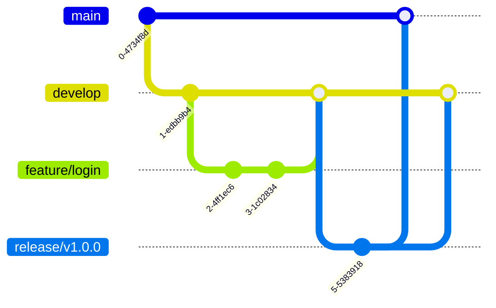
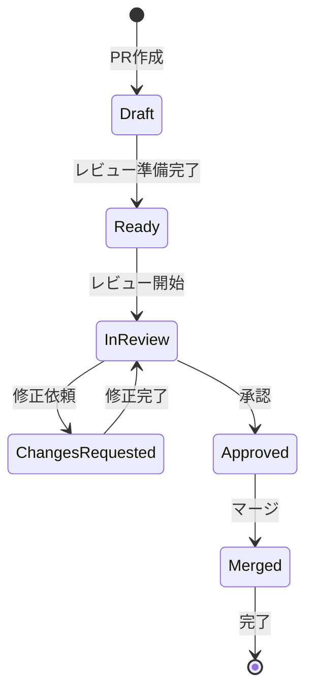
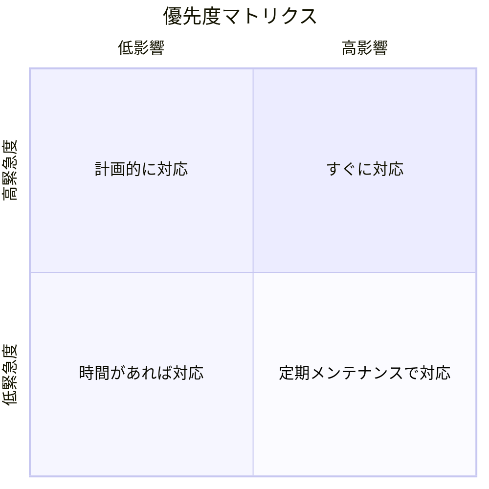
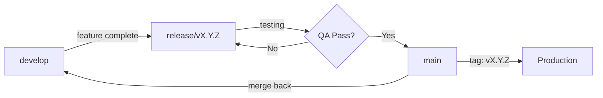
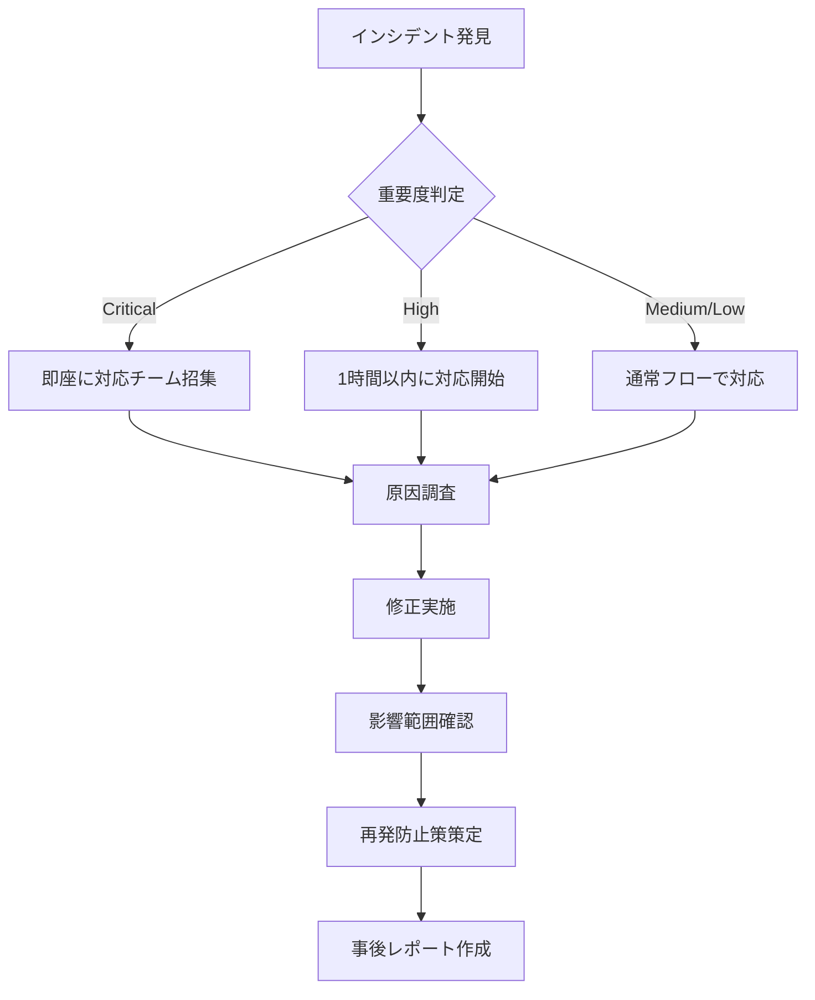
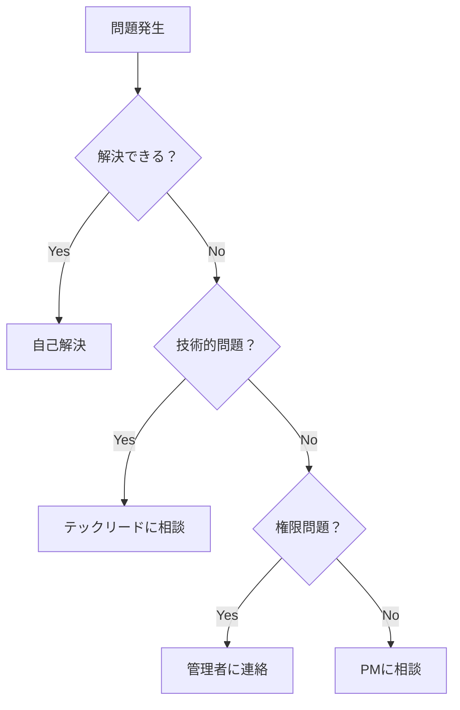

# GitHub 運用ガイドライン

**エス・エー・エス株式会社**  
*最終更新日: 2025年9月5日*  
*バージョン: 1.0.0*

## 📚 目次

1. [はじめに](#はじめに)
2. [基本原則](#基本原則)
3. [リポジトリ管理](#リポジトリ管理)
4. [ブランチ戦略](#ブランチ戦略)
5. [コミット規約](#コミット規約)
6. [プルリクエスト](#プルリクエスト)
7. [Issue管理](#issue管理)
8. [コードレビュー](#コードレビュー)
9. [リリース管理](#リリース管理)
10. [セキュリティガイドライン](#セキュリティガイドライン)
11. [クライアント案件管理](#クライアント案件管理)
12. [トラブルシューティング](#トラブルシューティング)

---

## 🎯 はじめに

このガイドラインは、エス・エー・エス株式会社におけるGitHub利用の標準規約を定めたものです。全ての開発者、プロジェクトマネージャー、関係者はこのガイドラインに従って作業を行ってください。

### 対象者
- 開発エンジニア
- プロジェクトマネージャー
- テックリード
- QAエンジニア
- 外部協力者

### 目的
- コード品質の向上
- セキュリティの確保
- 効率的な協働作業
- クライアント資産の保護

---

## 🔑 基本原則

### 1. セキュリティファースト
```markdown
✅ すべてのリポジトリは原則 Private
✅ 2要素認証（2FA）必須
✅ 機密情報はコミットしない
✅ 定期的な権限見直し
```

### 2. 最小権限の原則
```markdown
✅ 必要最小限の権限のみ付与
✅ 作業完了後は権限を削除
✅ 定期的な棚卸し実施
```

### 3. トレーサビリティ
```markdown
✅ すべての変更に意味のあるコミットメッセージ
✅ Issue との紐付け
✅ 適切なラベリング
```

---

## 📁 リポジトリ管理

### リポジトリ命名規則

```
[クライアント略称]-[プロジェクト名]-[種別]
```

#### 例
```
abc-corp-ec-site-frontend     # ABC社ECサイトのフロントエンド
abc-corp-ec-site-backend      # ABC社ECサイトのバックエンド
xyz-inc-mobile-app            # XYZ社モバイルアプリ
internal-tool-admin           # 社内ツール
```

### リポジトリ設定チェックリスト

新規リポジトリ作成時は以下を確認：

```markdown
## 初期設定
- [ ] Private設定
- [ ] README.md作成
- [ ] .gitignore設定
- [ ] LICENSE設定（クライアント案件は原則設定しない）
- [ ] Branch protection設定

## セキュリティ
- [ ] Secret scanning有効化
- [ ] Dependabot有効化
- [ ] Security policy追加

## ドキュメント
- [ ] CONTRIBUTING.md作成
- [ ] CODE_OF_CONDUCT.md作成
- [ ] プロジェクト概要記載
```

### ディレクトリ構造（推奨）

```
project-root/
├── .github/
│   ├── workflows/        # GitHub Actions
│   ├── ISSUE_TEMPLATE/   # Issueテンプレート
│   ├── pull_request_template.md
│   └── CODEOWNERS
├── docs/                 # ドキュメント
│   ├── architecture/    # アーキテクチャ設計
│   ├── api/             # API仕様書
│   └── deployment/      # デプロイ手順
├── src/                  # ソースコード
├── tests/                # テストコード
├── scripts/              # ユーティリティスクリプト
├── .env.example          # 環境変数サンプル
├── .gitignore
├── README.md
└── package.json / requirements.txt / go.mod など
```

---

## 🌿 ブランチ戦略

### Git Flow ベースの運用



### ブランチ種別

| ブランチ | 命名規則 | 用途 | 保護 |
|---------|---------|------|------|
| **main** | `main` | 本番環境（今後構築予定） | ✅ 完全保護（予定） |
| **staging** | `staging` | ステージング環境（今後構築予定） | ✅ 保護（予定） |
| **dev** | `dev` | 開発環境（現在運用中） | ⚠️ 部分保護 |
| **feature** | `feature/[issue番号]-[機能名]` | 機能開発 | ❌ |
| **bugfix** | `bugfix/[issue番号]-[説明]` | バグ修正 | ❌ |
| **hotfix** | `hotfix/[issue番号]-[説明]` | 緊急修正 | ❌ |
| **release** | `release/v[バージョン]` | リリース準備 | ⚠️ 一時保護 |

### ブランチルール

#### 現在の運用（dev環境のみ）
```yaml
dev:
  - 強制プッシュ禁止
  - 重要な変更はPR推奨
  - コミット前の確認必須

feature/*:
  - devブランチから作成
  - 作業完了後はdevにマージ
  - マージ後は削除
```

#### 将来の運用（3環境構成時）
```yaml
main:
  - 直接プッシュ禁止
  - PR必須（レビュー2名以上）
  - CI/CD成功必須
  - 管理者も制限対象

staging:
  - 直接プッシュ禁止
  - PR必須（レビュー1名以上）
  - テスト成功必須

dev:
  - featureブランチからのPR必須
  - テスト実行推奨

feature/*:
  - 作業完了後は削除
  - 2週間以上の放置禁止
  - devからの定期的な取り込み
```

---

## 📝 コミット規約

### Conventional Commits 形式

```
<type>(<scope>): <subject>

<body>

<footer>
```

### Type（必須）

| Type | 説明 | 例 |
|------|------|-----|
| `feat` | 新機能追加 | feat(auth): ログイン機能を実装 |
| `fix` | バグ修正 | fix(api): ユーザー検索のエラーを修正 |
| `docs` | ドキュメント変更 | docs(readme): インストール手順を更新 |
| `style` | コード整形（動作に影響なし） | style(css): インデントを修正 |
| `refactor` | リファクタリング | refactor(user): ユーザーモデルを簡潔に |
| `perf` | パフォーマンス改善 | perf(db): クエリを最適化 |
| `test` | テスト追加・修正 | test(auth): ログインテストを追加 |
| `build` | ビルドシステム変更 | build(webpack): 設定を更新 |
| `ci` | CI設定変更 | ci(github): Actions workflowを追加 |
| `chore` | その他の変更 | chore(deps): パッケージを更新 |
| `revert` | コミットの取り消し | revert: feat(auth)を取り消し |

### コミットメッセージの例

```bash
# 良い例
feat(auth): JWT認証を実装

- JWTトークンの生成・検証機能を追加
- リフレッシュトークンの仕組みを実装
- 認証ミドルウェアを作成

Closes #123

# 悪い例
update  # 何を更新したか不明
修正    # 何を修正したか不明
WIP     # 作業中のコミットは避ける
```

### コミットのベストプラクティス

```markdown
✅ 1つのコミットは1つの目的
✅ 日本語・英語どちらも可（プロジェクトで統一）
✅ Issue番号を含める
✅ 変更理由を body に記載
❌ 大きすぎるコミット
❌ 複数の目的を含むコミット
❌ コメントアウトしたコードを含める
```

---

## 🔀 プルリクエスト

### PR作成前チェックリスト

```markdown
## セルフチェック
- [ ] コードが正常に動作する
- [ ] テストが全て通る
- [ ] Lintエラーがない
- [ ] コンフリクトを解決済み
- [ ] 不要なコメント・デバッグコードを削除

## ドキュメント
- [ ] 必要に応じてREADMEを更新
- [ ] APIドキュメントを更新
- [ ] 破壊的変更の場合は移行ガイドを作成
```

### PRタイトル規則

```
[種別] 簡潔な説明 (#Issue番号)
```

#### 例
```
[feat] ユーザー認証機能を追加 (#123)
[fix] ログイン時のエラーを修正 (#456)
[docs] API仕様書を更新 (#789)
```

### PRテンプレート

```markdown
## 概要
<!-- 変更の概要を簡潔に記載 -->

## 変更内容
<!-- 詳細な変更内容をリスト形式で記載 -->
- 
- 
- 

## 変更種別
- [ ] 🎨 機能追加 (feat)
- [ ] 🐛 バグ修正 (fix)
- [ ] 📝 ドキュメント (docs)
- [ ] ♻️ リファクタリング (refactor)
- [ ] ⚡ パフォーマンス改善 (perf)
- [ ] ✅ テスト (test)

## 動作確認
<!-- 動作確認の方法と結果を記載 -->

## スクリーンショット
<!-- UI変更がある場合は必須 -->

## 影響範囲
<!-- この変更による影響範囲を記載 -->

## チェックリスト
- [ ] セルフレビュー実施済み
- [ ] テスト追加/更新済み
- [ ] ドキュメント更新済み
- [ ] 破壊的変更なし

## 関連Issue
Closes #

## 備考
<!-- その他の注意事項やレビュアーへの連絡事項 -->
```

### PRのライフサイクル



---

## 📋 Issue管理

### Issue種別とテンプレート

#### 1. バグ報告
```markdown
## バグの概要
<!-- 簡潔に記載 -->

## 再現手順
1. 
2. 
3. 

## 期待される動作
<!-- 正常な動作を記載 -->

## 実際の動作
<!-- バグの動作を記載 -->

## 環境
- OS: 
- ブラウザ: 
- バージョン: 

## スクリーンショット/ログ
<!-- 該当する場合 -->

## 優先度
- [ ] 🔴 Critical（システム停止）
- [ ] 🟠 High（主要機能に影響）
- [ ] 🟡 Medium（副次機能に影響）
- [ ] 🟢 Low（軽微な問題）
```

#### 2. 機能要望
```markdown
## 機能の概要
<!-- 提案する機能を簡潔に -->

## 背景・目的
<!-- なぜこの機能が必要か -->

## 詳細仕様
<!-- 具体的な仕様や要件 -->

## 代替案
<!-- 他の解決方法 -->

## 参考資料
<!-- 関連するリンクや資料 -->
```

### ラベル運用ルール

#### 必須ラベル（1つ以上）

| カテゴリ | ラベル | 用途 |
|---------|--------|------|
| **優先度** | `priority: critical` | 最優先対応 |
| | `priority: high` | 高優先度 |
| | `priority: medium` | 中優先度 |
| | `priority: low` | 低優先度 |
| **種別** | `bug` | バグ |
| | `enhancement` | 機能追加 |
| | `documentation` | ドキュメント |
| | `question` | 質問 |

#### ステータスラベル

| ラベル | 説明 |
|--------|------|
| `status: in progress` | 作業中 |
| `status: review` | レビュー中 |
| `status: blocked` | ブロック中 |
| `status: pending` | 保留 |

#### 工数ラベル

| ラベル | 目安時間 |
|--------|----------|
| `size: XS` | 1時間以内 |
| `size: S` | 半日 |
| `size: M` | 1-2日 |
| `size: L` | 3-5日 |
| `size: XL` | 1週間以上 |

### Issueの優先順位付け



---

## 👀 コードレビュー

### レビューの観点

#### 必須確認項目
```markdown
✅ **機能性**: 要件を満たしているか
✅ **セキュリティ**: 脆弱性はないか
✅ **パフォーマンス**: 効率的な実装か
✅ **可読性**: 理解しやすいコードか
✅ **テスト**: 適切にテストされているか
```

#### コードレビューチェックリスト

```markdown
## 設計・アーキテクチャ
- [ ] 設計原則に従っているか（SOLID, DRY, KISS）
- [ ] 適切な抽象化レベルか
- [ ] 既存のパターンと一貫性があるか

## コード品質
- [ ] 命名規則に従っているか
- [ ] 不要なコメントがないか
- [ ] エラーハンドリングが適切か
- [ ] ログ出力が適切か

## セキュリティ
- [ ] 入力値検証が行われているか
- [ ] SQLインジェクション対策があるか
- [ ] XSS対策があるか
- [ ] 機密情報がハードコードされていないか

## パフォーマンス
- [ ] N+1問題はないか
- [ ] 不要なループはないか
- [ ] キャッシュを適切に利用しているか

## テスト
- [ ] ユニットテストが書かれているか
- [ ] エッジケースがカバーされているか
- [ ] テストが理解しやすいか
```

### レビューコメントの書き方

#### 良い例
```markdown
💡 **提案**: この処理は `utils/validators.js` の `validateEmail()` 関数を使用することで、コードの重複を避けることができます。

```javascript
// 現在のコード
if (!/^[^\s@]+@[^\s@]+\.[^\s@]+$/.test(email)) {
  throw new Error('Invalid email');
}

// 提案
import { validateEmail } from '../utils/validators';
if (!validateEmail(email)) {
  throw new Error('Invalid email');
}
```
```

#### 悪い例
```markdown
❌ "このコードは良くない"  // 具体性がない
❌ "なぜこうしたの？"      // 攻撃的
❌ "私ならこうする"        // 建設的でない
```

### レビュー返答期限

| PR種別 | 初回レビュー | 再レビュー |
|--------|-------------|------------|
| **hotfix** | 1時間以内 | 30分以内 |
| **bugfix** | 4時間以内 | 2時間以内 |
| **feature** | 1営業日以内 | 4時間以内 |
| **その他** | 2営業日以内 | 1営業日以内 |

---

## 🚀 リリース管理

### セマンティックバージョニング

```
v[MAJOR].[MINOR].[PATCH]

MAJOR: 破壊的変更
MINOR: 後方互換性のある機能追加
PATCH: 後方互換性のあるバグ修正
```

### リリースフロー



### リリースチェックリスト

```markdown
## リリース前
- [ ] すべての機能が実装完了
- [ ] すべてのテストが成功
- [ ] ドキュメント更新完了
- [ ] CHANGELOG.md更新
- [ ] パフォーマンステスト実施
- [ ] セキュリティスキャン実施

## リリース作業
- [ ] リリースブランチ作成
- [ ] バージョン番号更新
- [ ] リリースノート作成
- [ ] タグ作成
- [ ] mainブランチへマージ

## リリース後
- [ ] 本番環境へデプロイ
- [ ] 動作確認
- [ ] developブランチへマージバック
- [ ] リリース告知
- [ ] モニタリング強化（24時間）
```

### リリースノートテンプレート

```markdown
# Release v1.2.3

**Release Date**: 2025-09-05

## ✨ New Features
- Feature A (#123)
- Feature B (#124)

## 🐛 Bug Fixes
- Fixed issue with login (#125)
- Resolved database connection problem (#126)

## 💥 Breaking Changes
- API endpoint `/v1/users` changed to `/v2/users`

## 📦 Dependencies
- Updated package-A to v2.0.0
- Added package-B v1.0.0

## 📝 Documentation
- Updated API documentation
- Added migration guide

## 🙏 Contributors
- @developer1
- @developer2
```

---

## 🔒 セキュリティガイドライン

### 絶対にコミットしてはいけないもの

```markdown
❌ パスワード、APIキー、トークン
❌ 秘密鍵、証明書
❌ 個人情報（本番データ）
❌ 内部ドキュメントURL
❌ クライアント固有の設定値
```

### 機密情報を誤ってコミットした場合

```bash
# 1. 即座にローテーション
# 漏洩した認証情報を無効化し、新しいものを発行

# 2. 履歴から完全に削除
git filter-branch --force --index-filter \
  'git rm --cached --ignore-unmatch [ファイルパス]' \
  --prune-empty --tag-name-filter cat -- --all

# 3. 強制プッシュ
git push origin --force --all
git push origin --force --tags

# 4. 報告
# セキュリティチームと上長に即座に報告
```

### セキュリティベストプラクティス

#### 依存関係管理
```markdown
✅ Dependabotアラートを有効化
✅ 定期的な`npm audit`/`pip check`実行
✅ 本番環境では最小限の依存関係
✅ lock ファイルをコミット
```

#### コードセキュリティ
```markdown
✅ 入力値は必ず検証
✅ SQLは必ずプレースホルダー使用
✅ XSS対策（エスケープ処理）
✅ CSRF対策
✅ セキュアな乱数生成器使用
```

#### アクセス制御
```markdown
✅ 最小権限の原則
✅ 定期的な権限レビュー
✅ 退職者の即座の権限削除
✅ 外部協力者は期限付き権限
```

### インシデント対応



## 🔧 クライアント案件管理

### Git操作フロー

#### 1. 開発準備
```bash
# devフォルダをVSCodeで開く
code dev/

# リモートリポジトリの変更をローカルに取り込み
git pull origin main

# 作業ブランチを作成（必要に応じて）
git checkout -b feature/新機能名
```

#### 2. 開発作業
```bash
# 作業状況確認
git status

# 変更内容の確認
git diff

# コミットしたい内容をステージング
git add ファイル名
# または全てステージング
git add .
```

#### 3. コミット
```bash
# コミットメッセージを付けてコミット
git commit -m "feat: ログイン機能を実装

詳細説明

Issue: #25"
```

#### 4. リモートへプッシュ
```bash
# リモートリポジトリにプッシュ
git push origin main
# またはブランチをプッシュ
git push origin feature/新機能名
```

### その他のよく使うコマンド

| コマンド | 説明 | 使用例 |
|---------|------|--------|
| `git log` | コミット履歴の確認 | `git log --oneline -10` |
| `git branch` | ブランチ一覧 | `git branch -a` |
| `git checkout` | ブランチ切り替え | `git checkout ブランチ名` |
| `git merge` | ブランチのマージ | `git merge feature/新機能` |
| `git stash` | 一時的に変更を退避 | `git stash` |
| `git reset` | コミットの取り消し | `git reset --soft HEAD^` |

### プロジェクト開始時

```markdown
## セットアップチェックリスト
- [ ] リポジトリ作成（必ずPrivate）
- [ ] チーム作成（client-[クライアント名]）
- [ ] アクセス権限設定
- [ ] ブランチ保護設定
- [ ] CI/CD環境構築
- [ ] ドキュメント初期化

## クライアント向け準備
- [ ] アクセス権限の確認（Read権限推奨）
- [ ] 進捗確認方法の共有
- [ ] Issue/PR運用ルールの説明
- [ ] リリース手順の合意
```

### 情報管理ルール

```markdown
✅ クライアント情報は絶対に他案件に漏らさない
✅ コミットメッセージに機密情報を含めない
✅ READMEには公開可能な情報のみ記載
✅ クライアント固有の設定は環境変数で管理
❌ 他クライアントのコードを流用する際は要レビュー
```

### 納品準備

```markdown
## 納品チェックリスト
- [ ] 不要なブランチを削除
- [ ] 不要なIssue/PRをクローズ
- [ ] ドキュメント最終確認
- [ ] テストコードの整備
- [ ] セキュリティスキャン実施
- [ ] ライセンス確認
- [ ] 納品物のアーカイブ作成

## 引き継ぎドキュメント
- [ ] システム構成図
- [ ] 環境構築手順書
- [ ] 運用手順書
- [ ] トラブルシューティングガイド
- [ ] 連絡先一覧
```

---

## 🔧 トラブルシューティング

### よくある問題と解決方法

#### 1. マージコンフリクト

```bash
# 最新のdevelopを取り込む
git checkout develop
git pull origin develop
git checkout feature/your-branch
git merge develop

# コンフリクト解決
# 1. コンフリクトファイルを編集
# 2. 解決したらadd
git add [resolved-file]
git commit -m "resolve: マージコンフリクトを解決"
```

#### 2. 誤ったコミット

```bash
# 直前のコミットを修正
git commit --amend

# 特定のコミットまで戻る（履歴は残る）
git revert [commit-hash]

# 特定のコミットまで戻る（履歴を書き換え）※要注意
git reset --hard [commit-hash]
```

#### 3. 大きなファイルをコミットしてしまった

```bash
# Git LFSを使用
git lfs track "*.psd"
git add .gitattributes
git add large-file.psd
git commit -m "add: Git LFSで大きなファイルを管理"
```

### エスカレーションパス



---

## 📞 サポート・問い合わせ

### 社内サポート

| 種別 | 連絡先 | 対応時間 |
|------|--------|----------|
| **技術的問題** | SAS Github管理チーム (github@sas-com.com) | 営業時間内 |
| **権限・アクセス** | SAS Github管理チーム (github@sas-com.com) | 営業時間内 |
| **セキュリティ** | SAS Github管理チーム (github@sas-com.com) | 24時間 |
| **緊急時** | SAS Github管理チーム (github@sas-com.com) | 24時間 |

### 有用なリソース

- [GitHub公式ドキュメント](https://docs.github.com)
- [Pro Git Book（日本語）](https://git-scm.com/book/ja/v2)
- [Conventional Commits](https://www.conventionalcommits.org/)
- [セマンティックバージョニング](https://semver.org/lang/ja/)

---

## 📝 改訂履歴

| バージョン | 日付 | 変更内容 | 承認者 |
|-----------|------|---------|--------|
| 1.0.0 | 2025-09-05 | 初版作成 | CTO |

---

## 📋 付録

### A. コマンドクイックリファレンス

```bash
# ブランチ操作
git checkout -b feature/new-feature    # 新規ブランチ作成
git branch -d feature/old-feature      # ブランチ削除
git branch -a                          # 全ブランチ表示

# リモート操作
git remote -v                          # リモート確認
git fetch origin                       # 最新情報取得
git pull origin develop                # プル

# 状態確認
git status                             # 状態確認
git log --oneline -10                 # 履歴確認
git diff                               # 差分確認

# タグ操作
git tag v1.0.0                        # タグ作成
git push origin v1.0.0                # タグをプッシュ
```

### B. .gitignoreテンプレート

```gitignore
# Dependencies
node_modules/
vendor/
venv/

# Build outputs
dist/
build/
*.exe
*.dll
*.so
*.dylib

# IDE
.vscode/
.idea/
*.swp
*.swo

# OS
.DS_Store
Thumbs.db

# Env
.env
.env.local
*.log

# Credentials
*.key
*.pem
*.cert
```

### C. PR/Issueテンプレートリンク

- [PR Template](.github/pull_request_template.md)
- [Bug Report](.github/ISSUE_TEMPLATE/bug_report.md)
- [Feature Request](.github/ISSUE_TEMPLATE/feature_request.md)

---

**© 2025 エス・エー・エス株式会社 - GitHub運用ガイドライン**