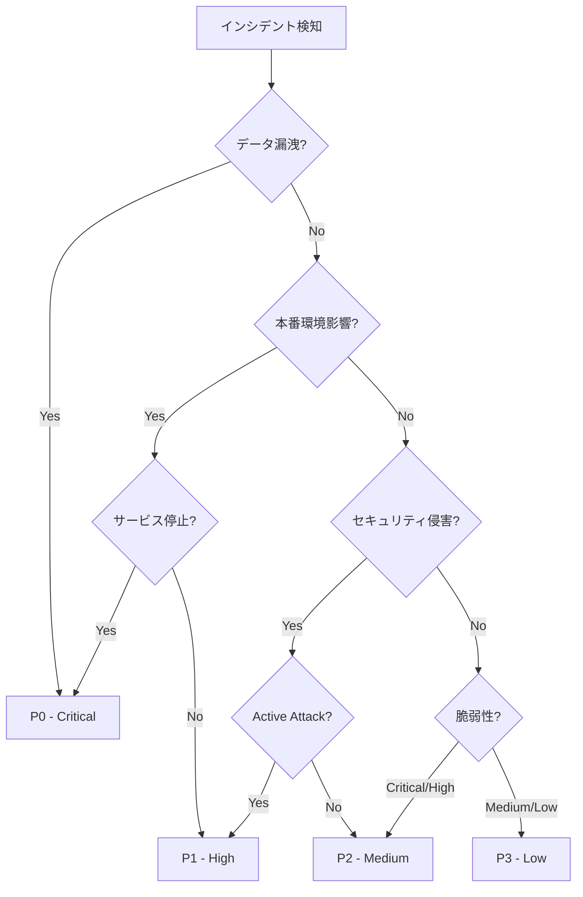

# インシデント分類・トリアージガイド

**エス・エー・エス株式会社**  
*セキュリティインシデントの迅速な分類と優先度付けのための実践ガイド*

## 目次

1. [概要](#概要)
2. [インシデント分類フレームワーク](#インシデント分類フレームワーク)
3. [自動トリアージシステム](#自動トリアージシステム)
4. [影響度評価](#影響度評価)
5. [エスカレーションプロトコル](#エスカレーションプロトコル)
6. [分類事例集](#分類事例集)
7. [クイックリファレンス](#クイックリファレンス)

## 概要

### 目的
本ガイドは、セキュリティインシデントを迅速かつ正確に分類し、適切な優先度を設定するための標準化されたフレームワークを提供します。

### 基本原則
- **一貫性**: 誰が評価しても同じ結果になる明確な基準
- **迅速性**: 5分以内での初期分類完了
- **正確性**: 過小評価・過大評価の防止
- **追跡可能性**: 分類根拠の文書化

## インシデント分類フレームワーク

### 分類ディシジョンツリー



### インシデントタイプ別分類

#### 1. データ侵害インシデント

| サブタイプ | 判定基準 | 重要度 | 対応時間 |
|-----------|----------|--------|----------|
| 顧客データ漏洩 | 個人情報・機密情報の外部流出 | P0 | 即座 |
| 内部データ漏洩 | 社内機密情報の不正取得 | P0-P1 | 15分-1時間 |
| アクセスログ漏洩 | ログファイルの外部公開 | P1-P2 | 1-4時間 |
| テストデータ漏洩 | 非本番データの漏洩 | P2-P3 | 4時間-翌日 |

#### 2. アクセス制御インシデント

| サブタイプ | 判定基準 | 重要度 | 対応時間 |
|-----------|----------|--------|----------|
| 管理者権限奪取 | Organization Ownerの侵害 | P0 | 即座 |
| 不正認証成功 | 正規ユーザーアカウントの侵害 | P1 | 1時間 |
| ブルートフォース | 大量の認証試行検知 | P1-P2 | 1-4時間 |
| 権限昇格試行 | 権限昇格の失敗ログ | P2 | 4時間 |

#### 3. コード/設定インシデント

| サブタイプ | 判定基準 | 重要度 | 対応時間 |
|-----------|----------|--------|----------|
| マルウェア混入 | 悪意のあるコードのコミット | P0-P1 | 即座-1時間 |
| バックドア設置 | 隠された不正アクセス経路 | P0 | 即座 |
| Secret露出 | APIキー等のハードコード | P1-P2 | 1-4時間 |
| 設定ミス | セキュリティ設定の不備 | P2-P3 | 4時間-翌日 |

#### 4. 脆弱性インシデント

| CVSSスコア | 悪用可能性 | 影響範囲 | 重要度 | 対応時間 |
|------------|------------|----------|--------|----------|
| 9.0-10.0 | 容易 | 広範囲 | P0 | 即座 |
| 7.0-8.9 | 可能 | 中程度 | P1 | 1時間 |
| 4.0-6.9 | 困難 | 限定的 | P2 | 4時間 |
| 0.0-3.9 | 極困難 | 最小 | P3 | 翌営業日 |

#### 5. 可用性インシデント

| サブタイプ | 判定基準 | 重要度 | 対応時間 |
|-----------|----------|--------|----------|
| DDoS攻撃 | サービス完全停止 | P0 | 即座 |
| リソース枯渇 | パフォーマンス重大劣化 | P1 | 1時間 |
| 部分的障害 | 一部機能の利用不可 | P2 | 4時間 |
| 断続的エラー | 散発的な接続問題 | P3 | 翌営業日 |

## 自動トリアージシステム

### GitHub Security Alert 自動分類

```python
# scripts/incident-tools/auto-triage.py
import json
from datetime import datetime
from typing import Dict, Tuple

class IncidentTriageSystem:
    """インシデント自動トリアージシステム"""
    
    def __init__(self):
        self.severity_mapping = {
            'critical': 'P0',
            'high': 'P1',
            'medium': 'P2',
            'low': 'P3'
        }
        
        self.cvss_thresholds = {
            'P0': 9.0,
            'P1': 7.0,
            'P2': 4.0,
            'P3': 0.0
        }
    
    def triage_security_alert(self, alert: Dict) -> Tuple[str, Dict]:
        """セキュリティアラートのトリアージ"""
        
        # 基本情報の抽出
        alert_type = alert.get('type', 'unknown')
        severity = alert.get('severity', 'medium').lower()
        cvss_score = alert.get('cvss_score', 0)
        
        # 初期分類
        priority = self._determine_priority(alert_type, severity, cvss_score)
        
        # コンテキスト評価
        context_factors = self._evaluate_context(alert)
        
        # 最終優先度調整
        final_priority = self._adjust_priority(priority, context_factors)
        
        # 対応計画の生成
        response_plan = self._generate_response_plan(final_priority, alert)
        
        return final_priority, response_plan
    
    def _determine_priority(self, alert_type: str, severity: str, cvss_score: float) -> str:
        """基本優先度の決定"""
        
        # 特別なケースの処理
        if alert_type == 'secret_scanning':
            return 'P1' if 'production' in str(alert).lower() else 'P2'
        
        if alert_type == 'code_scanning' and severity == 'critical':
            return 'P0' if cvss_score >= 9.0 else 'P1'
        
        # CVSSスコアベースの分類
        for priority, threshold in self.cvss_thresholds.items():
            if cvss_score >= threshold:
                return priority
        
        # デフォルトは severity マッピング
        return self.severity_mapping.get(severity, 'P2')
    
    def _evaluate_context(self, alert: Dict) -> Dict:
        """コンテキスト要因の評価"""
        
        factors = {
            'is_production': self._is_production_affected(alert),
            'is_public_repo': alert.get('repository', {}).get('private', True) == False,
            'has_customer_data': self._check_customer_data(alert),
            'is_actively_exploited': self._check_active_exploitation(alert),
            'affected_users_count': self._estimate_affected_users(alert)
        }
        
        return factors
    
    def _adjust_priority(self, base_priority: str, factors: Dict) -> str:
        """コンテキストに基づく優先度調整"""
        
        priority_levels = ['P0', 'P1', 'P2', 'P3']
        current_index = priority_levels.index(base_priority)
        
        # エスカレーション条件
        if factors['is_production'] and factors['has_customer_data']:
            current_index = max(0, current_index - 1)
        
        if factors['is_actively_exploited']:
            current_index = max(0, current_index - 1)
        
        if factors['affected_users_count'] > 1000:
            current_index = max(0, current_index - 1)
        
        # デエスカレーション条件
        if not factors['is_production'] and not factors['is_public_repo']:
            current_index = min(3, current_index + 1)
        
        return priority_levels[current_index]
    
    def _generate_response_plan(self, priority: str, alert: Dict) -> Dict:
        """対応計画の生成"""
        
        response_times = {
            'P0': {'initial': 15, 'resolution': 240},
            'P1': {'initial': 60, 'resolution': 1440},
            'P2': {'initial': 240, 'resolution': 4320},
            'P3': {'initial': 1440, 'resolution': 10080}
        }
        
        plan = {
            'priority': priority,
            'response_time': response_times[priority],
            'required_team': self._determine_required_team(priority),
            'initial_actions': self._get_initial_actions(priority, alert),
            'escalation_path': self._get_escalation_path(priority),
            'communication_plan': self._get_communication_plan(priority)
        }
        
        return plan
    
    def _determine_required_team(self, priority: str) -> list:
        """必要な対応チームの決定"""
        
        teams = {
            'P0': ['incident_commander', 'security_team', 'dev_lead', 'cto'],
            'P1': ['security_lead', 'dev_team', 'devops'],
            'P2': ['security_analyst', 'dev_team'],
            'P3': ['dev_team']
        }
        
        return teams.get(priority, ['dev_team'])
    
    def _is_production_affected(self, alert: Dict) -> bool:
        """本番環境への影響判定"""
        repo_name = alert.get('repository', {}).get('name', '')
        branch = alert.get('ref', '')
        
        production_indicators = ['prod', 'production', 'main', 'master']
        return any(ind in repo_name.lower() or ind in branch.lower() 
                  for ind in production_indicators)
    
    def _check_customer_data(self, alert: Dict) -> bool:
        """顧客データの関与判定"""
        sensitive_patterns = ['customer', 'user', 'payment', 'personal', 'pii']
        alert_str = json.dumps(alert).lower()
        
        return any(pattern in alert_str for pattern in sensitive_patterns)
    
    def _check_active_exploitation(self, alert: Dict) -> bool:
        """アクティブな悪用の確認"""
        # 実際の実装では、SIEMやログ分析システムと連携
        indicators = alert.get('exploitation_indicators', {})
        return indicators.get('active', False)
    
    def _estimate_affected_users(self, alert: Dict) -> int:
        """影響を受けるユーザー数の推定"""
        # 実際の実装では、サービスメトリクスと連携
        return alert.get('affected_users', 0)
    
    def _get_initial_actions(self, priority: str, alert: Dict) -> list:
        """初期対応アクションリスト"""
        
        base_actions = ['証拠保全', 'ログ収集', '影響範囲特定']
        
        priority_actions = {
            'P0': ['サービス隔離', '緊急パッチ適用', '全ステークホルダー通知'],
            'P1': ['アクセス制限', '詳細調査', 'チーム招集'],
            'P2': ['脆弱性評価', '修正計画策定'],
            'P3': ['チケット作成', '定期レビュー登録']
        }
        
        return base_actions + priority_actions.get(priority, [])
    
    def _get_escalation_path(self, priority: str) -> dict:
        """エスカレーションパス"""
        
        paths = {
            'P0': {
                'immediate': ['CTO', 'Security Lead'],
                '30min': ['Legal', 'PR'],
                '1hour': ['CEO', 'Board']
            },
            'P1': {
                'immediate': ['Security Lead', 'Dev Lead'],
                '1hour': ['CTO'],
                '4hour': ['Legal']
            },
            'P2': {
                'immediate': ['Dev Team'],
                '4hour': ['Security Lead']
            },
            'P3': {
                'next_business_day': ['Dev Team']
            }
        }
        
        return paths.get(priority, {})
    
    def _get_communication_plan(self, priority: str) -> dict:
        """コミュニケーション計画"""
        
        plans = {
            'P0': {
                'internal': '即座・30分毎更新',
                'customer': '2時間以内に初回通知',
                'public': '状況に応じて公表'
            },
            'P1': {
                'internal': '1時間以内・時間毎更新',
                'customer': '影響がある場合のみ',
                'public': '不要'
            },
            'P2': {
                'internal': '4時間以内・日次更新',
                'customer': '不要',
                'public': '不要'
            },
            'P3': {
                'internal': '定期報告で言及',
                'customer': '不要',
                'public': '不要'
            }
        }
        
        return plans.get(priority, {})
```

### 機械学習による分類精度向上

```python
# scripts/incident-tools/ml-classifier.py
import pandas as pd
import numpy as np
from sklearn.ensemble import RandomForestClassifier
from sklearn.preprocessing import LabelEncoder
import joblib

class MLIncidentClassifier:
    """機械学習ベースのインシデント分類器"""
    
    def __init__(self, model_path=None):
        if model_path:
            self.model = joblib.load(model_path)
        else:
            self.model = RandomForestClassifier(n_estimators=100)
        
        self.feature_encoders = {}
        self.priority_encoder = LabelEncoder()
    
    def train(self, historical_incidents: pd.DataFrame):
        """過去のインシデントデータで学習"""
        
        # 特徴量エンジニアリング
        features = self._extract_features(historical_incidents)
        
        # ラベルエンコーディング
        labels = self.priority_encoder.fit_transform(
            historical_incidents['final_priority']
        )
        
        # モデル訓練
        self.model.fit(features, labels)
        
        # 特徴重要度の分析
        self._analyze_feature_importance(features.columns)
    
    def predict(self, incident: dict) -> tuple:
        """新規インシデントの分類予測"""
        
        # 特徴量抽出
        features = self._extract_single_features(incident)
        
        # 予測
        priority_encoded = self.model.predict([features])[0]
        confidence = max(self.model.predict_proba([features])[0])
        
        # デコード
        priority = self.priority_encoder.inverse_transform([priority_encoded])[0]
        
        return priority, confidence
    
    def _extract_features(self, df: pd.DataFrame) -> pd.DataFrame:
        """特徴量抽出"""
        
        features = pd.DataFrame()
        
        # 時間的特徴
        features['hour_of_day'] = pd.to_datetime(df['timestamp']).dt.hour
        features['day_of_week'] = pd.to_datetime(df['timestamp']).dt.dayofweek
        features['is_weekend'] = features['day_of_week'].isin([5, 6]).astype(int)
        
        # アラート特徴
        features['cvss_score'] = df['cvss_score'].fillna(0)
        features['alert_count_24h'] = df['alert_count_24h']
        features['similar_alerts'] = df['similar_alerts_count']
        
        # リポジトリ特徴
        features['is_critical_repo'] = df['repository'].apply(
            lambda x: 1 if any(critical in x.lower() 
                              for critical in ['core', 'auth', 'payment']) 
            else 0
        )
        features['repo_stars'] = df['repo_stars'].fillna(0)
        features['repo_contributors'] = df['repo_contributors'].fillna(1)
        
        # 影響度特徴
        features['affected_files'] = df['affected_files_count']
        features['affected_users'] = df['estimated_affected_users']
        features['data_sensitivity'] = df['data_sensitivity_score']
        
        return features
    
    def _extract_single_features(self, incident: dict) -> list:
        """単一インシデントの特徴量抽出"""
        
        from datetime import datetime
        
        timestamp = datetime.fromisoformat(incident.get('timestamp', datetime.now().isoformat()))
        
        features = [
            timestamp.hour,
            timestamp.weekday(),
            1 if timestamp.weekday() in [5, 6] else 0,
            incident.get('cvss_score', 0),
            incident.get('alert_count_24h', 0),
            incident.get('similar_alerts_count', 0),
            1 if any(c in incident.get('repository', '').lower() 
                    for c in ['core', 'auth', 'payment']) else 0,
            incident.get('repo_stars', 0),
            incident.get('repo_contributors', 1),
            incident.get('affected_files_count', 0),
            incident.get('estimated_affected_users', 0),
            incident.get('data_sensitivity_score', 0)
        ]
        
        return features
    
    def _analyze_feature_importance(self, feature_names):
        """特徴重要度の分析"""
        
        importances = self.model.feature_importances_
        indices = np.argsort(importances)[::-1]
        
        print("Feature Importance Ranking:")
        for i in range(len(feature_names)):
            print(f"{i+1}. {feature_names[indices[i]]}: {importances[indices[i]]:.4f}")
```

## 影響度評価

### ビジネスインパクト分析

#### 影響度スコアリングマトリックス

| 要因 | 重み | スコア範囲 | 評価基準 |
|------|------|------------|----------|
| データ機密性 | 30% | 0-10 | 個人情報:10, 内部情報:5, 公開情報:0 |
| ユーザー影響 | 25% | 0-10 | 全ユーザー:10, 一部:5, なし:0 |
| サービス可用性 | 20% | 0-10 | 完全停止:10, 劣化:5, 正常:0 |
| 財務影響 | 15% | 0-10 | 重大損失:10, 中程度:5, 軽微:0 |
| 規制違反リスク | 10% | 0-10 | 確実:10, 可能性あり:5, なし:0 |

#### 影響度計算式

```python
def calculate_impact_score(factors: dict) -> float:
    """総合影響度スコアの計算"""
    
    weights = {
        'data_sensitivity': 0.30,
        'user_impact': 0.25,
        'service_availability': 0.20,
        'financial_impact': 0.15,
        'compliance_risk': 0.10
    }
    
    total_score = sum(
        factors.get(factor, 0) * weight 
        for factor, weight in weights.items()
    )
    
    return round(total_score, 2)
```

### タイムライン影響分析

```yaml
影響拡大予測モデル:
  0-15分:
    - 初期影響範囲の特定
    - 直接的な被害の確認
    
  15-60分:
    - 二次的影響の顕在化
    - 連鎖的な障害の発生
    
  1-4時間:
    - ビジネス影響の拡大
    - 顧客への影響波及
    
  4-24時間:
    - レピュテーション影響
    - 規制当局の関心
    
  24時間以降:
    - 長期的な信頼損失
    - 法的措置のリスク
```

## エスカレーションプロトコル

### 自動エスカレーションルール

```python
# scripts/incident-tools/escalation-manager.py
class EscalationManager:
    """エスカレーション管理システム"""
    
    def __init__(self):
        self.escalation_rules = {
            'P0': {
                'immediate': ['cto@sas-com.com', 'security-lead@sas-com.com'],
                '15min': ['ceo@sas-com.com', 'legal@sas-com.com'],
                '30min': ['board@sas-com.com', 'pr@sas-com.com']
            },
            'P1': {
                'immediate': ['security-lead@sas-com.com', 'dev-lead@sas-com.com'],
                '30min': ['cto@sas-com.com'],
                '2hour': ['legal@sas-com.com']
            },
            'P2': {
                'immediate': ['dev-team@sas-com.com'],
                '2hour': ['security-lead@sas-com.com']
            },
            'P3': {
                '24hour': ['dev-team@sas-com.com']
            }
        }
    
    def escalate(self, incident_id: str, priority: str, elapsed_time: int):
        """時間経過に基づくエスカレーション"""
        
        rules = self.escalation_rules.get(priority, {})
        notifications = []
        
        for threshold, contacts in rules.items():
            if self._should_escalate(threshold, elapsed_time):
                notifications.extend(contacts)
        
        return self._send_notifications(incident_id, notifications)
    
    def _should_escalate(self, threshold: str, elapsed_minutes: int) -> bool:
        """エスカレーション判定"""
        
        thresholds = {
            'immediate': 0,
            '15min': 15,
            '30min': 30,
            '1hour': 60,
            '2hour': 120,
            '4hour': 240,
            '24hour': 1440
        }
        
        threshold_minutes = thresholds.get(threshold, 0)
        return elapsed_minutes >= threshold_minutes
    
    def _send_notifications(self, incident_id: str, contacts: list) -> bool:
        """通知送信"""
        
        for contact in contacts:
            # 実際の通知送信処理
            print(f"Escalating {incident_id} to {contact}")
        
        return True
```

### 手動エスカレーション判断基準

#### エスカレーションが必要な状況

1. **技術的複雑性**
   - 原因不明が30分以上継続
   - 複数システムへの影響拡大
   - 未知の攻撃手法の発見

2. **ビジネス影響**
   - SLA違反の可能性
   - 重要顧客への影響
   - 売上への直接的影響

3. **外部要因**
   - メディアの関心
   - 規制当局からの問い合わせ
   - 法的措置の可能性

4. **リソース不足**
   - 専門知識の必要性
   - 人員の不足
   - 権限の不足

## 分類事例集

### ケース1: APIキーの漏洩

**シナリオ**: 開発者が誤ってAWSのアクセスキーをpublicリポジトリにコミット

**分類プロセス**:
1. GitHub Secret Scanningアラート受信
2. リポジトリ確認 → Public
3. キーの種類確認 → AWS本番環境
4. 使用状況確認 → 未使用

**判定**: P1 (High)

**根拠**:
- 本番環境のクレデンシャル (+1レベル)
- Publicリポジトリ (+1レベル)
- 未使用 (-1レベル)

### ケース2: DDoS攻撃

**シナリオ**: GitHub Pagesでホストしているサービスサイトへの大量アクセス

**分類プロセス**:
1. 監視アラート受信
2. トラフィック分析 → 異常パターン検出
3. サービス状態確認 → 応答遅延
4. 影響範囲確認 → 顧客サイト

**判定**: P0 (Critical)

**根拠**:
- サービス劣化
- 顧客影響あり
- 継続的な攻撃

### ケース3: 依存関係の脆弱性

**シナリオ**: Dependabotから高severity脆弱性アラート

**分類プロセス**:
1. Dependabotアラート受信
2. CVSS確認 → 7.5
3. 悪用可能性確認 → PoC公開済み
4. 影響範囲確認 → 開発環境のみ

**判定**: P2 (Medium)

**根拠**:
- High CVSS
- PoC存在
- 非本番環境 (-1レベル)

## クイックリファレンス

### 5分以内の初期分類チェックリスト

- [ ] アラートソースの確認
- [ ] 影響環境の特定（本番/開発）
- [ ] データ種別の確認（機密/公開）
- [ ] 影響ユーザー数の概算
- [ ] 攻撃の継続性確認
- [ ] 既知の脆弱性確認
- [ ] 初期優先度の設定
- [ ] エスカレーション要否判定

### 優先度別対応サマリー

| 優先度 | 検知時間 | 初動時間 | 解決目標 | 必須メンバー |
|--------|----------|----------|----------|--------------|
| P0 | 即座 | 15分 | 4時間 | CTO, Security全員, Dev Lead |
| P1 | 5分 | 1時間 | 24時間 | Security Lead, Dev Team |
| P2 | 1時間 | 4時間 | 72時間 | Security担当, Dev担当 |
| P3 | 24時間 | 翌営業日 | 1週間 | Dev担当 |

### よくある分類ミス

1. **過大評価の例**
   - 開発環境の軽微な設定ミス → P0判定
   - 正解: P2-P3

2. **過小評価の例**
   - 退職者アカウントの残存 → P3判定
   - 正解: P1（アクセス可能な場合）

3. **コンテキスト無視**
   - すべてのSecret露出 → P0判定
   - 正解: 環境と有効性で判定

### 分類精度向上のヒント

1. **定期的なレビュー**
   - 月次で分類結果を振り返り
   - 誤分類の原因分析
   - ルールの調整

2. **チーム間の認識統一**
   - 定期的な訓練実施
   - 事例の共有
   - フィードバックループ

3. **自動化の活用**
   - 機械学習モデルの導入
   - ルールベースの自動分類
   - 人間による検証

---

**改訂履歴**
- 2025-09-10: 初版作成

**次回レビュー予定**: 2026-01-10