# GitHub 運用ガイドライン

**エス・エー・エス株式会社**  
*最終更新日: 2025年9月5日*  
*バージョン: 1.0.0*

## 🎯 このガイドラインの目的

エス・エー・エス株式会社のGitHub運用ガイドラインは、以下の目的を達成するために策定されています：

### 主要な目的
1. **開発品質の向上** - 統一されたワークフローとレビュープロセスによる高品質なコード管理
2. **セキュリティの強化** - 機密情報保護とアクセス制御の標準化
3. **チーム生産性の最大化** - 明確なルールと自動化による効率的な開発プロセス
4. **知識の継承** - ベストプラクティスの文書化と共有による技術ノウハウの蓄積
5. **コンプライアンス対応** - 監査要件への対応とトレーサビリティの確保

### 適用範囲
このリポジトリは、エス・エー・エス株式会社におけるGitHub利用に関する**全社共通**ガイドラインをまとめたものです。
各プロジェクト固有のガイドラインは、[プロジェクト別ガイドライン作成マニュアル](./docs/onboarding/PROJECT_GUIDELINE_TEMPLATE.md)を参考に、各プロジェクトリポジトリ内に作成してください。

---

## 🚀 新規参画者向けセットアップフロー

適切なドキュメントを見つけやすくするため、対象者別に優先度マトリクスを整理しています。

### 凡例
- **◎** = 必須（Must read - 最初に読むべきドキュメント）
- **○** = 推奨（Recommended - 業務で頻繁に参照）
- **△** = 参考（Reference - 必要時に参照）
- **－** = 対象外（Not applicable）

新規参画者の方が効率的にプロジェクトに参加できるよう、段階的なセットアップフローを整備しています。
**各ノードをクリックすると詳細ドキュメントに移動できます。**

```mermaid
flowchart TD
    %% スタート
    START([新規参画開始]) --> CHECK{WSL2環境<br/>確認}
    
    %% 環境構築フェーズ（Day 1-2: 約3-4時間）
    CHECK -->|Windows使用| WSL2[WSL2インストール<br/>⏱️ 30分<br/>📖 環境構築ガイド]
    CHECK -->|Mac/Linux使用| GIT_SETUP[Git環境セットアップ<br/>⏱️ 15分<br/>📖 環境構築ガイド]
    
    WSL2 --> GIT_SETUP
    GIT_SETUP --> GITHUB_ACCOUNT[GitHubアカウント作成<br/>⏱️ 20分<br/>📖 環境構築ガイド]
    GITHUB_ACCOUNT --> TWO_FA[2FA設定<br/>⏱️ 10分<br/>📖 環境構築ガイド]
    TWO_FA --> SSH_KEY[SSH鍵生成・登録<br/>⏱️ 15分<br/>📖 環境構築ガイド]
    SSH_KEY --> CONNECTION_TEST[接続テスト<br/>⏱️ 5分<br/>📖 環境構築ガイド]
    
    CONNECTION_TEST --> ENV_CHECK{環境構築<br/>完了確認}
    ENV_CHECK -->|NG| TROUBLESHOOT[トラブルシューティング<br/>📞 サポート連絡<br/>📖 トラブル対応]
    TROUBLESHOOT --> ENV_CHECK
    ENV_CHECK -->|OK| ORG_INVITE
    
    %% 組織参加フェーズ（Day 2: 約1時間）
    ORG_INVITE[Organization招待<br/>⏱️ 15分<br/>📖 オンボーディング] --> TEAM_ASSIGN[チーム配属確認<br/>⏱️ 15分<br/>📖 オンボーディング]
    TEAM_ASSIGN --> DOCS_READ[基本ドキュメント確認<br/>⏱️ 30分<br/>📖 統合ガイドライン]
    
    %% 学習フェーズ（Day 3-5: 約8-10時間）
    DOCS_READ --> SKILL_CHECK{GitHub経験<br/>レベル確認}
    
    SKILL_CHECK -->|初心者| BASIC_TRAINING[Git基礎トレーニング<br/>⏱️ 3-4時間<br/>📖 クイックリファレンス]
    SKILL_CHECK -->|経験者| RULE_STUDY[社内ルール学習<br/>⏱️ 1-2時間<br/>📖 統合ガイドライン]
    
    BASIC_TRAINING --> PRACTICE_REPO[練習リポジトリ<br/>実習<br/>⏱️ 2時間<br/>📖 オンボーディング]
    PRACTICE_REPO --> PR_PRACTICE[PR作成練習<br/>⏱️ 1時間<br/>📖 PRレビューガイド]
    PR_PRACTICE --> CONFLICT_PRACTICE[コンフリクト解決<br/>練習<br/>⏱️ 1時間<br/>📖 トラブル対応]
    CONFLICT_PRACTICE --> RULE_STUDY
    
    %% ルール理解フェーズ
    RULE_STUDY --> COMMIT_RULES[コミットメッセージ<br/>規約理解<br/>⏱️ 30分<br/>📖 コミット規約]
    COMMIT_RULES --> BRANCH_STRATEGY[ブランチ戦略<br/>理解<br/>⏱️ 30分<br/>📖 ブランチ管理]
    BRANCH_STRATEGY --> SECURITY_RULES[セキュリティルール<br/>確認<br/>⏱️ 30分<br/>📖 セキュリティ対策]
    
    %% プロジェクト参加フェーズ（Week 2: 約4-6時間）
    SECURITY_RULES --> PROJECT_ASSIGN[プロジェクト<br/>アサイン通知]
    PROJECT_ASSIGN --> REPO_ACCESS[リポジトリ<br/>アクセス権限付与]
    REPO_ACCESS --> REPO_CLONE[プロジェクト<br/>リポジトリクローン<br/>⏱️ 15分<br/>📖 クイックリファレンス]
    REPO_CLONE --> DEV_ENV[開発環境構築<br/>⏱️ 1-2時間<br/>📖 プロジェクト固有README]
    
    DEV_ENV --> ENV_TEST{開発環境<br/>動作確認}
    ENV_TEST -->|NG| DEV_SUPPORT[開発環境<br/>サポート依頼<br/>📖 トラブル対応]
    DEV_SUPPORT --> DEV_ENV
    ENV_TEST -->|OK| MENTOR_ASSIGN
    
    %% メンタリングフェーズ（Week 2-3）
    MENTOR_ASSIGN[メンター配属<br/>⏱️ 30分] --> FIRST_ISSUE[初回Issue割り当て<br/>⏱️ 1時間<br/>📖 Issue/Project管理]
    FIRST_ISSUE --> TASK_UNDERSTAND[要件理解・<br/>質問<br/>⏱️ 30分]
    TASK_UNDERSTAND --> FIRST_DEVELOPMENT[初回開発実装<br/>⏱️ 2-4時間<br/>📖 ブランチ管理]
    FIRST_DEVELOPMENT --> FIRST_PR[初回PR作成<br/>⏱️ 30分<br/>📖 PRレビューガイド]
    FIRST_PR --> CODE_REVIEW[コードレビュー<br/>対応<br/>⏱️ 1-2時間<br/>📖 PRチェックリスト]
    
    CODE_REVIEW --> REVIEW_OK{レビュー<br/>承認}
    REVIEW_OK -->|修正要求| FIX_CODE[修正対応<br/>⏱️ 1時間<br/>📖 PRレビューガイド]
    FIX_CODE --> CODE_REVIEW
    REVIEW_OK -->|承認| MERGE_PR[PRマージ<br/>⏱️ 5分]
    
    %% 独立作業移行フェーズ（Week 3-4）
    MERGE_PR --> SECOND_TASK[第2回タスク<br/>アサイン]
    SECOND_TASK --> INDEPENDENT_CHECK{独立作業<br/>可能判定}
    INDEPENDENT_CHECK -->|要継続| MENTOR_CONTINUE[メンタリング継続]
    MENTOR_CONTINUE --> SECOND_TASK
    INDEPENDENT_CHECK -->|OK| INDEPENDENT_WORK[独立作業移行<br/>📖 開発チーム向け]
    
    %% 完了フェーズ
    INDEPENDENT_WORK --> ONBOARD_COMPLETE[🎉 オンボーディング<br/>完了]
    ONBOARD_COMPLETE --> REGULAR_DEV[通常開発業務<br/>開始]
    
    %% エラーハンドリング・サポート
    TROUBLESHOOT --> SUPPORT_CONTACT[📞 SAS Github管理チーム<br/>github@sas-com.com<br/>📖 緊急時対応]
    DEV_SUPPORT --> SUPPORT_CONTACT
    
    %% リンク定義（各ノードをクリックすると詳細ドキュメントに移動）
    click WSL2 "https://github.com/sas-com/github-guidelines/blob/main/docs/onboarding/GITHUB_ENVIRONMENT_SETUP.md" "GitHub環境構築ガイドへ移動"
    click GIT_SETUP "https://github.com/sas-com/github-guidelines/blob/main/docs/onboarding/GITHUB_ENVIRONMENT_SETUP.md" "GitHub環境構築ガイドへ移動"
    click GITHUB_ACCOUNT "https://github.com/sas-com/github-guidelines/blob/main/docs/onboarding/GITHUB_ENVIRONMENT_SETUP.md" "GitHub環境構築ガイドへ移動"
    click TWO_FA "https://github.com/sas-com/github-guidelines/blob/main/docs/onboarding/GITHUB_ENVIRONMENT_SETUP.md" "GitHub環境構築ガイドへ移動"
    click SSH_KEY "https://github.com/sas-com/github-guidelines/blob/main/docs/onboarding/GITHUB_ENVIRONMENT_SETUP.md" "GitHub環境構築ガイドへ移動"
    click CONNECTION_TEST "https://github.com/sas-com/github-guidelines/blob/main/docs/onboarding/GITHUB_ENVIRONMENT_SETUP.md" "GitHub環境構築ガイドへ移動"
    click TROUBLESHOOT "https://github.com/sas-com/github-guidelines/blob/main/docs/management/TROUBLESHOOTING.md" "トラブルシューティングガイドへ移動"
    click ORG_INVITE "https://github.com/sas-com/github-guidelines/blob/main/docs/onboarding/ONBOARDING.md" "オンボーディングガイドへ移動"
    click TEAM_ASSIGN "https://github.com/sas-com/github-guidelines/blob/main/docs/onboarding/ONBOARDING.md" "オンボーディングガイドへ移動"
    click DOCS_READ "https://github.com/sas-com/github-guidelines/blob/main/docs/overview/MASTER_GITHUB_GUIDELINES.md" "統合ガイドラインへ移動"
    click BASIC_TRAINING "https://github.com/sas-com/github-guidelines/blob/main/docs/reference/QUICK_REFERENCE.md" "クイックリファレンスへ移動"
    click RULE_STUDY "https://github.com/sas-com/github-guidelines/blob/main/docs/overview/MASTER_GITHUB_GUIDELINES.md" "統合ガイドラインへ移動"
    click PRACTICE_REPO "https://github.com/sas-com/github-guidelines/blob/main/docs/onboarding/ONBOARDING.md" "オンボーディングガイドへ移動"
    click PR_PRACTICE "https://github.com/sas-com/github-guidelines/blob/main/docs/workflow/PR_REVIEW_GUIDELINES.md" "PRレビューガイドラインへ移動"
    click CONFLICT_PRACTICE "https://github.com/sas-com/github-guidelines/blob/main/docs/management/TROUBLESHOOTING.md" "トラブルシューティングガイドへ移動"
    click COMMIT_RULES "https://github.com/sas-com/github-guidelines/blob/main/docs/workflow/COMMIT_CONVENTION_GUIDE.md" "コミット規約ガイドへ移動"
    click BRANCH_STRATEGY "https://github.com/sas-com/github-guidelines/blob/main/docs/workflow/BRANCH_MANAGEMENT_RULES.md" "ブランチ管理ルールへ移動"
    click SECURITY_RULES "https://github.com/sas-com/github-guidelines/blob/main/docs/security/GITHUB_SECURITY_BEST_PRACTICES.md" "セキュリティベストプラクティスへ移動"
    click REPO_CLONE "https://github.com/sas-com/github-guidelines/blob/main/docs/reference/QUICK_REFERENCE.md" "クイックリファレンスへ移動"
    click DEV_SUPPORT "https://github.com/sas-com/github-guidelines/blob/main/docs/management/TROUBLESHOOTING.md" "トラブルシューティングガイドへ移動"
    click FIRST_ISSUE "https://github.com/sas-com/github-guidelines/blob/main/docs/management/ISSUE_PROJECT_MANAGEMENT_GUIDE.md" "Issue/Project管理ガイドへ移動"
    click FIRST_DEVELOPMENT "https://github.com/sas-com/github-guidelines/blob/main/docs/workflow/BRANCH_MANAGEMENT_RULES.md" "ブランチ管理ルールへ移動"
    click FIRST_PR "https://github.com/sas-com/github-guidelines/blob/main/docs/workflow/PR_REVIEW_GUIDELINES.md" "PRレビューガイドラインへ移動"
    click CODE_REVIEW "https://github.com/sas-com/github-guidelines/blob/main/docs/workflow/PR_REVIEW_CHECKLIST.md" "PRレビューチェックリストへ移動"
    click FIX_CODE "https://github.com/sas-com/github-guidelines/blob/main/docs/workflow/PR_REVIEW_GUIDELINES.md" "PRレビューガイドラインへ移動"
    click INDEPENDENT_WORK "https://github.com/sas-com/github-guidelines/blob/main/docs/team/TEAM_CUSTOMIZATION_DEV.md" "開発チーム向けガイドへ移動"
    click SUPPORT_CONTACT "https://github.com/sas-com/github-guidelines/blob/main/docs/reference/EMERGENCY_RESPONSE.md" "緊急時対応マニュアルへ移動"
    
    %% スタイリング
    classDef startEnd fill:#e1f5fe,stroke:#01579b,stroke-width:2px,color:#000
    classDef process fill:#f3e5f5,stroke:#4a148c,stroke-width:2px,color:#000
    classDef decision fill:#fff3e0,stroke:#e65100,stroke-width:2px,color:#000
    classDef milestone fill:#e8f5e8,stroke:#2e7d32,stroke-width:3px,color:#000
    classDef support fill:#ffebee,stroke:#c62828,stroke-width:2px,color:#000
    classDef timeBox fill:#f1f8e9,stroke:#558b2f,stroke-width:1px,color:#000
    
    class START,ONBOARD_COMPLETE,REGULAR_DEV startEnd
    class WSL2,GIT_SETUP,GITHUB_ACCOUNT,TWO_FA,SSH_KEY,CONNECTION_TEST,ORG_INVITE,TEAM_ASSIGN,DOCS_READ,BASIC_TRAINING,PRACTICE_REPO,PR_PRACTICE,CONFLICT_PRACTICE,RULE_STUDY,COMMIT_RULES,BRANCH_STRATEGY,SECURITY_RULES,PROJECT_ASSIGN,REPO_ACCESS,REPO_CLONE,DEV_ENV,MENTOR_ASSIGN,FIRST_ISSUE,TASK_UNDERSTAND,FIRST_DEVELOPMENT,FIRST_PR,CODE_REVIEW,FIX_CODE,MERGE_PR,SECOND_TASK,INDEPENDENT_WORK process
    class CHECK,ENV_CHECK,SKILL_CHECK,ENV_TEST,REVIEW_OK,INDEPENDENT_CHECK decision
    class ONBOARD_COMPLETE milestone
    class TROUBLESHOOT,DEV_SUPPORT,SUPPORT_CONTACT,MENTOR_CONTINUE support
```



### 📊 フェーズ別完了目安時間

| フェーズ | 期間 | 累計作業時間 | 主要成果物 |
|----------|------|-------------|------------|
| **環境構築** | Day 1-2 | 3-4時間 | WSL2/Git/GitHub環境 |
| **基礎学習** | Day 3-5 | 8-12時間 | Git操作スキル習得 |
| **ルール理解** | Day 5 | 1-2時間 | 社内規約理解 |
| **プロジェクト参加** | Week 2 | 4-6時間 | 開発環境完成 |
| **メンタリング** | Week 2-3 | 8-10時間 | 初回PR完了 |
| **独立移行** | Week 3-4 | 継続 | 独立作業開始 |

### 🎯 各フェーズの成功基準

#### 環境構築完了
- ✅ SSH接続でGitHubにアクセス可能
- ✅ WSL2環境でGitコマンドが正常動作
- ✅ 2FA認証が有効
- ✅ Organization参加完了

#### 基礎学習完了
- ✅ 基本Gitコマンドを覚えている
- ✅ 練習リポジトリでPR作成経験
- ✅ コンフリクト解決ができる
- ✅ 社内コミット規約を理解

#### プロジェクト参加完了
- ✅ プロジェクトリポジトリのクローン
- ✅ 開発環境の正常動作確認
- ✅ メンターとのコミュニケーション確立
- ✅ 初回タスクの内容理解

#### 独立作業移行
- ✅ 独立してPR作成・レビュー対応
- ✅ Issue内容の理解と実装
- ✅ トラブル時の適切なエスカレーション
- ✅ チーム開発フローの習得

### 📞 各段階でのサポート体制

| 段階 | 主要サポート | 連絡先 | 対応内容 |
|------|-------------|--------|----------|
| 環境構築 | **SAS Github管理チーム** | github@sas-com.com | 技術的トラブルシューティング |
| 学習・ルール理解 | **メンター** | チーム内 | Git操作・社内ルール説明 |
| プロジェクト参加 | **プロジェクトリーダー** | プロジェクト内 | 開発環境・業務理解 |
| 独立移行 | **メンター** | チーム内 | 継続的な技術指導 |


---

## 🔑 基本原則

### 1. セキュリティファースト
- ✅ すべてのリポジトリは原則 **Private**
- ✅ 2要素認証（2FA）**必須**
- ✅ 機密情報はコミットしない
- ✅ 定期的な権限見直し

### 2. 品質重視
- ✅ コードレビュー必須
- ✅ テスト実施
- ✅ ドキュメント整備

### 3. 透明性
- ✅ 進捗の可視化
- ✅ 問題の早期共有
- ✅ 建設的なコミュニケーション

---

## 🚀 クイックスタート

### 新規参画者の方

1. **[GitHub環境構築ガイド](./docs/onboarding/GITHUB_ENVIRONMENT_SETUP.md)** で環境構築
2. **[オンボーディングガイド](./docs/onboarding/ONBOARDING.md)** を確認
3. 環境構築（WSL2、Git、GitHub）
4. SSH鍵の設定
5. 練習リポジトリでトレーニング

### 開発者の方

1. **[クイックリファレンス](./docs/reference/QUICK_REFERENCE.md)** を手元に
2. プロジェクトリポジトリをクローン
3. ブランチルールに従って開発
4. PRを作成してレビューを依頼

### クライアント様

1. **[クライアント様向けガイド](./docs/onboarding/CLIENT_GUIDE.md)** を確認
2. GitHubアカウント作成
3. プロジェクト招待を承認
4. 進捗確認とフィードバック

---

## 📝 主要ルール サマリー

### コミットメッセージ規約

```
<type>(<scope>): <subject> (#Issue番号)

例：
feat(auth): ログイン機能を実装 (#123)
fix(api): ユーザー検索のバグを修正 (#456)
docs(readme): インストール手順を更新 (#789)
```

### ブランチ戦略（SAS Git Flow）

```
main        # 本番環境
staging     # ステージング環境
dev         # 開発環境

feature/[component]/[機能名]  # 新機能開発
bugfix/[component]/[説明]     # バグ修正
hotfix/[component]/[説明]     # 緊急修正
```

詳細は **[ブランチ管理ルール](./docs/workflow/BRANCH_MANAGEMENT_RULES.md)** を参照。

### 優先度ラベル

| ラベル | 意味 | 対応期限 |
|--------|------|----------|
| 🔴 `priority: critical` | 最優先 | 即座 |
| 🟠 `priority: high` | 高優先度 | 当日中 |
| 🟡 `priority: medium` | 中優先度 | 今週中 |
| 🟢 `priority: low` | 低優先度 | 時間があるとき |

---

## 🆘 緊急時対応

### 緊急度レベル

| レベル | 状況 | 対応時間 | 連絡先 |
|--------|------|----------|--------|
| **L1** | システム停止・情報漏洩 | 15分以内 | SAS Github管理チーム |
| **L2** | 重大な機能障害 | 1時間以内 | SAS Github管理チーム |
| **L3** | 部分的障害 | 4時間以内 | SAS Github管理チーム |
| **L4** | 軽微な問題 | 翌営業日 | SAS Github管理チーム |

**詳細は [緊急時対応マニュアル](./docs/reference/EMERGENCY_RESPONSE.md) を参照**

---

## 📞 サポート・問い合わせ

### 社内サポート

| 種別 | 連絡先 | 対応時間 |
|------|--------|----------|
| **技術的問題** | SAS Github管理チーム (github@sas-com.com) | 営業時間内 |
| **権限・アクセス** | SAS Github管理チーム (github@sas-com.com) | 営業時間内 |
| **セキュリティ** | SAS Github管理チーム (github@sas-com.com) | 24時間 |
| **緊急時** | SAS Github管理チーム (github@sas-com.com) | 24時間 |

### よく使うリンク

- [GitHub公式ドキュメント](https://docs.github.com/ja)
- [Pro Git Book（日本語）](https://git-scm.com/book/ja/v2)
- [GitHub Status](https://www.githubstatus.com/) - 障害情報

---

## 📊 ドキュメント構成

### 全社共通ガイドライン（このリポジトリ）

#### 📖 基本ドキュメント
- **[README.md](./README.md)** - このファイル（全体サマリー）
- **[統合ガイドライン](./docs/overview/MASTER_GITHUB_GUIDELINES.md)** 🆕 - 単一情報源
- **[実装サマリー](./docs/overview/IMPLEMENTATION_SUMMARY.md)** 🆕 - 実装成果・ROI分析

#### 🚀 運用・ワークフロー
- **[ブランチ管理](./docs/workflow/BRANCH_MANAGEMENT_RULES.md)** - ブランチ戦略・保護ルール
- **[コミット規約](./docs/workflow/COMMIT_CONVENTION_GUIDE.md)** - メッセージフォーマット
- **[PRレビュー](./docs/workflow/PR_REVIEW_GUIDELINES.md)** - レビューガイドライン
- **[Issue/Project管理](./docs/management/ISSUE_PROJECT_MANAGEMENT_GUIDE.md)** 🆕 - 課題管理

#### 🛡️ セキュリティ・品質
- **[セキュリティベストプラクティス](./docs/security/GITHUB_SECURITY_BEST_PRACTICES.md)** - セキュリティ対策
- **[シークレット管理](./docs/security/SECRETS_MANAGEMENT_GUIDE.md)** - 機密情報保護
- **[テスト戦略](./docs/management/TEST_STRATEGY.md)** - 品質保証

#### 🔧 CI/CD・デプロイメント
- **[CI/CDワークフロー](./docs/cicd/CICD_WORKFLOW_DESIGN.md)** - パイプライン設計
- **[デプロイ戦略](./docs/cicd/CICD_DEPLOYMENT_STRATEGY.md)** - リリース手法
- **[環境別デプロイ](./docs/cicd/ENVIRONMENT_DEPLOYMENT_STRATEGY.md)** - 環境管理

#### 👥 チーム別カスタマイズ
- **[開発チーム向け](./docs/team/TEAM_CUSTOMIZATION_DEV.md)** 🆕 - 開発者ワークフロー
- **[インフラチーム向け](./docs/team/TEAM_CUSTOMIZATION_INFRA.md)** 🆕 - DevOps/SRE
- **[セキュリティチーム向け](./docs/team/TEAM_CUSTOMIZATION_SECURITY.md)** 🆕 - セキュリティ運用

#### 🛠️ IDE統合ガイド
- **[実装ガイドINDEX](./docs/implementation/README.md)** 🆕 - IDE統合ガイド一覧
- **[VS Code Git統合ガイド](./docs/implementation/IDE_VSCODE_GIT_GUIDE.md)** 🆕 - VS Code完全活用
- **[Eclipse Git統合ガイド](./docs/implementation/IDE_ECLIPSE_GIT_GUIDE.md)** 🆕 - EGit完全活用

#### 🤖 自動化・ツール
- **scripts/** - 自動化スクリプト群
  - github-automation/ - GitHub設定自動化
  - migration/ - 移行チェックリスト
- **ml_pipeline/** 🆕 - 違反検出MLシステム

### 各プロジェクトリポジトリで作成すべきドキュメント
```
[project-repository]/
├── README.md                    # プロジェクト概要
├── CONTRIBUTING.md              # 開発参加ガイド
├── DEVELOPMENT.md               # 開発環境構築手順
├── ARCHITECTURE.md              # システム設計書（推奨）
├── API.md                       # API仕様書（推奨）
├── DEPLOYMENT.md                # デプロイ手順（推奨）
└── .github/
    ├── ISSUE_TEMPLATE/          # Issueテンプレート
    └── pull_request_template.md # PRテンプレート
```

---

## 📚 対象者別ドキュメントマトリクス

適切なドキュメントを見つけやすくするため、対象者別に優先度マトリクスを整理しています。

### 凡例
- **◎** = 必須（Must read - 最初に読むべきドキュメント）
- **○** = 推奨（Recommended - 業務で頻繁に参照）
- **△** = 参考（Reference - 必要時に参照）
- **－** = 対象外（Not applicable）

---

### 📊 Matrix 1: 開発者向けドキュメントマトリクス

| No | 種別 | ドキュメント | 説明 | 重要度 | 新規参画者 | 既存開発者 | テックリード |
|----|------|------------|------|--------|-----------|-----------|-------------|
| 1 | 基本 | **[GitHub環境構築ガイド](./docs/onboarding/GITHUB_ENVIRONMENT_SETUP.md)** | WSL2、Git、GitHubの完全セットアップ | 高 | ◎ | △ | △ |
| 2 | 基本 | **[オンボーディング](./docs/onboarding/ONBOARDING.md)** | 環境構築から開発開始までの手順 | 高 | ◎ | － | △ |
| 3 | 基本 | **[統合ガイドライン](./docs/overview/MASTER_GITHUB_GUIDELINES.md)** | GitHub運用の全体像（10セクション構成） | 高 | ◎ | ○ | ◎ |
| 4 | 基本 | **[クイックリファレンス](./docs/reference/QUICK_REFERENCE.md)** | よく使うコマンドと操作 | 高 | ◎ | ◎ | ○ |
| 5 | 運用 | **[ブランチ管理ルール](./docs/workflow/BRANCH_MANAGEMENT_RULES.md)** | ブランチ戦略・命名規則 | 高 | ○ | ◎ | ◎ |
| 6 | 運用 | **[コミット規約](./docs/workflow/COMMIT_CONVENTION_GUIDE.md)** | コミットメッセージフォーマット | 高 | ◎ | ◎ | ○ |
| 7 | 運用 | **[PRレビューガイド](./docs/workflow/PR_REVIEW_GUIDELINES.md)** | レビュープロセスと基準 | 高 | ○ | ◎ | ◎ |
| 8 | 運用 | **[PRチェックリスト](./docs/workflow/PR_REVIEW_CHECKLIST.md)** | PR作成時の確認項目 | 中 | ○ | ◎ | ○ |
| 9 | 運用 | **[SAS Git Flow仕様](./docs/workflow/SAS_FLOW_SPECIFICATION.md)** | 独自Gitフロー詳細仕様 | 高 | ○ | ○ | ◎ |
| 10 | 運用 | **[SAS Flow運用ガイド](./docs/workflow/SAS_FLOW_OPERATIONS_GUIDE.md)** | Gitフロー運用手順 | 中 | △ | ○ | ◎ |
| 11 | 技術 | **[開発チーム向けガイド](./docs/team/TEAM_CUSTOMIZATION_DEV.md)** | 開発者専用ワークフロー | 高 | ○ | ◎ | ◎ |
| 12 | 技術 | **[PRテスト自動化](./docs/workflow/PR_TEST_AUTOMATION_GUIDE.md)** | 自動テスト実装ガイド | 中 | △ | ○ | ◎ |
| 13 | 技術 | **[CI/CDワークフロー](./docs/cicd/CICD_WORKFLOW_DESIGN.md)** | パイプライン設計 | 中 | △ | ○ | ◎ |
| 14 | 技術 | **[GitHub Actions運用](./docs/cicd/GITHUB_ACTIONS_OPERATIONS.md)** | Actions実装・運用 | 中 | △ | ○ | ◎ |
| 15 | 技術 | **[テスト戦略](./docs/management/TEST_STRATEGY.md)** | 品質保証プロセス | 中 | △ | ○ | ◎ |
| 16 | セキュリティ | **[セキュアコーディング](./docs/security/SECURE_CODING_GUIDE.md)** | 安全なコード実装 | 高 | ○ | ◎ | ◎ |
| 17 | セキュリティ | **[シークレット管理](./docs/security/SECRETS_MANAGEMENT_GUIDE.md)** | 機密情報の取り扱い | 高 | ◎ | ◎ | ◎ |
| 18 | セキュリティ | **[PRセキュリティチェック](./docs/security/PR_SECURITY_CHECKLIST.md)** | セキュリティレビュー項目 | 中 | △ | ○ | ◎ |
| 19 | 緊急対応 | **[緊急時対応マニュアル](./docs/reference/EMERGENCY_RESPONSE.md)** | インシデント対応手順 | 高 | ○ | ○ | ◎ |
| 20 | 緊急対応 | **[トラブルシューティング](./docs/management/TROUBLESHOOTING.md)** | 問題解決ガイド | 中 | △ | ○ | ○ |

---

### 📊 Matrix 2: 管理者向けドキュメントマトリクス

| No | 種別 | ドキュメント | 説明 | 重要度 | PM | 基盤管理者 |
|----|------|------------|------|--------|-----|----------|
| 1 | 基本 | **[統合ガイドライン](./docs/overview/MASTER_GITHUB_GUIDELINES.md)** | GitHub運用の包括的ガイド | 高 | ◎ | ◎ |
| 2 | 基本 | **[実装サマリー](./docs/overview/IMPLEMENTATION_SUMMARY.md)** | システム全体像とROI分析 | 高 | ◎ | ○ |
| 3 | 基本 | **[詳細ガイドライン](./docs/overview/GUIDELINES_DETAIL.md)** | 運用ルール詳細 | 中 | ○ | ◎ |
| 4 | 管理 | **[Issue/Project管理](./docs/management/ISSUE_PROJECT_MANAGEMENT_GUIDE.md)** | 課題管理とProject Board | 高 | ◎ | ○ |
| 5 | 管理 | **[テスト戦略](./docs/management/TEST_STRATEGY.md)** | 品質管理プロセス | 高 | ◎ | △ |
| 6 | 管理 | **[チームメトリクス](./docs/team/TEAM_METRICS_DASHBOARDS.md)** | KPI・ダッシュボード | 高 | ◎ | ○ |
| 7 | 管理 | **[プロジェクトテンプレート](./docs/onboarding/PROJECT_GUIDELINE_TEMPLATE.md)** | プロジェクト別ガイド作成 | 中 | ○ | △ |
| 8 | アーキテクチャ | **[組織アーキテクチャ](./docs/overview/GITHUB_ORG_ARCHITECTURE.md)** | GitHub組織構造設計 | 高 | ○ | ◎ |
| 9 | アーキテクチャ | **[技術実装](./docs/overview/GITHUB_TECHNICAL_IMPLEMENTATION.md)** | 技術アーキテクチャ | 中 | △ | ◎ |
| 10 | CI/CD | **[CI/CDベストプラクティス](./docs/cicd/CICD_BEST_PRACTICES.md)** | CI/CD最適化手法 | 中 | ○ | ◎ |
| 11 | CI/CD | **[デプロイ戦略](./docs/cicd/CICD_DEPLOYMENT_STRATEGY.md)** | リリース管理手法 | 高 | ◎ | ◎ |
| 12 | CI/CD | **[環境別デプロイ](./docs/cicd/ENVIRONMENT_DEPLOYMENT_STRATEGY.md)** | 環境管理戦略 | 高 | ○ | ◎ |
| 13 | CI/CD | **[デプロイ運用ガイド](./docs/cicd/DEPLOYMENT_OPERATIONS_GUIDE.md)** | デプロイ実行手順 | 中 | △ | ◎ |
| 14 | CI/CD | **[パフォーマンス最適化](./docs/cicd/CICD_PERFORMANCE_OPTIMIZATION_GUIDE.md)** | CI/CD高速化 | 低 | △ | ○ |
| 15 | CI/CD | **[Actionsチェックリスト](./docs/cicd/GITHUB_ACTIONS_CHECKLIST.md)** | Actions実装確認項目 | 中 | △ | ◎ |
| 16 | CI/CD | **[Webhook仕様](./docs/cicd/WEBHOOK_API_SPECIFICATION.md)** | Webhook API設計 | 低 | △ | ○ |
| 17 | CI/CD | **[Webhookデプロイ](./docs/cicd/WEBHOOK_DEPLOYMENT_GUIDE.md)** | Webhook実装ガイド | 低 | △ | ○ |
| 18 | セキュリティ | **[セキュリティベストプラクティス](./docs/security/GITHUB_SECURITY_BEST_PRACTICES.md)** | セキュリティ対策全般 | 高 | ◎ | ◎ |
| 19 | セキュリティ | **[インシデント対応計画](./docs/security/SECURITY_INCIDENT_RESPONSE_PLAN.md)** | セキュリティインシデント対応 | 高 | ◎ | ◎ |
| 20 | セキュリティ | **[セキュリティレビュー](./docs/security/SECURITY_REVIEW_PROCESS.md)** | セキュリティ評価プロセス | 中 | ○ | ◎ |
| 21 | セキュリティ | **[リスクマトリクス](./docs/security/SECURITY_RISK_MATRIX.md)** | リスク評価基準 | 高 | ◎ | ○ |
| 22 | セキュリティ | **[監視設定](./docs/security/SECURITY_MONITORING_SETUP.md)** | セキュリティ監視構築 | 中 | △ | ◎ |
| 23 | セキュリティ | **[SAST/DAST統合](./docs/security/SAST_DAST_INTEGRATION_GUIDE.md)** | セキュリティテスト自動化 | 中 | △ | ◎ |
| 24 | チーム運用 | **[インフラチーム向け](./docs/team/TEAM_CUSTOMIZATION_INFRA.md)** | DevOps/SRE向けガイド | 中 | △ | ◎ |
| 25 | チーム運用 | **[セキュリティチーム向け](./docs/team/TEAM_CUSTOMIZATION_SECURITY.md)** | セキュリティ運用ガイド | 中 | △ | ○ |
| 26 | 教育 | **[SAS Flow教育計画](./docs/workflow/SAS_FLOW_EDUCATION_PLAN.md)** | トレーニングプログラム | 中 | ○ | △ |
| 27 | 教育 | **[セキュリティトレーニング](./docs/security/SECURITY_TRAINING_GUIDE.md)** | セキュリティ教育 | 中 | ○ | △ |
| 28 | 教育 | **[インシデント対応訓練](./docs/security/INCIDENT_RESPONSE_TRAINING.md)** | 対応訓練プログラム | 中 | ○ | ○ |
| 29 | 緊急対応 | **[緊急時対応マニュアル](./docs/reference/EMERGENCY_RESPONSE.md)** | インシデント対応手順 | 高 | ◎ | ◎ |
| 30 | 緊急対応 | **[インシデント分類](./docs/security/INCIDENT_CLASSIFICATION_GUIDE.md)** | インシデントレベル判定 | 高 | ◎ | ○ |
| 31 | 緊急対応 | **[デプロイトラブル対応](./docs/cicd/DEPLOYMENT_TROUBLESHOOTING_GUIDE.md)** | デプロイ問題解決 | 中 | ○ | ◎ |
| 32 | 緊急対応 | **[フォレンジック](./docs/security/FORENSICS_EVIDENCE_GUIDE.md)** | 証拠保全手順 | 低 | △ | ○ |

---

### 📊 Matrix 3: クライアント向けドキュメントマトリクス

| No | 種別 | ドキュメント | 説明 | 重要度 | クライアント |
|----|------|------------|------|--------|------------|
| 1 | 基本 | **[クライアント向けガイド](./docs/onboarding/CLIENT_GUIDE.md)** | 進捗確認とフィードバック方法 | 高 | ◎ |
| 2 | 基本 | **[GitHub環境構築ガイド](./docs/onboarding/GITHUB_ENVIRONMENT_SETUP.md)** | 環境セットアップ（必要に応じて） | 中 | ○ |
| 3 | 基本 | **[クイックリファレンス](./docs/reference/QUICK_REFERENCE.md)** | 基本操作ガイド | 低 | △ |
| 4 | 管理 | **[実装サマリー](./docs/overview/IMPLEMENTATION_SUMMARY.md)** | プロジェクト成果・ROI | 中 | △ |
| 5 | 管理 | **[Issue/Project管理](./docs/management/ISSUE_PROJECT_MANAGEMENT_GUIDE.md)** | 進捗確認方法（閲覧のみ） | 中 | △ |
| 6 | セキュリティ | **[セキュリティベストプラクティス](./docs/security/GITHUB_SECURITY_BEST_PRACTICES.md)** | セキュリティ対策概要 | 低 | △ |
| 7 | 緊急対応 | **[緊急時対応マニュアル](./docs/reference/EMERGENCY_RESPONSE.md)** | 問題発生時の連絡方法 | 中 | ○ |

### 📊 開発者向けドキュメント（主要なもののみ）

| No | 種別 | ドキュメント | 説明 | 新規 | 既存 | リード |
|----|------|------------|------|-----|-----|-------|
| 1 | 基本 | **[GitHub環境構築ガイド](./docs/onboarding/GITHUB_ENVIRONMENT_SETUP.md)** | WSL2、Git、GitHubセットアップ | ◎ | △ | △ |
| 2 | 基本 | **[オンボーディング](./docs/onboarding/ONBOARDING.md)** | 環境構築から開発開始まで | ◎ | － | △ |
| 3 | 基本 | **[統合ガイドライン](./docs/overview/MASTER_GITHUB_GUIDELINES.md)** | GitHub運用全体像 | ◎ | ○ | ◎ |
| 4 | 基本 | **[クイックリファレンス](./docs/reference/QUICK_REFERENCE.md)** | よく使うコマンド | ◎ | ◎ | ○ |
| 5 | 運用 | **[ブランチ管理ルール](./docs/workflow/BRANCH_MANAGEMENT_RULES.md)** | ブランチ戦略 | ○ | ◎ | ◎ |
| 6 | 運用 | **[コミット規約](./docs/workflow/COMMIT_CONVENTION_GUIDE.md)** | メッセージフォーマット | ◎ | ◎ | ○ |
| 7 | 運用 | **[PRレビューガイド](./docs/workflow/PR_REVIEW_GUIDELINES.md)** | レビュープロセス | ○ | ◎ | ◎ |
| 8 | セキュリティ | **[シークレット管理](./docs/security/SECRETS_MANAGEMENT_GUIDE.md)** | 機密情報保護 | ◎ | ◎ | ◎ |
| 9 | 緊急 | **[緊急時対応](./docs/reference/EMERGENCY_RESPONSE.md)** | インシデント対応 | ○ | ○ | ◎ |

※ 詳細なドキュメントマトリクスは、[全文書一覧](./docs/overview/DOCUMENT_INDEX.md)を参照してください。

---

## ⚠️ 重要な注意事項

1. **セキュリティインシデントは即座に報告**
2. **強制プッシュ（--force）は絶対に使用しない**
3. **機密情報は絶対にコミットしない**
4. **不明な点は必ず確認してから作業する**
5. **定期的にガイドラインを確認し、最新情報を把握する**

---

## 📝 改訂履歴

| バージョン | 日付 | 変更内容 | 承認者 |
|-----------|------|---------|--------|
| 1.1.0 | 2025-09-11 | 統合ガイドライン・自動化ツール追加 | 管理責任者 |
| 1.0.0 | 2025-09-05 | 初版作成 | 管理責任者 |

---

**© 2025 エス・エー・エス株式会社 - GitHub運用ガイドライン**