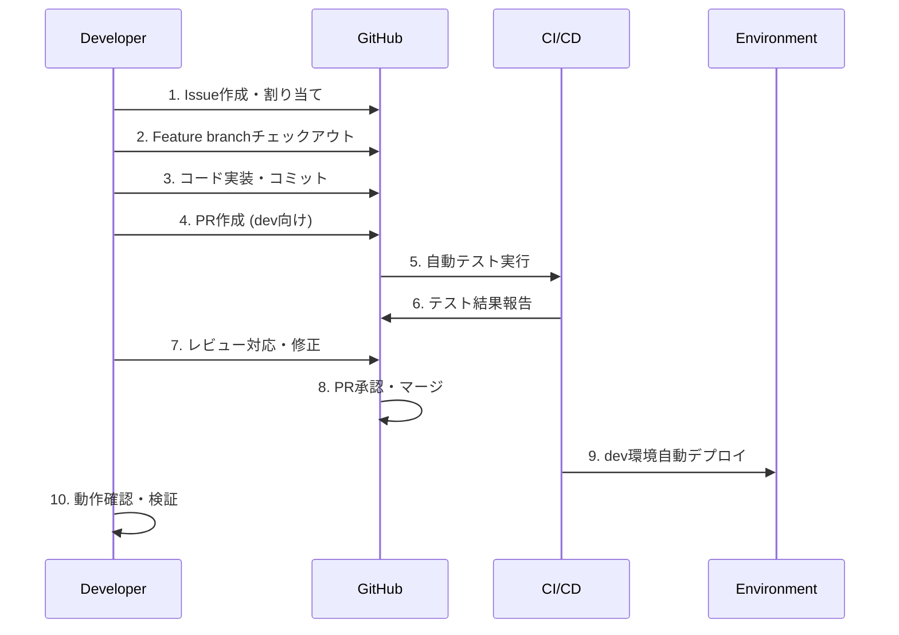

# SAS Flow運用手順書

**エス・エー・エス株式会社**  
**日常運用・緊急対応・トラブルシューティングガイド**

## 1. 日常運用手順

### 1.1 開発者の標準作業フロー


#### 1.1.1 Issue起票からブランチ作成
```bash
# 1. Issue作成（GitHub UI または CLI）
gh issue create --title "[user-service] Add email validation" \
                --body "Email format validation for user registration" \
                --label "feature,user-service,priority:medium"

# 2. Issue番号の確認
ISSUE_NUMBER=$(gh issue list --limit 1 --json number --jq '.[0].number')

# 3. Feature branch作成
SERVICE_NAME="user-service"
FEATURE_NAME="add-email-validation"
git checkout -b "feature/${SERVICE_NAME}/${FEATURE_NAME}"

# 4. Issue番号をブランチに関連付け
git commit --allow-empty -m "feat(${SERVICE_NAME}): start work on issue #${ISSUE_NUMBER}"
git push -u origin "feature/${SERVICE_NAME}/${FEATURE_NAME}"
```

#### 1.1.2 開発・テスト・コミット
```bash
# 1. Pre-commit hook有効化確認
pre-commit install
pre-commit run --all-files

# 2. 開発作業
# コード実装...

# 3. ローカルテスト実行
npm run test:unit
npm run test:integration:local
npm run lint
npm run security:check

# 4. 意味のある単位でコミット
git add .
git commit -m "feat(user-service): implement email format validation

- Add EmailValidator class with regex pattern
- Update UserRegistration to use new validator
- Add unit tests for edge cases
- Update API documentation

Closes #${ISSUE_NUMBER}"

# 5. リモートプッシュ
git push origin "feature/${SERVICE_NAME}/${FEATURE_NAME}"
```

#### 1.1.3 PR作成・レビュー
```bash
# 1. PR作成
gh pr create --title "feat(user-service): Add email validation feature" \
             --body "$(cat <<EOF
## Summary
- Implemented email format validation for user registration
- Added comprehensive unit tests
- Updated API documentation

## Changes
- Added EmailValidator class
- Modified UserRegistration service
- Updated validation middleware

## Testing
- Unit tests: 98% coverage
- Integration tests: All pass
- Manual testing: Validated with edge cases

## Deployment Notes
- No database migrations required
- Backward compatible change
- Feature flag: email_validation_v2

Closes #${ISSUE_NUMBER}
EOF
)" \
             --reviewer "@sas-com/user-service-team" \
             --assignee "@me"

# 2. PR URL の確認
PR_URL=$(gh pr view --json url --jq '.url')
echo "PR created: $PR_URL"
```

### 1.2 レビュアーの標準手順
```bash
# 1. PR通知の受信・確認
gh pr list --search "review-requested:@me"

# 2. ブランチチェックアウト・動作確認
gh pr checkout 123
npm install
npm run test
npm run build

# 3. コードレビュー実施
# - アーキテクチャ適合性
# - セキュリティ要件
# - パフォーマンス影響
# - テストカバレッジ
# - ドキュメント更新

# 4. レビューコメント・承認
gh pr review 123 --approve --body "LGTM. Email validation logic looks good."

# または修正要求
gh pr review 123 --request-changes --body "Please add error handling for malformed input."
```

### 1.3 環境昇格手順

#### 1.3.1 dev → staging 昇格
```bash
# 1. dev環境での検証完了確認
./scripts/dev-validation-check.sh

# 2. staging向けPR作成
git checkout staging
git pull origin staging
git checkout -b "promote/dev-to-staging-$(date +%Y%m%d)"
git merge origin/dev --no-ff

# 3. コンフリクト解決（必要に応じて）
git status
# コンフリクトファイルを編集
git add .
git commit

# 4. PR作成
gh pr create --title "promote: dev to staging - $(date +%Y-%m-%d)" \
             --body "$(cat <<EOF
## Promotion Summary
Dev to Staging promotion for $(date +%Y-%m-%d)

## Included Changes
$(git log --oneline origin/staging..origin/dev --pretty=format:"- %s")

## Pre-promotion Checklist
- [x] Dev environment validation complete
- [x] All feature tests passing
- [x] Security scans clean
- [x] Performance benchmarks met

## Post-promotion Tasks
- [ ] Staging smoke tests
- [ ] Integration test execution
- [ ] Stakeholder notification
EOF
)" \
             --base staging \
             --reviewer "@sas-com/qa-team,@sas-com/tech-leads"
```

#### 1.3.2 staging → main 昇格
```bash
# 1. Staging環境での包括的検証
./scripts/staging-validation-comprehensive.sh

# 2. リリースノート作成
./scripts/generate-release-notes.sh > "release-notes/$(date +%Y-%m-%d).md"

# 3. Main向けPR作成（リリースPR）
git checkout main
git pull origin main
git checkout -b "release/v$(./scripts/calculate-next-version.sh)"
git merge origin/staging --no-ff

# 4. Release PR作成
gh pr create --title "release: v$(./scripts/calculate-next-version.sh)" \
             --body "$(cat release-notes/$(date +%Y-%m-%d).md)" \
             --base main \
             --reviewer "@sas-com/release-managers" \
             --label "release"
```

## 2. 緊急対応手順

### 2.1 緊急度レベル判定

#### 2.1.1 L1 Critical（即座対応）
**影響範囲**: サービス完全停止、重要データ消失、セキュリティ侵害
**対応時間**: 即座（15分以内に初動）
**対応者**: オンコール担当者 + GitHub管理チーム

```bash
# L1対応フロー
echo "🚨 L1 Critical Incident Started: $(date)" | tee incident.log

# 1. インシデント宣言・通知
./scripts/declare-incident.sh L1 "Service outage - payment processing down"

# 2. 緊急チーム召集
./scripts/emergency-team-notification.sh L1

# 3. 即座のロールバック判断
LAST_GOOD_VERSION=$(kubectl get deployment sas-app -o jsonpath='{.metadata.annotations.deployment\.kubernetes\.io/revision}')
./scripts/emergency-rollback.sh $LAST_GOOD_VERSION

# 4. 並行でのRoot Cause分析
./scripts/incident-investigation.sh &
INVESTIGATION_PID=$!

# 5. 5分ごとの状況更新
while ! ./scripts/health-check.sh; do
    echo "$(date): Still recovering..." | tee -a incident.log
    ./scripts/send-status-update.sh L1
    sleep 300
done
```

#### 2.1.2 L2 High（1時間以内）
**影響範囲**: 重要機能の部分停止、パフォーマンス大幅劣化
**対応時間**: 1時間以内
**対応者**: 担当チーム + テックリード

```bash
# L2対応フロー
./scripts/declare-incident.sh L2 "Payment timeout issues affecting checkout"

# 1. 影響範囲の特定
./scripts/impact-analysis.sh > impact-report.txt

# 2. 暫定対策の実施
./scripts/implement-mitigation.sh

# 3. Hotfixブランチ作成・修正
SERVICE_NAME=$(echo $ISSUE | grep -oP '\[.*?\]' | tr -d '[]')
git checkout -b "hotfix/high/${SERVICE_NAME}/$(date +%Y%m%d)-payment-timeout"

# 修正作業...
git commit -m "hotfix: fix payment timeout issue

- Increase timeout from 30s to 60s
- Add retry mechanism for failed requests  
- Update monitoring thresholds

Fixes: L2-$(date +%Y%m%d)-001"

# 4. 緊急デプロイ
gh pr create --title "hotfix: Payment timeout fix" --body "Emergency fix" --label "hotfix,L2"
./scripts/emergency-merge-deploy.sh
```

#### 2.1.3 L3 Medium（4時間以内）
**影響範囲**: 軽微な機能障害、一部ユーザーへの影響
**対応時間**: 4時間以内
**対応者**: 担当チーム

#### 2.1.4 L4 Low（翌営業日）
**影響範囲**: UI不具合、ドキュメント問題等
**対応時間**: 翌営業日
**対応者**: 担当開発者

### 2.2 ホットフィックス手順

#### 2.2.1 Critical Hotfix（本番直行）
```bash
# 1. Hotfixブランチ作成
git checkout main
git pull origin main
git checkout -b "hotfix/critical/auth-service/SAS-2024-001"

# 2. 必要最小限の修正
# Critical path のみの修正に集中

# 3. 緊急テスト実行
npm run test:critical-path
./scripts/security-check-minimal.sh

# 4. 本番直行デプロイ
gh pr create --title "🚨 CRITICAL: Fix auth token vulnerability" \
             --body "Emergency security fix" \
             --label "hotfix,critical,security"

# 手動承認後の即座デプロイ
kubectl set image deployment/auth-service app=auth-service:$GITHUB_SHA -n sas-prod
kubectl rollout status deployment/auth-service -n sas-prod

# 5. 事後対応
./scripts/backport-hotfix.sh staging dev
./scripts/incident-postmortem-init.sh SAS-2024-001
```

#### 2.2.2 Staged Hotfix（段階適用）
```bash
# 1. 通常フローでの修正適用
git checkout -b "hotfix/high/payment-service/timeout-fix"

# 2. Dev環境で検証
git push origin hotfix/high/payment-service/timeout-fix
# CI/CDパイプライン完了待ち
./scripts/validate-dev-deployment.sh

# 3. Staging環境で追加検証
gh pr create --base staging --title "hotfix: Payment timeout fix"
# マージ後の検証
./scripts/validate-staging-deployment.sh

# 4. Main環境への適用
gh pr create --base main --title "hotfix: Payment timeout fix"
```

## 3. トラブルシューティング

### 3.1 よくある問題と解決策

#### 3.1.1 CI/CDパイプライン失敗
```bash
# 問題: テスト失敗
# 原因分析
gh run view [RUN_ID] --log > pipeline-logs.txt
grep -i "error\|failed\|exception" pipeline-logs.txt

# 解決手順
1. ローカル環境での再現確認
2. 依存関係の更新確認
3. 環境差異の調査
4. 修正・再実行

# 再実行
gh run rerun [RUN_ID]
```

#### 3.1.2 マージコンフリクト
```bash
# 安全なコンフリクト解決
git checkout feature/my-branch
git fetch origin
git status # 現在の状態確認

# リベースでコンフリクト解決
git rebase origin/dev

# コンフリクト箇所の確認
git status
git diff

# 手動解決後
git add .
git rebase --continue

# Force push (安全版)
git push --force-with-lease origin feature/my-branch
```

#### 3.1.3 デプロイメント失敗
```bash
# 問題診断
kubectl get pods -n [namespace] -l app=[service-name]
kubectl describe pod [pod-name] -n [namespace]
kubectl logs [pod-name] -n [namespace] --previous

# ロールバック実行
kubectl rollout undo deployment/[service-name] -n [namespace]
kubectl rollout status deployment/[service-name] -n [namespace]

# 健全性確認
./scripts/health-check.sh [environment]
```

#### 3.1.4 依存関係問題
```bash
# 循環依存の検出
./scripts/check-circular-dependencies.sh

# 依存関係の可視化
npm list --depth=2
python scripts/visualize-dependencies.py > dependencies.svg

# 不整合の解決
npm ci # クリーンインストール
./scripts/fix-dependency-conflicts.sh
```

### 3.2 パフォーマンス問題

#### 3.2.1 ビルド時間の最適化
```bash
# 現在のビルド時間分析
time npm run build 2>&1 | tee build-time.log

# 改善施策
1. キャッシュの有効活用
   npm ci --cache .npm
   
2. 並列処理の活用
   npm run test --maxWorkers=4
   
3. 不要ファイルの除外
   echo "node_modules/" >> .dockerignore
```

#### 3.2.2 テスト実行時間短縮
```bash
# テスト時間分析
npm run test -- --verbose --detectOpenHandles

# 並列実行
npm run test -- --maxWorkers=50%

# 選択的テスト実行（変更ファイルのみ）
npm run test -- --changedSince=main
```

## 4. 監視・アラート対応

### 4.1 監視ダッシュボード
```bash
# メトリクス確認コマンド
# デプロイメント頻度
gh api repos/:owner/:repo/deployments | jq '.[] | .created_at' | wc -l

# リードタイム（PR作成から本番デプロイまで）
./scripts/calculate-lead-time.sh

# 障害復旧時間
./scripts/calculate-mttr.sh

# 成功率
./scripts/calculate-success-rate.sh
```

### 4.2 アラート対応手順
```bash
# アラート受信時の標準対応
1. アラートレベルの確認
   if [ "$ALERT_LEVEL" == "CRITICAL" ]; then
     ./scripts/emergency-response.sh
   fi

2. 影響範囲の把握
   ./scripts/impact-assessment.sh

3. 初動対応の実施
   ./scripts/immediate-mitigation.sh

4. 関係者への通知
   ./scripts/stakeholder-notification.sh "$ALERT_LEVEL"
```

## 5. データバックアップ・復旧

### 5.1 定期バックアップ
```bash
# GitHub データのバックアップ
gh repo clone sas-com/service-name backup/service-name
gh api repos/:owner/:repo/issues > backup/issues-$(date +%Y%m%d).json
gh api repos/:owner/:repo/pulls > backup/pulls-$(date +%Y%m%d).json
```

### 5.2 災害復旧
```bash
# 緊急時のRepository復旧
1. バックアップからのリストア
2. 権限設定の復旧
3. CI/CD設定の復旧  
4. 動作確認
```

## 6. コンプライアンス・監査

### 6.1 定期監査準備
```bash
# 監査ログの生成
./scripts/generate-audit-logs.sh --period "2024-01-01 to 2024-12-31"

# アクセスログの確認
gh api orgs/:org/audit-log > audit-$(date +%Y%m%d).json

# セキュリティ設定の確認
./scripts/security-settings-audit.sh
```

### 6.2 変更管理記録
```bash
# すべての変更記録をエクスポート
gh api repos/:owner/:repo/commits > commits-history.json
gh pr list --state all --limit 1000 > pr-history.json

# 承認記録の生成
./scripts/generate-approval-records.sh
```

## 7. チーム連携・エスカレーション

### 7.1 連絡先一覧
```yaml
escalation_matrix:
  L1_Critical:
    primary: "github@sas-com.com"
    escalation_time: "15 minutes"
    backup: "+81-XX-XXXX-XXXX"
    
  L2_High:
    primary: "tech-leads@sas-com.com" 
    escalation_time: "1 hour"
    backup: "github@sas-com.com"
    
  L3_Medium:
    primary: "dev-team@sas-com.com"
    escalation_time: "4 hours"
    
  L4_Low:
    primary: "assignee"
    escalation_time: "next business day"
```

### 7.2 定期ミーティング
```bash
# 週次運用レビュー会議
- メトリクス確認
- インシデント振り返り
- プロセス改善提案

# 月次アーキテクチャレビュー
- 技術的負債の評価
- パフォーマンス分析
- セキュリティ状況確認
```

## 8. 継続改善

### 8.1 振り返り（Retrospective）
```bash
# 週次振り返り項目
1. What went well?
2. What could be improved?
3. Action items for next week

# 月次メトリクス分析
./scripts/monthly-metrics-analysis.sh
```

### 8.2 プロセス改善
```bash
# 改善提案の標準フォーマット
- 現在の問題点
- 提案する解決策
- 期待される効果
- 実装コスト・リスク
- 実装計画
```

---

**緊急連絡先**
- **L1 Critical**: github@sas-com.com（即座）
- **L2 High**: tech-leads@sas-com.com（1時間以内）
- **L3 Medium**: dev-team@sas-com.com（4時間以内）
- **L4 Low**: 担当者（翌営業日）

**更新履歴**
- 2025-09-10: 初版作成（v1.0.0）

**承認者**: GitHub管理チーム, 運用チーム  
**関連ドキュメント**:
- [SAS_FLOW_SPECIFICATION.md](/home/kurosawa/github-guidelines/SAS_FLOW_SPECIFICATION.md)
- [BRANCH_MANAGEMENT_RULES.md](/home/kurosawa/github-guidelines/BRANCH_MANAGEMENT_RULES.md)
- [CICD_WORKFLOW_DESIGN.md](/home/kurosawa/github-guidelines/CICD_WORKFLOW_DESIGN.md)
- [EMERGENCY_RESPONSE.md](/home/kurosawa/github-guidelines/EMERGENCY_RESPONSE.md)