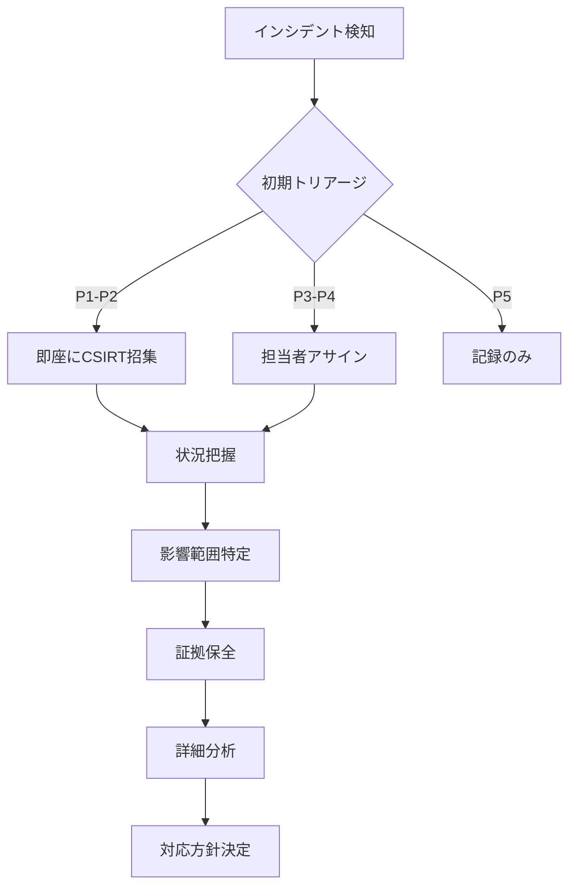

# セキュリティインシデント対応マニュアル

**エス・エー・エス株式会社**  
*最終更新日: 2025年9月10日*  
*バージョン: 1.0.0*  
*機密区分: 社外秘*

## 🚨 緊急連絡先

| 役割 | 連絡先 | 対応時間 | エスカレーション |
|------|--------|----------|----------------|
| **セキュリティホットライン** | security@sas-com.com | 24/7 | 最優先 |
| **CSIRT (Computer Security Incident Response Team)** | csirt@sas-com.com | 24/7 | 15分以内 |
| **セキュリティマネージャー** | sec-manager@sas-com.com | 営業時間 | 30分以内 |
| **CISO** | ciso@sas-com.com | 24/7 (緊急時) | 1時間以内 |
| **法務部** | legal@sas-com.com | 営業時間 | 必要時 |
| **広報部** | pr@sas-com.com | 営業時間 | 必要時 |

## 📋 インシデント分類

### 重要度レベル定義

| レベル | 定義 | 影響範囲 | 初動対応時間 | 例 |
|--------|------|----------|-------------|-----|
| **P1 - Critical** | ビジネス継続困難 | 全社・顧客影響大 | 15分以内 | データ漏洩、ランサムウェア、システム全体停止 |
| **P2 - High** | 重大な業務影響 | 複数部門・顧客影響 | 30分以内 | 認証システム障害、DDoS攻撃、重要データ改ざん |
| **P3 - Medium** | 中程度の業務影響 | 単一部門・限定的 | 2時間以内 | 不正アクセス試行、マルウェア検知、設定不備 |
| **P4 - Low** | 軽微な影響 | 個別システム | 4時間以内 | 脆弱性発見、ポリシー違反、異常ログ |
| **P5 - Info** | 情報収集 | なし | 翌営業日 | セキュリティ情報、脅威インテリジェンス |

### インシデントタイプ

```yaml
incident_types:
  malware:
    - ランサムウェア
    - トロイの木馬
    - ワーム
    - スパイウェア
    - ルートキット
    
  unauthorized_access:
    - 不正ログイン
    - 権限昇格
    - アカウント乗っ取り
    - 内部不正
    
  data_breach:
    - 個人情報漏洩
    - 機密情報漏洩
    - 知的財産窃取
    - 顧客データ流出
    
  denial_of_service:
    - DDoS攻撃
    - リソース枯渇
    - サービス妨害
    
  web_application:
    - SQLインジェクション
    - XSS攻撃
    - CSRF攻撃
    - ゼロデイ攻撃
    
  physical_security:
    - 機器盗難
    - 不正侵入
    - 紛失
    
  policy_violation:
    - セキュリティポリシー違反
    - コンプライアンス違反
    - 不適切な情報取り扱い
```

---

## 🔄 インシデント対応フロー

### フェーズ1: 検知と分析（Detection & Analysis）



#### 1.1 インシデント検知

**検知ソース**
- [ ] SIEM/SOCアラート
- [ ] IDS/IPS通知
- [ ] アンチウイルス検知
- [ ] ユーザー報告
- [ ] 外部通報（JPCERT/CC等）
- [ ] 脆弱性スキャン結果
- [ ] ログ分析
- [ ] 異常行動検知

**初動チェックリスト**
```markdown
□ インシデント発生日時記録
□ 検知方法の記録
□ 影響システムの特定
□ 影響ユーザー数の概算
□ データ漏洩の可能性評価
□ 継続中の攻撃か確認
□ 証拠の保全開始
□ インシデントチケット作成
```

#### 1.2 初期分析

**情報収集項目**
```yaml
basic_information:
  - incident_id: "INC-2025-XXXX"
  - detection_time: "YYYY-MM-DD HH:MM:SS"
  - reporter: "報告者名"
  - affected_systems: ["システムA", "システムB"]
  - affected_users: "推定XXXX名"
  - attack_vector: "攻撃経路"
  - threat_actor: "攻撃者情報（判明している場合）"
  
technical_details:
  - ip_addresses: ["攻撃元IP", "影響を受けたIP"]
  - domains: ["関連ドメイン"]
  - file_hashes: ["マルウェアハッシュ値"]
  - ioc: ["侵害の痕跡"]
  - logs: ["関連ログの場所"]
```

### フェーズ2: 封じ込めと根絶（Containment & Eradication）

#### 2.1 短期的封じ込め

**即座の対応アクション**
```bash
# ネットワーク隔離
iptables -I INPUT -s [攻撃元IP] -j DROP
iptables -I OUTPUT -d [攻撃元IP] -j DROP

# アカウント無効化
usermod -L [侵害されたアカウント]

# プロセス停止
kill -9 [不正プロセスPID]

# ファイアウォールルール追加
firewall-cmd --permanent --add-rich-rule='rule family="ipv4" source address="[攻撃元IP]" drop'

# サービス停止（必要に応じて）
systemctl stop [影響を受けたサービス]
```

**封じ込めチェックリスト**
- [ ] 影響システムのネットワーク隔離
- [ ] 侵害アカウントの無効化
- [ ] 不正プロセスの停止
- [ ] マルウェアの隔離
- [ ] ファイアウォールルール更新
- [ ] WAFルール追加
- [ ] 関連システムの監視強化

#### 2.2 証拠保全

**フォレンジック手順**
```bash
# メモリダンプ取得
sudo dd if=/dev/mem of=/secure/evidence/memory_dump_$(date +%Y%m%d_%H%M%S).img

# ディスクイメージ作成
dd if=/dev/sda of=/secure/evidence/disk_image_$(date +%Y%m%d_%H%M%S).img bs=4M

# ネットワークトラフィック保存
tcpdump -i eth0 -w /secure/evidence/network_capture_$(date +%Y%m%d_%H%M%S).pcap

# ログファイル保全
tar -czf /secure/evidence/logs_$(date +%Y%m%d_%H%M%S).tar.gz /var/log/

# ハッシュ値計算（改ざん防止）
sha256sum /secure/evidence/* > /secure/evidence/checksums.txt
```

**証拠保全チェーン**
```yaml
evidence_chain:
  collector: "収集者名"
  collection_time: "YYYY-MM-DD HH:MM:SS"
  location: "/secure/evidence/"
  hash: "SHA256ハッシュ値"
  custody_log:
    - date: "YYYY-MM-DD"
      from: "担当者A"
      to: "担当者B"
      purpose: "分析のため"
```

#### 2.3 根絶

**マルウェア除去**
- [ ] アンチウイルスでフルスキャン実施
- [ ] 感染ファイルの削除/隔離
- [ ] レジストリエントリのクリーンアップ
- [ ] 持続化メカニズムの除去
- [ ] バックドアの特定と削除

**脆弱性修正**
- [ ] セキュリティパッチ適用
- [ ] 設定不備の修正
- [ ] 弱いパスワードの変更
- [ ] 不要なサービスの無効化
- [ ] アクセス権限の見直し

### フェーズ3: 復旧（Recovery）

#### 3.1 システム復旧計画

**復旧優先順位**
```yaml
priority_1_critical:
  - 認証システム
  - 決済システム
  - 顧客データベース
  recovery_time: 2時間以内

priority_2_high:
  - Webサーバー
  - APIサーバー
  - メールシステム
  recovery_time: 4時間以内

priority_3_medium:
  - 内部システム
  - 開発環境
  - バックアップシステム
  recovery_time: 8時間以内

priority_4_low:
  - テスト環境
  - ドキュメントシステム
  recovery_time: 24時間以内
```

#### 3.2 復旧手順

**システム復旧チェックリスト**
```markdown
## 復旧前確認
□ マルウェア/脆弱性が完全に除去されたか
□ セキュリティパッチが適用されたか
□ バックアップの整合性確認
□ 復旧計画のレビュー完了

## 復旧実施
□ クリーンなバックアップからの復元
□ システム設定の再構築
□ セキュリティ設定の強化
□ ネットワーク接続の段階的復旧
□ サービスの順次起動

## 復旧後確認
□ システム正常性確認
□ セキュリティスキャン実施
□ ログ監視の再開
□ ユーザーアクセステスト
□ パフォーマンス確認
```

### フェーズ4: 事後対応（Post-Incident Activity）

#### 4.1 インシデントレポート作成

**エグゼクティブサマリーテンプレート**
```markdown
# インシデントレポート

## エグゼクティブサマリー
- **インシデントID**: INC-2025-XXXX
- **発生日時**: YYYY-MM-DD HH:MM
- **検知日時**: YYYY-MM-DD HH:MM
- **解決日時**: YYYY-MM-DD HH:MM
- **影響度**: P1 - Critical
- **影響範囲**: XXシステム、約XXXX名のユーザー

## インシデント概要
[何が起きたかを簡潔に記述]

## 影響
### ビジネス影響
- サービス停止時間: XX時間
- 影響顧客数: XXXX名
- 推定損失: XXX万円

### データ影響
- 漏洩データ: [あり/なし]
- データ種別: [個人情報/機密情報/なし]
- 影響レコード数: XXXX件

## 原因分析
### 直接原因
[技術的な原因]

### 根本原因
[プロセスや体制の問題]

## 対応内容
1. [実施した対応を時系列で記載]
2. 
3. 

## 再発防止策
### 短期対策（実施済み）
- [実施済みの対策]

### 中長期対策（計画）
- [今後実施予定の対策]

## 教訓
[今回のインシデントから得られた教訓]
```

#### 4.2 関係者への通知

**通知マトリックス**
| 通知先 | 条件 | タイミング | 方法 | テンプレート |
|--------|------|-----------|------|------------|
| **経営層** | P1-P2 | 即座 | 電話→メール | executive_template |
| **顧客** | データ漏洩 | 72時間以内 | メール/書面 | customer_template |
| **規制当局** | 個人情報漏洩 | 72時間以内 | 専用フォーム | regulatory_template |
| **JPCERT/CC** | 重大インシデント | 24時間以内 | Web/メール | jpcert_template |
| **警察** | 犯罪被害 | 即座 | 電話→訪問 | police_template |
| **保険会社** | 保険適用事案 | 48時間以内 | 電話→書面 | insurance_template |

**顧客通知テンプレート**
```
件名: 【重要】セキュリティインシデントに関するお知らせ

お客様各位

平素より弊社サービスをご利用いただき、誠にありがとうございます。

このたび、弊社システムにおいてセキュリティインシデントが発生し、
お客様の情報の一部が影響を受けた可能性があることが判明いたしました。

【影響を受けた可能性のある情報】
- [情報種別をリスト化]

【影響を受けた期間】
YYYY年MM月DD日 〜 YYYY年MM月DD日

【原因】
[簡潔に説明]

【対応状況】
1. 該当システムの停止と安全性確認
2. 影響範囲の特定と封じ込め
3. セキュリティ対策の強化
4. 再発防止策の実装

【お客様へのお願い】
念のため、以下の対応をお願いいたします：
- パスワードの変更
- 不審なメールやSMSにご注意
- クレジットカード明細の確認

【お問い合わせ窓口】
専用窓口: 0120-XXX-XXX（平日9:00-18:00）
メール: incident-support@sas-com.com

深くお詫び申し上げるとともに、再発防止に全力で取り組んでまいります。

エス・エー・エス株式会社
代表取締役 [名前]
```

---

## 🛠️ インシデント対応ツール

### 必須ツールキット

**フォレンジックツール**
```yaml
memory_forensics:
  - Volatility: メモリ解析
  - LiME: Linuxメモリ取得
  - DumpIt: Windowsメモリダンプ

disk_forensics:
  - Autopsy/Sleuth Kit: ディスク解析
  - FTK Imager: イメージ作成
  - dd/dcfldd: ディスクコピー

network_forensics:
  - Wireshark: パケット解析
  - NetworkMiner: ネットワーク解析
  - tcpdump: パケットキャプチャ

malware_analysis:
  - IDA Pro: 静的解析
  - OllyDbg: 動的解析
  - Cuckoo Sandbox: サンドボックス解析
  - VirusTotal: マルウェア検索

log_analysis:
  - Splunk: ログ分析
  - ELK Stack: ログ収集・分析
  - Graylog: ログ管理
```

### コマンドラインツール

**Linux インシデント対応コマンド**
```bash
# プロセス調査
ps auxf | grep suspicious
lsof -i :port
netstat -tulpn
ss -tulpn

# ファイル調査
find / -type f -mtime -7 -ls  # 7日以内に変更されたファイル
find / -type f -perm -4000 -ls  # SUIDファイル
grep -r "password" /var/log/

# ネットワーク調査
iptables -L -n -v
ip route show
arp -a
nslookup suspicious-domain.com

# ユーザー調査
last -f /var/log/wtmp
lastlog
who -a
w

# ログ調査
journalctl -xe
tail -f /var/log/syslog
grep -i error /var/log/*

# ハッシュ計算
md5sum suspicious_file
sha256sum suspicious_file
```

**Windows インシデント対応コマンド**
```powershell
# プロセス調査
Get-Process | Where-Object {$_.CPU -gt 50}
netstat -anob
Get-NetTCPConnection | Where-Object {$_.State -eq "Established"}

# サービス調査
Get-Service | Where-Object {$_.Status -eq "Running"}
sc query

# イベントログ調査
Get-EventLog -LogName Security -Newest 1000
Get-WinEvent -FilterHashtable @{LogName='Security';ID=4624}

# ファイル調査
Get-ChildItem -Path C:\ -Recurse -Force -ErrorAction SilentlyContinue | Where-Object {$_.LastWriteTime -gt (Get-Date).AddDays(-7)}

# レジストリ調査
Get-ItemProperty HKLM:\Software\Microsoft\Windows\CurrentVersion\Run
Get-ItemProperty HKCU:\Software\Microsoft\Windows\CurrentVersion\Run

# ネットワーク調査
Get-NetAdapter
Get-NetIPConfiguration
Resolve-DnsName suspicious-domain.com

# ユーザー調査
Get-LocalUser
Get-LocalGroupMember -Group "Administrators"
quser
```

---

## 📊 メトリクスとKPI

### インシデント対応メトリクス

```yaml
detection_metrics:
  mean_time_to_detect: "< 1時間"
  detection_rate: "> 95%"
  false_positive_rate: "< 10%"

response_metrics:
  mean_time_to_respond:
    p1: "< 15分"
    p2: "< 30分"
    p3: "< 2時間"
    p4: "< 4時間"
  
  mean_time_to_contain:
    p1: "< 2時間"
    p2: "< 4時間"
    p3: "< 8時間"
    p4: "< 24時間"
  
  mean_time_to_recover:
    p1: "< 4時間"
    p2: "< 8時間"
    p3: "< 24時間"
    p4: "< 48時間"

quality_metrics:
  incident_recurrence_rate: "< 5%"
  post_incident_review_completion: "100%"
  action_item_closure_rate: "> 90%"
  
training_metrics:
  incident_drill_frequency: "月1回"
  team_certification_rate: "> 80%"
  training_completion_rate: "100%"
```

---

## 🎯 インシデント対応演習

### 机上演習シナリオ

**シナリオ1: ランサムウェア攻撃**
```yaml
scenario:
  name: "ランサムウェア感染"
  difficulty: "High"
  duration: "4時間"
  
  initial_conditions:
    - 複数のファイルサーバーで暗号化確認
    - 身代金要求メッセージ表示
    - バックアップサーバーも影響
    
  inject_points:
    15_minutes: "経営層から状況説明要求"
    30_minutes: "メディアから問い合わせ"
    60_minutes: "新たな感染拡大確認"
    120_minutes: "顧客から問い合わせ殺到"
    
  expected_actions:
    - ネットワーク隔離
    - 感染範囲特定
    - バックアップ確認
    - 復旧計画策定
    - ステークホルダー通知
    
  success_criteria:
    - 2時間以内に感染拡大阻止
    - 4時間以内に復旧計画完成
    - 適切な通知実施
```

### 実地訓練計画

**年間訓練スケジュール**
| 月 | 訓練タイプ | シナリオ | 対象チーム |
|----|-----------|---------|-----------|
| 1月 | 机上演習 | DDoS攻撃 | CSIRT |
| 2月 | 実地訓練 | データ漏洩 | 全社 |
| 3月 | 机上演習 | 内部不正 | セキュリティ・法務 |
| 4月 | Red Team演習 | APT攻撃 | IT部門 |
| 5月 | 机上演習 | サプライチェーン攻撃 | 調達・IT |
| 6月 | 実地訓練 | ランサムウェア | 全社 |
| 7月 | 机上演習 | ゼロデイ攻撃 | CSIRT |
| 8月 | Purple Team演習 | 複合攻撃 | セキュリティ |
| 9月 | 机上演習 | 物理セキュリティ | 総務・セキュリティ |
| 10月 | 実地訓練 | BCP発動 | 全社 |
| 11月 | 机上演習 | クラウド侵害 | クラウドチーム |
| 12月 | 年次評価 | 総合演習 | 全社 |

---

## 📝 チェックリストとテンプレート

### インシデント初動チェックリスト

```markdown
## 発生から15分以内
□ インシデント発生時刻の記録
□ 影響システムの特定
□ 影響範囲の初期評価
□ 重要度レベルの判定（P1-P5）
□ CSIRT招集の判断
□ 証拠保全の開始
□ インシデントチケット作成

## 30分以内
□ 詳細情報の収集
□ 攻撃継続の有無確認
□ 短期的封じ込め実施
□ 関係者への初期連絡
□ 対応体制の確立
□ コミュニケーション計画策定

## 1時間以内
□ 技術的分析開始
□ ビジネス影響評価
□ 復旧計画の検討
□ 経営層への報告（P1-P2）
□ 法的要件の確認
□ 外部専門家の要否判断

## 4時間以内
□ 根本原因の特定
□ 完全な封じ込め実施
□ 復旧作業開始
□ ステークホルダー通知
□ 広報対応準備
□ 証拠の完全保全
```

### コミュニケーション計画テンプレート

```yaml
communication_plan:
  incident_id: "INC-2025-XXXX"
  
  internal_communication:
    immediate:
      - CSIRT全メンバー
      - 直属上司
      - 影響部門責任者
    
    within_1hour:
      - CTO/CISO
      - 法務部
      - 広報部
    
    within_4hours:
      - CEO
      - 全社員（必要に応じて）
  
  external_communication:
    customers:
      timing: "影響確定後72時間以内"
      method: "メール/Webサイト"
      approval: "CEO承認必須"
    
    media:
      timing: "広報部判断"
      method: "プレスリリース"
      spokesperson: "広報部長"
    
    authorities:
      timing: "法的要件に従う"
      method: "指定フォーム"
      responsible: "法務部"
  
  update_frequency:
    p1: "30分ごと"
    p2: "1時間ごと"
    p3: "4時間ごと"
    p4: "日次"
```

---

## 📚 参考資料とリソース

### 標準・ガイドライン
- [NIST SP 800-61r2 Computer Security Incident Handling Guide](https://nvlpubs.nist.gov/nistpubs/SpecialPublications/NIST.SP.800-61r2.pdf)
- [ISO/IEC 27035 Information security incident management](https://www.iso.org/standard/78973.html)
- [JPCERT/CC インシデントハンドリングマニュアル](https://www.jpcert.or.jp/)
- [FIRST CSIRT Services Framework](https://www.first.org/standards/frameworks/csirts/)

### 外部連携先
- **JPCERT/CC**: https://www.jpcert.or.jp/
- **IPA**: https://www.ipa.go.jp/
- **警察庁サイバー犯罪対策**: https://www.npa.go.jp/cyber/
- **NISC**: https://www.nisc.go.jp/

### トレーニング・認定
- SANS GCIH (GIAC Certified Incident Handler)
- SANS GNFA (GIAC Network Forensic Analyst)
- EC-Council ECIH (Certified Incident Handler)
- CompTIA CySA+ (Cybersecurity Analyst)

---

**© 2025 エス・エー・エス株式会社 - セキュリティインシデント対応マニュアル**  
*本ドキュメントは社外秘情報を含みます。無断複製・配布を禁じます。*