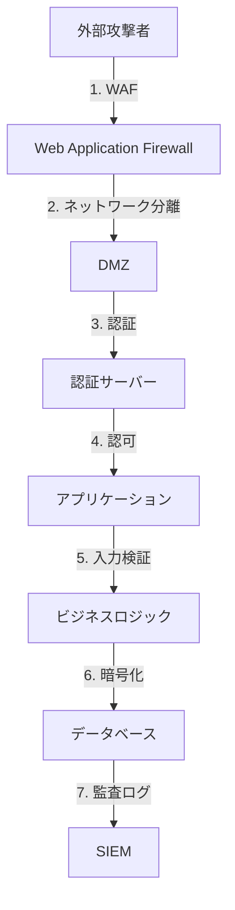
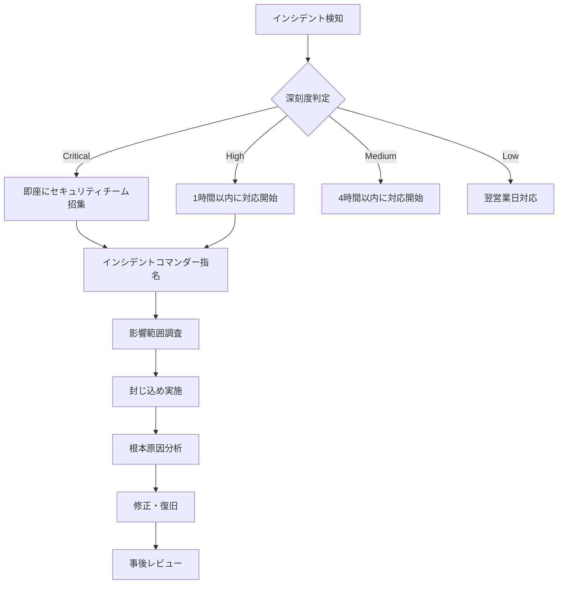

# セキュリティ教育・運用ガイド

**エス・エー・エス株式会社**  
*開発チーム向けセキュリティトレーニングと運用マニュアル*

## 目次

1. [セキュリティ基礎教育](#1-セキュリティ基礎教育)
2. [セキュアコーディング実践](#2-セキュアコーディング実践)
3. [セキュリティツール使用方法](#3-セキュリティツール使用方法)
4. [インシデント対応手順](#4-インシデント対応手順)
5. [定期監査チェックリスト](#5-定期監査チェックリスト)
6. [セキュリティチャンピオンプログラム](#6-セキュリティチャンピオンプログラム)
7. [ハンズオン演習](#7-ハンズオン演習)
8. [FAQ・トラブルシューティング](#8-faqトラブルシューティング)

---

## 1. セキュリティ基礎教育

### 1.1 OWASP Top 10 理解

#### A01:2021 – アクセス制御の不備

**概要**: 適切な認証・認可の欠如により、権限のないユーザーがリソースにアクセスできる脆弱性

**攻撃例**:
```javascript
// 脆弱なコード例
app.get('/api/user/:id', (req, res) => {
    // 認証チェックなし！
    const userId = req.params.id;
    const userData = db.getUser(userId);
    res.json(userData);
});
```

**セキュアな実装**:
```javascript
// セキュアなコード例
app.get('/api/user/:id', authenticate, authorize, (req, res) => {
    const userId = req.params.id;
    
    // 自分のデータまたは管理者のみアクセス可能
    if (req.user.id !== userId && !req.user.isAdmin) {
        return res.status(403).json({ error: 'Forbidden' });
    }
    
    const userData = db.getUser(userId);
    res.json(userData);
});
```

#### A02:2021 – 暗号化の失敗

**概要**: 機密データの不適切な暗号化または暗号化の欠如

**チェックポイント**:
- [ ] 機密データは保存時に暗号化されているか
- [ ] 転送時にTLS/HTTPSを使用しているか
- [ ] 強力な暗号化アルゴリズムを使用しているか
- [ ] 暗号鍵は適切に管理されているか

**推奨実装**:
```python
# Python例: 適切な暗号化
from cryptography.fernet import Fernet
import os

class SecureDataHandler:
    def __init__(self):
        # 環境変数から暗号鍵を取得
        self.key = os.environ.get('ENCRYPTION_KEY').encode()
        self.cipher = Fernet(self.key)
    
    def encrypt_sensitive_data(self, data: str) -> bytes:
        """機密データを暗号化"""
        return self.cipher.encrypt(data.encode())
    
    def decrypt_sensitive_data(self, encrypted_data: bytes) -> str:
        """暗号化データを復号"""
        return self.cipher.decrypt(encrypted_data).decode()
```

#### A03:2021 – インジェクション

**概要**: 信頼できないデータがコマンドやクエリの一部として送信される脆弱性

**SQLインジェクション防止**:
```java
// 脆弱なコード
String query = "SELECT * FROM users WHERE username = '" + username + "'";

// セキュアなコード（パラメータ化クエリ）
String query = "SELECT * FROM users WHERE username = ?";
PreparedStatement pstmt = connection.prepareStatement(query);
pstmt.setString(1, username);
ResultSet rs = pstmt.executeQuery();
```

**コマンドインジェクション防止**:
```python
# 脆弱なコード
import os
filename = request.args.get('file')
os.system(f"cat {filename}")  # 危険！

# セキュアなコード
import subprocess
import shlex
filename = request.args.get('file')
# ファイル名の検証
if not filename.replace('_', '').replace('-', '').isalnum():
    raise ValueError("Invalid filename")
# サブプロセスを使用
subprocess.run(['cat', filename], check=True, capture_output=True)
```

### 1.2 セキュリティ原則

#### 最小権限の原則
```yaml
# IAMポリシー例
{
  "Version": "2012-10-17",
  "Statement": [
    {
      "Effect": "Allow",
      "Action": [
        "s3:GetObject"  # 必要最小限の権限のみ
      ],
      "Resource": "arn:aws:s3:::my-bucket/public/*"  # 特定のパスのみ
    }
  ]
}
```

#### Defense in Depth（多層防御）


---

## 2. セキュアコーディング実践

### 2.1 言語別セキュアコーディングガイド

#### JavaScript/TypeScript

```typescript
// セキュアコーディングチェックリスト
class SecureAPIHandler {
    // 1. 入力検証
    validateInput(input: any): boolean {
        const schema = Joi.object({
            email: Joi.string().email().required(),
            age: Joi.number().min(0).max(120).required(),
            name: Joi.string().max(100).required()
        });
        
        const { error } = schema.validate(input);
        return !error;
    }
    
    // 2. XSS防止
    sanitizeOutput(data: string): string {
        return DOMPurify.sanitize(data);
    }
    
    // 3. CSRF対策
    async verifyCSRFToken(req: Request): Promise<boolean> {
        const token = req.headers['x-csrf-token'];
        const sessionToken = req.session.csrfToken;
        return crypto.timingSafeEqual(
            Buffer.from(token),
            Buffer.from(sessionToken)
        );
    }
    
    // 4. レート制限
    @RateLimit({
        windowMs: 15 * 60 * 1000, // 15分
        max: 100 // 最大100リクエスト
    })
    async handleRequest(req: Request, res: Response) {
        // リクエスト処理
    }
}
```

#### Python

```python
# セキュアなDjangoビュー
from django.views.decorators.csrf import csrf_protect
from django.contrib.auth.decorators import login_required
from django.core.exceptions import ValidationError
from django.utils.html import escape
import bleach

class SecureView:
    @login_required
    @csrf_protect
    @ratelimit(key='ip', rate='10/m', method='POST')
    def create_post(request):
        # 1. 入力検証
        title = request.POST.get('title', '')
        content = request.POST.get('content', '')
        
        if len(title) > 200:
            raise ValidationError("Title too long")
        
        # 2. HTMLサニタイゼーション
        allowed_tags = ['b', 'i', 'u', 'p', 'br']
        clean_content = bleach.clean(content, tags=allowed_tags)
        
        # 3. SQLインジェクション防止（ORMを使用）
        post = Post.objects.create(
            title=escape(title),
            content=clean_content,
            author=request.user
        )
        
        # 4. 監査ログ
        audit_log.info(f"Post created by {request.user.id}: {post.id}")
        
        return JsonResponse({'status': 'success', 'id': post.id})
```

#### Java

```java
// Spring Securityを使用したセキュアな実装
@RestController
@RequestMapping("/api")
public class SecureController {
    
    @Autowired
    private Validator validator;
    
    // 1. 認証・認可
    @PreAuthorize("hasRole('USER')")
    @PostMapping("/data")
    public ResponseEntity<?> createData(@Valid @RequestBody DataRequest request) {
        
        // 2. 入力検証（Bean Validation）
        Set<ConstraintViolation<DataRequest>> violations = validator.validate(request);
        if (!violations.isEmpty()) {
            return ResponseEntity.badRequest().body("Invalid input");
        }
        
        // 3. SQLインジェクション防止（JPA使用）
        Data data = new Data();
        data.setName(HtmlUtils.htmlEscape(request.getName()));
        data.setDescription(Jsoup.clean(request.getDescription(), Whitelist.basic()));
        
        // 4. CSRF対策（Spring Security自動）
        // 5. セキュリティヘッダー設定
        return ResponseEntity.ok()
            .header("X-Content-Type-Options", "nosniff")
            .header("X-Frame-Options", "DENY")
            .header("X-XSS-Protection", "1; mode=block")
            .body(dataRepository.save(data));
    }
}
```

### 2.2 セキュリティヘッダー設定

```javascript
// Express.jsでのセキュリティヘッダー設定
const helmet = require('helmet');

app.use(helmet({
    contentSecurityPolicy: {
        directives: {
            defaultSrc: ["'self'"],
            scriptSrc: ["'self'", "'unsafe-inline'", "https://trusted-cdn.com"],
            styleSrc: ["'self'", "'unsafe-inline'"],
            imgSrc: ["'self'", "data:", "https:"],
            connectSrc: ["'self'"],
            fontSrc: ["'self'"],
            objectSrc: ["'none'"],
            mediaSrc: ["'self'"],
            frameSrc: ["'none'"],
        },
    },
    hsts: {
        maxAge: 31536000,
        includeSubDomains: true,
        preload: true
    }
}));
```

---

## 3. セキュリティツール使用方法

### 3.1 GitHub Security機能

#### Secret Scanning設定
```bash
# カスタムパターンの追加
gh api \
  --method POST \
  -H "Accept: application/vnd.github+json" \
  /repos/OWNER/REPO/secret-scanning/push-protection-bypasses \
  -f pattern='sas-api-key-[a-zA-Z0-9]{32}' \
  -f name='SAS API Key'
```

#### Code Scanningワークフロー
```yaml
# .github/workflows/codeql.yml
name: "CodeQL"

on:
  push:
    branches: [ main ]
  pull_request:
    branches: [ main ]
  schedule:
    - cron: '30 1 * * 1'

jobs:
  analyze:
    name: Analyze
    runs-on: ubuntu-latest
    
    strategy:
      fail-fast: false
      matrix:
        language: [ 'javascript', 'python' ]
        
    steps:
    - name: Checkout repository
      uses: actions/checkout@v3
      
    - name: Initialize CodeQL
      uses: github/codeql-action/init@v2
      with:
        languages: ${{ matrix.language }}
        queries: +security-extended
        
    - name: Autobuild
      uses: github/codeql-action/autobuild@v2
      
    - name: Perform CodeQL Analysis
      uses: github/codeql-action/analyze@v2
```

### 3.2 ローカルセキュリティツール

#### Git-secrets導入
```bash
# インストール
brew install git-secrets  # macOS
# または
git clone https://github.com/awslabs/git-secrets
cd git-secrets && make install

# 設定
git secrets --install
git secrets --register-aws  # AWS認証情報のパターン追加

# カスタムパターン追加
git secrets --add 'sas-api-key-[a-zA-Z0-9]{32}'
git secrets --add 'password\s*=\s*["\'][^"\']+["\']'

# スキャン実行
git secrets --scan
```

#### Pre-commitフック設定
```yaml
# .pre-commit-config.yaml
repos:
  - repo: https://github.com/pre-commit/pre-commit-hooks
    rev: v4.4.0
    hooks:
      - id: trailing-whitespace
      - id: end-of-file-fixer
      - id: check-yaml
      - id: check-added-large-files
        
  - repo: https://github.com/Yelp/detect-secrets
    rev: v1.4.0
    hooks:
      - id: detect-secrets
        args: ['--baseline', '.secrets.baseline']
        
  - repo: https://github.com/PyCQA/bandit
    rev: 1.7.5
    hooks:
      - id: bandit
        args: ['-ll', '-i', '-r', '.']
```

---

## 4. インシデント対応手順

### 4.1 インシデント分類と初動対応



### 4.2 インシデント対応チェックリスト

#### Critical インシデント（データ漏洩の疑い）

```markdown
## 初動対応（15分以内）
- [ ] インシデントコマンダーを指名
- [ ] セキュリティチーム全員に通知
- [ ] 影響を受けるシステムの特定
- [ ] アクセスログの保全
- [ ] 初期調査の開始

## 封じ込め（1時間以内）
- [ ] 影響を受けたアカウントの無効化
- [ ] 不正なアクセスポイントの遮断
- [ ] 影響を受けたシステムの隔離
- [ ] バックアップの確認

## 調査・分析（24時間以内）
- [ ] 侵入経路の特定
- [ ] 影響を受けたデータの範囲特定
- [ ] タイムラインの作成
- [ ] 証拠の収集と保全

## 修正・復旧（72時間以内）
- [ ] 脆弱性の修正
- [ ] システムのクリーンアップ
- [ ] パッチの適用
- [ ] セキュリティ設定の強化
- [ ] システムの復旧

## 事後対応
- [ ] インシデントレポートの作成
- [ ] 関係者への報告
- [ ] 再発防止策の実装
- [ ] 教訓の文書化
- [ ] 手順書の更新
```

### 4.3 連絡体制

```yaml
incident_contacts:
  critical:
    primary:
      - name: セキュリティチームリード
        email: security-lead@sas-com.com
        phone: +81-XXX-XXXX-XXXX
        slack: "@security-lead"
    escalation:
      - name: CTO
        email: cto@sas-com.com
        phone: +81-XXX-XXXX-XXXX
      - name: CEO
        email: ceo@sas-com.com
        phone: +81-XXX-XXXX-XXXX
    external:
      - name: 外部セキュリティコンサルタント
        company: Security Experts Inc.
        email: contact@security-experts.com
        phone: +81-XXX-XXXX-XXXX
```

---

## 5. 定期監査チェックリスト

### 5.1 月次セキュリティ監査

```markdown
## アクセス管理
- [ ] 退職者のアカウント削除確認
- [ ] 権限の棚卸し（過剰な権限の削除）
- [ ] 2FA有効化状況の確認
- [ ] APIキー・アクセストークンのローテーション
- [ ] SSH鍵の棚卸し

## 脆弱性管理
- [ ] 脆弱性スキャン結果のレビュー
- [ ] Critical/High脆弱性の対応状況確認
- [ ] パッチ適用状況の確認
- [ ] 依存関係の更新確認

## コンプライアンス
- [ ] セキュリティポリシー遵守状況
- [ ] ログ保管状況の確認
- [ ] 暗号化設定の確認
- [ ] バックアップの確認

## インシデント
- [ ] 前月のインシデント対応状況レビュー
- [ ] 再発防止策の実装確認
- [ ] インシデント対応訓練の実施状況
```

### 5.2 四半期セキュリティレビュー

```markdown
## セキュリティ態勢評価
- [ ] セキュリティKPIの測定と分析
- [ ] ペネトレーションテストの実施
- [ ] セキュリティアーキテクチャレビュー
- [ ] サードパーティリスク評価

## ポリシー・手順書
- [ ] セキュリティポリシーの見直し
- [ ] インシデント対応手順の更新
- [ ] 災害復旧計画の見直し
- [ ] セキュリティトレーニング内容の更新

## 技術的対策
- [ ] セキュリティツールの有効性評価
- [ ] ログ監視の有効性確認
- [ ] アラート設定の見直し
- [ ] セキュリティ設定のベースライン更新
```

---

## 6. セキュリティチャンピオンプログラム

### 6.1 役割と責任

```yaml
security_champion:
  役割:
    - チーム内のセキュリティ意識向上
    - セキュリティベストプラクティスの推進
    - 脆弱性の早期発見と報告
    - セキュリティツールの活用支援
    
  責任:
    - 週次セキュリティレビューの実施
    - セキュリティ関連の質問への一次対応
    - セキュリティトレーニングの補助
    - インシデント対応の支援
    
  必要スキル:
    - OWASP Top 10の理解
    - セキュアコーディングの知識
    - 基本的な脆弱性診断スキル
    - セキュリティツールの使用経験
```

### 6.2 トレーニングプログラム

```markdown
## Week 1-2: 基礎知識
- [ ] OWASP Top 10 学習
- [ ] セキュアコーディング原則
- [ ] 会社のセキュリティポリシー理解

## Week 3-4: ツール習熟
- [ ] GitHub Security機能
- [ ] SAST/DASTツール
- [ ] 依存関係管理ツール

## Week 5-6: 実践演習
- [ ] 脆弱性診断演習
- [ ] インシデント対応シミュレーション
- [ ] コードレビュー実践

## Week 7-8: 応用と定着
- [ ] 実プロジェクトでのセキュリティレビュー
- [ ] セキュリティ改善提案の作成
- [ ] チームへの知識共有セッション
```

---

## 7. ハンズオン演習

### 7.1 脆弱性診断演習

#### 演習1: SQLインジェクション発見と修正

```python
# 脆弱なコード
def get_user_vulnerable(username):
    query = f"SELECT * FROM users WHERE username = '{username}'"
    return db.execute(query)

# テスト: SQLインジェクション
# username = "admin' OR '1'='1"
# これにより全ユーザーが返される

# 修正版
def get_user_secure(username):
    query = "SELECT * FROM users WHERE username = ?"
    return db.execute(query, (username,))
```

**演習タスク**:
1. 脆弱性を実際に確認
2. 攻撃ペイロードを作成
3. セキュアなコードに修正
4. 修正後のテスト実施

#### 演習2: XSS脆弱性の発見と対策

```html
<!-- 脆弱なコード -->
<div id="welcome">
    Welcome, <script>document.write(location.search.substring(6))</script>!
</div>

<!-- 攻撃URL: http://example.com/?name=<script>alert('XSS')</script> -->

<!-- セキュアなコード -->
<div id="welcome"></div>
<script>
    const params = new URLSearchParams(location.search);
    const name = params.get('name') || 'Guest';
    const safeText = document.createTextNode(`Welcome, ${name}!`);
    document.getElementById('welcome').appendChild(safeText);
</script>
```

### 7.2 セキュリティツール実践

#### GitHub Security Lab

```bash
# 1. リポジトリをフォーク
gh repo fork github/security-lab

# 2. CodeQL分析を実行
cd security-lab
codeql database create mydb --language=javascript
codeql database analyze mydb javascript-security-extended.qls \
  --format=sarif-latest --output=results.sarif

# 3. 結果を確認
cat results.sarif | jq '.runs[0].results'
```

#### Burp Suite Community Edition

```markdown
## セットアップ
1. Burp Suite Community Editionをダウンロード
2. プロキシ設定（localhost:8080）
3. CA証明書のインストール

## 基本的な脆弱性スキャン
1. Target > Site map でサイト構造を確認
2. Spider でクロール実施
3. Scanner で自動スキャン
4. Repeater で手動テスト
```

---

## 8. FAQ・トラブルシューティング

### 8.1 よくある質問

#### Q: パスワードをコミットしてしまった

```bash
# 対応手順
# 1. 即座にパスワードを変更

# 2. コミット履歴から削除
git filter-branch --force --index-filter \
  "git rm --cached --ignore-unmatch path/to/file" \
  --prune-empty --tag-name-filter cat -- --all

# 3. 強制プッシュ
git push origin --force --all
git push origin --force --tags

# 4. ローカルリポジトリのクリーンアップ
git for-each-ref --format="delete %(refname)" refs/original | git update-ref --stdin
git reflog expire --expire=now --all
git gc --prune=now
```

#### Q: 依存関係の脆弱性が多すぎる

```javascript
// package.jsonでの対応
{
  "scripts": {
    "audit:fix": "npm audit fix --force",
    "audit:report": "npm audit --json > audit-report.json"
  },
  "overrides": {
    // 特定のパッケージバージョンを強制
    "vulnerable-package": "^2.0.0"
  }
}
```

#### Q: SAST/DASTツールの誤検知が多い

```yaml
# .github/suppressions.yml
suppressions:
  - tool: CodeQL
    rule: js/sql-injection
    path: src/legacy/*.js
    reason: "Legacy code - scheduled for removal in Q4"
    expires: 2024-12-31
    
  - tool: Semgrep
    rule: javascript.lang.security.audit.dangerous-eval
    path: tests/*.js
    reason: "Test code only - not production"
```

### 8.2 トラブルシューティング

#### GitHub Actions セキュリティワークフローが失敗

```yaml
# デバッグ用ワークフロー
name: Debug Security Workflow

on:
  workflow_dispatch:

jobs:
  debug:
    runs-on: ubuntu-latest
    steps:
    - uses: actions/checkout@v3
    
    - name: Debug Information
      run: |
        echo "Repository: ${{ github.repository }}"
        echo "Branch: ${{ github.ref }}"
        echo "Token permissions:"
        curl -H "Authorization: token ${{ secrets.GITHUB_TOKEN }}" \
          https://api.github.com/repos/${{ github.repository }}
          
    - name: Test Security Tools
      run: |
        # CodeQL
        which codeql || echo "CodeQL not found"
        
        # Semgrep
        docker run --rm returntocorp/semgrep:latest --version
        
        # Trivy
        docker run --rm aquasecurity/trivy:latest --version
```

#### セキュリティアラートの調査

```bash
# アラート詳細の取得
gh api \
  -H "Accept: application/vnd.github+json" \
  /repos/OWNER/REPO/code-scanning/alerts/ALERT_NUMBER

# 依存関係アラートの取得
gh api \
  -H "Accept: application/vnd.github+json" \
  /repos/OWNER/REPO/dependabot/alerts

# Secret scanningアラートの取得
gh api \
  -H "Accept: application/vnd.github+json" \
  /repos/OWNER/REPO/secret-scanning/alerts
```

---

## 研修完了チェックリスト

### 新入社員向け（必須）
- [ ] セキュリティ基礎研修（4時間）
- [ ] OWASP Top 10理解度テスト
- [ ] セキュアコーディング演習完了
- [ ] Git-secrets設定完了
- [ ] 2FA有効化確認

### 開発者向け（必須）
- [ ] 言語別セキュアコーディング研修
- [ ] セキュリティツール使用研修
- [ ] 脆弱性診断演習完了
- [ ] インシデント対応訓練参加
- [ ] コードレビュー実践

### セキュリティチャンピオン向け
- [ ] 全基礎研修完了
- [ ] 応用セキュリティ研修
- [ ] ペネトレーションテスト基礎
- [ ] インシデント対応リード経験
- [ ] セキュリティ改善提案作成

---

## リソース・参考資料

### 必読ドキュメント
- [OWASP Top 10](https://owasp.org/Top10/)
- [OWASP Cheat Sheet Series](https://cheatsheetseries.owasp.org/)
- [GitHub Security Best Practices](./GITHUB_SECURITY_BEST_PRACTICES.md)
- [SAST/DAST Integration Guide](./SAST_DAST_INTEGRATION_GUIDE.md)

### オンライン学習リソース
- [OWASP WebGoat](https://owasp.org/www-project-webgoat/)
- [PortSwigger Web Security Academy](https://portswigger.net/web-security)
- [GitHub Security Lab](https://securitylab.github.com/)
- [HackTheBox](https://www.hackthebox.com/)

### ツール
- [Burp Suite](https://portswigger.net/burp)
- [OWASP ZAP](https://www.zaproxy.org/)
- [Metasploit](https://www.metasploit.com/)
- [Kali Linux](https://www.kali.org/)

---

**最終更新**: 2025-09-10  
**承認者**: セキュリティチーム  
**次回レビュー**: 2025-12-10