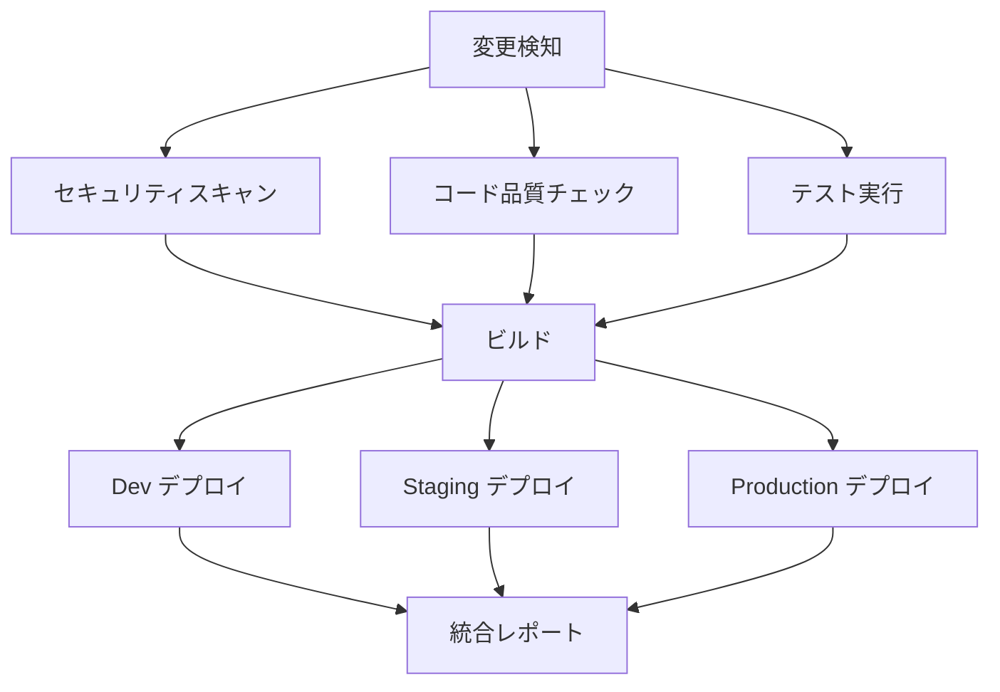

# CI/CD ベストプラクティスガイド

**エス・エー・エス株式会社**  
*GitHub Actions CI/CDパイプライン最適化・運用ベストプラクティス*

## 📋 目次

- [パフォーマンス最適化](#パフォーマンス最適化)
- [並列処理戦略](#並列処理戦略)
- [キャッシュ戦略](#キャッシュ戦略)
- [エラーハンドリング](#エラーハンドリング)
- [テスト戦略](#テスト戦略)
- [運用ベストプラクティス](#運用ベストプラクティス)
- [トラブルシューティング](#トラブルシューティング)

## ⚡ パフォーマンス最適化

### ワークフロー実行時間の最適化

```yaml
# パフォーマンス最適化のワークフロー例
name: 高速CI/CDパイプライン

on:
  push:
    branches: [ main, staging, dev ]
  pull_request:
    branches: [ main, staging, dev ]

# 並列実行を最大化
concurrency:
  group: ${{ github.workflow }}-${{ github.ref }}
  cancel-in-progress: true

env:
  # 共通環境変数でランタイム短縮
  FORCE_COLOR: 1
  NODE_OPTIONS: --max-old-space-size=4096

jobs:
  # =============================================================================
  # 前処理（変更検知・マトリックス生成）
  # =============================================================================
  changes:
    name: 変更検知
    runs-on: ubuntu-latest
    outputs:
      docs: ${{ steps.changes.outputs.docs }}
      yaml: ${{ steps.changes.outputs.yaml }}
      markdown: ${{ steps.changes.outputs.markdown }}
      workflows: ${{ steps.changes.outputs.workflows }}
    
    steps:
      - uses: actions/checkout@v4
        with:
          fetch-depth: 0  # 全履歴取得（初回のみ）
      
      - uses: dorny/paths-filter@v2
        id: changes
        with:
          filters: |
            docs:
              - '**/*.md'
              - 'docs/**'
            yaml:
              - '**/*.yml'
              - '**/*.yaml'
            markdown:
              - '**/*.md'
            workflows:
              - '.github/workflows/**'

  # =============================================================================
  # 並列チェック（変更されたファイルのみ）
  # =============================================================================
  markdown-check:
    name: Markdownチェック
    runs-on: ubuntu-latest
    needs: changes
    if: needs.changes.outputs.markdown == 'true'
    
    steps:
      - uses: actions/checkout@v4
      
      - name: キャッシュされたNode.jsセットアップ
        uses: actions/setup-node@v4
        with:
          node-version: '18'
          cache: 'npm'
          cache-dependency-path: '**/package-lock.json'
      
      - name: 変更されたMarkdownファイルのみチェック
        run: |
          # 変更されたファイルのみを対象にする
          git diff --name-only ${{ github.event.before }}..${{ github.sha }} \
            | grep '\.md$' \
            | xargs -r npx markdownlint
  
  yaml-check:
    name: YAMLチェック
    runs-on: ubuntu-latest
    needs: changes
    if: needs.changes.outputs.yaml == 'true'
    
    steps:
      - uses: actions/checkout@v4
      
      - name: 変更されたYAMLファイルのみチェック
        run: |
          git diff --name-only ${{ github.event.before }}..${{ github.sha }} \
            | grep -E '\.(ya?ml)$' \
            | xargs -r yamllint

  # =============================================================================
  # セキュリティスキャン（キャッシュ活用）
  # =============================================================================
  security-scan:
    name: セキュリティスキャン
    runs-on: ubuntu-latest
    
    strategy:
      matrix:
        scanner: [gitleaks, semgrep]
        include:
          - scanner: gitleaks
            cache-key: gitleaks-cache
          - scanner: semgrep  
            cache-key: semgrep-cache
    
    steps:
      - uses: actions/checkout@v4
        with:
          fetch-depth: 0
      
      - name: スキャンツールキャッシュ
        uses: actions/cache@v3
        with:
          path: |
            ~/.cache/${{ matrix.scanner }}
            /tmp/${{ matrix.scanner }}
          key: ${{ matrix.cache-key }}-${{ runner.os }}-${{ hashFiles('**/*.go', '**/*.py', '**/*.js') }}
          restore-keys: |
            ${{ matrix.cache-key }}-${{ runner.os }}-
      
      - name: ${{ matrix.scanner }}実行
        run: |
          case "${{ matrix.scanner }}" in
            "gitleaks")
              gitleaks detect --source . --verbose
              ;;
            "semgrep")
              semgrep --config=auto --json --output=semgrep.json .
              ;;
          esac
        continue-on-error: true
```

### リソース使用量の最適化

```yaml
# リソース効率的なジョブ設定
jobs:
  efficient-build:
    name: 効率的ビルド
    runs-on: ubuntu-latest
    
    # リソース使用量を制限
    env:
      NODE_OPTIONS: --max-old-space-size=2048
      MAKEFLAGS: -j2
    
    steps:
      - uses: actions/checkout@v4
        with:
          # 必要な分だけ取得
          fetch-depth: 1
      
      - name: 最適化されたNode.jsセットアップ
        uses: actions/setup-node@v4
        with:
          node-version: '18'
          cache: 'npm'
          # 依存関係のキャッシュキーを最適化
          cache-dependency-path: |
            package-lock.json
            **/package-lock.json
      
      - name: 選択的依存関係インストール
        run: |
          # 本番依存関係のみインストール（開発時以外）
          if [ "${{ github.event_name }}" != "pull_request" ]; then
            npm ci --only=production
          else
            npm ci
          fi
      
      - name: 並列ビルド
        run: |
          # CPUコア数に基づく並列処理
          CORES=$(nproc --all)
          npm run build -- --jobs=$((CORES > 2 ? CORES - 1 : 1))
```

## 🔄 並列処理戦略

### ジョブ依存関係の最適化



### マトリックス戦略の活用

```yaml
jobs:
  test-matrix:
    name: マトリックステスト
    runs-on: ${{ matrix.os }}
    
    strategy:
      # 並列実行数を制限してリソース効率化
      max-parallel: 3
      # 一つの組み合わせが失敗しても他を継続
      fail-fast: false
      matrix:
        os: [ubuntu-latest, windows-latest]
        node-version: [16, 18, 20]
        test-suite: [unit, integration, e2e]
        # 不要な組み合わせを除外
        exclude:
          - os: windows-latest
            test-suite: e2e
          - node-version: 16
            test-suite: e2e
    
    steps:
      - uses: actions/checkout@v4
      
      - name: Node.js ${{ matrix.node-version }} セットアップ
        uses: actions/setup-node@v4
        with:
          node-version: ${{ matrix.node-version }}
          cache: 'npm'
      
      - name: ${{ matrix.test-suite }}テスト実行
        run: npm run test:${{ matrix.test-suite }}
        env:
          CI: true
          OS: ${{ matrix.os }}
```

### 動的並列処理

```yaml
jobs:
  generate-matrix:
    name: テストマトリックス生成
    runs-on: ubuntu-latest
    outputs:
      matrix: ${{ steps.matrix.outputs.matrix }}
    
    steps:
      - uses: actions/checkout@v4
      
      - name: 動的マトリックス生成
        id: matrix
        run: |
          # 変更されたファイルに基づいてテストマトリックスを動的生成
          CHANGED_FILES=$(git diff --name-only ${{ github.event.before }}..${{ github.sha }})
          
          MATRIX_JSON='{"include":[]}'
          
          if echo "$CHANGED_FILES" | grep -q '\.md$'; then
            MATRIX_JSON=$(echo "$MATRIX_JSON" | jq '.include += [{"check": "markdown", "files": "*.md"}]')
          fi
          
          if echo "$CHANGED_FILES" | grep -q '\.ya?ml$'; then
            MATRIX_JSON=$(echo "$MATRIX_JSON" | jq '.include += [{"check": "yaml", "files": "*.yml,*.yaml"}]')
          fi
          
          if echo "$CHANGED_FILES" | grep -q '\.js$'; then
            MATRIX_JSON=$(echo "$MATRIX_JSON" | jq '.include += [{"check": "javascript", "files": "*.js"}]')
          fi
          
          echo "matrix=$MATRIX_JSON" >> $GITHUB_OUTPUT
  
  dynamic-checks:
    name: ${{ matrix.check }}チェック
    runs-on: ubuntu-latest
    needs: generate-matrix
    if: needs.generate-matrix.outputs.matrix != '{"include":[]}'
    
    strategy:
      matrix: ${{ fromJson(needs.generate-matrix.outputs.matrix) }}
    
    steps:
      - uses: actions/checkout@v4
      
      - name: ${{ matrix.check }}チェック実行
        run: |
          case "${{ matrix.check }}" in
            "markdown")
              npx markdownlint ${{ matrix.files }}
              ;;
            "yaml")
              yamllint ${{ matrix.files }}
              ;;
            "javascript")
              npx eslint ${{ matrix.files }}
              ;;
          esac
```

## 💾 キャッシュ戦略

### 多層キャッシュ戦略

```yaml
jobs:
  optimized-cache:
    name: 最適化キャッシュ
    runs-on: ubuntu-latest
    
    steps:
      - uses: actions/checkout@v4
      
      # Layer 1: Node.js バイナリキャッシュ
      - name: Node.jsセットアップ（バイナリキャッシュ付き）
        uses: actions/setup-node@v4
        with:
          node-version: '18'
          cache: 'npm'
      
      # Layer 2: 依存関係キャッシュ
      - name: 依存関係キャッシュ
        uses: actions/cache@v3
        with:
          path: |
            ~/.npm
            node_modules
            .npm-cache
          key: npm-${{ runner.os }}-${{ hashFiles('**/package-lock.json') }}
          restore-keys: |
            npm-${{ runner.os }}-
      
      # Layer 3: ビルド成果物キャッシュ
      - name: ビルドキャッシュ
        uses: actions/cache@v3
        with:
          path: |
            dist/
            .cache/
            .next/cache/
          key: build-${{ runner.os }}-${{ hashFiles('src/**', 'package.json') }}
          restore-keys: |
            build-${{ runner.os }}-
      
      # Layer 4: ツール固有キャッシュ
      - name: ツールキャッシュ
        uses: actions/cache@v3
        with:
          path: |
            ~/.cache/pip
            ~/.cache/yarn
            ~/.cargo/registry
            ~/.cargo/git
          key: tools-${{ runner.os }}-${{ hashFiles('**/requirements.txt', '**/Cargo.toml') }}
          restore-keys: |
            tools-${{ runner.os }}-
```

### スマートキャッシュ無効化

```yaml
jobs:
  smart-cache:
    name: スマートキャッシュ
    runs-on: ubuntu-latest
    
    steps:
      - uses: actions/checkout@v4
        with:
          fetch-depth: 2  # 比較のために前のコミットも取得
      
      - name: キャッシュキー生成
        id: cache-key
        run: |
          # 依存関係ファイルの変更を検知
          DEPS_HASH=$(find . -name "package.json" -o -name "package-lock.json" -o -name "requirements.txt" | \
                     sort | xargs cat | sha256sum | cut -d' ' -f1)
          
          # ソースコードの変更を検知
          SRC_HASH=$(find src/ -type f -name "*.js" -o -name "*.ts" -o -name "*.py" | \
                    sort | xargs cat | sha256sum | cut -d' ' -f1)
          
          echo "deps-hash=$DEPS_HASH" >> $GITHUB_OUTPUT
          echo "src-hash=$SRC_HASH" >> $GITHUB_OUTPUT
      
      - name: 依存関係キャッシュ（依存関係変更時のみ更新）
        uses: actions/cache@v3
        with:
          path: node_modules/
          key: deps-${{ steps.cache-key.outputs.deps-hash }}
          restore-keys: |
            deps-
      
      - name: ビルドキャッシュ（ソースコード変更時のみ更新）
        uses: actions/cache@v3
        with:
          path: dist/
          key: build-${{ steps.cache-key.outputs.src-hash }}
          restore-keys: |
            build-
```

### キャッシュサイズ最適化

```yaml
jobs:
  cache-optimization:
    name: キャッシュ最適化
    runs-on: ubuntu-latest
    
    steps:
      - uses: actions/checkout@v4
      
      - name: 選択的キャッシュ
        uses: actions/cache@v3
        with:
          path: |
            # 必要なファイルのみキャッシュ
            ~/.npm/_cacache
            node_modules/.cache
            # 大きなファイルは除外
            !node_modules/**/*.log
            !node_modules/**/*.tar.gz
          key: optimized-cache-${{ hashFiles('package-lock.json') }}
      
      - name: キャッシュサイズ監視
        run: |
          echo "キャッシュディレクトリサイズ:"
          du -sh ~/.npm/_cacache || echo "キャッシュなし"
          du -sh node_modules/.cache || echo "キャッシュなし"
          
          # 10GB を超える場合は警告
          CACHE_SIZE=$(du -s ~/.npm/_cacache 2>/dev/null | cut -f1 || echo "0")
          if [ "$CACHE_SIZE" -gt 10485760 ]; then  # 10GB in KB
            echo "⚠️  警告: キャッシュサイズが10GBを超えています"
          fi
```

## 🛠️ エラーハンドリング

### 段階的エラー処理

```yaml
jobs:
  robust-pipeline:
    name: 堅牢なパイプライン
    runs-on: ubuntu-latest
    
    steps:
      - uses: actions/checkout@v4
      
      - name: セットアップ（エラー時リトライ）
        uses: nick-fields/retry@v2
        with:
          timeout_minutes: 10
          max_attempts: 3
          retry_wait_seconds: 30
          command: |
            npm ci
            npm run setup
      
      - name: テスト実行（一部失敗許容）
        id: tests
        continue-on-error: true
        run: |
          set +e  # エラーで停止しない
          
          echo "ユニットテスト実行中..."
          npm run test:unit
          UNIT_EXIT=$?
          
          echo "インテグレーションテスト実行中..."
          npm run test:integration  
          INTEGRATION_EXIT=$?
          
          echo "E2Eテスト実行中..."
          npm run test:e2e
          E2E_EXIT=$?
          
          # 結果を環境変数に保存
          echo "unit-exit=$UNIT_EXIT" >> $GITHUB_OUTPUT
          echo "integration-exit=$INTEGRATION_EXIT" >> $GITHUB_OUTPUT
          echo "e2e-exit=$E2E_EXIT" >> $GITHUB_OUTPUT
          
          # クリティカルテストが失敗した場合のみ全体を失敗扱い
          if [ $UNIT_EXIT -ne 0 ] || [ $INTEGRATION_EXIT -ne 0 ]; then
            exit 1
          fi
      
      - name: テスト結果評価
        if: always()
        run: |
          echo "テスト結果サマリー:"
          echo "- ユニットテスト: ${{ steps.tests.outputs.unit-exit == '0' && 'PASS' || 'FAIL' }}"
          echo "- インテグレーションテスト: ${{ steps.tests.outputs.integration-exit == '0' && 'PASS' || 'FAIL' }}"
          echo "- E2Eテスト: ${{ steps.tests.outputs.e2e-exit == '0' && 'PASS' || 'FAIL' }}"
          
          # E2Eテストの失敗は警告として扱う
          if [ "${{ steps.tests.outputs.e2e-exit }}" != "0" ]; then
            echo "⚠️  E2Eテストが失敗しましたが、デプロイは続行されます"
          fi
      
      - name: エラー時のアーティファクト保存
        if: failure()
        uses: actions/upload-artifact@v3
        with:
          name: failure-logs-${{ github.run_id }}
          path: |
            logs/
            test-results/
            screenshots/
            *.log
          retention-days: 7
```

### エラー通知とエスカレーション

```yaml
jobs:
  error-handling:
    name: エラーハンドリング
    runs-on: ubuntu-latest
    
    steps:
      - name: 重要な処理
        id: critical-process
        run: |
          # 重要な処理を実行
          if ! npm run critical-task; then
            echo "critical-failed=true" >> $GITHUB_OUTPUT
            exit 1
          fi
      
      - name: エラー通知（即座）
        if: failure() && steps.critical-process.outputs.critical-failed == 'true'
        uses: 8398a7/action-slack@v3
        with:
          status: failure
          custom_payload: |
            {
              "text": "🚨 CRITICAL: CI/CDパイプライン重大エラー",
              "attachments": [
                {
                  "color": "danger",
                  "fields": [
                    {
                      "title": "Repository",
                      "value": "${{ github.repository }}",
                      "short": true
                    },
                    {
                      "title": "Branch",
                      "value": "${{ github.ref_name }}",
                      "short": true
                    },
                    {
                      "title": "Actor",
                      "value": "${{ github.actor }}",
                      "short": true
                    },
                    {
                      "title": "Workflow",
                      "value": "${{ github.workflow }}",
                      "short": true
                    }
                  ]
                }
              ]
            }
          webhook_url: ${{ secrets.SLACK_WEBHOOK_URL }}
      
      - name: エラー詳細レポート作成
        if: failure()
        run: |
          cat > error-report.md << EOF
          # CI/CDエラーレポート
          
          **発生時刻**: $(date -Iseconds)
          **ワークフロー**: ${{ github.workflow }}
          **実行ID**: ${{ github.run_id }}
          **ブランチ**: ${{ github.ref_name }}
          **コミット**: ${{ github.sha }}
          **実行者**: ${{ github.actor }}
          
          ## エラー詳細
          \`\`\`
          $(tail -n 100 /tmp/error.log || echo "エラーログなし")
          \`\`\`
          
          ## 環境情報
          - OS: ${{ runner.os }}
          - Node.js: $(node --version || echo "N/A")
          - npm: $(npm --version || echo "N/A")
          
          ## 推奨アクション
          1. ローカルでの再現確認
          2. 依存関係の確認
          3. 環境変数の確認
          4. 必要に応じてロールバック検討
          
          ---
          *このレポートは自動生成されました*
          EOF
      
      - name: Teams通知（詳細情報付き）
        if: failure()
        uses: skitionek/notify-microsoft-teams@master
        with:
          webhook_url: ${{ secrets.TEAMS_WEBHOOK_URL }}
          title: "CI/CDパイプラインエラー"
          message: |
            **リポジトリ**: ${{ github.repository }}
            **ブランチ**: ${{ github.ref_name }}
            **実行者**: ${{ github.actor }}
            **エラー時刻**: $(date)
            
            詳細なエラーレポートがアップロードされました。
            確認して適切な対応を行ってください。
```

## 🧪 テスト戦略

### 階層化テスト戦略

```yaml
jobs:
  test-pyramid:
    name: テストピラミッド実行
    runs-on: ubuntu-latest
    
    strategy:
      matrix:
        test-level:
          - name: unit
            priority: critical
            timeout: 5
            parallel: true
            
          - name: integration  
            priority: high
            timeout: 15
            parallel: false
            
          - name: e2e
            priority: medium
            timeout: 30
            parallel: false
            
          - name: performance
            priority: low
            timeout: 60
            parallel: false
    
    steps:
      - uses: actions/checkout@v4
      
      - name: ${{ matrix.test-level.name }}テスト環境セットアップ
        timeout-minutes: ${{ matrix.test-level.timeout }}
        run: |
          case "${{ matrix.test-level.name }}" in
            "unit")
              echo "高速ユニットテスト環境"
              npm ci --only=dev
              ;;
            "integration")
              echo "統合テスト環境"
              docker-compose up -d test-db
              ;;
            "e2e")
              echo "E2Eテスト環境"
              docker-compose up -d app test-db
              ;;
            "performance")
              echo "パフォーマンステスト環境"
              docker-compose up -d app test-db monitoring
              ;;
          esac
      
      - name: ${{ matrix.test-level.name }}テスト実行
        timeout-minutes: ${{ matrix.test-level.timeout }}
        continue-on-error: ${{ matrix.test-level.priority != 'critical' }}
        run: |
          echo "実行中: ${{ matrix.test-level.name }}テスト"
          npm run test:${{ matrix.test-level.name }}
      
      - name: テスト結果処理
        if: always()
        run: |
          # テスト結果の分析と保存
          echo "テスト完了: ${{ matrix.test-level.name }}"
          
          if [ -f "test-results/${{ matrix.test-level.name }}-results.xml" ]; then
            echo "結果ファイル確認済み"
          else
            echo "警告: 結果ファイルが見つかりません"
          fi
      
      - name: テスト結果アップロード
        if: always()
        uses: actions/upload-artifact@v3
        with:
          name: test-results-${{ matrix.test-level.name }}
          path: |
            test-results/
            coverage/
            screenshots/
          retention-days: 30
```

### テスト結果統合・レポート

```yaml
jobs:
  test-report:
    name: テスト結果統合
    runs-on: ubuntu-latest
    needs: [test-pyramid]
    if: always()
    
    steps:
      - uses: actions/checkout@v4
      
      - name: 全テスト結果ダウンロード
        uses: actions/download-artifact@v3
        with:
          path: all-test-results
      
      - name: 統合テストレポート作成
        run: |
          echo "📊 統合テストレポートを作成中..."
          
          cat > test-report.md << EOF
          # 📊 統合テストレポート
          
          **実行日時**: $(date -Iseconds)
          **ブランチ**: ${{ github.ref_name }}
          **コミット**: ${{ github.sha }}
          **実行者**: ${{ github.actor }}
          
          ## テスト結果サマリー
          
          | テストレベル | 結果 | 実行時間 | カバレッジ |
          |-------------|------|----------|-----------|
          EOF
          
          # 各テストレベルの結果を集計
          for level in unit integration e2e performance; do
            if [ -d "all-test-results/test-results-$level" ]; then
              echo "| $level | ✅ PASS | - | - |" >> test-report.md
            else
              echo "| $level | ❌ FAIL | - | - |" >> test-report.md
            fi
          done
          
          cat >> test-report.md << EOF
          
          ## 詳細分析
          
          ### 品質メトリクス
          - **テスト実行数**: $(find all-test-results -name "*.xml" | wc -l)
          - **失敗テスト数**: $(grep -r "failure" all-test-results --include="*.xml" | wc -l || echo "0")
          - **スキップテスト数**: $(grep -r "skipped" all-test-results --include="*.xml" | wc -l || echo "0")
          
          ### 推奨アクション
          $(if [ $(grep -r "failure" all-test-results --include="*.xml" | wc -l || echo "0") -gt 0 ]; then
            echo "- 失敗したテストの修正が必要"
          fi)
          $(if [ $(find all-test-results -name "*.xml" | wc -l) -eq 0 ]; then
            echo "- テスト実行の確認が必要"
          fi)
          
          ---
          *このレポートは自動生成されました*
          EOF
      
      - name: テストレポートアップロード
        uses: actions/upload-artifact@v3
        with:
          name: test-report-${{ github.run_id }}
          path: test-report.md
          retention-days: 90
      
      - name: テスト結果通知
        uses: skitionek/notify-microsoft-teams@master
        with:
          webhook_url: ${{ secrets.TEAMS_WEBHOOK_URL }}
          title: "テスト実行完了"
          message: |
            **リポジトリ**: ${{ github.repository }}
            **ブランチ**: ${{ github.ref_name }}
            **実行時間**: $(date)
            
            統合テストレポートが生成されました。
            詳細は添付のアーティファクトをご確認ください。
```

## 🔧 運用ベストプラクティス

### ワークフロー最適化チェックリスト

```markdown
# CI/CDワークフロー最適化チェックリスト

## パフォーマンス最適化
- [ ] 不要なチェックアウトを削減
- [ ] 適切なfetch-depthを設定
- [ ] キャッシュ戦略を実装
- [ ] 並列実行を最大化
- [ ] リソース使用量を最適化

## エラーハンドリング
- [ ] 適切なcontinue-on-errorを設定
- [ ] リトライ機構を実装
- [ ] エラー時の通知を設定
- [ ] アーティファクト保存を設定
- [ ] タイムアウト値を適切に設定

## セキュリティ
- [ ] 最小権限の原則を適用
- [ ] シークレットを適切に管理
- [ ] 外部アクションの固定バージョンを使用
- [ ] セキュリティスキャンを実装
- [ ] 監査ログを有効化

## 運用性
- [ ] 適切なジョブ名を設定
- [ ] わかりやすいログ出力
- [ ] 成果物の適切な保存
- [ ] 通知設定の実装
- [ ] ドキュメントの整備
```

### モニタリング・メトリクス

```yaml
jobs:
  metrics-collection:
    name: CI/CDメトリクス収集
    runs-on: ubuntu-latest
    if: always()
    
    steps:
      - name: ワークフローメトリクス収集
        env:
          GH_TOKEN: ${{ secrets.GITHUB_TOKEN }}
        run: |
          echo "📈 CI/CDメトリクスを収集中..."
          
          # 最近のワークフロー実行データを取得
          gh api repos/${{ github.repository }}/actions/runs \
            --paginate \
            --jq '.workflow_runs[] | select(.created_at > (now - 7*24*3600 | todate)) | {id, status, conclusion, created_at, updated_at}' \
            > workflow-metrics.json
          
          # メトリクス分析
          TOTAL_RUNS=$(jq '. | length' workflow-metrics.json)
          SUCCESS_RUNS=$(jq '[.[] | select(.conclusion == "success")] | length' workflow-metrics.json)
          FAILURE_RUNS=$(jq '[.[] | select(.conclusion == "failure")] | length' workflow-metrics.json)
          SUCCESS_RATE=$((SUCCESS_RUNS * 100 / TOTAL_RUNS))
          
          echo "総実行数: $TOTAL_RUNS"
          echo "成功数: $SUCCESS_RUNS" 
          echo "失敗数: $FAILURE_RUNS"
          echo "成功率: $SUCCESS_RATE%"
          
          # メトリクスファイル作成
          cat > ci-metrics.json << EOF
          {
            "period": "7days",
            "timestamp": "$(date -Iseconds)",
            "repository": "${{ github.repository }}",
            "metrics": {
              "total_runs": $TOTAL_RUNS,
              "success_runs": $SUCCESS_RUNS,
              "failure_runs": $FAILURE_RUNS,
              "success_rate": $SUCCESS_RATE,
              "avg_duration_minutes": $(jq '[.[] | ((.updated_at | fromdateiso8601) - (.created_at | fromdateiso8601))] | add / length / 60' workflow-metrics.json)
            }
          }
          EOF
      
      - name: メトリクス分析・アラート
        run: |
          SUCCESS_RATE=$(jq '.metrics.success_rate' ci-metrics.json)
          AVG_DURATION=$(jq '.metrics.avg_duration_minutes' ci-metrics.json)
          
          echo "📊 パフォーマンス分析:"
          echo "- 成功率: $SUCCESS_RATE%"
          echo "- 平均実行時間: ${AVG_DURATION}分"
          
          # アラート条件チェック
          if [ $(echo "$SUCCESS_RATE < 90" | bc -l) -eq 1 ]; then
            echo "⚠️  警告: 成功率が90%を下回っています"
          fi
          
          if [ $(echo "$AVG_DURATION > 30" | bc -l) -eq 1 ]; then
            echo "⚠️  警告: 平均実行時間が30分を超えています"
          fi
      
      - name: メトリクスアップロード
        uses: actions/upload-artifact@v3
        with:
          name: ci-metrics-$(date +%Y%m%d)
          path: |
            ci-metrics.json
            workflow-metrics.json
          retention-days: 365
```

### 継続的改善プロセス

```yaml
jobs:
  continuous-improvement:
    name: 継続的改善分析
    runs-on: ubuntu-latest
    if: github.event_name == 'schedule' || github.event_name == 'workflow_dispatch'
    
    steps:
      - uses: actions/checkout@v4
        with:
          fetch-depth: 0
      
      - name: ワークフロー変更履歴分析
        run: |
          echo "🔍 ワークフロー改善分析を実行中..."
          
          # 最近30日のワークフロー変更を分析
          git log --since="30 days ago" --oneline --name-only -- .github/workflows/ > workflow-changes.txt
          
          WORKFLOW_CHANGES=$(wc -l < workflow-changes.txt)
          echo "最近30日間のワークフロー変更: $WORKFLOW_CHANGES件"
          
          # パフォーマンス改善の機会を特定
          echo "## 改善提案" > improvement-suggestions.md
          
          # ワークフローファイルサイズチェック
          find .github/workflows -name "*.yml" -size +50k -exec echo "- {} が大きすぎます（分割を検討）" \; >> improvement-suggestions.md
          
          # 重複するジョブの検出
          grep -h "name:" .github/workflows/*.yml | sort | uniq -d | while read line; do
            echo "- 重複するジョブ名: $line" >> improvement-suggestions.md
          done
      
      - name: パフォーマンス改善提案
        run: |
          cat >> improvement-suggestions.md << EOF
          
          ## パフォーマンス最適化提案
          
          ### キャッシュ最適化
          - [ ] 依存関係キャッシュの効率化
          - [ ] ビルドキャッシュの活用拡大
          - [ ] マルチレイヤーキャッシュの導入
          
          ### 並列処理改善
          - [ ] マトリックス戦略の最適化
          - [ ] 依存関係の見直し
          - [ ] 動的並列処理の導入
          
          ### リソース効率化
          - [ ] 不要なステップの削除
          - [ ] 軽量なランナーの使用
          - [ ] 条件分岐の最適化
          
          ### セキュリティ強化
          - [ ] アクション固定バージョンの更新
          - [ ] 権限の最小化
          - [ ] セキュリティスキャンの強化
          
          ---
          
          **次回レビュー予定**: $(date -d '+1 month' '+%Y-%m-%d')
          EOF
      
      - name: 改善提案アップロード
        uses: actions/upload-artifact@v3
        with:
          name: improvement-suggestions-$(date +%Y%m%d)
          path: improvement-suggestions.md
          retention-days: 90
      
      - name: 改善提案通知
        uses: skitionek/notify-microsoft-teams@master
        with:
          webhook_url: ${{ secrets.TEAMS_WEBHOOK_URL }}
          title: "CI/CD改善提案レポート"
          message: |
            **対象期間**: 過去30日間
            **改善機会**: 複数の最適化提案あり
            
            詳細な改善提案がアップロードされました。
            チームで確認して優先度を検討してください。
```

## 🔧 トラブルシューティング

### 一般的な問題と解決策

```yaml
# トラブルシューティングガイドのワークフロー実装例
jobs:
  troubleshooting:
    name: 問題診断・自動修復
    runs-on: ubuntu-latest
    if: failure()
    
    steps:
      - name: 環境情報収集
        run: |
          echo "🔍 環境情報を収集中..."
          echo "=== システム情報 ===" > troubleshoot-info.txt
          echo "OS: $(uname -a)" >> troubleshoot-info.txt
          echo "CPU: $(nproc) cores" >> troubleshoot-info.txt
          echo "Memory: $(free -h)" >> troubleshoot-info.txt
          echo "Disk: $(df -h)" >> troubleshoot-info.txt
          
          echo "=== Node.js情報 ===" >> troubleshoot-info.txt
          node --version >> troubleshoot-info.txt 2>&1 || echo "Node.js not found" >> troubleshoot-info.txt
          npm --version >> troubleshoot-info.txt 2>&1 || echo "npm not found" >> troubleshoot-info.txt
          
          echo "=== 環境変数 ===" >> troubleshoot-info.txt
          env | grep -E "(NODE|NPM|GITHUB)" >> troubleshoot-info.txt
      
      - name: 一般的な問題の自動診断
        run: |
          echo "🔧 自動診断を実行中..."
          
          # ディスク容量不足チェック
          DISK_USAGE=$(df / | tail -1 | awk '{print $5}' | sed 's/%//')
          if [ $DISK_USAGE -gt 90 ]; then
            echo "❌ ディスク容量不足: ${DISK_USAGE}%使用中"
            echo "解決策: 不要なファイルの削除、キャッシュクリア"
          fi
          
          # メモリ不足チェック  
          AVAILABLE_MEMORY=$(free -m | awk 'NR==2{printf "%.1f", $7*100/$2 }')
          if [ $(echo "$AVAILABLE_MEMORY < 10" | bc -l) -eq 1 ]; then
            echo "❌ メモリ不足: 使用可能メモリ${AVAILABLE_MEMORY}%"
            echo "解決策: プロセス終了、メモリ効率的なコマンド使用"
          fi
          
          # ネットワーク接続チェック
          if ! curl -s --max-time 5 https://registry.npmjs.org/ > /dev/null; then
            echo "❌ ネットワーク接続問題: npmレジストリにアクセスできません"
            echo "解決策: ネットワーク設定確認、プロキシ設定確認"
          fi
          
          # パッケージインストール問題チェック
          if [ -f package.json ] && [ ! -d node_modules ]; then
            echo "❌ 依存関係未インストール"
            echo "解決策: npm ci または npm install を実行"
          fi
      
      - name: 自動修復試行
        run: |
          echo "🔧 自動修復を試行中..."
          
          # キャッシュクリア
          echo "キャッシュをクリア中..."
          npm cache clean --force 2>/dev/null || echo "npmキャッシュクリア不要"
          
          # 一時ファイルクリア
          echo "一時ファイルをクリア中..."
          rm -rf /tmp/* 2>/dev/null || echo "一時ファイルクリア完了"
          
          # 依存関係の再インストール
          if [ -f package.json ]; then
            echo "依存関係を再インストール中..."
            rm -rf node_modules package-lock.json
            npm install
          fi
      
      - name: トラブルシューティング情報保存
        if: always()
        uses: actions/upload-artifact@v3
        with:
          name: troubleshooting-${{ github.run_id }}
          path: |
            troubleshoot-info.txt
            *.log
          retention-days: 7
```

### パフォーマンス問題の診断

```yaml
jobs:
  performance-diagnosis:
    name: パフォーマンス診断
    runs-on: ubuntu-latest
    
    steps:
      - uses: actions/checkout@v4
      
      - name: ワークフロー実行時間分析
        env:
          GH_TOKEN: ${{ secrets.GITHUB_TOKEN }}
        run: |
          echo "⏱️  パフォーマンス分析を実行中..."
          
          # 最近10回の実行時間を取得
          gh api repos/${{ github.repository }}/actions/runs \
            --jq '.workflow_runs[0:10] | .[] | {id, status, created_at, updated_at, run_time: ((.updated_at | fromdateiso8601) - (.created_at | fromdateiso8601))}' \
            > recent-runs.json
          
          # 実行時間統計
          AVG_TIME=$(jq '[.[].run_time] | add / length' recent-runs.json)
          MAX_TIME=$(jq '[.[].run_time] | max' recent-runs.json)
          MIN_TIME=$(jq '[.[].run_time] | min' recent-runs.json)
          
          echo "平均実行時間: ${AVG_TIME}秒"
          echo "最大実行時間: ${MAX_TIME}秒"
          echo "最小実行時間: ${MIN_TIME}秒"
          
          # パフォーマンス問題の検出
          if [ $(echo "$AVG_TIME > 1800" | bc -l) -eq 1 ]; then  # 30分超過
            echo "⚠️  パフォーマンス問題: 平均実行時間が30分を超えています"
            
            echo "推奨改善策:" > performance-recommendations.txt
            echo "1. 並列処理の拡張" >> performance-recommendations.txt
            echo "2. キャッシュ戦略の改善" >> performance-recommendations.txt
            echo "3. 不要なステップの削除" >> performance-recommendations.txt
            echo "4. より高速なランナーの使用検討" >> performance-recommendations.txt
          fi
      
      - name: ジョブレベル分析
        env:
          GH_TOKEN: ${{ secrets.GITHUB_TOKEN }}
        run: |
          echo "🔍 ジョブレベルの分析を実行中..."
          
          # 最新の実行のジョブ詳細を取得
          LATEST_RUN_ID=$(gh api repos/${{ github.repository }}/actions/runs --jq '.workflow_runs[0].id')
          
          gh api repos/${{ github.repository }}/actions/runs/$LATEST_RUN_ID/jobs \
            --jq '.jobs[] | {name, status, started_at, completed_at, duration: ((.completed_at | fromdateiso8601) - (.started_at | fromdateiso8601))}' \
            > job-performance.json
          
          echo "ジョブ実行時間:"
          jq -r '.[] | "\(.name): \(.duration)秒"' job-performance.json
          
          # 最も時間のかかるジョブを特定
          SLOWEST_JOB=$(jq -r 'sort_by(.duration) | reverse | .[0] | .name' job-performance.json)
          SLOWEST_TIME=$(jq -r 'sort_by(.duration) | reverse | .[0] | .duration' job-performance.json)
          
          echo "最も時間のかかるジョブ: $SLOWEST_JOB (${SLOWEST_TIME}秒)"
```

---

## 📞 サポート・参考資料

### 緊急時連絡先
- **GitHub管理チーム**: github@sas-com.com
- **技術サポート**: tech-support@sas-com.com
- **緊急時**: 同上（24時間対応）

### 参考ドキュメント
- [GitHub Actions公式ドキュメント](https://docs.github.com/actions)
- [ワークフローセキュリティガイド](https://docs.github.com/actions/security-guides)
- [SAS CI/CD デプロイメント戦略](/CICD_DEPLOYMENT_STRATEGY.md)
- [SAS シークレット管理ガイド](/SECRETS_MANAGEMENT_GUIDE.md)

---

*このガイドは継続的に更新され、最新のベストプラクティスを反映します。*