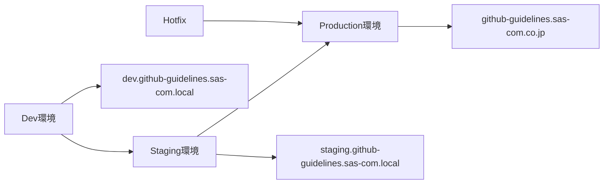
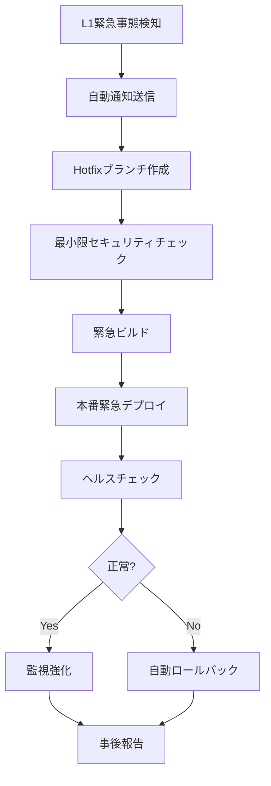
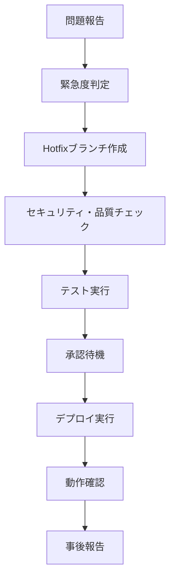

# CI/CDデプロイメント戦略ガイド

**エス・エー・エス株式会社**  
*GitHub Actions CI/CDパイプライン運用戦略*

## 📋 目次

- [環境アーキテクチャ](#環境アーキテクチャ)
- [ブランチ戦略](#ブランチ戦略)
- [デプロイメント戦略](#デプロイメント戦略)
- [承認フロー](#承認フロー)
- [モニタリング戦略](#モニタリング戦略)
- [ロールバック戦略](#ロールバック戦略)
- [緊急時対応](#緊急時対応)

## 🏗️ 環境アーキテクチャ

### 3層環境構成



### 環境詳細仕様

| 環境 | 用途 | URL | デプロイ頻度 | 承認要件 |
|------|------|-----|------------|----------|
| **Dev** | 開発・機能テスト | dev.github-guidelines.sas-com.local | 随時 | なし |
| **Staging** | 統合テスト・受け入れテスト | staging.github-guidelines.sas-com.local | 1日1回 | 1名承認 |
| **Production** | 本番運用 | github-guidelines.sas-com.co.jp | 週1回 | 2名承認 |

### インフラ構成

```yaml
# 各環境の推奨構成
environments:
  dev:
    compute: 最小リソース
    storage: 開発用ストレージ
    monitoring: 基本監視
    backup: なし
    
  staging:
    compute: 本番相当リソース
    storage: 本番相当ストレージ
    monitoring: 本番相当監視
    backup: 日次バックアップ
    
  production:
    compute: 高可用性構成
    storage: 冗長化ストレージ
    monitoring: 24/7監視
    backup: 時間別・日次・週次バックアップ
```

## 🌿 ブランチ戦略

### ブランチ構成

```mermaid
gitgraph
    commit id: "Initial"
    
    branch dev
    checkout dev
    commit id: "Feature A"
    commit id: "Feature B"
    
    checkout main
    merge dev id: "Release to Staging"
    
    branch staging
    checkout staging
    commit id: "Staging Test"
    
    checkout main
    merge staging id: "Release to Production"
    
    branch hotfix/l1-critical-fix
    checkout hotfix/l1-critical-fix
    commit id: "Emergency Fix"
    
    checkout main
    merge hotfix/l1-critical-fix id: "Hotfix"
```

### ブランチルール

#### メインブランチ
- **main**: 本番環境のソースコード
- **staging**: ステージング環境のソースコード  
- **dev**: 開発環境のソースコード

#### 作業ブランチ
- **feature/**: 新機能開発
- **bugfix/**: バグ修正
- **hotfix/**: 緊急修正

#### 命名規則

```bash
# 機能ブランチ
feature/user-authentication
feature/markdown-validation

# バグ修正ブランチ
bugfix/fix-yaml-parsing
bugfix/resolve-security-scan-issue

# 緊急修正ブランチ（緊急度レベル付き）
hotfix/l1-critical-security-patch
hotfix/l2-high-performance-issue
```

### ブランチ保護設定

```yaml
# .github/branch-protection.yml
branch_protection_rules:
  main:
    required_status_checks:
      strict: true
      contexts:
        - "security-scan"
        - "code-quality"  
        - "build"
    enforce_admins: true
    required_pull_request_reviews:
      required_approving_review_count: 2
      dismiss_stale_reviews: true
      require_code_owner_reviews: true
    restrictions:
      users: ["sas-github-admin"]
      teams: ["sas-tech-leads"]
  
  staging:
    required_status_checks:
      strict: true
      contexts:
        - "security-scan"
        - "build"
    required_pull_request_reviews:
      required_approving_review_count: 1
```

## 🚀 デプロイメント戦略

### デプロイメントパターン

#### 1. 継続的デプロイメント（Dev環境）

```yaml
trigger:
  - push to dev branch
  - pull request merge

steps:
  1. セキュリティスキャン（並列）
  2. コード品質チェック（並列）
  3. 自動テスト実行
  4. ビルド・成果物作成
  5. Dev環境自動デプロイ
  6. ヘルスチェック
  7. 通知
```

#### 2. 制御されたデプロイメント（Staging環境）

```yaml
trigger:
  - manual deployment from dev
  - scheduled deployment (daily)

steps:
  1. Dev環境での検証完了確認
  2. セキュリティ・品質チェック
  3. 統合テスト実行
  4. 承認待機（1名）
  5. Staging環境デプロイ
  6. 受け入れテスト実行
  7. 結果レポート作成
```

#### 3. ブルーグリーンデプロイメント（Production環境）

```yaml
trigger:
  - manual deployment from staging
  - scheduled deployment (weekly)

steps:
  1. Staging環境での検証完了確認
  2. 承認待機（2名必須）
  3. グリーン環境準備
  4. グリーン環境デプロイ
  5. グリーン環境ヘルスチェック
  6. トラフィック切り替え（段階的）
     - 10% → 50% → 100%
  7. ブルー環境停止
  8. 本番運用監視
```

### デプロイメント成功基準

```yaml
health_checks:
  basic:
    - HTTP 200 response
    - 主要ページ表示確認
    - 基本機能動作確認
  
  extended:
    - パフォーマンステスト
    - セキュリティスキャン
    - 依存関係チェック
    - ユーザビリティテスト
  
  production:
    - 全機能動作確認
    - 性能要件達成確認
    - セキュリティ要件達成確認
    - 監視システム正常動作確認
```

## ✅ 承認フロー

### 承認マトリックス

| 環境 | 必要承認数 | 承認者 | 承認条件 |
|------|------------|--------|----------|
| Dev | 0 | - | 自動デプロイ |
| Staging | 1 | 開発チーム | テスト完了 |
| Production | 2 | 管理者・技術責任者 | ステークホルダー確認 |
| Hotfix L1 | 0 | - | 緊急時自動 |
| Hotfix L2+ | 1 | 管理者 | 緊急度判定 |

### 承認プロセス

#### Staging環境承認

```yaml
approval_process:
  trigger: staging deployment request
  
  requirements:
    - セキュリティスキャン完了
    - コード品質チェック完了
    - Dev環境での動作確認完了
    
  approvers:
    - any member of: sas-github-admin
    
  timeout: 24 hours
  
  auto_approval_conditions:
    - 軽微な修正（typo、doc更新）
    - 定期メンテナンス
```

#### Production環境承認

```yaml
approval_process:
  trigger: production deployment request
  
  requirements:
    - Staging環境での動作確認完了
    - パフォーマンステスト完了
    - セキュリティ監査完了
    - ロールバック計画確認
    - 関係者への事前通知完了
    
  approvers:
    - required: sas-github-admin (1名)
    - required: sas-tech-lead (1名)
    
  timeout: 72 hours
  
  escalation:
    - 24h後: 管理者に通知
    - 48h後: 技術責任者に通知
    - 72h後: 自動却下
```

## 📊 モニタリング戦略

### 監視レベル

#### Level 1: 基本監視（全環境）

```yaml
basic_monitoring:
  availability:
    - HTTP ヘルスチェック（1分間隔）
    - DNS 解決確認
    - SSL証明書有効性
    
  performance:
    - レスポンス時間
    - エラー率
    - 可用性率
    
  alerts:
    - 5分間連続失敗でアラート
    - Teams通知
```

#### Level 2: 詳細監視（Staging・Production）

```yaml
advanced_monitoring:
  metrics:
    - CPU使用率
    - メモリ使用率
    - ディスク使用率
    - ネットワークトラフィック
    
  logs:
    - アプリケーションログ
    - セキュリティログ
    - アクセスログ
    
  traces:
    - パフォーマンストレース
    - エラートレース
```

#### Level 3: ビジネス監視（Production のみ）

```yaml
business_monitoring:
  user_experience:
    - ページロード時間
    - ユーザージャーニー
    - コンバージョン率
    
  business_metrics:
    - アクティブユーザー数
    - 機能利用率
    - エラー影響度
    
  sla_monitoring:
    - 可用性 SLA: 99.9%
    - パフォーマンス SLA: 2秒以内
    - 復旧時間 SLA: 30分以内
```

### アラート設定

```yaml
alert_rules:
  critical:
    - サービス停止: 即座通知
    - セキュリティ侵害: 即座通知
    - データ損失: 即座通知
    
  high:
    - パフォーマンス低下: 5分後通知
    - エラー率上昇: 10分後通知
    - 容量不足警告: 15分後通知
    
  medium:
    - 軽微なエラー: 30分後通知
    - 予防的アラート: 1時間後通知

escalation:
  level_1: Teams通知
  level_2: Email通知 + Teams通知
  level_3: SMS通知 + 電話通知
```

## 🔄 ロールバック戦略

### ロールバックトリガー

```yaml
rollback_triggers:
  automatic:
    - ヘルスチェック連続失敗（5分間）
    - エラー率 > 5%
    - レスポンス時間 > 5秒
    - セキュリティアラート検知
    
  manual:
    - 管理者判断
    - ユーザーからの重大な問題報告
    - ビジネス影響の判明
```

### ロールバック手順

#### 1. 即座ロールバック（5分以内）

```bash
# 自動ロールバック
1. 異常検知
2. 自動トラフィック切り替え
3. 前バージョンへの復帰
4. ヘルスチェック確認
5. 関係者通知
```

#### 2. 計画的ロールバック（30分以内）

```bash
# 手動ロールバック
1. 問題状況の評価
2. ロールバック計画の確認
3. 関係者への事前通知
4. データベース状態の確認
5. ロールバック実行
6. 動作確認
7. 事後報告
```

### ロールバック成功基準

```yaml
rollback_success_criteria:
  technical:
    - HTTP 200レスポンス復帰
    - エラー率 < 1%
    - パフォーマンス基準達成
    
  business:
    - 主要機能動作確認
    - ユーザー影響の最小化
    - データ整合性確認
    
  operational:
    - 監視アラート解除
    - 運用チームへの状況共有
    - 事後分析計画の策定
```

## 🚨 緊急時対応

### 緊急度分類

| レベル | 説明 | 対応時間 | 承認要件 | 例 |
|--------|------|----------|----------|---|
| **L1-Critical** | サービス停止・セキュリティ侵害 | 即座 | 承認不要 | システム停止、データ漏洩 |
| **L2-High** | 主要機能障害 | 1時間以内 | 1名承認 | 認証エラー、パフォーマンス低下 |
| **L3-Medium** | 軽微な機能障害 | 4時間以内 | 1名承認 | UI不具合、軽微なバグ |
| **L4-Low** | 改善要望・予防的修正 | 翌営業日 | 通常フロー | 文言修正、軽微な改善 |

### 緊急対応フロー

#### L1緊急対応（Critical）



#### L2以下対応（High・Medium・Low）



### 緊急時連絡体制

```yaml
emergency_contacts:
  primary:
    - github@sas-com.com
    - 24時間対応
    
  escalation:
    L1_critical:
      - Teams: 即座通知
      - Email: 即座通知
      - SMS: 5分後通知
      
    L2_high:
      - Teams: 即座通知
      - Email: 30分後通知
      
    L3_medium:
      - Teams: 即座通知
      - Email: 1時間後通知
      
    L4_low:
      - Teams: 翌営業日通知
```

### 事後処理

#### インシデントレポート

```markdown
# インシデントレポートテンプレート

## 基本情報
- **発生日時**: 
- **検知日時**: 
- **復旧日時**: 
- **影響時間**: 
- **緊急度**: 

## 問題の概要
- **現象**: 
- **影響範囲**: 
- **根本原因**: 

## 対応履歴
1. 
2. 
3. 

## 再発防止策
- **即座実施**: 
- **短期対応**: 
- **長期対応**: 

## 学んだ教訓
- 
- 

## 改善提案
- 
- 
```

#### 事後改善プロセス

```yaml
post_incident_process:
  immediate_actions:
    - インシデントレポート作成（24時間以内）
    - 関係者への報告完了
    - 一時的な監視強化
    
  short_term_actions:
    - 根本原因分析完了（1週間以内）
    - 再発防止策実装（2週間以内）
    - プロセス改善実施
    
  long_term_actions:
    - システム改善計画策定
    - 教育・訓練プログラム更新
    - 緊急時対応プロセス見直し
```

---

## 📞 サポート・連絡先

### 技術サポート
- **Email**: github@sas-com.com
- **Teams**: SAS GitHub管理チーム
- **緊急時**: 同上（24時間対応）

### エスカレーション
- **L1 Critical**: 即座にgithub@sas-com.comに連絡
- **L2 High**: 1時間以内にgithub@sas-com.comに連絡
- **L3 Medium**: 4時間以内にgithub@sas-com.comに連絡
- **L4 Low**: 翌営業日にgithub@sas-com.comに連絡

---

*このガイドは継続的に更新され、チーム全体で共有されます。*