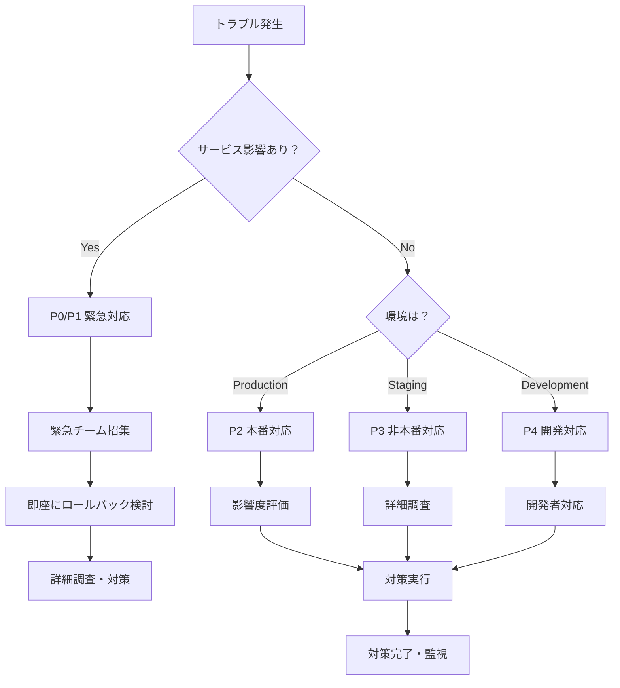

# デプロイ・トラブルシューティングガイド

**エス・エー・エス株式会社**  
*GitHub運用ガイドライン - デプロイ・トラブルシューティングガイド*

## 目次

- [概要](#概要)
- [トラブル分類と診断フロー](#トラブル分類と診断フロー)
- [GitHub Actions関連のトラブル](#github-actions関連のトラブル)
- [デプロイメント関連のトラブル](#デプロイメント関連のトラブル)
- [環境固有のトラブル](#環境固有のトラブル)
- [セキュリティ関連のトラブル](#セキュリティ関連のトラブル)
- [パフォーマンス関連のトラブル](#パフォーマンス関連のトラブル)
- [緊急時対応手順](#緊急時対応手順)
- [予防策と改善提案](#予防策と改善提案)

## 概要

本ガイドは、エス・エー・エス株式会社のGitHub環境におけるデプロイに関連するトラブルの診断と解決方法を提供します。体系的なアプローチにより、迅速な問題解決を支援します。

### トラブル対応の基本原則

1. **安全第一**: システム全体への影響を最小限に抑制
2. **迅速な初動**: 5分以内の初動対応開始
3. **証跡保全**: 診断に必要な情報の確実な保存
4. **段階的復旧**: 小さなステップでの段階的な回復
5. **再発防止**: 根本原因分析と改善策の実施

### 緊急度レベル

| レベル | 定義 | 対応時間 | 対応者 |
|--------|------|----------|---------|
| P0 | 本番サービス完全停止 | 即座（5分以内） | 全チーム |
| P1 | 本番サービス重大障害 | 30分以内 | 運用チーム |
| P2 | 本番サービス軽微障害 | 2時間以内 | 担当者 |
| P3 | 非本番環境障害 | 1営業日以内 | 担当者 |
| P4 | 改善要求・軽微な問題 | 1週間以内 | 担当者 |

## トラブル分類と診断フロー

### 初期診断フローチャート



### 診断のための基本情報収集

#### 1. 基本情報

```bash
# 現在時刻とタイムゾーン
date
timedatectl status

# 最後のデプロイ情報
git log --oneline -5
git describe --tags

# 現在のブランチとコミット
git status
git rev-parse HEAD
```

#### 2. システム状態

```bash
# システムリソース確認
top
free -h
df -h
iostat -x 1 5

# プロセス状態確認
ps aux | grep -E "(node|nginx|postgres|redis)"

# ネットワーク状態確認
netstat -tuln
ss -tuln
```

#### 3. サービス状態

```bash
# ヘルスチェック実行
curl -v https://[環境]/health
curl -v https://[環境]/api/v1/status

# ログ確認（最新100行）
tail -100 /var/log/application.log
tail -100 /var/log/nginx/error.log
```

## GitHub Actions関連のトラブル

### 問題1: ワークフロー実行失敗

#### 症状
- GitHub Actionsでワークフローが失敗する
- ジョブが途中で停止する
- 特定のステップでエラーが発生する

#### 診断手順

```bash
# 1. GitHub UI でワークフロー詳細確認
# https://github.com/sas-com/github-guidelines/actions

# 2. 失敗したジョブのログダウンロード
gh run download [run-id]

# 3. エラーメッセージの分析
grep -E "(ERROR|Failed|fatal)" workflow-logs/*.txt
```

#### 一般的な原因と解決策

**原因: Node.js依存関係の問題**
```yaml
# 解決策: package-lock.jsonの更新
- name: Clear npm cache
  run: npm cache clean --force

- name: Delete node_modules
  run: rm -rf node_modules

- name: Install dependencies
  run: npm ci
```

**原因: テスト失敗**
```bash
# 診断: テストログの詳細確認
npm test -- --verbose

# 解決策: 失敗したテストの修正
npm test -- --testNamePattern="failing-test-name"
```

**原因: タイムアウト**
```yaml
# 解決策: タイムアウト時間の調整
jobs:
  test:
    timeout-minutes: 30  # デフォルト360分から短縮
```

**原因: Secret/環境変数の未設定**
```bash
# 診断: 使用される環境変数の確認
echo "Required secrets:"
echo "- DATABASE_URL"
echo "- API_KEY" 

# 解決策: GitHub UIでSecrets設定確認
# Settings → Secrets and variables → Actions
```

### 問題2: 成果物（Artifacts）の問題

#### 症状
- ビルド成果物のアップロードに失敗
- ダウンロードした成果物が不正
- 成果物が見つからない

#### 診断と解決策

```yaml
# 診断: 成果物の存在確認
- name: Check artifacts
  run: |
    ls -la dist/
    du -sh dist/

# 解決策: 成果物の適切な設定
- name: Upload artifacts
  uses: actions/upload-artifact@v4
  with:
    name: build-artifacts-${{ github.run_id }}
    path: |
      dist/
      !dist/**/*.map
    retention-days: 30
    if-no-files-found: error
```

### 問題3: 並行実行の問題

#### 症状
- 同時実行により競合状態が発生
- リソースの取り合いによる失敗
- 不整合な状態の発生

#### 解決策

```yaml
# 並行実行制御の設定
concurrency:
  group: ${{ github.workflow }}-${{ github.ref }}
  cancel-in-progress: true  # 開発環境の場合

# または保守的な設定（本番環境）
concurrency:
  group: production-deployment
  cancel-in-progress: false
```

## デプロイメント関連のトラブル

### 問題1: デプロイ先サーバーへの接続失敗

#### 症状
- SSH接続がタイムアウト
- 認証に失敗する
- ネットワークが到達不能

#### 診断手順

```bash
# 1. 基本接続テスト
ping target-server.example.com
telnet target-server.example.com 22

# 2. SSH接続テスト
ssh -v user@target-server.example.com

# 3. DNS解決確認
nslookup target-server.example.com
dig target-server.example.com
```

#### 解決策

**ネットワーク問題**:
```bash
# ファイアウォール設定確認
sudo ufw status
sudo iptables -L

# 接続許可設定
sudo ufw allow from [GitHub Actions IP ranges]
```

**SSH認証問題**:
```bash
# キーペア確認
ssh-keygen -l -f ~/.ssh/id_rsa.pub

# authorized_keys確認
cat ~/.ssh/authorized_keys
```

### 問題2: アプリケーションの起動失敗

#### 症状
- デプロイ後にアプリケーションが起動しない
- 起動はするが正常に動作しない
- プロセスが異常終了する

#### 診断手順

```bash
# 1. プロセス状態確認
ps aux | grep node
systemctl status your-app

# 2. ログ確認
journalctl -u your-app -f
tail -f /var/log/your-app/error.log

# 3. 設定ファイル確認
cat /etc/systemd/system/your-app.service
cat /path/to/config/production.json
```

#### 一般的な問題と解決策

**環境変数の問題**:
```bash
# 診断: 必要な環境変数の確認
printenv | grep -E "(NODE_ENV|DATABASE_URL|PORT)"

# 解決策: 環境変数の設定
export NODE_ENV=production
export DATABASE_URL="postgresql://..."
```

**ポートバインディング問題**:
```bash
# 診断: ポート使用状況確認
netstat -tuln | grep :3000
lsof -i :3000

# 解決策: ポート変更またはプロセス停止
kill -9 [process-id]
```

**権限問題**:
```bash
# 診断: ファイル権限確認
ls -la /path/to/app/
ps aux | grep node  # 実行ユーザー確認

# 解決策: 適切な権限設定
chown -R app-user:app-group /path/to/app/
chmod 755 /path/to/app/bin/start
```

### 問題3: データベースマイグレーション失敗

#### 症状
- マイグレーション実行時にエラー
- スキーマ変更が適用されない
- データ整合性の問題

#### 診断手順

```bash
# 1. マイグレーション状態確認
npm run migrate:status
# または
npx knex migrate:currentVersion

# 2. データベース接続確認
psql -h db-host -U db-user -d db-name -c "SELECT version();"

# 3. マイグレーションログ確認
cat migration.log
```

#### 解決策

**マイグレーション失敗時の回復**:
```bash
# 1. 現在の状態確認
npm run migrate:status

# 2. 失敗したマイグレーションのロールバック
npm run migrate:rollback

# 3. データベースのバックアップから復旧（必要時）
pg_restore -h db-host -U db-user -d db-name backup.sql

# 4. 修正後のマイグレーション実行
npm run migrate:latest
```

**データ整合性問題**:
```sql
-- 診断クエリ
SELECT COUNT(*) FROM users WHERE created_at > updated_at;
SELECT * FROM orders WHERE status NOT IN ('pending', 'completed', 'cancelled');

-- 修正クエリ（例）
UPDATE users SET updated_at = created_at WHERE created_at > updated_at;
```

## 環境固有のトラブル

### Development環境

#### 問題: 頻繁なビルド失敗

**原因**: 依存関係の不整合、ローカル環境の違い

```bash
# 診断
npm ls  # 依存関係ツリー確認
npm audit  # セキュリティ監査

# 解決策
rm -rf node_modules package-lock.json
npm install
npm audit fix
```

#### 問題: Hot Reloadが動作しない

**原因**: ファイル監視の問題、権限の問題

```bash
# 診断
lsof | grep [project-directory]  # ファイルハンドル確認

# 解決策
echo fs.inotify.max_user_watches=524288 | sudo tee -a /etc/sysctl.conf
sudo sysctl -p
```

### Staging環境

#### 問題: 本番データとの差異

**原因**: データベース状態の違い、設定値の差異

```bash
# 診断
# スキーマ比較
pg_dump --schema-only production_db > prod_schema.sql
pg_dump --schema-only staging_db > staging_schema.sql
diff prod_schema.sql staging_schema.sql

# 解決策
# 必要に応じて本番データの匿名化バックアップを使用
```

#### 問題: 外部サービス接続の問題

**原因**: Staging用のAPIキー不正、ネットワーク制限

```bash
# 診断
curl -H "Authorization: Bearer $STAGING_API_KEY" https://api.example.com/test

# 解決策
# Staging環境用の正しいAPIキーの設定確認
```

### Production環境

#### 問題: Blue-Green切り替え失敗

**原因**: ロードバランサー設定、ヘルスチェック失敗

```bash
# 診断
# ロードバランサー状態確認
aws elbv2 describe-target-health --target-group-arn [arn]

# Green環境のヘルスチェック
curl -f https://green.sas-com.example.com/health

# 解決策
# ヘルスチェックエンドポイントの修正
# ロードバランサー設定の確認
```

#### 問題: カナリアデプロイメント異常

**原因**: トラフィック分散の不正、メトリクス監視の問題

```bash
# 診断
# トラフィック分散状況確認
# カナリア環境のメトリクス確認

# 解決策
# トラフィック比率の調整
# メトリクス閾値の調整
```

## セキュリティ関連のトラブル

### 問題1: セキュリティスキャン失敗

#### 症状
- SAST、DAST、依存関係スキャンでエラー
- 脆弱性検出による自動失敗
- False positiveによる不正な失敗

#### 診断手順

```bash
# 1. スキャン結果の詳細確認
cat security-scan-results.sarif
grep -A 10 -B 10 "HIGH\|CRITICAL" scan-results.txt

# 2. 依存関係の確認
npm audit
snyk test

# 3. コードの問題箇所特定
semgrep --config=auto src/
```

#### 解決策

**依存関係の脆弱性**:
```bash
# 1. 自動修正の実行
npm audit fix
npm audit fix --force  # 破壊的変更を含む場合

# 2. 手動での依存関係更新
npm update package-name
npm install package-name@latest

# 3. 代替パッケージへの変更
npm uninstall vulnerable-package
npm install secure-alternative
```

**コードの脆弱性**:
```javascript
// 問題: SQLインジェクション
const query = `SELECT * FROM users WHERE id = ${userId}`;

// 解決: パラメータ化クエリ
const query = 'SELECT * FROM users WHERE id = $1';
const result = await db.query(query, [userId]);
```

**False positive対応**:
```yaml
# .semgrepignore ファイル
# Ignore test files
test/
**/*.test.js

# Specific line ignore
# nosemgrep: javascript.lang.security.audit.xss.handlebars-template
```

### 問題2: Secrets管理の問題

#### 症状
- 環境変数やSecretsが認識されない
- 認証エラーが発生する
- APIキーが無効

#### 診断手順

```bash
# 1. GitHub UIでSecrets設定確認
# Settings → Secrets and variables → Actions

# 2. ワークフロー内での環境変数確認
echo "Available environment variables:"
printenv | grep -v -E "(TOKEN|KEY|PASSWORD|SECRET)" | sort

# 3. 外部サービスへの接続テスト
curl -H "Authorization: Bearer $API_TOKEN" https://api.example.com/me
```

#### 解決策

```yaml
# 正しいSecrets参照方法
env:
  DATABASE_URL: ${{ secrets.DATABASE_URL }}
  API_KEY: ${{ secrets.API_KEY }}

# 環境別Secrets
env:
  DATABASE_URL: ${{ secrets.PROD_DATABASE_URL }}
  # staging環境の場合: ${{ secrets.STAGING_DATABASE_URL }}
```

### 問題3: 認証・認可の問題

#### 症状
- API認証に失敗する
- JWT tokenの検証エラー
- 権限不足エラー

#### 診断手順

```bash
# 1. Token詳細確認
echo $JWT_TOKEN | cut -d. -f2 | base64 -d | jq .

# 2. 証明書確認
openssl x509 -in cert.pem -text -noout

# 3. 権限確認
curl -H "Authorization: Bearer $TOKEN" https://api.example.com/profile
```

#### 解決策

```javascript
// JWT token検証の修正例
const jwt = require('jsonwebtoken');

try {
  const decoded = jwt.verify(token, process.env.JWT_SECRET, {
    algorithms: ['HS256'],
    maxAge: '1h'
  });
} catch (error) {
  console.error('JWT verification failed:', error.message);
  return res.status(401).json({ error: 'Invalid token' });
}
```

## パフォーマンス関連のトラブル

### 問題1: レスポンス時間の劣化

#### 症状
- APIのレスポンス時間が遅い
- ページロード時間が長い
- タイムアウトが頻発する

#### 診断手順

```bash
# 1. アプリケーションレベルの確認
curl -w "@curl-format.txt" https://api.example.com/endpoint

# curl-format.txt の内容
# time_namelookup:    %{time_namelookup}s\n
# time_connect:       %{time_connect}s\n
# time_appconnect:    %{time_appconnect}s\n
# time_pretransfer:   %{time_pretransfer}s\n
# time_redirect:      %{time_redirect}s\n
# time_starttransfer: %{time_starttransfer}s\n
# time_total:         %{time_total}s\n

# 2. システムリソースの確認
top -p $(pgrep node)
iostat -x 1 5
```

#### 解決策

**データベースクエリ最適化**:
```sql
-- 診断: スロークエリの確認
SELECT query, mean_time, calls 
FROM pg_stat_statements 
ORDER BY mean_time DESC 
LIMIT 10;

-- 解決: インデックス追加
CREATE INDEX idx_users_email ON users(email);
CREATE INDEX idx_orders_created_at ON orders(created_at);
```

**キャッシュ戦略の改善**:
```javascript
// Redis cache の実装
const redis = require('redis');
const client = redis.createClient();

async function getUser(userId) {
  const cacheKey = `user:${userId}`;
  
  // キャッシュから取得
  let user = await client.get(cacheKey);
  if (user) {
    return JSON.parse(user);
  }
  
  // データベースから取得
  user = await db.getUserById(userId);
  
  // キャッシュに保存（1時間）
  await client.setex(cacheKey, 3600, JSON.stringify(user));
  
  return user;
}
```

### 問題2: メモリリーク

#### 症状
- メモリ使用量が継続的に増加
- OutOfMemory エラーが発生
- アプリケーションの動作が不安定

#### 診断手順

```bash
# 1. メモリ使用量の監視
ps -o pid,ppid,cmd,%mem,%cpu -p $(pgrep node)
top -p $(pgrep node)

# 2. Node.jsヒープの分析
node --inspect app.js
# Chrome DevTools でヒープスナップショットを取得

# 3. プロファイリングツールの使用
npm install -g clinic
clinic doctor -- node app.js
```

#### 解決策

```javascript
// EventEmitter のリスナー解放
process.on('exit', () => {
  eventEmitter.removeAllListeners();
});

// setInterval の確実なクリア
const intervalId = setInterval(() => {
  // 処理
}, 1000);

process.on('SIGTERM', () => {
  clearInterval(intervalId);
});

// Stream の適切な処理
const stream = fs.createReadStream('large-file.txt');
stream.on('end', () => {
  stream.destroy();
});
```

### 問題3: 高CPU使用率

#### 症状
- CPU使用率が100%近くになる
- アプリケーションが応答しない
- 他のプロセスに影響する

#### 診断手順

```bash
# 1. CPU使用率の詳細確認
top -H -p $(pgrep node)  # スレッド別表示
htop

# 2. プロファイリング
node --prof app.js
node --prof-process isolate-*.log > processed.txt

# 3. ボトルネック特定
perf top -p $(pgrep node)
```

#### 解決策

```javascript
// 重い処理の非同期化
const cluster = require('cluster');
const numCPUs = require('os').cpus().length;

if (cluster.isMaster) {
  for (let i = 0; i < numCPUs; i++) {
    cluster.fork();
  }
} else {
  // ワーカープロセスでアプリケーション実行
  require('./app');
}

// 重いループの最適化
async function processLargeArray(items) {
  for (let i = 0; i < items.length; i++) {
    await processItem(items[i]);
    
    // CPUを他のタスクに譲る
    if (i % 1000 === 0) {
      await new Promise(resolve => setImmediate(resolve));
    }
  }
}
```

## 緊急時対応手順

### P0: 本番サービス完全停止

#### 初動対応（0-5分）

```bash
# 1. 状況確認
curl -I https://sas-com.example.com
ping sas-com.example.com

# 2. 即座にロールバック実行
# GitHub UI → Actions → "Emergency Rollback"
# - Target Environment: production
# - Emergency Level: L1
# - Rollback Target: [最後の安定版]

# 3. 全関係者への緊急通知
# - SAS Github管理チーム (github@sas-com.com)
# - 経営陣
# - カスタマーサポートチーム
```

#### 継続対応（5-30分）

```bash
# 1. ロールバック状況監視
watch -n 10 "curl -s https://sas-com.example.com/health"

# 2. 詳細ログ収集
journalctl -u your-app --since "10 minutes ago" > incident-logs.txt
docker logs container-name >> incident-logs.txt

# 3. 影響範囲の詳細調査
# - 影響を受けたユーザー数
# - データ整合性の確認
# - 金銭的影響の評価
```

### P1: 本番サービス重大障害

#### 対応手順（0-30分）

```bash
# 1. 障害内容の詳細分析
tail -f /var/log/application.log | grep -E "(ERROR|CRITICAL)"

# 2. 影響度評価
# - 機能別の影響確認
# - ユーザー体験への影響度
# - SLA への影響

# 3. 対応方針の決定
# A. 即座にロールバック
# B. 緊急パッチ適用
# C. 部分的な機能停止
```

### インシデント管理

#### インシデント記録テンプレート

```markdown
# インシデント報告書

## 基本情報
- **インシデントID**: INC-YYYYMMDD-HHMMSS
- **発生日時**: YYYY-MM-DD HH:MM:SS JST
- **検知者**: [名前]
- **緊急度**: P0/P1/P2/P3/P4
- **影響範囲**: [具体的な影響]

## 症状
- [具体的な症状の詳細]

## 調査結果
- **原因**: [根本原因]
- **トリガー**: [直接的な引き金]

## 対応内容
1. [実施した対応1]
2. [実施した対応2]
3. [実施した対応3]

## 復旧時刻
- **復旧完了**: YYYY-MM-DD HH:MM:SS JST
- **総影響時間**: XX分

## 再発防止策
1. [短期的な対策]
2. [中期的な対策]
3. [長期的な対策]

## 学んだ教訓
- [今回の経験から得られた知見]
```

## 予防策と改善提案

### 監視強化

#### 1. プロアクティブ監視の実装

```yaml
# CloudWatch Alarms (AWS例)
alerts:
  - name: HighErrorRate
    metric: ErrorRate
    threshold: 1%
    duration: 5 minutes
    
  - name: SlowResponseTime
    metric: ResponseTime
    threshold: 1000ms
    duration: 3 minutes
    
  - name: HighMemoryUsage
    metric: MemoryUtilization
    threshold: 80%
    duration: 10 minutes
```

#### 2. カスタムヘルスチェック

```javascript
// 詳細ヘルスチェックエンドポイント
app.get('/health/detailed', async (req, res) => {
  const health = {
    status: 'healthy',
    timestamp: new Date().toISOString(),
    checks: {
      database: await checkDatabase(),
      redis: await checkRedis(),
      externalApi: await checkExternalServices(),
      diskSpace: await checkDiskSpace(),
      memory: process.memoryUsage()
    }
  };
  
  const isHealthy = Object.values(health.checks)
    .every(check => check.status === 'healthy');
    
  res.status(isHealthy ? 200 : 503).json(health);
});
```

### 自動化の拡充

#### 1. 自動復旧機能

```yaml
# 自動スケーリング設定
auto_scaling:
  cpu_threshold: 70%
  memory_threshold: 80%
  scale_out_cooldown: 300s
  scale_in_cooldown: 900s

# 自動ロールバック条件
auto_rollback:
  error_rate_threshold: 5%
  response_time_threshold: 2000ms
  health_check_failures: 3
```

#### 2. Chaos Engineering

```bash
# Chaos Monkey の導入例
# ランダムにインスタンスを停止してレジリエンスをテスト
chaos_monkey:
  enabled: true
  environments: [staging]
  schedule: "0 10 * * MON"  # 毎週月曜日10時
  targets:
    - application_servers
    - database_connections
    - network_partitions
```

### 開発プロセス改善

#### 1. Pre-commit フック

```bash
#!/bin/bash
# .git/hooks/pre-commit

# セキュリティスキャン
npm run security:scan

# リンター実行
npm run lint

# テスト実行
npm run test:unit

# いずれかが失敗した場合はcommitを拒否
if [ $? -ne 0 ]; then
  echo "Pre-commit checks failed. Please fix the issues before committing."
  exit 1
fi
```

#### 2. 自動テスト拡充

```javascript
// 統合テストの例
describe('User Registration Flow', () => {
  test('should register new user successfully', async () => {
    const userData = {
      email: 'test@example.com',
      password: 'securepassword'
    };
    
    const response = await request(app)
      .post('/api/users/register')
      .send(userData)
      .expect(201);
      
    expect(response.body).toHaveProperty('id');
    expect(response.body.email).toBe(userData.email);
    
    // データベースに正しく保存されているか確認
    const user = await User.findByEmail(userData.email);
    expect(user).toBeTruthy();
  });
});
```

### ドキュメント整備

#### 1. Runbook の作成

```markdown
# アプリケーション運用 Runbook

## 緊急時連絡先
- GitHub管理チーム: github@sas-com.com
- 開発リーダー: [連絡先]
- インフラチーム: [連絡先]

## よく使うコマンド
```bash
# サービス状態確認
systemctl status your-app

# ログ確認
journalctl -u your-app -f

# 緊急時の再起動
systemctl restart your-app
```

## トラブルシューティング参照表
| 症状 | 原因候補 | 対処法 |
|------|----------|---------|
| 503エラー | アプリケーション停止 | サービス再起動 |
| 高CPU使用率 | 無限ループ | プロセス再起動 |
| メモリ不足 | メモリリーク | アプリケーション再起動 |
```

---

## 関連ドキュメント

- [デプロイ運用手順書](./DEPLOYMENT_OPERATIONS_GUIDE.md)
- [環境別デプロイ戦略](./ENVIRONMENT_DEPLOYMENT_STRATEGY.md)
- [緊急時対応マニュアル](./EMERGENCY_RESPONSE.md)
- [GitHub Actions運用ガイド](./GITHUB_ACTIONS_OPERATIONS.md)
- [セキュリティ・リスク管理](./SECURITY_RISK_MATRIX.md)

---

**作成者**: エス・エー・エス株式会社 GitHub管理チーム  
**最終更新**: 2024年9月10日  
**バージョン**: 1.0.0