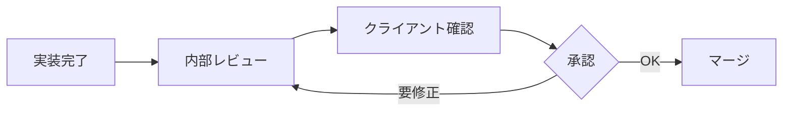

# クライアント様向け GitHub 利用ガイド

**エス・エー・エス株式会社**  
*プロジェクト進捗確認とコミュニケーションのために*

## 📌 はじめに

本ガイドは、エス・エー・エス株式会社が開発を担当させていただくプロジェクトにおいて、
クライアント様がGitHubを通じて進捗確認やフィードバックを行うための手引きです。

GitHubを活用することで、以下のメリットがあります：

✅ **リアルタイムな進捗確認**  
✅ **透明性の高い開発プロセス**  
✅ **効率的なフィードバック**  
✅ **全ての変更履歴の記録**  
✅ **品質管理プロセスの可視化**

---

## 🔰 GitHub とは

GitHubは、ソフトウェア開発プロジェクトの管理プラットフォームです。

### 主な機能

| 機能 | 説明 | クライアント様の用途 |
|------|------|-------------------|
| **Repository（リポジトリ）** | プロジェクトの保管庫 | ソースコードの閲覧 |
| **Issues（イシュー）** | タスク・課題管理 | 要望・不具合の報告 |
| **Pull Request（PR）** | 変更の提案・レビュー | 実装内容の確認 |
| **Projects** | プロジェクト管理ボード | 全体進捗の把握 |
| **Releases** | リリース管理 | 納品物の確認 |

---

## 🚀 アクセス方法

### 1. GitHubアカウントの作成

1. https://github.com にアクセス
2. 「Sign up」をクリック
3. 必要情報を入力
   - Username（ユーザー名）
   - Email（メールアドレス）
   - Password（パスワード）

📖 **詳細な手順が必要な場合**: [GitHub環境構築ガイド](./GITHUB_ENVIRONMENT_SETUP.md)を参照

### 2. プロジェクトへの招待

弊社から招待メールをお送りします：

```
件名: [GitHub] エス・エー・エス株式会社からプロジェクトへの招待

本文:
プロジェクトリポジトリへのアクセス権限を付与させていただきました。
以下のリンクから承認をお願いします。

[承認リンク]
```

### 3. セキュリティ設定（推奨）

**2要素認証の有効化**を強く推奨します：

1. Settings → Password and authentication
2. Two-factor authentication → Enable
3. スマートフォンアプリ（Google Authenticator等）で設定

---

## 📊 進捗確認方法

### プロジェクトダッシュボード

プロジェクト全体の進捗を俯瞰できます。

```
プロジェクトページ → Projects タブ
```

#### カンバンボードの見方

| 列 | 意味 | 説明 |
|----|------|------|
| **Backlog** | 未着手 | 今後実施予定のタスク |
| **To Do** | 着手予定 | 直近で着手するタスク |
| **In Progress** | 作業中 | 現在進行中のタスク |
| **Review** | レビュー中 | 実装完了、確認中 |
| **Done** | 完了 | 作業完了したタスク |

### マイルストーン

リリース予定を確認できます。

```
Issues → Milestones
```

各マイルストーンには以下が表示されます：
- 期限
- 進捗率
- 残タスク数
- 完了タスク数

### 進捗レポートの見方

週次で更新される進捗レポート：

```markdown
## 週次進捗レポート（2025/09/05週）

### 完了タスク
- ✅ ログイン機能実装 (#15)
- ✅ ユーザー管理画面 (#16)

### 進行中タスク
- 🔄 商品検索機能 (#20) - 進捗70%
- 🔄 決済機能連携 (#21) - 進捗30%

### 来週の予定
- 商品検索機能の完成
- 決済機能のテスト

### 課題・相談事項
- 決済APIの仕様確認が必要です
```

---

## 💬 フィードバック方法

### Issue（イシュー）でのやり取り

#### 新規要望・不具合報告

1. **Issues** タブをクリック
2. **New issue** ボタンをクリック
3. テンプレートを選択
   - 🐛 バグ報告
   - ✨ 機能要望
   - 💬 質問

#### Issue作成例

```markdown
## 概要
ログイン画面でエラーメッセージが表示されません

## 再現手順
1. ログイン画面を開く
2. 誤ったパスワードを入力
3. ログインボタンをクリック

## 期待する動作
「パスワードが正しくありません」というエラーメッセージが表示される

## 実際の動作
何も表示されずにログイン画面に戻る

## スクリーンショット
[画像を添付]
```

### コメントの書き方

建設的なフィードバックをお願いします：

#### 良い例
```markdown
✅ 「ボタンの色を青色から緑色に変更していただけますか？」
✅ 「この機能は素晴らしいです！追加で〇〇もできるとより便利です」
✅ 「表示速度が遅いように感じます。改善可能でしょうか？」
```

#### 避けていただきたい例
```markdown
❌ 「使いづらい」（具体性がない）
❌ 「全然違う」（何が違うか不明）
❌ 「早くして」（建設的でない）
```

---

## 📝 コードレビューへの参加

### Pull Request（PR）の確認

実装内容を確認し、フィードバックいただけます。

#### PRの見方

1. **Pull requests** タブをクリック
2. 確認したいPRをクリック
3. **Files changed** で変更内容を確認

#### レビューコメントの付け方

気になる箇所にコメントを追加：

1. 該当行の「+」アイコンをクリック
2. コメントを入力
3. 「Add single comment」をクリック

### 承認プロセス

重要な機能については承認をお願いする場合があります：



---

## 📦 納品物の確認

### Releases（リリース）

納品物は Releases として管理されます。

```
リポジトリページ → Releases
```

#### リリース内容

各リリースには以下が含まれます：

- **リリースノート**（変更内容の詳細）
- **ソースコード**（ZIPファイル）
- **ビルド済みファイル**（必要に応じて）
- **ドキュメント**

#### ダウンロード方法

1. Releases ページを開く
2. 該当バージョンを選択
3. Assets から必要なファイルをダウンロード

---

## 🔐 セキュリティとプライバシー

### アクセス権限

クライアント様には以下の権限を付与します：

| 権限 | 可能な操作 | 推奨 |
|------|-----------|------|
| **Read（読み取り）** | コード閲覧、Issue作成、コメント | ✅ 標準 |
| **Triage（トリアージ）** | ＋Issue管理、ラベル付け | ⚠️ 必要に応じて |
| **Write（書き込み）** | ＋コード編集、プッシュ | ❌ 原則付与しない |
| **Admin（管理者）** | 全権限 | ❌ 付与しない |

**標準的な設定**: Read権限のみを付与し、進捗確認とフィードバックをいただく形式

### 情報管理

- リポジトリは **Private（非公開）** 設定
- アクセスは関係者のみに限定
- 機密情報は環境変数で管理
- 定期的なアクセスログ監査

---

## 📱 便利な通知設定

### メール通知のカスタマイズ

重要な更新のみ通知を受け取る設定：

1. リポジトリページ → **Watch** ボタン
2. **Custom** を選択
3. 必要な通知を選択：
   - ✅ Issues（新規課題）
   - ✅ Pull requests（実装完了）
   - ✅ Releases（リリース）
   - ✅ Discussions（議論）

### 通知の確認

GitHubサイト内で通知を確認：
- 右上のベルアイコンをクリック
- 未読通知が一覧表示

---

## 📊 レポート機能

### Insights（インサイト）

開発活動の統計情報を確認できます。

```
リポジトリページ → Insights
```

#### 確認できる情報

- **Pulse**: 週次/月次の活動サマリー
- **Contributors**: 開発者別の貢献度
- **Commits**: コミット履歴のグラフ
- **Code frequency**: コード追加/削除の推移
- **Network**: ブランチの関係図

---

## 🆘 お困りの際は

### よくあるご質問

#### Q: パスワードを忘れました
A: GitHubのログイン画面で「Forgot password?」から再設定できます

#### Q: 通知が多すぎます
A: Watch設定を「Custom」にして必要な通知のみ選択してください

#### Q: コードの特定の箇所について質問したい
A: 該当ファイルを開き、行番号をクリックしてコメントを追加できます

#### Q: 過去のバージョンを確認したい
A: Releases または Tags から過去のバージョンを確認できます

### サポート窓口

| お問い合わせ内容 | 連絡先 | 対応時間 |
|----------------|--------|----------|
| **GitHub操作方法** | SAS Github管理チーム (github@sas-com.com) | 平日 9:00-18:00 |
| **仕様に関する質問** | SAS Github管理チーム (github@sas-com.com) | 1営業日以内 |
| **緊急の不具合** | SAS Github管理チーム (github@sas-com.com) | 24時間 |

---

## 📚 参考資料

### 基本操作ガイド

- [GitHub公式ガイド（日本語）](https://docs.github.com/ja)
- [はじめてのGitHub](https://github.co.jp/features)
- [GitHub用語集](https://docs.github.com/ja/get-started/quickstart/github-glossary)

### 動画チュートリアル

GitHubの基本操作を動画で学べます：
- [GitHub入門](https://www.youtube.com/github)
- [5分で分かるGitHub](https://skills.github.com/)

---

## 💡 効果的な活用のコツ

### 1. 定期的な確認
- 週2-3回程度、進捗を確認
- 重要なマイルストーン前は毎日確認

### 2. 早めのフィードバック
- 問題を見つけたら早めに報告
- 小さな修正要望も遠慮なく

### 3. 具体的なコミュニケーション
- スクリーンショットを活用
- 再現手順を明確に記載
- 期待する動作を具体的に説明

### 4. ポジティブなフィードバックも
- 良い実装には「👍」リアクション
- チームのモチベーション向上に

---

## 🤝 一緒により良いプロダクトを

GitHubを通じた透明性の高いコミュニケーションにより、
より良いプロダクトを共に作り上げていきましょう。

ご不明な点がございましたら、SAS Github管理チーム (github@sas-com.com) までお気軽にお問い合わせください。

---

**© 2025 エス・エー・エス株式会社**  
*Your Success is Our Success*