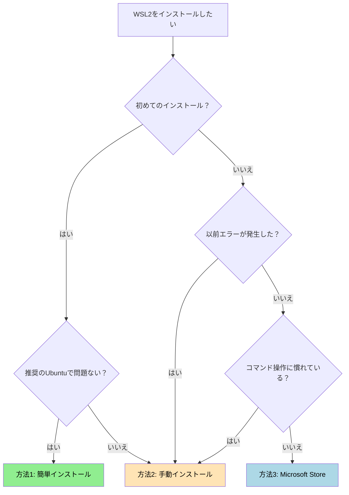
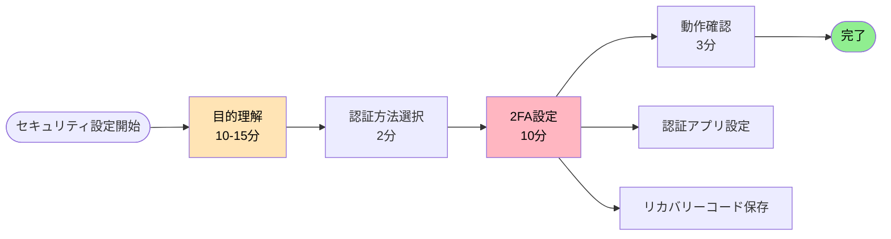
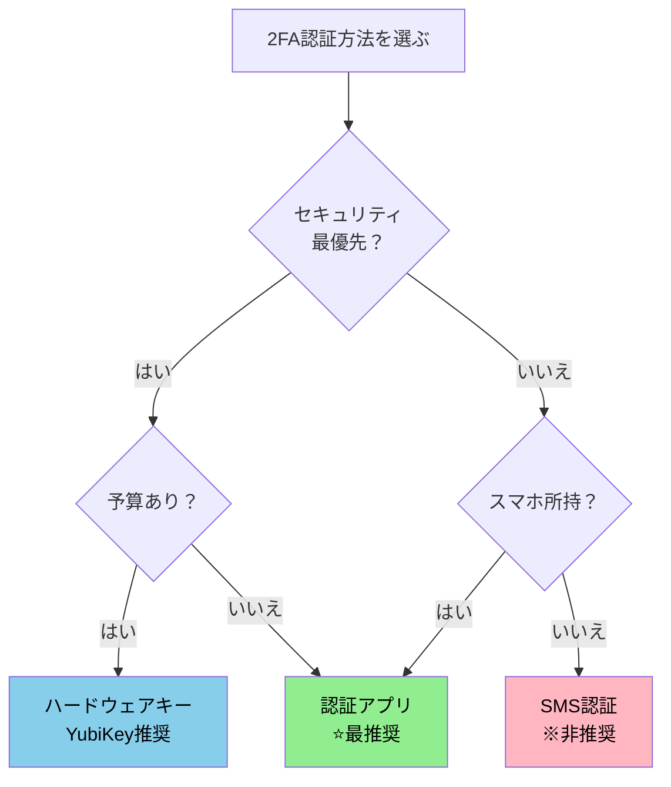

# GitHub 環境構築ガイド

**エス・エー・エス株式会社**
*開発環境のセットアップから GitHubアカウント設定まで完全ガイド*
*最終更新: 2025年10月10日*

---

## 📚 目次

1. **[🎯 はじめに](#-はじめに)**
   - 本ガイドの目的
   - 対象者
   - 所要時間と難易度

2. **[📋 全体構成と作業フロー](#-全体構成と作業フロー)**
   - 環境構築の全体像
   - 作業順序と依存関係
   - チェックリスト

3. **[🖥️ 第1章: WSL2環境の構築](#️-第1章-wsl2環境の構築)**
   - 事前確認事項
   - Windows機能の有効化
   - WSL2のインストール
   - Ubuntu初期設定
   - Windows Terminal活用（推奨）
   - トラブルシューティング

4. **[🌐 第2章: GitHubアカウントの設定](#-第2章-githubアカウントの設定)**
   - アカウント作成
   - プロフィール設定
   - セキュリティ設定（2FA必須）
   - 組織への参加
   - 通知設定

5. **[🔧 第3章: Git環境の構築](#-第3章-git環境の構築)**
   - Gitのインストール
   - Git初期設定
   - エイリアス設定

6. **[🔑 第4章: SSH接続の設定](#-第4章-ssh接続の設定)**
   - SSH鍵の生成
   - GitHubへの登録
   - 接続テスト

7. **[💻 第5章: 開発エディタの基本セットアップ](#-第5章-開発エディタの基本セットアップ)**
   - VS Codeのインストール（推奨）
   - Eclipseのインストール（Java開発者向け）
   - IDE統合設定（次のステップ）

8. **[✅ 第6章: 最終確認](#-最終確認)**
   - 環境構築完了チェックリスト

9. **[❓ 付録: トラブルシューティング](#-付録-トラブルシューティング)**
10. **[📞 サポート情報](#-サポート情報)**

---

## 🎯 はじめに

### 📌 本ガイドの目的

このガイドは、エス・エー・エス株式会社で GitHub を使った開発を始めるために必要な環境構築を、**ゼロから完全にサポート**します。

### 👥 対象者

- 新規参画者（エンジニア）
- GitHub環境を再構築する必要がある方
- Windows11環境で開発を行う方

### ⏱️ 所要時間と難易度

| カテゴリ | 所要時間 | 難易度 |
|---------|----------|--------|
| **全体所要時間** | **1-1.5時間** | **★★☆** |
| 第1章: WSL2のインストール | 15-30分 | ★★☆ |
| 第2章: GitHubアカウント設定 | 20-30分 | ★☆☆ |
| 第3章: Gitのセットアップ | 10-15分 | ★☆☆ |
| 第4章: SSH接続設定 | 10-15分 | ★★☆ |
| 第5章: 開発エディタ基本セットアップ | 5-10分 | ★☆☆ |
| 第6章: 最終確認 | 5-10分 | ★☆☆ |

---

## 📋 全体構成と作業フロー

### 🗺️ 環境構築の全体像


### 📝 作業の依存関係

| 順序 | 作業項目 | 前提条件 | 必須/任意 |
|------|----------|----------|-----------|
| 1 | 第1章: WSL2インストール | Windows11環境 | 必須 |
| 2 | 第2章: GitHubアカウント作成 | WSL2完了 | 必須 |
| 3 | 第2章: 2FA設定 | GitHubアカウント | **必須** |
| 4 | 第2章: 組織参加 | 2FA設定完了 | **必須** |
| 5 | 第2章: 通知設定 | 組織参加完了 | 必須 |
| 6 | 第3章: Gitインストール | 第2章完了 | 必須 |
| 7 | 第4章: SSH鍵設定 | Git設定完了 | 必須 |
| 8 | 第5章: 開発エディタ基本セットアップ | SSH設定完了 | 必須 |
| 9 | 第6章: 最終確認 | 全設定完了 | 必須 |

### ✅ マスターチェックリスト

#### 📦 環境準備フェーズ
- [ ] OS要件を満たしている（Windows11）
- [ ] 管理者権限がある
- [ ] インターネット接続が安定している

#### 🔧 セットアップフェーズ
- [ ] 第1章: WSL2インストール完了
- [ ] 第2章: GitHubアカウント作成完了
- [ ] 第2章: プロフィール設定完了
- [ ] 第2章: **2FA設定完了（必須）**
- [ ] 第2章: リカバリーコード保管完了
- [ ] 第2章: **組織参加完了（必須）**
- [ ] 第2章: 通知設定完了

#### 🌐 Git環境フェーズ
- [ ] 第3章: Gitインストール完了
- [ ] 第3章: Git初期設定完了（user.name, user.email）

#### 🔑 接続フェーズ
- [ ] 第4章: SSH鍵生成完了
- [ ] 第4章: GitHub登録完了
- [ ] 第4章: 接続テスト成功

#### 💻 エディタフェーズ
- [ ] 第5章: 開発エディタ（VS CodeまたはEclipse）インストール完了
- [ ] 第5章: WSL2連携設定完了

#### ✅ 最終フェーズ
- [ ] 第6章: 環境構築完了チェックリスト確認
- [ ] 第6章: 全ての設定動作確認完了

---

## 🖥️ 第1章: WSL2環境の構築

### 📊 章の概要

| 項目 | 内容 |
|------|------|
| **目的** | Windows11上でLinux（Ubuntu）開発環境を構築し、Git/GitHub開発に最適な環境を整備。WSL2により、Windowsアプリケーションを使いながらLinuxコマンドラインの利点を享受する。|
| **所要時間** | 15-30分（再起動含む） |
| **難易度** | ★★☆ |
| **必要権限** | 管理者権限 |

---

### 1.1 事前確認（必須）

#### 🔍 システム要件チェック

**手順1: Windowsバージョン確認**

PowerShellを**管理者として実行**し、以下のコマンドを実行：

```powershell
# Windowsバージョンを確認
winver
```

**必要要件：**
- ✅ Windows11（推奨OS）
- ✅ x64システム（64ビット版）

#### 🔍 仮想化機能チェック

**手順2: 仮想化の有効確認**

1. `Ctrl + Shift + Esc` でタスクマネージャーを開く
2. 「パフォーマンス」タブ → 「CPU」を選択
3. 右下に「**仮想化: 有効**」と表示されていることを確認

**仮想化が無効の場合：**
1. PCを再起動し、BIOS/UEFI設定画面へ（F2, F10, Delキーなど）
2. 以下を有効化：
   - Intel CPU: **Intel VT-x** → Enabled
   - AMD CPU: **AMD-V / SVM Mode** → Enabled
3. 設定を保存して再起動

#### 🔍 Windows機能の状態確認

**手順3: 必要機能の確認**

```powershell
# PowerShell（管理者）で実行
Get-WindowsOptionalFeature -Online | Where-Object {
    $_.FeatureName -like "*Linux*" -or
    $_.FeatureName -like "*VirtualMachinePlatform*"
} | Format-Table FeatureName, State -AutoSize
```

**期待される結果：**

| 機能名 | 必要な状態 | 説明 |
|--------|------------|------|
| Microsoft-Windows-Subsystem-Linux | Enabled | Linux基盤機能 |
| VirtualMachinePlatform | Enabled | 仮想化プラットフォーム |

**もし上記の機能が「Disabled」の場合：**

以下のコマンドを実行して有効化してください：

```powershell
# PowerShell（管理者）で実行
# Microsoft-Windows-Subsystem-Linux を有効化
Enable-WindowsOptionalFeature -Online -FeatureName Microsoft-Windows-Subsystem-Linux -All -NoRestart

# VirtualMachinePlatform を有効化
Enable-WindowsOptionalFeature -Online -FeatureName VirtualMachinePlatform -All -NoRestart

# 両方の機能を有効化したら、必ずPCを再起動
Restart-Computer
```

> ⚠️ **重要**: これらの機能が無効の場合、この手順で有効化してから次のセクション「1.2 Windows機能の有効化」に進んでください。すでに両方が Enabled の場合は 1.2 へ進んで問題ありません。

---

### 1.2 Windows機能の有効化

> ⚠️ **重要な注意事項**  
> Windows機能を有効化する方法は**3つ**あります。どれか**1つ**を選んで実行してください。

#### 📊 有効化方法の比較

| 方法 | 推奨度 | 特徴 | 適している人 |
|------|--------|------|--------------|
| **方法A: PowerShell** | ⭐⭐⭐ | コマンド2つで完了 | コマンド操作に慣れている人 |
| **方法B: DISM** | ⭐⭐ | 詳細な制御が可能 | トラブル時の代替手段 |
| **方法C: GUI** | ⭐ | 視覚的で分かりやすい | コマンドが苦手な人 |

---

#### 📝 方法A: PowerShellで有効化（推奨）

PowerShellを**管理者として実行**：

```powershell
# ステップ1: Linux用サブシステムを有効化
Enable-WindowsOptionalFeature -Online -FeatureName Microsoft-Windows-Subsystem-Linux -All -NoRestart

# ステップ2: 仮想マシンプラットフォームを有効化
Enable-WindowsOptionalFeature -Online -FeatureName VirtualMachinePlatform -All -NoRestart

# ステップ3: 有効化を確認
Get-WindowsOptionalFeature -Online -FeatureName Microsoft-Windows-Subsystem-Linux
Get-WindowsOptionalFeature -Online -FeatureName VirtualMachinePlatform

# 両方が "State : Enabled" になっていることを確認
```

##### ✅ 両方が "State : Enabled" になっていることの確認方法

以下のいずれかの方法で、2つの機能が正しく Enabled になっているかを確認してください。

1. 個別表示で確認する（上記コマンドそのまま）
   - 直後に表示される出力内に `State : Enabled` が含まれているか確認します。

   例（抜粋）：
   ```text
   FeatureName : Microsoft-Windows-Subsystem-Linux
   State       : Enabled
   ...
   FeatureName : VirtualMachinePlatform
   State       : Enabled
   ```

2. 一括で一覧確認する（簡潔表示）
   ```powershell
   Get-WindowsOptionalFeature -Online -FeatureName Microsoft-Windows-Subsystem-Linux,VirtualMachinePlatform | Select FeatureName,State
   ```
   期待出力例：
   ```text
   FeatureName                          State
   ------------                          -----
   Microsoft-Windows-Subsystem-Linux    Enabled
   VirtualMachinePlatform               Enabled
   ```

3. スクリプトで明示的に判定（判定結果のみ表示）
   ```powershell
   $features = "Microsoft-Windows-Subsystem-Linux","VirtualMachinePlatform"
   $allEnabled = $true
   foreach ($f in $features) {
     $state = (Get-WindowsOptionalFeature -Online -FeatureName $f).State
     if ($state -ne "Enabled") { $allEnabled = $false; Write-Host "[NG] $f : $state" -ForegroundColor Red } else { Write-Host "[OK] $f : Enabled" -ForegroundColor Green }
   }
   if ($allEnabled) { Write-Host "=== 全て Enabled です。次のステップへ進んでください ===" -ForegroundColor Green } else { Write-Host "=== 未有効の機能があります。再度有効化手順を確認してください ===" -ForegroundColor Yellow }
   ```

4. CSVとして記録（証跡保存用・新人教育レビュー向け）
   ```powershell
   Get-WindowsOptionalFeature -Online -FeatureName Microsoft-Windows-Subsystem-Linux,VirtualMachinePlatform | Select FeatureName,State | Export-Csv -Path .\wsl_feature_state.csv -NoTypeInformation -Encoding UTF8
   ```
   - 生成された `wsl_feature_state.csv` をレビュー時に提出すると、セットアップ確認が容易になります。

5. トラブル時の再確認（想定ケース）
   - 再起動後に Status が Disabled に戻っている → セキュアブートや企業ポリシーによる制限の可能性。情報システム部門に相談。
   - VirtualMachinePlatform のみ Disabled → BIOS で仮想化無効、もしくは Hyper-V 関連設定不整合。`bcdedit /set hypervisorlaunchtype auto` 実行後再起動を試行。

> ℹ️ 出力が `Enabled` 以外の場合（例: `Disabled`, `EnablePending`）は再度 Enable コマンドを実行し、再起動後に再確認してください。

```powershell
# ステップ4: PCを再起動（必須）
Restart-Computer
```

---

#### 📝 方法B: DISMコマンドで有効化

PowerShellを**管理者として実行**：

```powershell
# ステップ1: Linux用サブシステムを有効化
dism.exe /online /enable-feature /featurename:Microsoft-Windows-Subsystem-Linux /all /norestart

# ステップ2: 仮想マシンプラットフォームを有効化
dism.exe /online /enable-feature /featurename:VirtualMachinePlatform /all /norestart

# "The operation completed successfully." と表示されれば成功

# ステップ3: PCを再起動（必須）
Restart-Computer
```

---

#### 📝 方法C: GUIで有効化

1. **Windows機能の画面を開く**
   - `Win + R` → `optionalfeatures` と入力 → Enter

2. **以下の機能にチェックを入れる**
   - ☑ **Linux 用 Windows サブシステム**（必須）
   - ☑ **仮想マシン プラットフォーム**（必須）

3. **OKをクリック** → 変更を適用

4. **PCを再起動**（必須）

---

### 1.3 WSL2のインストール

> 🎯 **インストール方法の選択**
> WSL2のインストールには**3つの方法**があります。状況に応じて選択してください。

#### 📊 インストール方法の比較

| 方法 | 推奨度 | 特徴 | 適している人 |
|------|--------|------|--------------|
| **方法1: 簡単インストール** | ⭐⭐⭐ | コマンド1つで完了、Ubuntu-24.04が自動インストール | 初めての方、推奨ディストリビューションで問題ない方 |
| **方法2: 手動インストール** | ⭐⭐ | ディストリビューション選択可能、詳細な制御 | 特定のLinuxディストリが必要な方、過去にエラーが発生した方 |
| **方法3: Microsoft Store** | ⭐ | GUI操作で分かりやすい | コマンド操作が苦手な方 |

#### 🔄 インストール方法の選択フローチャート



---

#### 📝 方法1: 簡単インストール（推奨）

**最もシンプルな方法**です。コマンド1つでWSL2とUbuntu-24.04 LTSが自動的にインストールされます。

PowerShellを**管理者として実行**：

```powershell
# ステップ1: WSL2と既定のUbuntuを一括インストール
wsl --install

# ステップ2: PCを再起動（必須）
Restart-Computer
```

> ✅ **成功時の出力例：**
> ```
> Installing: Virtual Machine Platform
> Virtual Machine Platform has been installed.
> Installing: Windows Subsystem for Linux
> Windows Subsystem for Linux has been installed.
> Installing: Ubuntu
> Ubuntu has been installed.
> The requested operation is successful. Changes will not be effective until the system is rebooted.
> ```

> ℹ️ **補足**: `wsl --install` は Ubuntu-24.04 LTS（2025年12月時点の既定）をインストールします。別のディストリビューションが必要な場合は方法2を使用してください。

---

#### 📝 方法2: 手動インストール

**ディストリビューションを選択**したい場合や、**より詳細な制御**が必要な場合に使用します。

PowerShellを**管理者として実行**：

```powershell
# ステップ1: WSLカーネルを最新版に更新
wsl --update

# ステップ2: WSL2を既定のバージョンに設定
wsl --set-default-version 2

# ステップ3: 利用可能なディストリビューション一覧を表示
wsl --list --online
```

**利用可能なディストリビューション一覧（2025年12月時点）：**

| ディストリビューション | パッケージマネージャー | 推奨度 | 備考 |
|------------------------|------------------------|--------|------|
| **Ubuntu-24.04** | apt | ⭐⭐⭐ | **SAS標準開発環境**、豊富なドキュメント |
| Ubuntu-22.04 | apt | ⭐⭐ | 安定版、長期サポート |
| Debian | apt | ⭐⭐ | 軽量、安定重視 |
| openSUSE-Tumbleweed | zypper | ⭐ | 最新パッケージ |
| SUSE-Linux-Enterprise-15-SP6 | zypper | ⭐ | エンタープライズ向け |
| Oracle Linux 9.1 | dnf | ⭐ | Oracle環境向け |
| Oracle Linux 8.7 | dnf | ⭐ | Oracle環境向け |

```powershell
# ステップ4: Ubuntu-24.04をインストール（推奨）
wsl --install -d Ubuntu-24.04

# ステップ5: PCを再起動（必須）
Restart-Computer
```

> 💡 **ヒント**: サーバー環境がAmazon Linuxの場合でも、**開発環境はUbuntuを推奨**します。理由：
> - チーム内でのサポート体制が充実
> - ドキュメントが豊富
> - 本番環境との差異はDockerで吸収可能

---

#### 📝 方法3: Microsoft Store経由

**GUI操作**でインストールしたい場合に使用します。

1. **Microsoft Storeを開く**
   - タスクバーの検索で「Microsoft Store」と入力
   - または `Win + S` → 「store」と入力

2. **Ubuntuを検索**
   - 検索バーに「Ubuntu」と入力
   - 「**Ubuntu 24.04 LTS**」を選択

3. **インストール**
   - 「入手」または「インストール」ボタンをクリック
   - インストール完了を待つ

4. **起動**
   - 「開く」ボタンをクリック
   - または、スタートメニューから「Ubuntu 24.04 LTS」を起動

5. **PCを再起動**（推奨）

---

#### ✅ インストール確認

インストール完了後、以下のコマンドで確認：

```powershell
# インストール済みディストリビューションの確認
wsl --list --verbose
```

**期待される出力：**

```
  NAME            STATE           VERSION
* Ubuntu-24.04    Running         2
```

> ⚠️ **VERSION が「1」の場合**：WSL1でインストールされています。以下で変換：
> ```powershell
> wsl --set-version Ubuntu-24.04 2
> ```

---

### 1.4 Ubuntu初期設定

#### 🔧 初回起動時の設定

Ubuntuを初めて起動すると、ユーザーアカウントの作成を求められます。

```bash
# ステップ1: ユーザー名を入力
# ※ 英数字小文字のみ使用可能（記号・大文字不可）
Enter new UNIX username: yourname

# ステップ2: パスワードを設定
# ※ 入力中は画面に表示されません（セキュリティのため）
New password:
Retype new password:
```

> ⚠️ **パスワードについての重要事項：**
> - このパスワードは**Linux管理者権限（sudo）**のパスワードです
> - `sudo` コマンド実行時に毎回必要になります
> - **入力中は画面に何も表示されません**（セキュリティ仕様）
> - 忘れないようにメモを取ってください
> - **8文字以上の複雑なパスワード**を推奨

#### 📦 基本パッケージの更新とインストール

```bash
# ステップ3: パッケージリストを更新
sudo apt update

# ステップ4: インストール済みパッケージを最新版に更新
sudo apt upgrade -y

# ステップ5: 開発に必要な基本ツールをインストール
sudo apt install -y git curl wget build-essential
```

> ✅ **成功時のポイント：**
> - `apt update`: 「Reading package lists... Done」で完了
> - `apt upgrade`: 「0 upgraded, 0 newly installed...」または更新完了メッセージ
> - `apt install`: 「Processing triggers...」で完了

#### ✅ 初期設定確認

```bash
# Gitがインストールされたか確認
git --version

# 期待される出力例
# git version 2.43.0
```

---

### 1.5 Windows Terminal の活用（推奨）

Windows Terminalは、複数のシェル（PowerShell、Ubuntu、CMD）を**タブで管理**できる便利なターミナルアプリです。

#### 📊 Windows Terminalの特徴

| 機能 | 説明 |
|------|------|
| **タブ機能** | 複数のセッションを1つのウィンドウで管理 |
| **画面分割** | 横・縦に画面を分割して同時作業 |
| **Unicode対応** | 日本語や絵文字を正しく表示 |
| **カスタマイズ** | テーマ、フォント、背景などを変更可能 |
| **WSL統合** | Ubuntu等のLinuxシェルにワンクリックでアクセス |

#### 📝 インストール方法

**Microsoft Store経由（推奨）：**

1. Microsoft Storeを開く
2. 「**Windows Terminal**」で検索
3. 「入手」をクリック

**または、PowerShell（管理者）で：**

```powershell
winget install --id Microsoft.WindowsTerminal -e
```

#### 🔧 基本的な使い方

| 操作 | ショートカット |
|------|----------------|
| 新しいタブ | `Ctrl + Shift + T` |
| タブを閉じる | `Ctrl + Shift + W` |
| Ubuntu タブを開く | `Ctrl + Shift + 3`（既定の場合） |
| 画面を横に分割 | `Alt + Shift + +` |
| 画面を縦に分割 | `Alt + Shift + -` |
| 設定を開く | `Ctrl + ,` |

---

### 1.6 トラブルシューティング

#### 🔧 よくあるエラーと解決方法

| エラーコード | エラー内容 | 原因 | 解決方法 |
|-------------|-----------|------|----------|
| **0x80370114** | WSL2を実行するには、カーネルコンポーネントの更新が必要です | WSLカーネル未インストール/古い | `wsl --update` を実行 |
| **0x800701bc** | WSL 2 requires an update to its kernel component | WSL2カーネル未インストール | [WSL2 Linuxカーネル更新パッケージ](https://aka.ms/wsl2kernel)をインストール |
| **0x80370102** | 仮想マシンを起動できませんでした | Hyper-V未有効 | 下記コマンドを実行後、再起動 |
| **0x80040326** | WSL機能が正しく有効化されていません | Windows機能未有効 | 1.2の手順を再実行 |
| **0x80004005** | 予期しないエラー | 複数の原因が考えられる | PCを再起動し、再試行 |

#### 📝 エラー0x80370102の解決方法

```powershell
# PowerShell（管理者）で実行
bcdedit /set hypervisorlaunchtype auto

# PCを再起動
Restart-Computer
```

#### 📝 WSLの完全リセット（最終手段）

すべての方法を試しても解決しない場合：

```powershell
# ステップ1: WSLをアンインストール
wsl --unregister Ubuntu-24.04

# ステップ2: WSLを再インストール
wsl --install -d Ubuntu-24.04

# ステップ3: PCを再起動
Restart-Computer
```

> ⚠️ **警告**: `--unregister` を実行すると、**そのディストリビューション内のすべてのデータが削除**されます。重要なデータがある場合は事前にバックアップしてください。

---

### ✅ 第1章完了チェックリスト

以下の項目をすべて確認してから、第2章へ進んでください：

- [ ] WSL2がインストールされている（`wsl --list --verbose` で VERSION が 2）
- [ ] Ubuntuが起動できる
- [ ] Ubuntuでユーザーアカウントを作成した
- [ ] `sudo apt update && sudo apt upgrade` が正常に完了した
- [ ] `git --version` でGitバージョンが表示される

```bash
# 一括確認コマンド（Ubuntu内で実行）
echo "=== WSL2 環境確認 ===" && \
echo "User: $(whoami)" && \
echo "Git: $(git --version)" && \
echo "Ubuntu: $(lsb_release -d | cut -f2)" && \
echo "=== 確認完了 ==="
```

**期待される出力例：**

```
=== WSL2 環境確認 ===
User: yourname
Git: git version 2.43.0
Ubuntu: Ubuntu 24.04.1 LTS
=== 確認完了 ===
```

---

## 🌐 第2章: GitHubアカウントの設定

### 📊 章の概要

| 項目 | 内容 |
|------|------|
| **目的** | GitHubアカウントを作成し、企業の重要資産であるソースコードを保護するための多層防御セキュリティを構築。2要素認証（2FA）により不正アクセスを99.9%防止し、プロフィール設定でチーム内の識別性を向上。SAS組織への参加要件を満たす安全なアカウント環境を整備します。 |
| **所要時間** | 20-30分 |
| **難易度** | ★☆☆ |
| **前提条件** | WSL2完了 |
| **重要事項** | 2FA設定は**必須** |

---

### 2.1 アカウント作成

#### 新規作成の手順

1. **GitHubにアクセス**
   ```
   https://github.com
   ```

2. **Sign up をクリック**

3. **必要情報を入力**

   | 項目 | 入力内容 | 推奨例 |
   |------|----------|--------|
   | **Username** | 英数字とハイフン<br/>**形式: [名]-[姓]** | taro-yamada<br/>hanako-sato<br/>kenji-tanaka |
   | **Email** | 会社メールアドレス | yamada@sas-com.com |
   | **Password** | 15文字以上 | 大小英数字記号を含む |

   > 📝 **Username設定ガイドライン**
   >
   > **推奨形式:** `[名英字]-[姓英字]`（例：taro-yamada）
   >
   > **なぜこの形式を推奨するのか：**
   > - **一貫性の確保**: 組織内で統一されたネーミングルールによる管理の容易さ
   > - **国際的な可読性**: グローバルチームやオープンソースプロジェクトでの認識しやすさ
   > - **Git設定との整合性**: user.name の英語名設定（Taro Yamada）と一致
   > - **プロフェッショナルな印象**: ビジネス環境での信頼性向上
   >
   > **具体例：**
   > - ✅ **良い例**:
   >   - `taro-yamada` （山田太郎）
   >   - `hanako-sato` （佐藤花子）
   >   - `kenji-tanaka` （田中健二）
   >   - `yuki-suzuki` （鈴木由紀）
   > - ⚠️ **避けるべき例**:
   >   - `yamadataro` （ハイフンなし、読みにくい）
   >   - `t-yamada` （イニシャルのみ、識別困難）
   >   - `taro123` （姓なし、プロフェッショナルでない）
   >   - `cooldev2025` （ニックネーム形式）

4. **メール認証**
   - 6桁のコードを入力

#### 既存アカウントの利用

<details>
<summary>個人アカウントを業務利用する場合</summary>

**設定手順：**
1. Settings → Emails → Add email address
2. 会社メールアドレスを追加
3. 必要に応じてPrimaryに設定

**メリット：**
- コントリビューション履歴を維持
- アカウント管理が簡単

</details>

---

### 2.2 プロフィール設定

**Settings → Profile で設定：**

| 項目 | 設定内容 | 例 |
|------|----------|-----|
| **Name** | 本名（日本語可） | 山田 太郎 |
| **Bio** | 簡単な自己紹介 | Software Engineer at SAS Inc. |
| **Company** | 会社名 | @sas-com |
| **Location** | 勤務地 | Tokyo, Japan |
| **Avatar** | プロフィール画像 | 400×400px以上推奨 |

---

### 2.3 セキュリティ設定（最重要）

#### 📌 セキュリティ設定の目的と全体像

##### 🎯 なぜセキュリティ設定が必要なのか

**目的：GitHubアカウントとソースコードを不正アクセスから守る**

GitHubには企業の重要な資産であるソースコード、機密情報、知的財産が保管されています。パスワードだけではアカウントが乗っ取られるリスクがあり、以下のような深刻な被害が発生する可能性があります：

| リスク | 被害内容 | 影響範囲 |
|--------|----------|----------|
| **不正アクセス** | アカウント乗っ取り、なりすまし | 個人・組織全体 |
| **情報漏洩** | ソースコード、機密データの流出 | 企業・顧客 |
| **マルウェア混入** | 悪意あるコードの注入 | 製品・サービス |
| **システム破壊** | リポジトリ削除、データ改ざん | 事業継続 |
| **金銭的損失** | 賠償責任、信用失墜、株価下落 | 企業経営 |

**2要素認証（2FA）導入によるセキュリティ効果：**
- ✅ **アカウント乗っ取り防止率99.9%**（Google調査）
- ✅ **フィッシング攻撃からの保護**
- ✅ **パスワード漏洩時の被害防止**
- ✅ **コンプライアンス要件の充足**

---

##### 🗺️ セキュリティ設定の全体構成



**設定項目と所要時間：**

| 設定項目 | 所要時間 | 難易度 | 必須/任意 |
|---------|----------|--------|-----------|
| **1. 認証方法の理解と選択** | 2分 | ★☆☆ | 必須 |
| **2. 2FA設定（認証アプリ）** | 10分 | ★★☆ | 必須 |
| **3. リカバリーコード保存** | 2分 | ★☆☆ | 必須 |
| **4. 動作確認** | 3分 | ★☆☆ | 必須 |
| **5. バックアップ設定（SMS）** | 5分 | ★☆☆ | 推奨 |

**合計所要時間：約15-20分**

---

##### 🏢 SAS組織のセキュリティ要件

**組織参加の必須条件：**
- ✅ **2FA設定完了**（認証アプリまたはハードウェアキー）
- ✅ **リカバリーコード安全保管**（3箇所以上）
- ✅ **強力なパスワード設定**（15文字以上）

> ⚠️ **重要**
> 2FAを設定しないと sas-com 組織に参加できません。必ず設定を完了してください。

**設定完了後の状態：**
- ✅ GitHubログイン時に2段階認証が要求される
- ✅ パスワード漏洩時もアカウント保護される
- ✅ SAS組織へのアクセスが可能になる
- ✅ セキュアな開発環境が整う

---

#### 🔐 2要素認証（2FA）の設定 ※必須

##### 🔐 2FA認証パターンの比較

GitHubで利用可能な2FA認証方法を理解し、最適な方法を選択しましょう。

**主要認証パターン一覧：**

| 認証方法 | セキュリティレベル | 利便性 | 推奨度 | メリット | デメリット | 使用ケース |
|---------|------------------|--------|--------|---------|----------|------------|
| **GitHubモバイル<br/>アプリ** | ⭐⭐⭐⭐⭐ | ⭐⭐⭐⭐⭐ | ⭐⭐⭐<br/>**最推奨** | ・プッシュ通知で即座に承認<br/>・コード入力不要（ワンタップ）<br/>・GitHub公式アプリで安心<br/>・リポジトリ管理も可能 | ・GitHubのみで使用可能<br/>・スマホ紛失時のリスク<br/>・インターネット接続が必要 | **最も便利な認証**<br/>日常的なGitHub操作<br/>モバイル端末での作業<br/>頻繁なログインが必要 |
| **認証アプリ<br/>(TOTP)** | ⭐⭐⭐⭐⭐ | ⭐⭐⭐⭐ | ⭐⭐⭐<br/>**最推奨** | ・オフラインで動作<br/>・フィッシング耐性が高い<br/>・複数アカウント管理可能<br/>・無料 | ・初期設定が必要<br/>・スマホ紛失時のリスク<br/>・機種変更時の移行作業 | **標準的な業務利用**<br/>日常的なGitHub操作<br/>複数デバイス不要 |
| **ハードウェアキー<br/>(YubiKey等)** | ⭐⭐⭐⭐⭐ | ⭐⭐⭐⭐⭐ | ⭐⭐ | ・最高レベルのセキュリティ<br/>・フィッシング完全防止<br/>・物理的な認証<br/>・複数サービスで利用可能 | ・追加費用（5,000-10,000円）<br/>・紛失時のリスク<br/>・USB接続が必要 | **高セキュリティ環境**<br/>管理者アカウント<br/>機密プロジェクト<br/>FIDO2対応環境 |
| **SMS認証** | ⭐⭐ | ⭐⭐⭐ | ⭐<br/>**非推奨** | ・設定が簡単<br/>・特別なアプリ不要<br/>・スマホのみで完結 | ・SIMスワップ攻撃のリスク<br/>・通信圏外で使用不可<br/>・フィッシングリスク<br/>・キャリア依存 | **一時的な利用のみ**<br/>認証アプリが使えない場合<br/>バックアップ手段 |
| **リカバリーコード** | ⭐⭐⭐⭐ | ⭐⭐ | - | ・デバイス紛失時の救済<br/>・ネットワーク不要<br/>・確実なアクセス保証 | ・使い捨て（1回限り）<br/>・安全な保管が必要<br/>・紛失リスク | **緊急時専用**<br/>デバイス紛失時<br/>認証アプリ故障時 |
| **WebAuthn/<br/>Passkey** | ⭐⭐⭐⭐⭐ | ⭐⭐⭐⭐⭐ | ⭐⭐ | ・パスワードレス認証<br/>・生体認証連携<br/>・最新セキュリティ技術<br/>・フィッシング完全防止 | ・対応デバイス限定<br/>・比較的新しい技術<br/>・デバイス依存 | **最新環境**<br/>Windows Hello対応<br/>Touch ID/Face ID対応<br/>パスワードレス環境 |

---

##### 📊 認証方法選択フローチャート



---

##### 🎯 SAS推奨構成

**標準構成（全員必須）：**
1. **メイン認証**（以下のいずれか1つを選択）:
   - **GitHubモバイルアプリ**（最も便利、プッシュ通知で承認）
   - **認証アプリ（TOTP）**（Google Authenticator / Microsoft Authenticator / Authy）
2. **バックアップ**: リカバリーコード（安全な場所に保管）

**推奨追加構成（任意）：**
3. **セカンダリ**: SMS認証（バックアップ用）
4. **高セキュリティ**: ハードウェアキー（管理者・重要プロジェクト）

**設定優先順位：**
1. ✅ **必須**: メイン認証設定（GitHubモバイルアプリまたは認証アプリ）
2. ✅ **必須**: リカバリーコード保存
3. ⭐ **推奨**: SMS認証をバックアップ追加
4. ⭐ **任意**: ハードウェアキー追加（管理者向け）

> 💡 **ベストプラクティス**
> - 認証アプリは**2つ以上のデバイス**にバックアップ設定
> - リカバリーコードは**3箇所以上**に分散保管（パスワードマネージャー、紙、金庫等）
> - 定期的（3ヶ月ごと）に認証設定を見直し

---

##### 📋 2FA設定の概要と所要時間

| 項目 | 内容 |
|------|------|
| **全体所要時間** | 約10-15分 |
| **必要なもの** | スマートフォン（認証アプリ用） |
| **設定タイミング** | アカウント作成後すぐに |
| **優先度** | **最重要（必須）** |

---

##### 🗺️ 2FA設定への詳細ナビゲーション

###### **ステップ1: GitHubへサインイン（所要時間: 1分）**

1. **ブラウザでGitHubを開く**
   - URL: `https://github.com`
   - 推奨ブラウザ: Chrome, Firefox, Edge

2. **サインインボタンをクリック**
   - **場所**: 画面右上の「Sign in」ボタン（白背景に黒文字）
   - **日本語表示の場合**: 「サインイン」と表示

3. **ログイン情報を入力**
   - Username または Email を入力
   - Password を入力
   - 「Sign in」ボタンをクリック（緑色の大きなボタン）

---

###### **ステップ2: 設定画面への移動（所要時間: 30秒）**

1. **プロフィールメニューを開く**
   - **場所**: 画面右上のプロフィールアイコン（丸い画像）をクリック
   - **見た目**:
     - デフォルトは紫色系のアバター画像
     - カスタム設定済みの場合は自分の画像
   - **サイズ**: 約40×40ピクセルの円形

2. **Settingsを選択**
   - **場所**: ドロップダウンメニューの下から3番目あたり
   - **表示**: 「Settings」（歯車アイコン付き）
   - **日本語表示の場合**: 「設定」と表示
   - クリックすると設定画面に遷移

---

###### **ステップ3: セキュリティ設定画面へ（所要時間: 30秒）**

1. **左サイドバーを確認**
   - **場所**: 画面左側の縦長メニュー
   - **背景色**: 白またはダークモード時は暗い色
   - **項目数**: 約20項目程度

2. **Access セクションを探す**
   - **場所**: サイドバーの上から約1/3の位置
   - **見出し**: 「Access」という小見出しがある

3. **「Password and authentication」をクリック**
   - **場所**: Accessセクション内の最初の項目
   - **アイコン**: 鍵マークが付いている
   - **日本語表示**: 「パスワードと認証」
   - **文字色**: 通常は青色のリンク

---

###### **ステップ4: 2FA設定の開始（所要時間: 1分）**

1. **Two-factor authentication セクションを確認**
   - **場所**: ページの中央部分
   - **見出し**: 「Two-factor authentication」という大きな見出し
   - **背景**: 薄い灰色のボックス内

2. **現在のステータスを確認**
   - **未設定の場合**: 「Two-factor authentication is not enabled yet」と表示
   - **表示色**: オレンジ色の警告表示

3. **「Enable two-factor authentication」ボタンをクリック**
   - **場所**: セクション内の緑色の大きなボタン
   - **サイズ**: 横幅約200px、高さ約40px
   - **文字**: 白文字で表示
   - **日本語表示**: 「2要素認証を有効にする」

---

###### **ステップ5: 認証方法の選択（所要時間: 2分）**

1. **2FA設定方法を選ぶ**

   GitHubでは複数の2FA設定方法が利用可能です。以下の2つの最推奨方法から選択してください：

   | 方法 | 推奨度 | 特徴 | 設定の難易度 |
   |------|--------|------|-------------|
   | **方法A: GitHubモバイルアプリ** | ⭐⭐⭐ | プッシュ通知でワンタップ承認<br/>最も便利 | ★☆☆ |
   | **方法B: 認証アプリ(TOTP)** | ⭐⭐⭐ | オフラインで動作<br/>複数サービスで使用可能 | ★★☆ |

2. **選択のポイント**
   - **GitHubモバイルアプリ**: GitHub専用で使う場合、最も便利（コード入力不要）
   - **認証アプリ(TOTP)**: 他のサービスでも使う場合、汎用性が高い

---

> 📌 **次のステップ**
> - **方法A（GitHubモバイルアプリ）** を選ぶ場合 → [ステップ6A へ](#ステップ6a-githubモバイルアプリでの設定方法a)
> - **方法B（認証アプリTOTP）** を選ぶ場合 → [ステップ6B へ](#ステップ6b-認証アプリの準備方法b)

---

### 🅰️ 方法A: GitHubモバイルアプリでの設定

###### **ステップ6A: GitHubモバイルアプリのインストール（所要時間: 3分）**

1. **スマートフォンでGitHubアプリをインストール**

   | OS | ダウンロード方法 |
   |-----|-----------------|
   | **iOS** | App Store で「GitHub」を検索してインストール |
   | **Android** | Google Play Store で「GitHub」を検索してインストール |

2. **GitHubアプリにサインイン**
   - アプリを開く
   - 「Sign in」をタップ
   - GitHub.comのユーザー名とパスワードを入力
   - サインイン完了

---

###### **ステップ7A: モバイルアプリでの2FA設定（所要時間: 3分）**

1. **PC画面で設定方法を選択**
   - 「Password and authentication」ページの「Enable two-factor authentication」をクリック
   - 認証方法選択画面で **「GitHub Mobile」** を選択

2. **スマートフォンに通知が届く**
   - スマートフォンのGitHubアプリに通知が表示される
   - 通知をタップして開く

3. **承認を確認**
   - 「Approve this sign-in?」という確認画面が表示される
   - **「Approve」ボタンをタップ**
   - PC画面に「GitHub Mobile is now configured」と表示されれば成功

---

###### **ステップ8A: リカバリーコードの保存（所要時間: 2分）**

> ⚠️ **超重要**: GitHubモバイルアプリを紛失した場合のバックアップです。必ず保存してください！

[共通のリカバリーコード保存手順](#ステップ9-リカバリーコードの保存所要時間-2分) に進んでください。

---

### 🅱️ 方法B: 認証アプリ(TOTP)での設定

###### **ステップ6B: 認証アプリの準備（方法B）（所要時間: 3分）**

1. **スマートフォンで認証アプリをインストール**

   **推奨アプリと入手方法：**

   | アプリ名 | 対応OS | ダウンロード方法 | 特徴 |
   |---------|--------|-----------------|------|
   | **Google Authenticator** | iOS/Android | App Store/Play Store で「Google認証」検索 | シンプルで使いやすい |
   | **Microsoft Authenticator** | iOS/Android | App Store/Play Store で「Microsoft認証」検索 | バックアップ機能充実 |
   | **Authy** | iOS/Android | App Store/Play Store で「Authy」検索 | 複数デバイス同期可能 |

2. **アプリを起動**
   - 初回起動時は簡単な設定が必要
   - 「アカウントを追加」または「+」ボタンを探す

---

###### **ステップ7B: QRコードのスキャン（方法B）（所要時間: 2分）**

1. **PC画面で設定方法を選択**
   - 「Password and authentication」ページの「Enable two-factor authentication」をクリック
   - 認証方法選択画面で **「Set up using an app」** を選択（認証アプリを選択）

2. **GitHub画面でQRコードを確認**
   - **場所**: 画面中央に大きく表示
   - **サイズ**: 約200×200ピクセルの正方形
   - **見た目**: 白黒のモザイク模様

2. **QRコードの下に表示される情報**
   - **Manual entry code**: QRコードが読めない場合の手動入力コード
   - **形式**: 英数字の文字列（例: ABCD EFGH IJKL MNOP）
   - **重要**: このコードも必ずメモしておく

3. **認証アプリでQRコードをスキャン**

   **Google Authenticatorの場合：**
   - アプリ内の「+」ボタンをタップ
   - 「QRコードをスキャン」を選択
   - カメラが起動したらQRコードを枠内に収める
   - 自動的に読み取られる

   **Microsoft Authenticatorの場合：**
   - 「アカウントを追加」をタップ
   - 「その他（Google、Facebookなど）」を選択
   - QRコードをスキャン

4. **手動入力が必要な場合**
   - アプリで「手動で入力」を選択
   - アカウント名: GitHub（または自分で識別できる名前）
   - キー: Manual entry codeを入力
   - 種類: 時間ベース（TOTP）を選択

---

###### **ステップ8B: 認証コードの入力（方法B）（所要時間: 1分）**

1. **認証アプリに表示される6桁のコード確認**
   - **表示場所**: アプリ内のGitHubアカウント欄
   - **形式**: 6桁の数字（例: 123 456）
   - **有効時間**: 30秒ごとに変更される
   - **表示**: 残り時間がバーや円で表示される

2. **GitHubページでコードを入力**
   - **入力欄**: 「Verify the code from the app」の下
   - **フォーマット**: 6桁の数字を入力
   - **注意**: スペースは不要（123456と続けて入力）

3. **「Continue」ボタンをクリック**
   - **場所**: 入力欄の下
   - **色**: 緑色のボタン
   - **注意**: 30秒以内に入力完了する

---

### 🔄 共通手順（方法A・方法B共通）

###### **ステップ9: リカバリーコードの保存（所要時間: 2分）**

> ⚠️ **超重要**: この手順を絶対にスキップしないでください！
> この手順は方法A（GitHubモバイルアプリ）と方法B（認証アプリTOTP）の両方で共通です。

1. **リカバリーコード画面が表示される**
   - **タイトル**: 「Save your recovery codes」
   - **内容**: 16個の8文字コードが表示

2. **リカバリーコードの形式**
   ```
   abcd-1234
   efgh-5678
   ijkl-9012
   ... (計16個)
   ```

3. **保存方法（すべて実施を推奨）**

   **方法A: ダウンロード保存**
   - 「Download」ボタンをクリック
   - `github-recovery-codes.txt`ファイルがダウンロードされる
   - 安全な場所に移動

   **方法B: 印刷保存**
   - 「Print」ボタンをクリック
   - 印刷して会社の金庫等に保管

   **方法C: パスワードマネージャーに保存**
   - 1Password、Bitwarden等を使用
   - セキュアノートとして保存

   **方法D: 手動でメモ**
   - 紙に手書きで記録
   - 複数箇所に分けて保管

4. **「I have saved my recovery codes」にチェック**
   - **場所**: ページ下部のチェックボックス
   - **必須**: チェックしないと次に進めない

5. **「Continue」ボタンをクリック**

---

###### **ステップ10: 設定完了の確認（所要時間: 1分）**

1. **成功メッセージの確認**
   - **表示**: 「Two-factor authentication enabled」
   - **色**: 緑色のチェックマーク付き
   - **意味**: 2FA設定が正常に完了

2. **設定状況の最終確認**
   - Password and authentication ページに戻る
   - Two-factor authentication: **Enabled** と表示
   - Configured と緑色で表示されていることを確認

---

##### 🔍 2FA設定後の動作確認

###### **テストログイン手順**

1. **一度ログアウト**
   - 右上のプロフィールアイコン → Sign out

2. **再度ログイン**
   - Username/Email とPassword を入力
   - 新たに「Authentication code」入力画面が表示

3. **認証アプリでコード確認**
   - アプリを開いてGitHubの6桁コードを確認
   - コードを入力して「Verify」をクリック

4. **ログイン成功**
   - 通常のGitHub画面が表示されれば成功

---

##### 🛠️ トラブルシューティング

###### **よくある問題と解決方法**

| 問題 | 原因 | 解決方法 |
|------|------|----------|
| **QRコードが読めない** | カメラの権限がない | アプリの設定でカメラ権限を許可 |
| **6桁コードが無効** | 時刻がずれている | スマホの時刻を自動設定に |
| **設定画面が見つからない** | UIバージョンの違い | 右上メニュー → Settings を確実に選択 |
| **認証アプリが開けない** | アプリの不具合 | アプリを再インストール |
| **Recovery codesを失くした** | 保存忘れ | Settings → 2FA → View recovery codes |

###### **緊急時の対処法**

1. **スマートフォンを紛失した場合**
   - Recovery codesを使用してログイン
   - 新しいデバイスで2FAを再設定

2. **Recovery codesも紛失した場合**
   - GitHub Support に連絡
   - 本人確認後、アカウント回復支援

3. **認証アプリが故障した場合**
   - バックアップコードを使用
   - SMS認証に一時的に切り替え

---

##### 📝 2FA設定チェックリスト

**設定前の準備：**
- [ ] スマートフォンを用意
- [ ] 認証アプリをインストール
- [ ] 安定したインターネット接続

**設定中：**
- [ ] GitHubにログイン完了
- [ ] Settings → Password and authentication に移動
- [ ] Enable two-factor authenticationをクリック
- [ ] 認証アプリを選択
- [ ] QRコードをスキャン完了
- [ ] 6桁コードの入力成功
- [ ] Recovery codesを保存（3箇所以上推奨）

**設定後：**
- [ ] 設定完了メッセージを確認
- [ ] 一度ログアウトして再ログインテスト
- [ ] Recovery codesを安全な場所に保管
- [ ] チームリーダーに設定完了を報告

---

##### 🌏 日本語インターフェースでの操作

GitHubを日本語表示にしている場合の対応表：

| 英語表示 | 日本語表示 |
|----------|------------|
| Settings | 設定 |
| Password and authentication | パスワードと認証 |
| Two-factor authentication | 2要素認証 |
| Enable two-factor authentication | 2要素認証を有効にする |
| Set up using an app | アプリを使用して設定 |
| Verify | 確認 |
| Recovery codes | リカバリーコード |
| Continue | 続ける |
| Download | ダウンロード |
| Save | 保存 |

> 💡 **ヒント**: 日本語表示で分かりにくい場合は、一時的に英語表示に切り替えることをお勧めします。
> Settings → Appearance → Language → English に変更可能です。

---

### 2.4 組織への参加

2FA設定が完了したら、SAS組織（sas-com）への参加を行います。

> ⚠️ **重要: 管理者による事前設定が必要**
>
> 組織への参加には、**GitHub組織管理者による招待メール送信**が必要です。
> 招待メールが届いていない場合は、github@sas-com.com に連絡して招待を依頼してください。

#### 📊 セクション概要

| 項目 | 内容 |
|------|------|
| **目的** | SAS組織への正式参加を完了し、リポジトリへのアクセス権を取得 |
| **所要時間** | 2-3分 |
| **難易度** | ★☆☆ |
| **前提条件** | ・2FA設定完了<br/>・**GitHub組織管理者による招待メール送信完了** |

#### 事前準備（管理者作業）

組織への参加を行う前に、以下の管理者側の作業が完了している必要があります：

| 作業内容 | 実施者 | 実施タイミング |
|---------|--------|---------------|
| **組織への招待メール送信** | GitHub組織管理者 | 参加者の2FA設定完了後 |

**管理者への連絡方法：**
- 連絡先: github@sas-com.com
- 必要情報: GitHubアカウント名、メールアドレス、所属部署

> 💡 **補足**
> 管理者は、GitHub組織設定の「People」→「Invite member」から招待を送信します。
> 招待後、参加者のメールアドレスに招待メールが自動送信されます。

---

#### 参加手順（参加者作業）

1. **招待メールを確認**
   - 件名: `You've been invited to join sas-com`
   - 送信元: GitHub Notifications

2. **View invitation をクリック**
   - メール内のボタンをクリック
   - GitHubのログイン画面が表示される場合はログイン

3. **Join sas-com をクリック**
   - 組織参加の確認画面が表示される
   - 緑色の「Join sas-com」ボタンをクリック

4. **参加完了を確認**
   - 「Welcome to sas-com」という画面が表示されれば成功
   - 組織のリポジトリ一覧が閲覧可能になる

> ⚠️ **注意**
> 招待メールが届かない場合は、github@sas-com.com に連絡してください。

---

### 2.5 通知設定

組織参加後、GitHub通知を最適化します。

#### 📊 セクション概要

| 項目 | 内容 |
|------|------|
| **目的** | 重要な更新を見逃さないよう通知設定を最適化 |
| **所要時間** | 2-3分 |
| **難易度** | ★☆☆ |
| **前提条件** | 組織参加完了 |

#### 設定手順

**Settings → Notifications で設定：**

**推奨設定：**
- ✅ Comments on Issues and Pull Requests
- ✅ Pull Request reviews
- ✅ Pull Request pushes
- ⬜ Include your own updates

**メール通知設定：**
- ✅ Watching: リポジトリのすべての活動を通知
- ✅ Participating: 自分が関与するアクティビティを通知
- ⬜ Ignoring: 通知しない

> 💡 **ヒント**
> 通知が多すぎる場合は、後で個別リポジトリごとに調整できます。

> 📝 **次のステップ**
> GitHubアカウントの設定が完了しました。次は、[第3章: Git環境の構築](#-第3章-git環境の構築) に進んでください。

---

## 🔧 第3章: Git環境の構築

### 📊 章の概要

| 項目 | 内容 |
|------|------|
| **目的** | バージョン管理システムGitをWSL2環境にインストールし、ソースコードの変更履歴管理、チーム開発、バージョン管理を可能にする基盤を構築。前章で作成したGitHubユーザー名との統一、会社標準ドメインの設定、日本語対応、改行コード設定等、SAS開発標準に準拠した初期設定を実施します。 |
| **所要時間** | 10-15分 |
| **難易度** | ★☆☆ |
| **前提条件** | GitHubアカウント作成完了 |

---

### 3.1 Gitのインストール

**WSL2のUbuntu内で実行：**

```bash
# WSL2のUbuntu内で実行
sudo apt update
sudo apt install -y git

# インストール確認
git --version
# 出力例: git version 2.43.0
```

---

### 3.2 Git初期設定

**必須設定の実行：**

```bash
# ========== 基本情報設定 ==========
# 名前（英語推奨：国際チーム連携、ASCII互換性、GitHub表示最適化のため）
# 第2章で作成したGitHubユーザー名と同じ形式を使用: [名英字]-[姓英字]
git config --global user.name "taro-yamada"

# メールアドレス（会社用、標準ドメイン使用）
git config --global user.email "yamada@sas-com.com"

# ========== エディタ設定 ==========
# VS Code を使用する場合（第5章でVS Codeをインストール後に設定可能）
git config --global core.editor "code --wait"

# ========== 日本語対応 ==========
# ファイル名の文字化け防止
git config --global core.quotepath false

# ========== 改行コード設定 ==========
# Windows11標準設定
git config --global core.autocrlf input
git config --global core.eol lf

# ========== 動作設定 ==========
git config --global push.default current
git config --global pull.rebase false
git config --global color.ui auto

# ========== 設定確認 ==========
git config --global --list
```

#### 📋 設定ガイドラインと標準化について

**名前設定（user.name）について：**
- ✅ **英語名を強く推奨**：国際チーム連携、ASCII互換性、GitHub表示最適化
- ✅ **推奨パターン**：第2章で作成したGitHubユーザー名と同じ `[名英字]-[姓英字]` 形式
  ```bash
  # 良い例（GitHubユーザー名と一致する形式）
  git config --global user.name "taro-yamada"
  git config --global user.name "hanako-sato"
  git config --global user.name "kenji-tanaka"
  ```
- ⚠️ **使用可能だが推奨しない**：
  ```bash
  # 日本語名（表示問題やファイル名競合の可能性）
  git config --global user.name "山田 太郎"
  ```

**メールアドレス（user.email）について：**
- ✅ **標準ドメイン**: `@sas-com.com` を使用
- ✅ **推奨パターン**：
  ```bash
  # 良い例
  git config --global user.email "yamada@sas-com.com"
  git config --global user.email "tanaka@sas-com.com"
  git config --global user.email "sato.hanako@sas-com.com"
  ```
- ❌ **使用禁止**：
  ```bash
  # 古いドメイン（統一性のため使用禁止）
  git config --global user.email "yamada@sas-com.co.jp"

  # 個人用アドレス（セキュリティポリシー違反）
  git config --global user.email "yamada@gmail.com"
  ```

**設定の理由：**
- **English名（ハイフン形式）**: GitHubユーザー名との一致、国際チーム連携、文字エンコーディング問題回避、統一的な識別子管理
- **標準ドメイン**: セキュリティポリシー統一、管理体制の一元化、将来的なシステム統合

---

### 3.3 エイリアス設定（任意）

```bash
# よく使うコマンドの短縮形
git config --global alias.st status
git config --global alias.co checkout
git config --global alias.br branch
git config --global alias.ci commit
git config --global alias.lg "log --graph --oneline --all"
```

> 📝 **次のステップ**
> Git環境の構築が完了したら、[第4章: SSH接続の設定](#-第4章-ssh接続の設定) に進んでください。

---

## 🔑 第4章: SSH接続の設定

### 📊 章の概要

| 項目 | 内容 |
|------|------|
| **目的** | SSH公開鍵認証を設定し、パスワード入力不要で安全かつ効率的にGitHub操作を実現。HTTPSに比べて高速で、認証情報漏洩リスクがなく、git push/pull/clone等の日常的なGit操作を快適に実施できる環境を構築します。PC識別IDによる鍵管理で、複数デバイス使用時の追跡性も確保します。 |
| **所要時間** | 10-15分 |
| **難易度** | ★★☆ |
| **前提条件** | GitHubアカウント作成済み |

---

### 4.1 SSH鍵の生成

**WSL2のUbuntu内で実行：**

```bash
# SSH鍵を生成（メールアドレスは自分のものに変更、標準ドメイン使用）
ssh-keygen -t ed25519 -C "yamada@sas-com.com"

# 以下が表示されたらEnterを3回押す
# Enter file in which to save the key: [Enter]
# Enter passphrase: [Enter]
# Enter same passphrase again: [Enter]

# 生成確認
ls -la ~/.ssh/
# id_ed25519（秘密鍵）とid_ed25519.pub（公開鍵）を確認
```

---

### 4.2 GitHubへの登録

```bash
# 公開鍵をコピー（WSL2の場合）
cat ~/.ssh/id_ed25519.pub | clip.exe
```

**GitHub側の設定：**

1. Settings → SSH and GPG keys → New SSH key
2. 以下を入力：
   - **Title**: SAS-PC-R-XXX-WSL2（PC識別ID-WSL2(固定文字)）
     - 例: `SAS-PC-R-001-WSL2`（PC識別IDがR-001の場合）
     - 例: `SAS-PC-R-123-WSL2`（PC識別IDがR-123の場合）
     - **注意**: XXXの部分は実際のPC識別IDに置き換えてください
   - **Key type**: Authentication Key
   - **Key**: コピーした公開鍵
3. Add SSH key をクリック

---

### 4.3 接続テスト

```bash
# SSH接続テスト
ssh -T git@github.com

# 初回接続時
# Are you sure you want to continue connecting? → yes

# 成功メッセージ
# Hi username! You've successfully authenticated...
```

---

## 💻 第5章: 開発エディタの基本セットアップ

### 📊 章の概要

| 項目 | 内容 |
|------|------|
| **目的** | Git操作を効率化するための開発エディタ環境を整備。WSL2との連携設定により、Windows上でLinux環境のコード編集とGit操作をシームレスに行える統合開発環境を構築します。 |
| **所要時間** | 5-10分 |
| **難易度** | ★☆☆ |
| **前提条件** | WSL2完了、SSH設定完了 |

---

### 5.1 開発エディタの選択

**SAS推奨エディタ：**

| エディタ | 推奨度 | 特徴 | 適している人 |
|---------|--------|------|--------------|
| **VS Code** | ⭐⭐⭐ | 軽量・高速・無料<br/>WSL2統合が優秀 | 全般的な開発<br/>Web/Python/Node.js |
| **Eclipse** | ⭐⭐ | Java開発に最適<br/>豊富なプラグイン | Java開発者<br/>エンタープライズ開発 |

> 📝 **次のステップ**
>
> 開発エディタの基本セットアップが完了しました。次は、[第6章: 最終確認](#-第6章-最終確認) に進んで、全ての設定が正しく完了していることを確認してください。
>
> **環境構築完了後の発展的な学習：**
>
> より詳細なGit統合設定（コミット、プッシュ、ブランチ操作等）については、以下の専用ガイドをご参照ください：
>
> - **VS Code使用者**: [VS Code Git統合完全ガイド](../implementation/IDE_VSCODE_GIT_GUIDE.md)
> - **Eclipse使用者**: [Eclipse Git統合完全ガイド](../implementation/IDE_ECLIPSE_GIT_GUIDE.md)

---

## ✅ 第6章: 最終確認

### 📊 章の概要

| 項目 | 内容 |
|------|------|
| **目的** | 全ての環境設定が正しく完了していることを確認。最終チェックリストで抜け漏れを防止し、即座に実務開発を開始できる状態を達成します。 |
| **所要時間** | 5分 |
| **難易度** | ★☆☆ |
| **前提条件** | 第1章～第5章の全設定完了 |

---

### 6.1 最終確認

#### ✅ 環境構築完了チェックリスト

**システム環境：**
- [ ] WSL2が正常動作
- [ ] 開発エディタ（VS CodeまたはEclipse）がインストール済み
- [ ] WSL2連携設定完了
- [ ] Gitがインストール済み
- [ ] Git設定が完了（user.name, user.email）

**GitHub環境：**
- [ ] GitHubにログイン可能
- [ ] 2FAが有効
- [ ] プロフィール設定完了

**接続環境：**
- [ ] SSH接続テスト成功
- [ ] 組織に参加済み
- [ ] 通知設定完了

**セキュリティ：**
- [ ] リカバリーコード保管済み
- [ ] 強力なパスワード設定済み

**次のステップ：**
- [ ] IDE統合設定ガイドを確認（VS CodeまたはEclipse）

---

## ❓ 付録: トラブルシューティング

### WSL2関連

<details>
<summary>🔧 Git操作が遅い</summary>

**原因：** Windows側のファイル（/mnt/c/）を使用

**解決方法：**
```bash
# WSL2内のファイルシステムを使用
cd ~/projects  # /mnt/c/ ではなく
```
</details>

<details>
<summary>🔧 エラー 0x80370114</summary>

**解決手順：**
1. タスクマネージャーで仮想化を確認
2. BIOSで仮想化を有効化
3. Windows機能を有効化
4. PCを再起動
</details>

### GitHub関連

<details>
<summary>🔧 2FA後にログインできない</summary>

**解決方法：**
1. リカバリーコードを使用
2. Settings → Password and authentication
3. 2FAを再設定
</details>

<details>
<summary>🔧 SSH接続が失敗する</summary>

```bash
# SSHエージェントを起動
eval "$(ssh-agent -s)"

# 鍵を追加
ssh-add ~/.ssh/id_ed25519

# デバッグ情報を表示
ssh -vT git@github.com
```
</details>

---

## 📞 サポート情報

### 連絡先

| 内容 | 連絡先 | 対応時間 |
|------|--------|----------|
| **通常サポート** | github@sas-com.com | 平日 9:00-18:00 |
| **緊急対応** | github@sas-com.com | 24時間 |
| **技術的質問** | github@sas-com.com | 平日 9:00-18:00 |

### 関連ドキュメント

**基本ドキュメント：**
- [全社GitHub運用ガイドライン](../../README.md)
- [新規参画者向けオンボーディング](../ONBOARDING.md)
- [クイックリファレンス](../../QUICK_REFERENCE.md)
- [緊急時対応マニュアル](../../EMERGENCY_RESPONSE.md)

**IDE統合ガイド（次のステップ）：**
- [VS Code Git統合完全ガイド](../implementation/IDE_VSCODE_GIT_GUIDE.md)
- [Eclipse Git統合完全ガイド](../implementation/IDE_ECLIPSE_GIT_GUIDE.md)

---

**© 2025 エス・エー・エス株式会社 - GitHub環境構築ガイド**