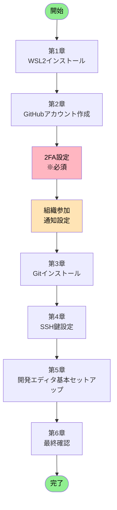
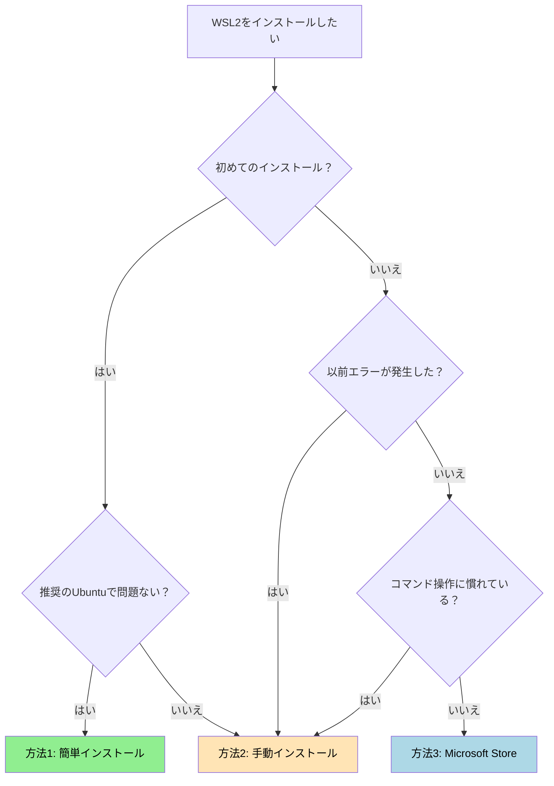

# GitHub 環境構築ガイド

**エス・エー・エス株式会社**
*開発環境のセットアップから GitHubアカウント設定まで完全ガイド*
*最終更新: 2025年10月10日*

---

## 📚 目次

1. **[🎯 はじめに](#-はじめに)**
   - 本ガイドの目的
   - 対象者
   - 所要時間と難易度

2. **[📋 全体構成と作業フロー](#-全体構成と作業フロー)**
   - 環境構築の全体像
   - 作業順序と依存関係
   - チェックリスト

3. **[🖥️ 第1章: WSL2環境の構築](#️-第1章-wsl2環境の構築)**
   - 事前確認事項
   - Windows機能の有効化
   - WSL2のインストール
   - Ubuntu初期設定
   - Windows Terminal活用（推奨）
   - トラブルシューティング

4. **[🌐 第2章: GitHubアカウントの設定](#-第2章-githubアカウントの設定)**
   - アカウント作成
   - プロフィール設定
   - セキュリティ設定（2FA必須）
   - 組織への参加
   - 通知設定

5. **[🔧 第3章: Git環境の構築](#-第3章-git環境の構築)**
   - Gitのインストール
   - Git初期設定
   - エイリアス設定

6. **[🔑 第4章: SSH接続の設定](#-第4章-ssh接続の設定)**
   - SSH鍵の生成
   - GitHubへの登録
   - 接続テスト

7. **[💻 第5章: 開発エディタの基本セットアップ](#-第5章-開発エディタの基本セットアップ)**
   - VS Codeのインストール（推奨）
   - Eclipseのインストール（Java開発者向け）
   - IDE統合設定（次のステップ）

8. **[✅ 第6章: 最終確認](#-最終確認)**
   - 環境構築完了チェックリスト

9. **[❓ 付録: トラブルシューティング](#-付録-トラブルシューティング)**
10. **[📞 サポート情報](#-サポート情報)**

---

## 🎯 はじめに

### 📌 本ガイドの目的

このガイドは、エス・エー・エス株式会社で GitHub を使った開発を始めるために必要な環境構築を、**ゼロから完全にサポート**します。

### 👥 対象者

- 新規参画者（エンジニア）
- GitHub環境を再構築する必要がある方
- Windows11環境で開発を行う方

### ⏱️ 所要時間と難易度

| カテゴリ | 所要時間 | 難易度 |
|---------|----------|--------|
| **全体所要時間** | **1-1.5時間** | **★★☆** |
| 第1章: WSL2のインストール | 15-30分 | ★★☆ |
| 第2章: GitHubアカウント設定 | 20-30分 | ★☆☆ |
| 第3章: Gitのセットアップ | 10-15分 | ★☆☆ |
| 第4章: SSH接続設定 | 10-15分 | ★★☆ |
| 第5章: 開発エディタ基本セットアップ | 5-10分 | ★☆☆ |
| 第6章: 最終確認 | 5-10分 | ★☆☆ |

---

## 📋 全体構成と作業フロー

### 🗺️ 環境構築の全体像



### 📝 作業の依存関係

| 順序 | 作業項目 | 前提条件 | 必須/任意 |
|------|----------|----------|-----------|
| 1 | 第1章: WSL2インストール | Windows11環境 | 必須 |
| 2 | 第2章: GitHubアカウント作成 | WSL2完了 | 必須 |
| 3 | 第2章: 2FA設定 | GitHubアカウント | **必須** |
| 4 | 第2章: 組織参加 | 2FA設定完了 | **必須** |
| 5 | 第2章: 通知設定 | 組織参加完了 | 必須 |
| 6 | 第3章: Gitインストール | 第2章完了 | 必須 |
| 7 | 第4章: SSH鍵設定 | Git設定完了 | 必須 |
| 8 | 第5章: 開発エディタ基本セットアップ | SSH設定完了 | 必須 |
| 9 | 第6章: 最終確認 | 全設定完了 | 必須 |

### ✅ マスターチェックリスト

#### 📦 環境準備フェーズ
- [ ] OS要件を満たしている（Windows11）
- [ ] 管理者権限がある
- [ ] インターネット接続が安定している

#### 🔧 セットアップフェーズ
- [ ] 第1章: WSL2インストール完了
- [ ] 第2章: GitHubアカウント作成完了
- [ ] 第2章: プロフィール設定完了
- [ ] 第2章: **2FA設定完了（必須）**
- [ ] 第2章: リカバリーコード保管完了
- [ ] 第2章: **組織参加完了（必須）**
- [ ] 第2章: 通知設定完了

#### 🌐 Git環境フェーズ
- [ ] 第3章: Gitインストール完了
- [ ] 第3章: Git初期設定完了（user.name, user.email）

#### 🔑 接続フェーズ
- [ ] 第4章: SSH鍵生成完了
- [ ] 第4章: GitHub登録完了
- [ ] 第4章: 接続テスト成功

#### 💻 エディタフェーズ
- [ ] 第5章: 開発エディタ（VS CodeまたはEclipse）インストール完了
- [ ] 第5章: WSL2連携設定完了

#### ✅ 最終フェーズ
- [ ] 第6章: 環境構築完了チェックリスト確認
- [ ] 第6章: 全ての設定動作確認完了

---

## 🖥️ 第1章: WSL2環境の構築

### 📊 章の概要

| 項目 | 内容 |
|------|------|
| **目的** | Windows11上でLinux（Ubuntu）開発環境を構築し、Git/GitHub開発に最適な環境を整備。WSL2により、Windowsアプリケーションを使いながらLinuxコマンドラインの利点を享受する。|
| **所要時間** | 15-30分（再起動含む） |
| **難易度** | ★★☆ |
| **必要権限** | 管理者権限 |

---

### 1.1 事前確認（必須）

#### 🔍 システム要件チェック

**手順1: Windowsバージョン確認**

PowerShellを**管理者として実行**し、以下のコマンドを実行：

```powershell
# Windowsバージョンを確認
winver
```

**必要要件：**
- ✅ Windows11（推奨OS）
- ✅ x64システム（64ビット版）

#### 🔍 仮想化機能チェック

**手順2: 仮想化の有効確認**

1. `Ctrl + Shift + Esc` でタスクマネージャーを開く
2. 「パフォーマンス」タブ → 「CPU」を選択
3. 右下に「**仮想化: 有効**」と表示されていることを確認

**仮想化が無効の場合：**
1. PCを再起動し、BIOS/UEFI設定画面へ（F2, F10, Delキーなど）
2. 以下を有効化：
   - Intel CPU: **Intel VT-x** → Enabled
   - AMD CPU: **AMD-V / SVM Mode** → Enabled
3. 設定を保存して再起動

#### 🔍 Windows機能の状態確認

**手順3: 必要機能の確認**

```powershell
# PowerShell（管理者）で実行
Get-WindowsOptionalFeature -Online | Where-Object {
    $_.FeatureName -like "*Linux*" -or
    $_.FeatureName -like "*VirtualMachinePlatform*"
} | Format-Table FeatureName, State -AutoSize
```

**期待される結果：**

| 機能名 | 必要な状態 | 説明 |
|--------|------------|------|
| Microsoft-Windows-Subsystem-Linux | Enabled | Linux基盤機能 |
| VirtualMachinePlatform | Enabled | 仮想化プラットフォーム |

**もし上記の機能が「Disabled」の場合：**

以下のコマンドを実行して有効化してください：

```powershell
# PowerShell（管理者）で実行
# Microsoft-Windows-Subsystem-Linux を有効化
Enable-WindowsOptionalFeature -Online -FeatureName Microsoft-Windows-Subsystem-Linux -All -NoRestart

# VirtualMachinePlatform を有効化
Enable-WindowsOptionalFeature -Online -FeatureName VirtualMachinePlatform -All -NoRestart

# 両方の機能を有効化したら、必ずPCを再起動
Restart-Computer
```

> ⚠️ **重要**: これらの機能が無効の場合、この手順で有効化してから次のセクション「1.2 Windows機能の有効化」に進んでください。すでに両方が Enabled の場合は 1.2 へ進んで問題ありません。

---

### 1.2 Windows機能の有効化

> ⚠️ **重要な注意事項**  
> Windows機能を有効化する方法は**3つ**あります。どれか**1つ**を選んで実行してください。

#### 📊 有効化方法の比較

| 方法 | 推奨度 | 特徴 | 適している人 |
|------|--------|------|--------------|
| **方法A: PowerShell** | ⭐⭐⭐ | コマンド2つで完了 | コマンド操作に慣れている人 |
| **方法B: DISM** | ⭐⭐ | 詳細な制御が可能 | トラブル時の代替手段 |
| **方法C: GUI** | ⭐ | 視覚的で分かりやすい | コマンドが苦手な人 |

---

#### 📝 方法A: PowerShellで有効化（推奨）

PowerShellを**管理者として実行**：

```powershell
# ステップ1: Linux用サブシステムを有効化
Enable-WindowsOptionalFeature -Online -FeatureName Microsoft-Windows-Subsystem-Linux -All -NoRestart

# ステップ2: 仮想マシンプラットフォームを有効化
Enable-WindowsOptionalFeature -Online -FeatureName VirtualMachinePlatform -All -NoRestart

# ステップ3: 有効化を確認
Get-WindowsOptionalFeature -Online -FeatureName Microsoft-Windows-Subsystem-Linux
Get-WindowsOptionalFeature -Online -FeatureName VirtualMachinePlatform

# 両方が "State : Enabled" になっていることを確認
```

##### ✅ 両方が "State : Enabled" になっていることの確認方法

以下のいずれかの方法で、2つの機能が正しく Enabled になっているかを確認してください。

1. 個別表示で確認する（上記コマンドそのまま）
   - 直後に表示される出力内に `State : Enabled` が含まれているか確認します。

   例（抜粋）：
   ```text
   FeatureName : Microsoft-Windows-Subsystem-Linux
   State       : Enabled
   ...
   FeatureName : VirtualMachinePlatform
   State       : Enabled
   ```

2. 一括で一覧確認する（簡潔表示）
   ```powershell
   Get-WindowsOptionalFeature -Online -FeatureName Microsoft-Windows-Subsystem-Linux,VirtualMachinePlatform | Select FeatureName,State
   ```
   期待出力例：
   ```text
   FeatureName                          State
   ------------                          -----
   Microsoft-Windows-Subsystem-Linux    Enabled
   VirtualMachinePlatform               Enabled
   ```

3. スクリプトで明示的に判定（判定結果のみ表示）
   ```powershell
   $features = "Microsoft-Windows-Subsystem-Linux","VirtualMachinePlatform"
   $allEnabled = $true
   foreach ($f in $features) {
     $state = (Get-WindowsOptionalFeature -Online -FeatureName $f).State
     if ($state -ne "Enabled") { $allEnabled = $false; Write-Host "[NG] $f : $state" -ForegroundColor Red } else { Write-Host "[OK] $f : Enabled" -ForegroundColor Green }
   }
   if ($allEnabled) { Write-Host "=== 全て Enabled です。次のステップへ進んでください ===" -ForegroundColor Green } else { Write-Host "=== 未有効の機能があります。再度有効化手順を確認してください ===" -ForegroundColor Yellow }
   ```

4. CSVとして記録（証跡保存用・新人教育レビュー向け）
   ```powershell
   Get-WindowsOptionalFeature -Online -FeatureName Microsoft-Windows-Subsystem-Linux,VirtualMachinePlatform | Select FeatureName,State | Export-Csv -Path .\wsl_feature_state.csv -NoTypeInformation -Encoding UTF8
   ```
   - 生成された `wsl_feature_state.csv` をレビュー時に提出すると、セットアップ確認が容易になります。

5. トラブル時の再確認（想定ケース）
   - 再起動後に Status が Disabled に戻っている → セキュアブートや企業ポリシーによる制限の可能性。情報システム部門に相談。
   - VirtualMachinePlatform のみ Disabled → BIOS で仮想化無効、もしくは Hyper-V 関連設定不整合。`bcdedit /set hypervisorlaunchtype auto` 実行後再起動を試行。

> ℹ️ 出力が `Enabled` 以外の場合（例: `Disabled`, `EnablePending`）は再度 Enable コマンドを実行し、再起動後に再確認してください。

```powershell
# ステップ4: PCを再起動（必須）
Restart-Computer
```

---

#### 📝 方法B: DISMコマンドで有効化

PowerShellを**管理者として実行**：

```powershell
# ステップ1: Linux用サブシステムを有効化
dism.exe /online /enable-feature /featurename:Microsoft-Windows-Subsystem-Linux /all /norestart

# ステップ2: 仮想マシンプラットフォームを有効化
dism.exe /online /enable-feature /featurename:VirtualMachinePlatform /all /norestart

# "The operation completed successfully." と表示されれば成功

# ステップ3: PCを再起動（必須）
Restart-Computer
```

---

#### 📝 方法C: GUIで有効化

1. **Windows機能の画面を開く**
   - `Win + R` → `optionalfeatures` と入力 → Enter

2. **以下の機能にチェックを入れる**
   - ☑ **Linux 用 Windows サブシステム**（必須）
   - ☑ **仮想マシン プラットフォーム**（必須）

3. **OKをクリック** → 変更を適用

4. **PCを再起動**（必須）

---

### 1.3 WSL2のインストール

> 🎯 **インストール方法の選択**
> WSL2のインストールには**3つの方法**があります。状況に応じて選択してください。

#### 📊 インストール方法の比較

| 方法 | 推奨度 | 特徴 | 適している人 |
|------|--------|------|--------------|
| **方法1: 簡単インストール** | ⭐⭐⭐ | コマンド1つで完了、Ubuntu-24.04が自動インストール | 初めての方、推奨ディストリビューションで問題ない方 |
| **方法2: 手動インストール** | ⭐⭐ | ディストリビューション選択可能、詳細な制御 | 特定のLinuxディストリが必要な方、過去にエラーが発生した方 |
| **方法3: Microsoft Store** | ⭐ | GUI操作で分かりやすい | コマンド操作が苦手な方 |

#### 🔄 インストール方法の選択フローチャート



---

#### 📝 方法1: 簡単インストール（推奨）

**最もシンプルな方法**です。コマンド1つでWSL2とUbuntu-24.04 LTSが自動的にインストールされます。

PowerShellを**管理者として実行**：

```powershell
# ステップ1: WSL2と既定のUbuntuを一括インストール
wsl --install

# ステップ2: PCを再起動（必須）
Restart-Computer
```

> ✅ **成功時の出力例：**
> ```
> Installing: Virtual Machine Platform
> Virtual Machine Platform has been installed.
> Installing: Windows Subsystem for Linux
> Windows Subsystem for Linux has been installed.
> Installing: Ubuntu
> Ubuntu has been installed.
> The requested operation is successful. Changes will not be effective until the system is rebooted.
> ```

> ℹ️ **補足**: `wsl --install` は Ubuntu-24.04 LTS（2025年12月時点の既定）をインストールします。別のディストリビューションが必要な場合は方法2を使用してください。

---

#### 📝 方法2: 手動インストール

**ディストリビューションを選択**したい場合や、**より詳細な制御**が必要な場合に使用します。

PowerShellを**管理者として実行**：

```powershell
# ステップ1: WSLカーネルを最新版に更新
wsl --update

# ステップ2: WSL2を既定のバージョンに設定
wsl --set-default-version 2

# ステップ3: 利用可能なディストリビューション一覧を表示
wsl --list --online
```

**利用可能なディストリビューション一覧（2025年12月時点）：**

| ディストリビューション | パッケージマネージャー | 推奨度 | 備考 |
|------------------------|------------------------|--------|------|
| **Ubuntu-24.04** | apt | ⭐⭐⭐ | **SAS標準開発環境**、豊富なドキュメント |
| Ubuntu-22.04 | apt | ⭐⭐ | 安定版、長期サポート |
| Debian | apt | ⭐⭐ | 軽量、安定重視 |
| openSUSE-Tumbleweed | zypper | ⭐ | 最新パッケージ |
| SUSE-Linux-Enterprise-15-SP6 | zypper | ⭐ | エンタープライズ向け |
| Oracle Linux 9.1 | dnf | ⭐ | Oracle環境向け |
| Oracle Linux 8.7 | dnf | ⭐ | Oracle環境向け |

```powershell
# ステップ4: Ubuntu-24.04をインストール（推奨）
wsl --install -d Ubuntu-24.04

# ステップ5: PCを再起動（必須）
Restart-Computer
```

> 💡 **ヒント**: サーバー環境がAmazon Linuxの場合でも、**開発環境はUbuntuを推奨**します。理由：
> - チーム内でのサポート体制が充実
> - ドキュメントが豊富
> - 本番環境との差異はDockerで吸収可能

---

#### 📝 方法3: Microsoft Store経由

**GUI操作**でインストールしたい場合に使用します。

1. **Microsoft Storeを開く**
   - タスクバーの検索で「Microsoft Store」と入力
   - または `Win + S` → 「store」と入力

2. **Ubuntuを検索**
   - 検索バーに「Ubuntu」と入力
   - 「**Ubuntu 24.04 LTS**」を選択

3. **インストール**
   - 「入手」または「インストール」ボタンをクリック
   - インストール完了を待つ

4. **起動**
   - 「開く」ボタンをクリック
   - または、スタートメニューから「Ubuntu 24.04 LTS」を起動

5. **PCを再起動**（推奨）

---

#### ✅ インストール確認

インストール完了後、以下のコマンドで確認：

```powershell
# インストール済みディストリビューションの確認
wsl --list --verbose
```

**期待される出力：**

```
  NAME            STATE           VERSION
* Ubuntu-24.04    Running         2
```

> ⚠️ **VERSION が「1」の場合**：WSL1でインストールされています。以下で変換：
> ```powershell
> wsl --set-version Ubuntu-24.04 2
> ```

---

### 1.4 Ubuntu初期設定

#### 🔧 初回起動時の設定

Ubuntuを初めて起動すると、ユーザーアカウントの作成を求められます。

```bash
# ステップ1: ユーザー名を入力
# ※ 英数字小文字のみ使用可能（記号・大文字不可）
Enter new UNIX username: yourname

# ステップ2: パスワードを設定
# ※ 入力中は画面に表示されません（セキュリティのため）
New password:
Retype new password:
```

> ⚠️ **パスワードについての重要事項：**
> - このパスワードは**Linux管理者権限（sudo）**のパスワードです
> - `sudo` コマンド実行時に毎回必要になります
> - **入力中は画面に何も表示されません**（セキュリティ仕様）
> - 忘れないようにメモを取ってください
> - **8文字以上の複雑なパスワード**を推奨

#### 📦 基本パッケージの更新とインストール

```bash
# ステップ3: パッケージリストを更新
sudo apt update

# ステップ4: インストール済みパッケージを最新版に更新
sudo apt upgrade -y

# ステップ5: 開発に必要な基本ツールをインストール
sudo apt install -y git curl wget build-essential
```

> ✅ **成功時のポイント：**
> - `apt update`: 「Reading package lists... Done」で完了
> - `apt upgrade`: 「0 upgraded, 0 newly installed...」または更新完了メッセージ
> - `apt install`: 「Processing triggers...」で完了

#### ✅ 初期設定確認

```bash
# Gitがインストールされたか確認
git --version

# 期待される出力例
# git version 2.43.0
```

---

### 1.5 Windows Terminal の活用（推奨）

Windows Terminalは、複数のシェル（PowerShell、Ubuntu、CMD）を**タブで管理**できる便利なターミナルアプリです。

#### 📊 Windows Terminalの特徴

| 機能 | 説明 |
|------|------|
| **タブ機能** | 複数のセッションを1つのウィンドウで管理 |
| **画面分割** | 横・縦に画面を分割して同時作業 |
| **Unicode対応** | 日本語や絵文字を正しく表示 |
| **カスタマイズ** | テーマ、フォント、背景などを変更可能 |
| **WSL統合** | Ubuntu等のLinuxシェルにワンクリックでアクセス |

#### 📝 インストール方法

**Microsoft Store経由（推奨）：**

1. Microsoft Storeを開く
2. 「**Windows Terminal**」で検索
3. 「入手」をクリック

**または、PowerShell（管理者）で：**

```powershell
winget install --id Microsoft.WindowsTerminal -e
```

#### 🔧 基本的な使い方

| 操作 | ショートカット |
|------|----------------|
| 新しいタブ | `Ctrl + Shift + T` |
| タブを閉じる | `Ctrl + Shift + W` |
| Ubuntu タブを開く | `Ctrl + Shift + 3`（既定の場合） |
| 画面を横に分割 | `Alt + Shift + +` |
| 画面を縦に分割 | `Alt + Shift + -` |
| 設定を開く | `Ctrl + ,` |

---

### 1.6 トラブルシューティング

#### 🔧 よくあるエラーと解決方法

| エラーコード | エラー内容 | 原因 | 解決方法 |
|-------------|-----------|------|----------|
| **0x80370114** | WSL2を実行するには、カーネルコンポーネントの更新が必要です | WSLカーネル未インストール/古い | `wsl --update` を実行 |
| **0x800701bc** | WSL 2 requires an update to its kernel component | WSL2カーネル未インストール | [WSL2 Linuxカーネル更新パッケージ](https://aka.ms/wsl2kernel)をインストール |
| **0x80370102** | 仮想マシンを起動できませんでした | Hyper-V未有効 | 下記コマンドを実行後、再起動 |
| **0x80040326** | WSL機能が正しく有効化されていません | Windows機能未有効 | 1.2の手順を再実行 |
| **0x80004005** | 予期しないエラー | 複数の原因が考えられる | PCを再起動し、再試行 |

#### 📝 エラー0x80370102の解決方法

```powershell
# PowerShell（管理者）で実行
bcdedit /set hypervisorlaunchtype auto

# PCを再起動
Restart-Computer
```

#### 📝 WSLの完全リセット（最終手段）

すべての方法を試しても解決しない場合：

```powershell
# ステップ1: WSLをアンインストール
wsl --unregister Ubuntu-24.04

# ステップ2: WSLを再インストール
wsl --install -d Ubuntu-24.04

# ステップ3: PCを再起動
Restart-Computer
```

> ⚠️ **警告**: `--unregister` を実行すると、**そのディストリビューション内のすべてのデータが削除**されます。重要なデータがある場合は事前にバックアップしてください。

---

### ✅ 第1章完了チェックリスト

以下の項目をすべて確認してから、第2章へ進んでください：

- [ ] WSL2がインストールされている（`wsl --list --verbose` で VERSION が 2）
- [ ] Ubuntuが起動できる
- [ ] Ubuntuでユーザーアカウントを作成した
- [ ] `sudo apt update && sudo apt upgrade` が正常に完了した
- [ ] `git --version` でGitバージョンが表示される

```bash
# 一括確認コマンド（Ubuntu内で実行）
echo "=== WSL2 環境確認 ===" && \
echo "User: $(whoami)" && \
echo "Git: $(git --version)" && \
echo "Ubuntu: $(lsb_release -d | cut -f2)" && \
echo "=== 確認完了 ==="
```

**期待される出力例：**

```
=== WSL2 環境確認 ===
User: yourname
Git: git version 2.43.0
Ubuntu: Ubuntu 24.04.1 LTS
=== 確認完了 ===
```

---

## 📞 サポート情報

| 内容 | 連絡先 | 対応時間 |
|------|--------|----------|
| **通常サポート** | github@sas-com.com | 平日 9:00-18:00 |
| **緊急対応** | github@sas-com.com | 24時間 |
| **技術的質問** | github@sas-com.com | 平日 9:00-18:00 |

---

**© 2025 エス・エー・エス株式会社 - GitHub環境構築ガイド**