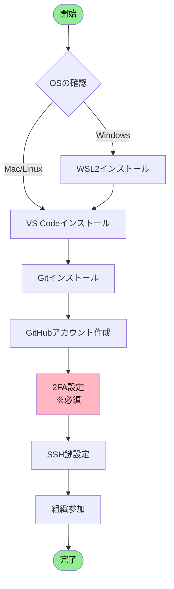
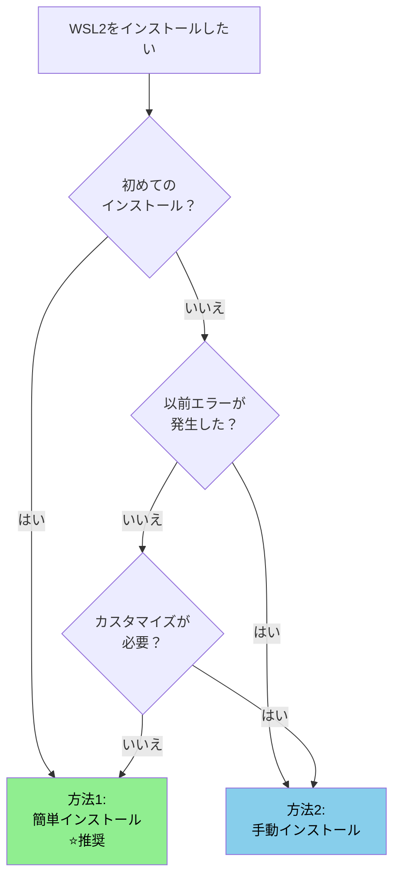

# GitHub 環境構築ガイド

**エス・エー・エス株式会社**
*開発環境のセットアップから GitHubアカウント設定まで完全ガイド*
*最終更新: 2025年10月10日*

---

## 📚 目次

1. **[🎯 はじめに](#-はじめに)**
   - 本ガイドの目的
   - 対象者
   - 所要時間と難易度

2. **[📋 全体構成と作業フロー](#-全体構成と作業フロー)**
   - 環境構築の全体像
   - 作業順序と依存関係
   - チェックリスト

3. **[🖥️ 第1章: WSL2環境の構築（Windows必須）](#️-第1章-wsl2環境の構築windows必須)**
   - 事前確認事項
   - インストール方法の選択
   - セットアップ手順
   - Windows Terminal活用（強く推奨）
   - トラブルシューティング

4. **[💻 第2章: VS Code + WSL拡張機能のセットアップ](#-第2章-vs-code--wsl拡張機能のセットアップ)**
   - VS Codeのインストール
   - Remote - WSL拡張機能
   - WSLからVS Codeを起動
   - 推奨拡張機能
   - トラブルシューティング

5. **[🔧 第3章: Git環境の構築](#-第3章-git環境の構築)**
   - Gitのインストール
   - 初期設定
   - 動作確認

6. **[🌐 第4章: GitHubアカウントの設定](#-第4章-githubアカウントの設定)**
   - アカウント作成
   - プロフィール設定
   - セキュリティ設定（2FA必須）

7. **[🔑 第5章: SSH接続の設定](#-第5章-ssh接続の設定)**
   - SSH鍵の生成
   - GitHubへの登録
   - 接続テスト

8. **[🏢 第6章: 組織への参加と最終設定](#-第6章-組織への参加と最終設定)**
   - 組織への参加
   - 通知設定
   - 最終確認

9. **[❓ 付録: トラブルシューティング](#-付録-トラブルシューティング)**
10. **[📞 サポート情報](#-サポート情報)**

---

## 🎯 はじめに

### 📌 本ガイドの目的

このガイドは、エス・エー・エス株式会社で GitHub を使った開発を始めるために必要な環境構築を、**ゼロから完全にサポート**します。

### 👥 対象者

- 新規参画者（エンジニア）
- GitHub環境を再構築する必要がある方
- Windows/Mac/Linux環境で開発を行う方

### ⏱️ 所要時間と難易度

| カテゴリ | 所要時間 | 難易度 |
|---------|----------|--------|
| **全体所要時間** | **1.5-2.5時間** | **★★☆** |
| WSL2のインストール（Windows） | 15-30分 | ★★☆ |
| VS Code + WSL拡張機能 | 15-20分 | ★☆☆ |
| Gitのセットアップ | 10-15分 | ★☆☆ |
| GitHubアカウント設定 | 20-30分 | ★☆☆ |
| SSH接続設定 | 10-15分 | ★★☆ |
| 最終確認 | 5-10分 | ★☆☆ |

---

## 📋 全体構成と作業フロー

### 🗺️ 環境構築の全体像



### 📝 作業の依存関係

| 順序 | 作業項目 | 前提条件 | 必須/任意 |
|------|----------|----------|-----------|
| 1 | WSL2インストール | Windows環境 | Windows必須 |
| 2 | VS Code + WSL拡張機能 | WSL2完了（Windows）<br/>なし（Mac/Linux） | 必須 |
| 3 | Gitインストール | WSL2完了（Windows）<br/>なし（Mac/Linux） | 必須 |
| 4 | GitHubアカウント作成 | なし | 必須 |
| 5 | 2FA設定 | GitHubアカウント | **必須** |
| 6 | SSH鍵設定 | Git設定完了 | 必須 |
| 7 | 組織参加 | 2FA設定完了 | 必須 |

### ✅ マスターチェックリスト

#### 📦 環境準備フェーズ
- [ ] OS要件を満たしている（Windows 10 v2004以降 / macOS / Linux）
- [ ] 管理者権限がある
- [ ] インターネット接続が安定している

#### 🔧 セットアップフェーズ
- [ ] WSL2インストール完了（Windowsのみ）
- [ ] VS Codeインストール完了
- [ ] Remote - WSL拡張機能インストール完了
- [ ] WSLからVS Code起動確認完了
- [ ] Gitインストール完了
- [ ] Git初期設定完了（user.name, user.email）

#### 🌐 GitHubフェーズ
- [ ] GitHubアカウント作成完了
- [ ] プロフィール設定完了
- [ ] **2FA設定完了（必須）**
- [ ] リカバリーコード保管完了

#### 🔑 接続フェーズ
- [ ] SSH鍵生成完了
- [ ] GitHub登録完了
- [ ] 接続テスト成功

#### 🏢 最終フェーズ
- [ ] 組織参加完了
- [ ] 通知設定完了
- [ ] 動作確認完了

---

## 🖥️ 第1章: WSL2環境の構築（Windows必須）

> 💡 **Mac/Linuxユーザーの方へ**  
> このセクションはスキップして「[第2章: Git環境の構築](#-第2章-git環境の構築)」へ進んでください。

### 📊 章の概要

| 項目 | 内容 |
|------|------|
| **目的** | Windows上でLinux開発環境を構築 |
| **所要時間** | 15-30分（再起動含む） |
| **難易度** | ★★☆ |
| **必要権限** | 管理者権限 |

---

### 1.1 事前確認（必須）

#### 🔍 システム要件チェック

**手順1: Windowsバージョン確認**

PowerShellを**管理者として実行**し、以下のコマンドを実行：

```powershell
# Windowsバージョンを確認
winver
```

**必要要件：**
- ✅ Windows 10 バージョン 2004以降（ビルド 19041以降）
- ✅ Windows 11（全バージョン対応）
- ✅ x64システム（64ビット版）

#### 🔍 仮想化機能チェック

**手順2: 仮想化の有効確認**

1. `Ctrl + Shift + Esc` でタスクマネージャーを開く
2. 「パフォーマンス」タブ → 「CPU」を選択
3. 右下に「**仮想化: 有効**」と表示されていることを確認

**仮想化が無効の場合：**
1. PCを再起動し、BIOS/UEFI設定画面へ（F2, F10, Delキーなど）
2. 以下を有効化：
   - Intel CPU: **Intel VT-x** → Enabled
   - AMD CPU: **AMD-V / SVM Mode** → Enabled
3. 設定を保存して再起動

#### 🔍 Windows機能の状態確認

**手順3: 必要機能の確認**

```powershell
# PowerShell（管理者）で実行
Get-WindowsOptionalFeature -Online | Where-Object {
    $_.FeatureName -like "*Linux*" -or
    $_.FeatureName -like "*VirtualMachinePlatform*"
} | Format-Table FeatureName, State -AutoSize
```

**期待される結果：**

| 機能名 | 必要な状態 | 説明 |
|--------|------------|------|
| Microsoft-Windows-Subsystem-Linux | Enabled | Linux基盤機能 |
| VirtualMachinePlatform | Enabled | 仮想化プラットフォーム |

**もし上記の機能が「Disabled」の場合：**

以下のコマンドを実行して有効化してください：

```powershell
# PowerShell（管理者）で実行
# Microsoft-Windows-Subsystem-Linux を有効化
Enable-WindowsOptionalFeature -Online -FeatureName Microsoft-Windows-Subsystem-Linux -All -NoRestart

# VirtualMachinePlatform を有効化
Enable-WindowsOptionalFeature -Online -FeatureName VirtualMachinePlatform -All -NoRestart

# 両方の機能を有効化したら、必ずPCを再起動
Restart-Computer
```

> ⚠️ **重要**: これらの機能が無効の場合、この手順で有効化してから次のセクション「1.2 Windows機能の有効化」に進んでください。すでに両方が「Enabled」になっている場合は、1.2のセクションはスキップして「1.3 WSL2のインストール」に進むことができます。

---

### 1.2 Windows機能の有効化

> ⚠️ **重要な注意事項**  
> Windows機能を有効化する方法は**3つ**あります。どれか**1つ**を選んで実行してください。

#### 📊 有効化方法の比較

| 方法 | 推奨度 | 特徴 | 適している人 |
|------|--------|------|--------------|
| **方法A: PowerShell** | ⭐⭐⭐ | コマンド2つで完了 | コマンド操作に慣れている人 |
| **方法B: DISM** | ⭐⭐ | 詳細な制御が可能 | トラブル時の代替手段 |
| **方法C: GUI** | ⭐ | 視覚的で分かりやすい | コマンドが苦手な人 |

---

#### 📝 方法A: PowerShellで有効化（推奨）

PowerShellを**管理者として実行**：

```powershell
# ステップ1: Linux用サブシステムを有効化
Enable-WindowsOptionalFeature -Online -FeatureName Microsoft-Windows-Subsystem-Linux -All -NoRestart

# ステップ2: 仮想マシンプラットフォームを有効化
Enable-WindowsOptionalFeature -Online -FeatureName VirtualMachinePlatform -All -NoRestart

# ステップ3: 有効化を確認
Get-WindowsOptionalFeature -Online -FeatureName Microsoft-Windows-Subsystem-Linux
Get-WindowsOptionalFeature -Online -FeatureName VirtualMachinePlatform

# 両方が "State : Enabled" になっていることを確認

# ステップ4: PCを再起動（必須）
Restart-Computer
```

---

#### 📝 方法B: DISMコマンドで有効化

PowerShellを**管理者として実行**：

```powershell
# ステップ1: Linux用サブシステムを有効化
dism.exe /online /enable-feature /featurename:Microsoft-Windows-Subsystem-Linux /all /norestart

# ステップ2: 仮想マシンプラットフォームを有効化
dism.exe /online /enable-feature /featurename:VirtualMachinePlatform /all /norestart

# "The operation completed successfully." と表示されれば成功

# ステップ3: PCを再起動（必須）
Restart-Computer
```

---

#### 📝 方法C: GUIで有効化

1. **Windows機能の画面を開く**
   - `Win + R` → `optionalfeatures` と入力 → Enter

2. **以下の機能にチェックを入れる**
   - ☑ **Linux 用 Windows サブシステム**（必須）
   - ☑ **仮想マシン プラットフォーム**（必須）

3. **OKをクリック** → 変更を適用

4. **PCを再起動**（必須）

---

### 1.3 WSL2のインストール

> 🎯 **インストール方法の選択**  
> ここでも**3つの方法**があります。状況に応じて選択してください。

#### 🗺️ インストール方法選択フローチャート



---

#### ✨ 方法1: 簡単インストール（推奨）

PowerShellを**管理者として実行**：

```powershell
# WSL2と既定のUbuntuを一括インストール
wsl --install

# インストール完了メッセージを確認
# "The requested operation is successful..."

# PCを再起動（必須）
Restart-Computer
```

**再起動後：**
- Ubuntuが自動的に起動
- ユーザー名とパスワードを設定

---

#### 🔧 方法2: 手動インストール

**ステップ1: WSLカーネル更新**

```powershell
# WSLカーネルを最新版に更新
wsl --update

# WSL2を既定に設定
wsl --set-default-version 2
```

**ステップ2: ディストリビューション選択**

```powershell
# 利用可能な一覧を確認
wsl --list --online

# Ubuntuをインストール（例）
wsl --install -d Ubuntu-22.04
```

---

#### 🖱️ 方法3: Microsoft Store経由

1. Microsoft Storeを開く
2. 「Ubuntu」で検索
3. 「Ubuntu 22.04 LTS」を選択
4. インストールをクリック

---

### 1.4 Ubuntu初期設定

初回起動時の設定：

```bash
# ユーザー名を入力（英数字小文字）
Enter new UNIX username: yourname

# パスワードを設定（表示されません）
New password: 
Retype new password: 

# 基本パッケージを更新
sudo apt update && sudo apt upgrade -y

# 開発ツールをインストール
sudo apt install -y git curl wget build-essential
```

---

### 1.5 トラブルシューティング

#### ❌ エラー 0x80370114

**原因と解決方法：**

| 原因 | 確認方法 | 解決方法 |
|------|----------|----------|
| 仮想化が無効 | タスクマネージャーで確認 | BIOSで有効化 |
| Windows機能が無効 | `Get-WindowsOptionalFeature`で確認 | 1.2の手順を実行 |
| WSLカーネルが古い | `wsl --status`で確認 | `wsl --update`を実行 |

#### ❌ その他のエラー

<details>
<summary>クリックして詳細を表示</summary>

**エラー 0x800701bc:**
```powershell
# WSL2カーネル未インストール
wsl --update
```

**エラー 0x80370102:**
```powershell
# 仮想マシン起動失敗
bcdedit /set hypervisorlaunchtype auto
Restart-Computer
```

**エラー 0x80040326:**
```powershell
# WSL機能が無効
dism.exe /online /enable-feature /featurename:Microsoft-Windows-Subsystem-Linux /all
Restart-Computer
```

</details>

---

### 1.6 Windows Terminal の活用（推奨）

> 💡 **Windows Terminal について**
> Windows Terminal は Microsoft が開発した新しいターミナルアプリケーションで、PowerShell と WSL2 の両方で優れた体験を提供します。

#### 📊 Windows Terminal の利点

| 従来のツール | Windows Terminal |
|--------------|------------------|
| コマンドプロンプト | ✅ **タブ機能**で複数セッション管理 |
| PowerShell ISE | ✅ **Unicode完全サポート**（日本語表示） |
| 個別ウィンドウ | ✅ **統合環境**（PowerShell + WSL2） |
| 限定的なカスタマイズ | ✅ **豊富なテーマ**とフォント設定 |
| コピペが不便 | ✅ **Ctrl+C/V**で直感的操作 |

#### 🎯 なぜ Windows Terminal が必要か

**開発効率の向上：**
- **タブ管理**: PowerShell、Ubuntu（WSL2）、Git Bashを1つのウィンドウで切り替え
- **分割ペイン**: 画面を分割してコマンドとログを同時表示
- **フォント改善**: Cascadia Code フォントで読みやすいコード表示

**Git作業の最適化：**
- WSL2とPowerShellを瞬時に切り替え
- 複数のリポジトリを並行作業
- ログ出力の見やすさが大幅改善

#### 📥 インストール方法（3つの方法から選択）

> 📌 **インストール方法について**
> Windows Terminal のインストールには **3つの方法** があります。お使いの環境に応じて、いずれか1つを選択してください。

**方法A: Microsoft Store（推奨）**

1. **Microsoft Store を開く**
2. **「Windows Terminal」** で検索
3. **入手/インストール** をクリック

**方法B: GitHub から直接ダウンロード**

```powershell
# PowerShellで直接ダウンロード（最新版）
# 1. GitHubリリースページにアクセス
# https://github.com/microsoft/terminal/releases

# 2. Assets から .msixbundle をダウンロード
# Microsoft.WindowsTerminal_Win10_1.18.xxx.0_8wekyb3d8bbwe.msixbundle

# 3. ダブルクリックでインストール
```

**方法C: Winget（パッケージマネージャ）**

```powershell
# PowerShellで実行
winget install --id Microsoft.WindowsTerminal -e
```

#### ⚙️ 基本設定（Git/WSL2最適化）

> ⚠️ **重要な注意事項**
> 以下の設定はあくまで **参考例** です。実際の設定は、お使いのPC環境や個人の好みによって異なります。
> 特にファイルパスやユーザー名の部分は、ご自身の環境に合わせて変更してください。

**設定ファイルの場所:**
```
Ctrl + , で設定画面を開く
または
%LOCALAPPDATA%\Packages\Microsoft.WindowsTerminal_8wekyb3d8bbwe\LocalState\settings.json
```

**推奨設定項目（参考例）:**

```json
{
  "defaultProfile": "{2c4de342-38b7-51cf-b940-2309a097f518}",
  "profiles": {
    "defaults": {
      "fontFace": "Cascadia Code",
      "fontSize": 11,
      "cursorShape": "bar",
      "colorScheme": "One Half Dark"
    },
    "list": [
      {
        "guid": "{2c4de342-38b7-51cf-b940-2309a097f518}",
        "name": "Ubuntu",
        "source": "Windows.Terminal.Wsl",
        "startingDirectory": "//wsl$/Ubuntu/home/yourname"
      }
    ]
  },
  "actions": [
    {
      "command": { "action": "copy", "singleLine": false },
      "keys": "ctrl+c"
    },
    {
      "command": "paste",
      "keys": "ctrl+v"
    }
  ]
}
```

#### 🚀 効率的な使い方

**ショートカット一覧:**

| 操作 | ショートカット | 用途 |
|------|---------------|------|
| **新しいタブ** | `Ctrl + Shift + T` | 新しいシェルセッション |
| **タブ切り替え** | `Ctrl + Tab` | 開いているタブ間を移動 |
| **ペイン分割** | `Alt + Shift + D` | 画面を縦または横に分割 |
| **コピー** | `Ctrl + C` | 選択したテキストをコピー |
| **ペースト** | `Ctrl + V` | クリップボードから貼り付け |
| **検索** | `Ctrl + Shift + F` | 出力内容を検索 |

**実践的な活用例:**

```bash
# タブ1: メインの作業用WSL2
cd ~/projects/my-repo
git status

# タブ2: ログ監視用
tail -f /var/log/application.log

# タブ3: PowerShellでWindowsツール実行
# Windows側のファイル管理など

# 分割ペイン: Git操作とファイル編集を同時表示
# 左ペイン: git log --oneline
# 右ペイン: code ./README.md
```

#### 🎨 テーマとカスタマイズ

**人気のテーマ:**
- **One Half Dark** (暗いテーマ、目に優しい)
- **Campbell Powershell** (PowerShell標準)
- **Solarized Dark** (コーディング向け)

**フォント推奨:**
- **Cascadia Code** (Microsoft製、プログラミング最適化)
- **JetBrains Mono** (読みやすさ重視)
- **Fira Code** (リガチャ対応)

#### 🔧 トラブルシューティング

<details>
<summary>🔧 WSL2が表示されない</summary>

**解決方法:**
1. Windows Terminal を再起動
2. WSL2が正しくインストールされているか確認
3. 設定 → プロファイルを追加 → WSL を選択
</details>

<details>
<summary>🔧 日本語が文字化けする</summary>

**解決方法:**
```json
{
  "profiles": {
    "defaults": {
      "fontFace": "Cascadia Code",
      "experimental.retroTerminalEffect": false
    }
  }
}
```
</details>

<details>
<summary>🔧 コピー＆ペーストができない</summary>

**解決方法:**
1. 設定 → アクション でキーバインドを確認
2. 右クリックメニューを使用
3. 選択時は `Ctrl+C`、貼り付けは `Ctrl+V`
</details>

#### 💡 Windows Terminal 活用のメリット

**開発作業での実感:**
- Git操作の快適性が格段に向上
- 複数プロジェクトの並行作業が簡単
- ログの確認とコマンド実行を同時に可能
- Windows環境とLinux環境の統合感

**チーム作業での利点:**
- 画面共有時の見やすさ
- 統一された作業環境
- トラブルシューティング効率の向上

> 📝 **次のステップ**
> Windows Terminal の設定が完了したら、[第2章: VS Code + WSL拡張機能のセットアップ](#-第2章-vs-code--wsl拡張機能のセットアップ) に進んでください。

---

## 💻 第2章: 開発エディタの基本セットアップ

### 📊 章の概要

| 項目 | 内容 |
|------|------|
| **目的** | 開発用エディタの基本インストール |
| **所要時間** | 5-10分 |
| **難易度** | ★☆☆ |
| **前提条件** | WSL2完了（Windows）またはターミナルアクセス（Mac/Linux） |

> 💡 **開発エディタについて**
> 本章では、Git環境構築に必要な最小限のエディタセットアップのみ説明します。IDE固有の詳細な設定については、後述の「IDE統合設定ガイド」を参照してください。

---

### 2.1 VS Codeのインストール（推奨）

#### 📋 基本インストール手順

**Windows環境：**
1. 公式サイト（https://code.visualstudio.com/）からダウンロード
2. インストーラーを実行（**必ず「Add to PATH」にチェック**）
3. インストール完了

**Mac環境：**
```bash
# Homebrewを使用（推奨）
brew install --cask visual-studio-code
```

**Linux環境：**
```bash
# Ubuntu/Debian
sudo apt update && sudo apt install -y code

# または公式サイトからダウンロード
```

#### ✅ インストール確認

```bash
# コマンドラインで確認
code --version
```

### 2.2 WSL2連携設定（Windows環境）

#### 📥 Remote - WSL拡張機能のインストール

Windows環境でWSL2を使用している場合のみ必要です：

```bash
# VS Codeで拡張機能をインストール
code --install-extension ms-vscode-remote.remote-wsl
```

#### 🚀 WSL2からVS Codeを起動

```bash
# WSL2ターミナルで実行
cd ~/projects/my-repo
code .

# 初回起動時は VS Code Server が自動インストールされます
```

### 2.3 Eclipseのインストール（Java開発者向け）

Java開発者の場合は、Eclipse IDEも選択肢となります：

1. 公式サイト（https://www.eclipse.org/）からダウンロード
2. 適切なパッケージを選択（Eclipse IDE for Java Developers等）
3. インストール実行

## 🛠️ IDE統合設定（次のステップ）

環境構築が完了したら、使用するIDEでのGit統合設定を行います。

### Visual Studio Code

VS Codeを使用する場合は、以下のガイドを参照してください：

📖 **[VS Code Git統合完全ガイド](../implementation/IDE_VSCODE_GIT_GUIDE.md)**

このガイドで学べる内容：
- VS Code Git機能の初期設定
- WSL2との連携設定
- ソース管理ビューの使い方
- GitLens、GitHub Pull Requests拡張機能
- コミット作成とブランチ操作
- コンフリクト解決方法

### Eclipse

Eclipseを使用する場合は、以下のガイドを参照してください：

📖 **[Eclipse Git統合完全ガイド](../implementation/IDE_ECLIPSE_GIT_GUIDE.md)**

このガイドで学べる内容：
- EGitプラグインの設定
- Git Repositories/Stagingビューの使い方
- ブランチ操作とマージ
- Historyビューの活用
- 推奨プラグイン

---

> 📝 **次のステップ**
> 開発エディタの基本セットアップが完了したら、[第3章: Git環境の構築](#-第3章-git環境の構築) に進んでください。

---

## 🔧 第3章: Git環境の構築

#### 📋 設定の種類と違い

VS Codeには**2種類の設定スコープ**があります：

| 設定スコープ | 適用範囲 | 使用場面 | 設定ファイルの場所 |
|-------------|---------|---------|------------------|
| **ユーザー設定**<br/>（User Settings） | すべてのプロジェクト | VS Code全体で共通の設定<br/>（例: フォント、テーマ） | **Windows**: `%APPDATA%\Code\User\settings.json`<br/>**Mac**: `~/Library/Application Support/Code/User/settings.json`<br/>**Linux**: `~/.config/Code/User/settings.json` |
| **ワークスペース設定**<br/>（Workspace Settings） | 現在のプロジェクトのみ | プロジェクト固有の設定<br/>（例: インデント幅） | プロジェクトルートの<br/>`.vscode/settings.json` |

**優先順位：**
- ワークスペース設定 > ユーザー設定
- 同じ項目が両方に存在する場合、ワークスペース設定が優先されます

> 📝 **推奨**: 以下の設定は**ユーザー設定**として追加することをお勧めします。すべてのプロジェクトで共通して使える基本設定です。

---

#### 📂 settings.jsonを開く方法

**3つの方法**があります。お好みの方法を選択してください：

---

##### 🎯 方法A: GUIから開く（初心者推奨）

**ステップ1: 設定画面を開く**

1. **キーボードショートカットを使用**
   - Windows/Linux: `Ctrl + ,`（Ctrl + カンマ）
   - Mac: `Cmd + ,`（Cmd + カンマ）

   **または**

2. **メニューから開く**
   - Windows/Linux: **File** → **Preferences** → **Settings**
   - Mac: **Code** → **Settings...** → **Settings**

**ステップ2: settings.jsonを直接編集モードに切り替え**

1. **設定画面が開いたら**、画面右上を確認

2. **右上のアイコンを探す**
   - **アイコン**: `{}` または「ファイルを開く」アイコン
   - **ツールチップ**: "Open Settings (JSON)" と表示
   - **場所**: 検索ボックスの右側

3. **アイコンをクリック**
   - `settings.json` ファイルがエディタで開きます

**ステップ3: ファイルの内容を確認**

- **既存の設定がある場合**: `{ ... }` の中に既存の設定が表示
- **初めての場合**: 空の `{}` または基本設定のみ表示

---

##### 🎯 方法B: コマンドパレットから開く

**ステップ1: コマンドパレットを開く**

- Windows/Linux: `Ctrl + Shift + P`
- Mac: `Cmd + Shift + P`

**ステップ2: コマンドを入力**

1. **検索ボックスに入力**:
   ```
   Preferences: Open User Settings (JSON)
   ```
   または、単に `settings json` と入力して候補を絞る

2. **候補から選択**:
   - **ユーザー設定**: `Preferences: Open User Settings (JSON)`
   - **ワークスペース設定**: `Preferences: Open Workspace Settings (JSON)`

3. **Enterキーを押す**
   - `settings.json` ファイルが開きます

---

##### 🎯 方法C: ファイルパスから直接開く

**ステップ1: ファイルパスを確認**

お使いのOSに応じたパスを確認：

| OS | ユーザー設定のパス |
|----|-------------------|
| **Windows** | `%APPDATA%\Code\User\settings.json` |
| **Mac** | `~/Library/Application Support/Code/User/settings.json` |
| **Linux** | `~/.config/Code/User/settings.json` |
| **WSL2** | `~/.config/Code/User/settings.json` |

**ステップ2: VS Codeで直接開く**

**方法2-A: VS Codeのファイルメニューから**

1. **File** → **Open File...** をクリック
2. 上記のパスに移動
3. `settings.json` を選択して開く

**方法2-B: コマンドラインから開く（推奨）**

```bash
# Windowsの場合（PowerShell）
code "$env:APPDATA\Code\User\settings.json"

# Macの場合
code ~/Library/Application\ Support/Code/User/settings.json

# Linux/WSL2の場合
code ~/.config/Code/User/settings.json
```

---

#### ✏️ 設定を追加する方法

**シナリオ1: 既存の設定がある場合（追記）**

既存の設定がある場合は、**既存の設定を維持しながら**新しい設定を追加します。

**既存のsettings.json例：**
```json
{
  "editor.fontSize": 14,
  "workbench.colorTheme": "Dark+"
}
```

**追加後の例：**
```json
{
  "editor.fontSize": 14,
  "workbench.colorTheme": "Dark+",
  // ↓ 以下を追加（カンマに注意）
  "git.confirmSync": false,
  "git.autofetch": true,
  "files.eol": "\n"
}
```

> ⚠️ **重要**: 最後の項目には**カンマを付けない**でください。それ以外の項目は、次の項目がある場合は**カンマが必要**です。

---

**シナリオ2: 初めて設定する場合（新規作成）**

空のファイルまたは `{}` のみの場合：

**初期状態：**
```json
{
}
```

**設定追加後：**
```json
{
  "git.confirmSync": false,
  "git.autofetch": true,
  "files.eol": "\n"
}
```

---

#### 🔧 推奨設定（参考例）

以下の設定を `settings.json` に追加してください：

```json
{
  // ========== Git設定 ==========
  "git.confirmSync": false,
  "git.autofetch": true,
  "git.enableSmartCommit": true,
  "git.suggestSmartCommit": false,

  // ========== GitLens設定 ==========
  "gitlens.currentLine.enabled": true,
  "gitlens.hovers.currentLine.over": "line",
  "gitlens.codeLens.enabled": true,

  // ========== ファイル設定 ==========
  "files.eol": "\n",
  "files.insertFinalNewline": true,
  "files.trimTrailingWhitespace": true,

  // ========== エディタ設定 ==========
  "editor.formatOnSave": true,
  "editor.tabSize": 2,
  "editor.renderWhitespace": "boundary",
  "editor.rulers": [80, 120],

  // ========== ターミナル設定 ==========
  "terminal.integrated.defaultProfile.windows": "Ubuntu (WSL)",
  "terminal.integrated.fontSize": 14,

  // ========== Remote - WSL設定 ==========
  "remote.WSL.fileWatcher.polling": false
}
```

**各設定の説明：**

| 設定項目 | 説明 | 効果 |
|---------|------|------|
| `git.confirmSync` | 同期時の確認を無効化 | プッシュ/プル時の確認ダイアログを表示しない |
| `git.autofetch` | 自動フェッチを有効化 | リモートの変更を自動的に取得 |
| `files.eol` | 改行コードをLFに統一 | クロスプラットフォーム開発での問題を防止 |
| `editor.formatOnSave` | 保存時に自動フォーマット | コードスタイルの統一 |
| `terminal.integrated.defaultProfile.windows` | 統合ターミナルのデフォルト | WSL2のbashを使用 |

> ⚠️ **注意**: これらは参考設定です。プロジェクトやチームの規約に合わせて調整してください。

---

#### ✅ 設定反映の確認方法

**ステップ1: ファイルを保存**

- `Ctrl + S`（Windows/Linux）または `Cmd + S`（Mac）
- ファイルが保存されると、設定は即座に反映されます

**ステップ2: 設定が正しく反映されたか確認**

**方法A: GUI設定画面で確認**

1. `Ctrl + ,` で設定画面を開く
2. 検索ボックスで追加した設定を検索（例: `git.autofetch`）
3. チェックボックスが有効になっていることを確認

**方法B: 動作確認**

設定の種類によって確認方法が異なります：

| 設定 | 確認方法 |
|------|---------|
| **Git設定** | GitビューでPush/Pullの動作を確認 |
| **ターミナル設定** | 統合ターミナルを開いて（`` Ctrl + ` ``）デフォルトシェルを確認 |
| **エディタ設定** | ファイルを編集して保存し、自動フォーマットを確認 |

**ステップ3: エラーがある場合**

**症状：** settings.jsonを保存したが、エラーメッセージが表示される

**原因と解決方法：**

| エラー内容 | 原因 | 解決方法 |
|-----------|------|---------|
| `Expected comma` | カンマが不足 | 項目の末尾にカンマを追加 |
| `Trailing comma` | 最後の項目にカンマがある | 最後の項目からカンマを削除 |
| `Property is not allowed` | 存在しない設定項目 | スペルを確認、または設定を削除 |
| `Parse error` | JSON形式が不正 | 括弧やクォートの対応を確認 |

**JSONバリデーション確認：**

VS Codeは自動的にJSON形式をチェックし、エラーがあれば以下のように表示します：

- **赤い波線**: 構文エラーがある箇所
- **左下の警告アイコン**: エラーの詳細を表示
- **ツールチップ**: エラー箇所にカーソルを合わせると詳細が表示

---

#### 💡 よくある質問（FAQ）

<details>
<summary>Q1: 設定を間違えた場合、元に戻せますか？</summary>

**A**: はい、戻せます。

**方法1: Undo機能を使用**
- `Ctrl + Z`（Windows/Linux）または `Cmd + Z`（Mac）で直前の変更を取り消し

**方法2: 設定項目を削除**
- 間違った設定を削除して保存

**方法3: デフォルトに戻す**
- 設定画面でギアアイコン → "Reset Setting" をクリック
</details>

<details>
<summary>Q2: ユーザー設定とワークスペース設定、どちらを使うべきですか？</summary>

**A**: 以下の基準で判断してください：

- **ユーザー設定**: 全プロジェクト共通の個人的な好み（フォント、テーマ、Git設定など）
- **ワークスペース設定**: プロジェクト固有のルール（インデント幅、特定の拡張機能設定など）

本ガイドの推奨設定は**ユーザー設定**への追加を想定しています。
</details>

<details>
<summary>Q3: settings.jsonが見つかりません</summary>

**A**: 初めてVS Codeを使う場合、ファイルがまだ作成されていない可能性があります。

**解決方法：**
1. 「方法A: GUIから開く」または「方法B: コマンドパレットから開く」を使用
2. VS Codeが自動的にファイルを作成します
3. 設定を追加して保存
</details>

<details>
<summary>Q4: WSL2環境では設定ファイルはどこにありますか？</summary>

**A**: WSL2でRemote - WSL拡張機能を使用している場合：

**ユーザー設定:**
- **Windows側**: `%APPDATA%\Code\User\settings.json`
- **WSL2側**: `~/.config/Code/User/settings.json`（WSL2内から開いた場合）

**確認方法:**
- VS Code左下の緑色のアイコンに「WSL: Ubuntu」と表示されている場合、WSL2側の設定が使用されます
- それ以外の場合、Windows側の設定が使用されます
</details>

---

#### 📝 設定完了チェックリスト

- [ ] `settings.json` ファイルを開くことができた
- [ ] 既存の設定を確認した（または新規作成した）
- [ ] 推奨設定を追加した
- [ ] JSON形式のエラーがないことを確認した
- [ ] ファイルを保存した（`Ctrl + S` / `Cmd + S`）
- [ ] 設定が反映されていることを確認した
- [ ] Gitビューやターミナルで動作を確認した

---

### 2.6 トラブルシューティング

#### ❌ よくある問題と解決方法

---

#### 問題1: `code` コマンドが認識されない

**症状:**
```bash
$ code .
bash: code: command not found
```

**原因と解決方法:**

| 原因 | 解決方法 |
|------|---------|
| **VS CodeがPATHに追加されていない** | VS Codeを再インストール（"Add to PATH"にチェック） |
| **WSL2のPATH未更新** | WSL2ターミナルを再起動 |

**手動でPATHに追加（Windows）:**

```bash
# WSL2の ~/.bashrc または ~/.zshrc に追加
echo 'export PATH=$PATH:"/mnt/c/Program Files/Microsoft VS Code/bin"' >> ~/.bashrc
source ~/.bashrc
```

---

#### 問題2: VS Code Serverのインストールが失敗する

**症状:**
```
Installing VS Code Server...
Error: Failed to download
```

**解決方法:**

1. **インターネット接続を確認**
2. **プロキシ設定を確認**（企業環境の場合）
3. **手動でサーバーをダウンロード:**

```bash
# WSL2で実行
curl -L https://update.code.visualstudio.com/latest/server-linux-x64/stable -o vscode-server.tar.gz
mkdir -p ~/.vscode-server/bin/latest
tar -xzf vscode-server.tar.gz -C ~/.vscode-server/bin/latest --strip-components=1
```

---

#### 問題3: WSL2への接続が切断される

**症状:**
- 作業中にVS CodeがWSL2から切断される
- "Disconnected from WSL" エラー

**解決方法:**

**方法A: WSL2を再起動**
```bash
# PowerShellで実行
wsl --shutdown
wsl
```

**方法B: VS Code Serverを再インストール**
```bash
# WSL2内の既存サーバーを削除
rm -rf ~/.vscode-server

# VS Codeから再接続
code .
```

---

#### 問題4: ファイル監視エラー（File Watcher Error）

**症状:**
```
Visual Studio Code is unable to watch for file changes in this large workspace
```

**原因:**
- ファイル監視数の上限超過

**解決方法:**

```bash
# WSL2で実行
# ファイル監視数の上限を増やす
echo fs.inotify.max_user_watches=524288 | sudo tee -a /etc/sysctl.conf
sudo sysctl -p
```

---

#### 問題5: 拡張機能がWSL2で動作しない

**症状:**
- Windows側で動作するが、WSL2で動作しない拡張機能がある

**解決方法:**

1. **拡張機能をWSL2側にインストール**
   - 拡張機能ビューで "Install in WSL: Ubuntu" をクリック

2. **拡張機能の詳細を確認**
   - 一部の拡張機能はWSL2非対応

---

#### 問題6: Gitの改行コード警告が表示される

**症状:**
```
warning: LF will be replaced by CRLF
```

**解決方法:**

```bash
# WSL2で実行
git config --global core.autocrlf input
git config --global core.eol lf
```

VS Code設定に追加:
```json
{
  "files.eol": "\n"
}
```

---

#### 🔍 デバッグ情報の収集

問題が解決しない場合、以下の情報を確認：

```bash
# VS Codeのバージョン
code --version

# WSL2のバージョン
wsl --version

# VS Code Serverのログ
~/.vscode-server/.logs/

# Remote - WSL拡張機能のログ
# VS Code: Ctrl + Shift + P → "Remote-WSL: Show Log"
```

---

### 2.7 VS Code活用のベストプラクティス

#### 💡 効率的なワークフロー

**1. ワークスペースの活用**

```bash
# プロジェクトごとにワークスペースを作成
code ~/projects/project-a/project-a.code-workspace
```

**2. マルチルートワークスペース**
- 複数のプロジェクトを1つのウィンドウで管理
- File → Add Folder to Workspace

**3. ショートカットキー**

| 操作 | Windows/Linux | Mac |
|------|---------------|-----|
| **コマンドパレット** | `Ctrl + Shift + P` | `Cmd + Shift + P` |
| **ファイル検索** | `Ctrl + P` | `Cmd + P` |
| **統合ターミナル** | `` Ctrl + ` `` | `` Cmd + ` `` |
| **Git操作** | `Ctrl + Shift + G` | `Cmd + Shift + G` |
| **ソース管理** | `Ctrl + Shift + G G` | `Cmd + Shift + G G` |

---

#### ✅ VS Codeセットアップ完了チェックリスト

- [ ] VS Codeがインストール済み
- [ ] `code --version` でバージョン確認成功
- [ ] Remote - WSL拡張機能がインストール済み
- [ ] WSL2から `code .` で起動成功
- [ ] VS Code左下に `WSL: Ubuntu` と表示
- [ ] GitLens拡張機能がインストール済み
- [ ] Git Graph拡張機能がインストール済み
- [ ] 推奨設定を適用済み
- [ ] 統合ターミナルでWSL2のbashが起動

---

> 📝 **次のステップ**
> VS Codeのセットアップが完了したら、[第3章: Git環境の構築](#-第3章-git環境の構築) に進んでください。

---

## 🔧 第3章: Git環境の構築

### 📊 章の概要

| 項目 | 内容 |
|------|------|
| **目的** | バージョン管理システムGitのセットアップ |
| **所要時間** | 10-15分 |
| **難易度** | ★☆☆ |
| **前提条件** | WSL2完了（Windows）またはターミナルアクセス（Mac/Linux） |

---

### 3.1 Gitのインストール

#### 🖥️ Windows（WSL2内で実行）

```bash
# WSL2のUbuntu内で実行
sudo apt update
sudo apt install -y git

# インストール確認
git --version
# 出力例: git version 2.34.1
```

#### 🍎 Mac

```bash
# Homebrewを使用（推奨）
brew install git

# またはXcodeツール
xcode-select --install
```

#### 🐧 Linux

```bash
# Ubuntu/Debian
sudo apt update && sudo apt install -y git

# RHEL/CentOS
sudo yum install -y git
```

---

### 3.2 Git初期設定

**必須設定の実行：**

```bash
# ========== 基本情報設定 ==========
# 名前（英語推奨：国際チーム連携、ASCII互換性、GitHub表示最適化のため）
# GitHubユーザー名と同じ形式を使用: [名英字]-[姓英字]
git config --global user.name "taro-yamada"

# メールアドレス（会社用、標準ドメイン使用）
git config --global user.email "yamada@sas-com.com"

# ========== エディタ設定 ==========
# VS Code を使用する場合（第2章でVS Codeをインストール済みの場合）
git config --global core.editor "code --wait"

# ========== 日本語対応 ==========
# ファイル名の文字化け防止
git config --global core.quotepath false

# ========== 改行コード設定 ==========
# Windows/Mac/Linux共通
git config --global core.autocrlf input
git config --global core.eol lf

# ========== 動作設定 ==========
git config --global push.default current
git config --global pull.rebase false
git config --global color.ui auto

# ========== 設定確認 ==========
git config --global --list
```

#### 📋 設定ガイドラインと標準化について

**名前設定（user.name）について：**
- ✅ **英語名を強く推奨**：国際チーム連携、ASCII互換性、GitHub表示最適化
- ✅ **推奨パターン**：GitHubユーザー名と同じ `[名英字]-[姓英字]` 形式
  ```bash
  # 良い例（GitHubユーザー名と一致する形式）
  git config --global user.name "taro-yamada"
  git config --global user.name "hanako-sato"
  git config --global user.name "kenji-tanaka"
  ```
- ⚠️ **使用可能だが推奨しない**：
  ```bash
  # 日本語名（表示問題やファイル名競合の可能性）
  git config --global user.name "山田 太郎"
  ```

**メールアドレス（user.email）について：**
- ✅ **標準ドメイン**: `@sas-com.com` を使用
- ✅ **推奨パターン**：
  ```bash
  # 良い例
  git config --global user.email "yamada@sas-com.com"
  git config --global user.email "tanaka@sas-com.com"
  git config --global user.email "sato.hanako@sas-com.com"
  ```
- ❌ **使用禁止**：
  ```bash
  # 古いドメイン（統一性のため使用禁止）
  git config --global user.email "yamada@sas-com.co.jp"
  
  # 個人用アドレス（セキュリティポリシー違反）
  git config --global user.email "yamada@gmail.com"
  ```

**設定の理由：**
- **English名（ハイフン形式）**: GitHubユーザー名との一致、国際チーム連携、文字エンコーディング問題回避、統一的な識別子管理
- **標準ドメイン**: セキュリティポリシー統一、管理体制の一元化、将来的なシステム統合

---

### 3.3 エイリアス設定（任意）

```bash
# よく使うコマンドの短縮形
git config --global alias.st status
git config --global alias.co checkout
git config --global alias.br branch
git config --global alias.ci commit
git config --global alias.lg "log --graph --oneline --all"
```

---

## 🌐 第4章: GitHubアカウントの設定

### 📊 章の概要

| 項目 | 内容 |
|------|------|
| **目的** | GitHubアカウントの作成とセキュリティ設定 |
| **所要時間** | 20-30分 |
| **難易度** | ★☆☆ |
| **重要事項** | 2FA設定は**必須** |

---

### 4.1 アカウント作成

#### 新規作成の手順

1. **GitHubにアクセス**
   ```
   https://github.com
   ```

2. **Sign up をクリック**

3. **必要情報を入力**

   | 項目 | 入力内容 | 推奨例 |
   |------|----------|--------|
   | **Username** | 英数字とハイフン<br/>**形式: [名]-[姓]** | taro-yamada<br/>hanako-sato<br/>kenji-tanaka |
   | **Email** | 会社メールアドレス | yamada@sas-com.com |
   | **Password** | 15文字以上 | 大小英数字記号を含む |

   > 📝 **Username設定ガイドライン**
   >
   > **推奨形式:** `[名英字]-[姓英字]`（例：taro-yamada）
   >
   > **なぜこの形式を推奨するのか：**
   > - **一貫性の確保**: 組織内で統一されたネーミングルールによる管理の容易さ
   > - **国際的な可読性**: グローバルチームやオープンソースプロジェクトでの認識しやすさ
   > - **Git設定との整合性**: user.name の英語名設定（Taro Yamada）と一致
   > - **プロフェッショナルな印象**: ビジネス環境での信頼性向上
   >
   > **具体例：**
   > - ✅ **良い例**:
   >   - `taro-yamada` （山田太郎）
   >   - `hanako-sato` （佐藤花子）
   >   - `kenji-tanaka` （田中健二）
   >   - `yuki-suzuki` （鈴木由紀）
   > - ⚠️ **避けるべき例**:
   >   - `yamadataro` （ハイフンなし、読みにくい）
   >   - `t-yamada` （イニシャルのみ、識別困難）
   >   - `taro123` （姓なし、プロフェッショナルでない）
   >   - `cooldev2025` （ニックネーム形式）

4. **メール認証**
   - 6桁のコードを入力

#### 既存アカウントの利用

<details>
<summary>個人アカウントを業務利用する場合</summary>

**設定手順：**
1. Settings → Emails → Add email address
2. 会社メールアドレスを追加
3. 必要に応じてPrimaryに設定

**メリット：**
- コントリビューション履歴を維持
- アカウント管理が簡単

</details>

---

### 4.2 プロフィール設定

**Settings → Profile で設定：**

| 項目 | 設定内容 | 例 |
|------|----------|-----|
| **Name** | 本名（日本語可） | 山田 太郎 |
| **Bio** | 簡単な自己紹介 | Software Engineer at SAS Inc. |
| **Company** | 会社名 | @sas-com |
| **Location** | 勤務地 | Tokyo, Japan |
| **Avatar** | プロフィール画像 | 400×400px以上推奨 |

---

### 4.3 セキュリティ設定（最重要）

#### 🔐 2要素認証（2FA）の設定 ※必須

> ⚠️ **重要**
> 2FAを設定しないと組織に参加できません。必ず設定を完了してください。

---

##### 📋 2FA設定の概要と所要時間

| 項目 | 内容 |
|------|------|
| **全体所要時間** | 約10-15分 |
| **必要なもの** | スマートフォン（認証アプリ用） |
| **設定タイミング** | アカウント作成後すぐに |
| **優先度** | **最重要（必須）** |

---

##### 🗺️ 2FA設定への詳細ナビゲーション

###### **ステップ1: GitHubへサインイン（所要時間: 1分）**

1. **ブラウザでGitHubを開く**
   - URL: `https://github.com`
   - 推奨ブラウザ: Chrome, Firefox, Edge

2. **サインインボタンをクリック**
   - **場所**: 画面右上の「Sign in」ボタン（白背景に黒文字）
   - **日本語表示の場合**: 「サインイン」と表示

3. **ログイン情報を入力**
   - Username または Email を入力
   - Password を入力
   - 「Sign in」ボタンをクリック（緑色の大きなボタン）

---

###### **ステップ2: 設定画面への移動（所要時間: 30秒）**

1. **プロフィールメニューを開く**
   - **場所**: 画面右上のプロフィールアイコン（丸い画像）をクリック
   - **見た目**:
     - デフォルトは紫色系のアバター画像
     - カスタム設定済みの場合は自分の画像
   - **サイズ**: 約40×40ピクセルの円形

2. **Settingsを選択**
   - **場所**: ドロップダウンメニューの下から3番目あたり
   - **表示**: 「Settings」（歯車アイコン付き）
   - **日本語表示の場合**: 「設定」と表示
   - クリックすると設定画面に遷移

---

###### **ステップ3: セキュリティ設定画面へ（所要時間: 30秒）**

1. **左サイドバーを確認**
   - **場所**: 画面左側の縦長メニュー
   - **背景色**: 白またはダークモード時は暗い色
   - **項目数**: 約20項目程度

2. **Access セクションを探す**
   - **場所**: サイドバーの上から約1/3の位置
   - **見出し**: 「Access」という小見出しがある

3. **「Password and authentication」をクリック**
   - **場所**: Accessセクション内の最初の項目
   - **アイコン**: 鍵マークが付いている
   - **日本語表示**: 「パスワードと認証」
   - **文字色**: 通常は青色のリンク

---

###### **ステップ4: 2FA設定の開始（所要時間: 1分）**

1. **Two-factor authentication セクションを確認**
   - **場所**: ページの中央部分
   - **見出し**: 「Two-factor authentication」という大きな見出し
   - **背景**: 薄い灰色のボックス内

2. **現在のステータスを確認**
   - **未設定の場合**: 「Two-factor authentication is not enabled yet」と表示
   - **表示色**: オレンジ色の警告表示

3. **「Enable two-factor authentication」ボタンをクリック**
   - **場所**: セクション内の緑色の大きなボタン
   - **サイズ**: 横幅約200px、高さ約40px
   - **文字**: 白文字で表示
   - **日本語表示**: 「2要素認証を有効にする」

---

###### **ステップ5: 認証方法の選択（所要時間: 2分）**

1. **認証方法選択画面が表示される**
   - **タイトル**: 「Setup two-factor authentication」
   - **説明文**: セキュリティ向上についての説明が表示

2. **「Set up using an app」を選択（推奨）**
   - **場所**: 2つの選択肢の上側
   - **ラジオボタン**: 丸い選択ボタンをクリック
   - **推奨理由**: SMS より安全で確実

3. **代替オプション（非推奨）**
   - 「Set up using SMS」: 電話番号を使用
   - **注意**: 日本の番号は +81 から始まる

---

###### **ステップ6: 認証アプリの準備（所要時間: 3分）**

1. **スマートフォンで認証アプリをインストール**

   **推奨アプリと入手方法：**

   | アプリ名 | 対応OS | ダウンロード方法 | 特徴 |
   |---------|--------|-----------------|------|
   | **Google Authenticator** | iOS/Android | App Store/Play Store で「Google認証」検索 | シンプルで使いやすい |
   | **Microsoft Authenticator** | iOS/Android | App Store/Play Store で「Microsoft認証」検索 | バックアップ機能充実 |
   | **Authy** | iOS/Android | App Store/Play Store で「Authy」検索 | 複数デバイス同期可能 |

2. **アプリを起動**
   - 初回起動時は簡単な設定が必要
   - 「アカウントを追加」または「+」ボタンを探す

---

###### **ステップ7: QRコードのスキャン（所要時間: 2分）**

1. **GitHub画面でQRコードを確認**
   - **場所**: 画面中央に大きく表示
   - **サイズ**: 約200×200ピクセルの正方形
   - **見た目**: 白黒のモザイク模様

2. **QRコードの下に表示される情報**
   - **Manual entry code**: QRコードが読めない場合の手動入力コード
   - **形式**: 英数字の文字列（例: ABCD EFGH IJKL MNOP）
   - **重要**: このコードも必ずメモしておく

3. **認証アプリでQRコードをスキャン**

   **Google Authenticatorの場合：**
   - アプリ内の「+」ボタンをタップ
   - 「QRコードをスキャン」を選択
   - カメラが起動したらQRコードを枠内に収める
   - 自動的に読み取られる

   **Microsoft Authenticatorの場合：**
   - 「アカウントを追加」をタップ
   - 「その他（Google、Facebookなど）」を選択
   - QRコードをスキャン

4. **手動入力が必要な場合**
   - アプリで「手動で入力」を選択
   - アカウント名: GitHub（または自分で識別できる名前）
   - キー: Manual entry codeを入力
   - 種類: 時間ベース（TOTP）を選択

---

###### **ステップ8: 認証コードの入力（所要時間: 1分）**

1. **認証アプリに表示される6桁のコード確認**
   - **表示場所**: アプリ内のGitHubアカウント欄
   - **形式**: 6桁の数字（例: 123 456）
   - **有効時間**: 30秒ごとに変更される
   - **表示**: 残り時間がバーや円で表示される

2. **GitHubページでコードを入力**
   - **入力欄**: 「Verify the code from the app」の下
   - **フォーマット**: 6桁の数字を入力
   - **注意**: スペースは不要（123456と続けて入力）

3. **「Continue」ボタンをクリック**
   - **場所**: 入力欄の下
   - **色**: 緑色のボタン
   - **注意**: 30秒以内に入力完了する

---

###### **ステップ9: リカバリーコードの保存（所要時間: 2分）**

> ⚠️ **超重要**: この手順を絶対にスキップしないでください！

1. **リカバリーコード画面が表示される**
   - **タイトル**: 「Save your recovery codes」
   - **内容**: 16個の8文字コードが表示

2. **リカバリーコードの形式**
   ```
   abcd-1234
   efgh-5678
   ijkl-9012
   ... (計16個)
   ```

3. **保存方法（すべて実施を推奨）**

   **方法A: ダウンロード保存**
   - 「Download」ボタンをクリック
   - `github-recovery-codes.txt`ファイルがダウンロードされる
   - 安全な場所に移動

   **方法B: 印刷保存**
   - 「Print」ボタンをクリック
   - 印刷して会社の金庫等に保管

   **方法C: パスワードマネージャーに保存**
   - 1Password、Bitwarden等を使用
   - セキュアノートとして保存

   **方法D: 手動でメモ**
   - 紙に手書きで記録
   - 複数箇所に分けて保管

4. **「I have saved my recovery codes」にチェック**
   - **場所**: ページ下部のチェックボックス
   - **必須**: チェックしないと次に進めない

5. **「Continue」ボタンをクリック**

---

###### **ステップ10: 設定完了の確認（所要時間: 1分）**

1. **成功メッセージの確認**
   - **表示**: 「Two-factor authentication enabled」
   - **色**: 緑色のチェックマーク付き
   - **意味**: 2FA設定が正常に完了

2. **設定状況の最終確認**
   - Password and authentication ページに戻る
   - Two-factor authentication: **Enabled** と表示
   - Configured と緑色で表示されていることを確認

---

##### 🔍 2FA設定後の動作確認

###### **テストログイン手順**

1. **一度ログアウト**
   - 右上のプロフィールアイコン → Sign out

2. **再度ログイン**
   - Username/Email とPassword を入力
   - 新たに「Authentication code」入力画面が表示

3. **認証アプリでコード確認**
   - アプリを開いてGitHubの6桁コードを確認
   - コードを入力して「Verify」をクリック

4. **ログイン成功**
   - 通常のGitHub画面が表示されれば成功

---

##### 🛠️ トラブルシューティング

###### **よくある問題と解決方法**

| 問題 | 原因 | 解決方法 |
|------|------|----------|
| **QRコードが読めない** | カメラの権限がない | アプリの設定でカメラ権限を許可 |
| **6桁コードが無効** | 時刻がずれている | スマホの時刻を自動設定に |
| **設定画面が見つからない** | UIバージョンの違い | 右上メニュー → Settings を確実に選択 |
| **認証アプリが開けない** | アプリの不具合 | アプリを再インストール |
| **Recovery codesを失くした** | 保存忘れ | Settings → 2FA → View recovery codes |

###### **緊急時の対処法**

1. **スマートフォンを紛失した場合**
   - Recovery codesを使用してログイン
   - 新しいデバイスで2FAを再設定

2. **Recovery codesも紛失した場合**
   - GitHub Support に連絡
   - 本人確認後、アカウント回復支援

3. **認証アプリが故障した場合**
   - バックアップコードを使用
   - SMS認証に一時的に切り替え

---

##### 📝 2FA設定チェックリスト

**設定前の準備：**
- [ ] スマートフォンを用意
- [ ] 認証アプリをインストール
- [ ] 安定したインターネット接続

**設定中：**
- [ ] GitHubにログイン完了
- [ ] Settings → Password and authentication に移動
- [ ] Enable two-factor authenticationをクリック
- [ ] 認証アプリを選択
- [ ] QRコードをスキャン完了
- [ ] 6桁コードの入力成功
- [ ] Recovery codesを保存（3箇所以上推奨）

**設定後：**
- [ ] 設定完了メッセージを確認
- [ ] 一度ログアウトして再ログインテスト
- [ ] Recovery codesを安全な場所に保管
- [ ] チームリーダーに設定完了を報告

---

##### 🌏 日本語インターフェースでの操作

GitHubを日本語表示にしている場合の対応表：

| 英語表示 | 日本語表示 |
|----------|------------|
| Settings | 設定 |
| Password and authentication | パスワードと認証 |
| Two-factor authentication | 2要素認証 |
| Enable two-factor authentication | 2要素認証を有効にする |
| Set up using an app | アプリを使用して設定 |
| Verify | 確認 |
| Recovery codes | リカバリーコード |
| Continue | 続ける |
| Download | ダウンロード |
| Save | 保存 |

> 💡 **ヒント**: 日本語表示で分かりにくい場合は、一時的に英語表示に切り替えることをお勧めします。
> Settings → Appearance → Language → English に変更可能です。

---

## 🔑 第5章: SSH接続の設定

### 📊 章の概要

| 項目 | 内容 |
|------|------|
| **目的** | GitHubへの安全な接続設定 |
| **所要時間** | 10-15分 |
| **難易度** | ★★☆ |
| **前提条件** | GitHubアカウント作成済み |

---

### 5.1 SSH鍵の生成

**WSL2/Mac/Linuxで実行：**

```bash
# SSH鍵を生成（メールアドレスは自分のものに変更、標準ドメイン使用）
ssh-keygen -t ed25519 -C "yamada@sas-com.com"

# 以下が表示されたらEnterを3回押す
# Enter file in which to save the key: [Enter]
# Enter passphrase: [Enter]
# Enter same passphrase again: [Enter]

# 生成確認
ls -la ~/.ssh/
# id_ed25519（秘密鍵）とid_ed25519.pub（公開鍵）を確認
```

---

### 5.2 GitHubへの登録

```bash
# 公開鍵をコピー（WSL2の場合）
cat ~/.ssh/id_ed25519.pub | clip.exe

# Mac/Linuxの場合
cat ~/.ssh/id_ed25519.pub
# 表示内容を手動でコピー
```

**GitHub側の設定：**

1. Settings → SSH and GPG keys → New SSH key
2. 以下を入力：
   - **Title**: SAS-PC-R-XXX-WSL2（PC識別ID-WSL2(固定文字)）
     - 例: `SAS-PC-R-001-WSL2`（PC識別IDがR-001の場合）
     - 例: `SAS-PC-R-123-WSL2`（PC識別IDがR-123の場合）
     - **注意**: XXXの部分は実際のPC識別IDに置き換えてください
   - **Key type**: Authentication Key
   - **Key**: コピーした公開鍵
3. Add SSH key をクリック

---

### 5.3 接続テスト

```bash
# SSH接続テスト
ssh -T git@github.com

# 初回接続時
# Are you sure you want to continue connecting? → yes

# 成功メッセージ
# Hi username! You've successfully authenticated...
```

---

## 🏢 第6章: 組織への参加と最終設定

### 📊 章の概要

| 項目 | 内容 |
|------|------|
| **目的** | 組織参加と環境設定の完了 |
| **所要時間** | 5-10分 |
| **難易度** | ★☆☆ |
| **前提条件** | 2FA設定完了 |

---

### 6.1 組織への参加

1. **招待メールを確認**
   - 件名: `You've been invited to join sas-com`

2. **View invitation をクリック**

3. **Join sas-com をクリック**

---

### 6.2 通知設定

**Settings → Notifications で設定：**

**推奨設定：**
- ✅ Comments on Issues and Pull Requests
- ✅ Pull Request reviews
- ✅ Pull Request pushes
- ⬜ Include your own updates

---

### 6.3 最終確認

#### ✅ 環境構築完了チェックリスト

**システム環境：**
- [ ] WSL2が正常動作（Windows）
- [ ] VS Codeがインストール済み
- [ ] Remote - WSL拡張機能が動作
- [ ] WSLから `code .` で起動可能
- [ ] Gitがインストール済み
- [ ] Git設定が完了

**GitHub環境：**
- [ ] GitHubにログイン可能
- [ ] 2FAが有効
- [ ] プロフィール設定完了

**接続環境：**
- [ ] SSH接続テスト成功
- [ ] 組織に参加済み
- [ ] 通知設定完了

**セキュリティ：**
- [ ] リカバリーコード保管済み
- [ ] 強力なパスワード設定済み

---

## ❓ 付録: トラブルシューティング

### WSL2関連

<details>
<summary>🔧 Git操作が遅い</summary>

**原因：** Windows側のファイル（/mnt/c/）を使用

**解決方法：**
```bash
# WSL2内のファイルシステムを使用
cd ~/projects  # /mnt/c/ ではなく
```
</details>

<details>
<summary>🔧 エラー 0x80370114</summary>

**解決手順：**
1. タスクマネージャーで仮想化を確認
2. BIOSで仮想化を有効化
3. Windows機能を有効化
4. PCを再起動
</details>

### GitHub関連

<details>
<summary>🔧 2FA後にログインできない</summary>

**解決方法：**
1. リカバリーコードを使用
2. Settings → Password and authentication
3. 2FAを再設定
</details>

<details>
<summary>🔧 SSH接続が失敗する</summary>

```bash
# SSHエージェントを起動
eval "$(ssh-agent -s)"

# 鍵を追加
ssh-add ~/.ssh/id_ed25519

# デバッグ情報を表示
ssh -vT git@github.com
```
</details>

---

## 📞 サポート情報

### 連絡先

| 内容 | 連絡先 | 対応時間 |
|------|--------|----------|
| **通常サポート** | github@sas-com.com | 平日 9:00-18:00 |
| **緊急対応** | github@sas-com.com | 24時間 |
| **技術的質問** | github@sas-com.com | 平日 9:00-18:00 |

### 関連ドキュメント

**基本ドキュメント：**
- [全社GitHub運用ガイドライン](../../README.md)
- [新規参画者向けオンボーディング](../ONBOARDING.md)
- [クイックリファレンス](../../QUICK_REFERENCE.md)
- [緊急時対応マニュアル](../../EMERGENCY_RESPONSE.md)

**IDE統合ガイド：**
- [VS Code Git統合完全ガイド](../implementation/IDE_VSCODE_GIT_GUIDE.md)
- [Eclipse Git統合完全ガイド](../implementation/IDE_ECLIPSE_GIT_GUIDE.md)

---

**© 2025 エス・エー・エス株式会社 - GitHub環境構築ガイド**