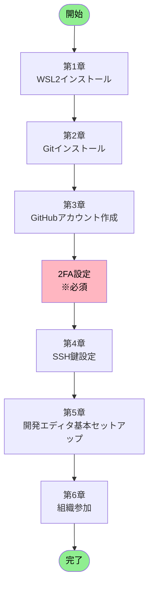

# GitHub 環境構築ガイド

**エス・エー・エス株式会社**
*開発環境のセットアップから GitHubアカウント設定まで完全ガイド*
*最終更新: 2025年10月10日*

---

## 📚 目次

1. **[🎯 はじめに](#-はじめに)**
   - 本ガイドの目的
   - 対象者
   - 所要時間と難易度

2. **[📋 全体構成と作業フロー](#-全体構成と作業フロー)**
   - 環境構築の全体像
   - 作業順序と依存関係
   - チェックリスト

3. **[🖥️ 第1章: WSL2環境の構築](#️-第1章-wsl2環境の構築)**
   - 事前確認事項
   - Windows機能の有効化
   - WSL2のインストール
   - Ubuntu初期設定
   - Windows Terminal活用（推奨）
   - トラブルシューティング

4. **[🔧 第2章: Git環境の構築](#-第2章-git環境の構築)**
   - Gitのインストール
   - Git初期設定
   - エイリアス設定

5. **[🌐 第3章: GitHubアカウントの設定](#-第3章-githubアカウントの設定)**
   - アカウント作成
   - プロフィール設定
   - セキュリティ設定（2FA必須）

6. **[🔑 第4章: SSH接続の設定](#-第4章-ssh接続の設定)**
   - SSH鍵の生成
   - GitHubへの登録
   - 接続テスト

7. **[💻 第5章: 開発エディタの基本セットアップ](#-第5章-開発エディタの基本セットアップ)**
   - VS Codeのインストール（推奨）
   - Eclipseのインストール（Java開発者向け）
   - IDE統合設定（次のステップ）

8. **[🏢 第6章: 組織への参加と最終設定](#-第6章-組織への参加と最終設定)**
   - 組織への参加
   - 通知設定
   - 最終確認

9. **[❓ 付録: トラブルシューティング](#-付録-トラブルシューティング)**
10. **[📞 サポート情報](#-サポート情報)**

---

## 🎯 はじめに

### 📌 本ガイドの目的

このガイドは、エス・エー・エス株式会社で GitHub を使った開発を始めるために必要な環境構築を、**ゼロから完全にサポート**します。

### 👥 対象者

- 新規参画者（エンジニア）
- GitHub環境を再構築する必要がある方
- Windows11環境で開発を行う方

### ⏱️ 所要時間と難易度

| カテゴリ | 所要時間 | 難易度 |
|---------|----------|--------|
| **全体所要時間** | **1-1.5時間** | **★★☆** |
| 第1章: WSL2のインストール | 15-30分 | ★★☆ |
| 第2章: Gitのセットアップ | 10-15分 | ★☆☆ |
| 第3章: GitHubアカウント設定 | 20-30分 | ★☆☆ |
| 第4章: SSH接続設定 | 10-15分 | ★★☆ |
| 第5章: 開発エディタ基本セットアップ | 5-10分 | ★☆☆ |
| 第6章: 最終確認 | 5-10分 | ★☆☆ |

---

## 📋 全体構成と作業フロー

### 🗺️ 環境構築の全体像



### 📝 作業の依存関係

| 順序 | 作業項目 | 前提条件 | 必須/任意 |
|------|----------|----------|-----------|
| 1 | 第1章: WSL2インストール | Windows11環境 | 必須 |
| 2 | 第2章: Gitインストール | WSL2完了 | 必須 |
| 3 | 第3章: GitHubアカウント作成 | なし | 必須 |
| 4 | 第3章: 2FA設定 | GitHubアカウント | **必須** |
| 5 | 第4章: SSH鍵設定 | Git設定完了 | 必須 |
| 6 | 第5章: 開発エディタ基本セットアップ | SSH設定完了 | 必須 |
| 7 | 第6章: 組織参加 | 2FA設定完了 | 必須 |

### ✅ マスターチェックリスト

#### 📦 環境準備フェーズ
- [ ] OS要件を満たしている（Windows11）
- [ ] 管理者権限がある
- [ ] インターネット接続が安定している

#### 🔧 セットアップフェーズ
- [ ] 第1章: WSL2インストール完了
- [ ] 第2章: Gitインストール完了
- [ ] 第2章: Git初期設定完了（user.name, user.email）

#### 🌐 GitHubフェーズ
- [ ] 第3章: GitHubアカウント作成完了
- [ ] 第3章: プロフィール設定完了
- [ ] 第3章: **2FA設定完了（必須）**
- [ ] 第3章: リカバリーコード保管完了

#### 🔑 接続フェーズ
- [ ] 第4章: SSH鍵生成完了
- [ ] 第4章: GitHub登録完了
- [ ] 第4章: 接続テスト成功

#### 💻 エディタフェーズ
- [ ] 第5章: 開発エディタ（VS CodeまたはEclipse）インストール完了
- [ ] 第5章: WSL2連携設定完了

#### 🏢 最終フェーズ
- [ ] 第6章: 組織参加完了
- [ ] 第6章: 通知設定完了
- [ ] 第6章: 動作確認完了

---

## 🖥️ 第1章: WSL2環境の構築

### 📊 章の概要

| 項目 | 内容 |
|------|------|
| **目的** | Windows上でLinux開発環境を構築 |
| **所要時間** | 15-30分（再起動含む） |
| **難易度** | ★★☆ |
| **必要権限** | 管理者権限 |

---

### 1.1 事前確認（必須）

#### 🔍 システム要件チェック

**手順1: Windowsバージョン確認**

PowerShellを**管理者として実行**し、以下のコマンドを実行：

```powershell
# Windowsバージョンを確認
winver
```

**必要要件：**
- ✅ Windows11（推奨OS）
- ✅ x64システム（64ビット版）

#### 🔍 仮想化機能チェック

**手順2: 仮想化の有効確認**

1. `Ctrl + Shift + Esc` でタスクマネージャーを開く
2. 「パフォーマンス」タブ → 「CPU」を選択
3. 右下に「**仮想化: 有効**」と表示されていることを確認

**仮想化が無効の場合：**
1. PCを再起動し、BIOS/UEFI設定画面へ（F2, F10, Delキーなど）
2. 以下を有効化：
   - Intel CPU: **Intel VT-x** → Enabled
   - AMD CPU: **AMD-V / SVM Mode** → Enabled
3. 設定を保存して再起動

#### 🔍 Windows機能の状態確認

**手順3: 必要機能の確認**

```powershell
# PowerShell（管理者）で実行
Get-WindowsOptionalFeature -Online | Where-Object {
    $_.FeatureName -like "*Linux*" -or
    $_.FeatureName -like "*VirtualMachinePlatform*"
} | Format-Table FeatureName, State -AutoSize
```

**期待される結果：**

| 機能名 | 必要な状態 | 説明 |
|--------|------------|------|
| Microsoft-Windows-Subsystem-Linux | Enabled | Linux基盤機能 |
| VirtualMachinePlatform | Enabled | 仮想化プラットフォーム |

**もし上記の機能が「Disabled」の場合：**

以下のコマンドを実行して有効化してください：

```powershell
# PowerShell（管理者）で実行
# Microsoft-Windows-Subsystem-Linux を有効化
Enable-WindowsOptionalFeature -Online -FeatureName Microsoft-Windows-Subsystem-Linux -All -NoRestart

# VirtualMachinePlatform を有効化
Enable-WindowsOptionalFeature -Online -FeatureName VirtualMachinePlatform -All -NoRestart

# 両方の機能を有効化したら、必ずPCを再起動
Restart-Computer
```

> ⚠️ **重要**: これらの機能が無効の場合、この手順で有効化してから次のセクション「1.2 Windows機能の有効化」に進んでください。すでに両方が「Enabled」になっている場合は、1.2のセクションはスキップして「1.3 WSL2のインストール」に進むことができます。

---

### 1.2 Windows機能の有効化

> ⚠️ **重要な注意事項**  
> Windows機能を有効化する方法は**3つ**あります。どれか**1つ**を選んで実行してください。

#### 📊 有効化方法の比較

| 方法 | 推奨度 | 特徴 | 適している人 |
|------|--------|------|--------------|
| **方法A: PowerShell** | ⭐⭐⭐ | コマンド2つで完了 | コマンド操作に慣れている人 |
| **方法B: DISM** | ⭐⭐ | 詳細な制御が可能 | トラブル時の代替手段 |
| **方法C: GUI** | ⭐ | 視覚的で分かりやすい | コマンドが苦手な人 |

---

#### 📝 方法A: PowerShellで有効化（推奨）

PowerShellを**管理者として実行**：

```powershell
# ステップ1: Linux用サブシステムを有効化
Enable-WindowsOptionalFeature -Online -FeatureName Microsoft-Windows-Subsystem-Linux -All -NoRestart

# ステップ2: 仮想マシンプラットフォームを有効化
Enable-WindowsOptionalFeature -Online -FeatureName VirtualMachinePlatform -All -NoRestart

# ステップ3: 有効化を確認
Get-WindowsOptionalFeature -Online -FeatureName Microsoft-Windows-Subsystem-Linux
Get-WindowsOptionalFeature -Online -FeatureName VirtualMachinePlatform

# 両方が "State : Enabled" になっていることを確認

# ステップ4: PCを再起動（必須）
Restart-Computer
```

---

#### 📝 方法B: DISMコマンドで有効化

PowerShellを**管理者として実行**：

```powershell
# ステップ1: Linux用サブシステムを有効化
dism.exe /online /enable-feature /featurename:Microsoft-Windows-Subsystem-Linux /all /norestart

# ステップ2: 仮想マシンプラットフォームを有効化
dism.exe /online /enable-feature /featurename:VirtualMachinePlatform /all /norestart

# "The operation completed successfully." と表示されれば成功

# ステップ3: PCを再起動（必須）
Restart-Computer
```

---

#### 📝 方法C: GUIで有効化

1. **Windows機能の画面を開く**
   - `Win + R` → `optionalfeatures` と入力 → Enter

2. **以下の機能にチェックを入れる**
   - ☑ **Linux 用 Windows サブシステム**（必須）
   - ☑ **仮想マシン プラットフォーム**（必須）

3. **OKをクリック** → 変更を適用

4. **PCを再起動**（必須）

---

### 1.3 WSL2のインストール

> 🎯 **インストール方法の選択**
> WSL2のインストールには**3つの方法**があります。状況に応じて選択してください。

#### 📋 インストール方法の一覧

| 方法 | 推奨度 | 特徴 | 適している人 |
|------|--------|------|--------------|
| **方法1: 簡単インストール** | ⭐⭐⭐ | コマンド1つで完了<br/>Ubuntu-24.04が自動インストール | 初めてWSL2を使う人<br/>推奨ディストリビューションで良い人 |
| **方法2: 手動インストール** | ⭐⭐ | ディストリビューション選択可能<br/>詳細な制御が可能 | 特定のディストリビューションが必要な人<br/>以前エラーが発生した人 |
| **方法3: Microsoft Store** | ⭐ | GUI操作で分かりやすい | コマンド操作が苦手な人 |

#### 💡 ディストリビューション選択ガイド

**主要ディストリビューション一覧：**

| ディストリビューション | 系統 | 用途/特徴 | パッケージマネージャー | 推奨度 | 備考 |
|---------------------|------|-----------|----------------------|--------|------|
| **Ubuntu** | Debian系 | 開発環境として最適 | apt | ⭐⭐⭐ | **SAS標準開発環境**<br/>豊富なパッケージと安定性<br/>チーム内サポート体制完備 |
| **Debian** | Debian系 | Ubuntuの基礎ディストリビューション | apt | ⭐⭐ | より軽量で安定性重視<br/>Ubuntuより保守的 |
| **Amazon Linux** | Red Hat系 | AWS環境向けに最適化 | yum/dnf | ⭐⭐ | **AWSサーバ用途**<br/>EC2での動作に特化 |
| **Rocky Linux** | Red Hat系 | CentOSの後継（エンタープライズ） | dnf/yum | ⭐⭐ | Red Hat互換性重視<br/>サーバー環境向け |
| **CentOS Stream** | Red Hat系 | Red Hatベースの開発版 | dnf/yum | ⭐ | ローリングリリース型<br/>サーバー用途向け |
| **Fedora** | Red Hat系 | 最新技術を取り入れた先進的OS | dnf | ⭐ | 実験的要素が多い<br/>頻繁なアップデート |
| **Alpine** | 独立系 | 軽量コンテナ向け | apk | ⭐ | Dockerコンテナ専用<br/>開発環境には不向き |
| **Kali Linux** | Debian系 | セキュリティテスト/ペネトレーション | apt | ⭐ | 特殊用途専用<br/>セキュリティ専門家向け |
| **openSUSE** | 独立系 | 企業向けエンタープライズLinux | zypper | ⭐ | Ubuntuより複雑な設定<br/>YaST管理ツール特徴 |
| **Arch Linux** | 独立系 | ローリングリリース型 | pacman | ⭐ | 上級者向け<br/>手動設定多数・高カスタマイズ性 |

---

#### 🔍 サーバ環境との互換性について

**Amazon Linuxサーバを利用する場合：**

| 項目 | 詳細 |
|------|------|
| **開発環境** | Ubuntu 24.04 LTS（推奨） |
| **本番サーバ** | Amazon Linux 2023 |
| **互換性** | ✅ 問題なし |

**理由と推奨事項：**

1. **開発環境はUbuntuで問題なし**
   - モダンな開発ツール（Docker、Node.js、Python等）は両環境で動作
   - Git操作、エディタ、CI/CDツールは環境非依存
   - 主要な開発フローは影響を受けない

2. **両環境の違いを理解して開発**
   - パッケージマネージャーの違い（apt vs yum/dnf）
   - 一部のシステムパッケージ名の違い
   - デフォルトのディレクトリ構成の違い

3. **本番環境との差異を吸収する方法**
   - **Docker使用（推奨）**: コンテナで環境を統一
   - **CI/CD環境**: Amazon Linuxベースのテスト環境を構築
   - **IaC（Infrastructure as Code）**: Terraform等で環境を管理

**実務での推奨構成：**

```
【開発環境】WSL2 Ubuntu 24.04 LTS
    ↓
  Docker コンテナ (Amazon Linux イメージ)
    ↓
【本番環境】Amazon Linux 2023 on EC2
```

> ✅ **結論**: AWSでAmazon Linuxを使用する場合でも、開発環境は**Ubuntu 24.04 LTS**の選択で問題ありません。
> Dockerやコンテナ技術を活用することで、環境の差異を吸収できます。

> ⚠️ **注意**: 特別な理由がない限り、開発環境は**Ubuntu-24.04 LTS**の使用を強く推奨します。

#### 🗺️ インストール方法選択フローチャート


---

#### ✨ 方法1: 簡単インストール（推奨）

PowerShellを**管理者として実行**：

```powershell
# WSL2と既定のUbuntuを一括インストール
wsl --install

# インストール完了メッセージを確認
# "The requested operation is successful..."

# PCを再起動（必須）
Restart-Computer
```

> 📌 **インストールされるディストリビューション**
> `wsl --install`コマンドを実行すると、**Ubuntu-24.04 LTS**（または最新のLTSバージョン）が既定でインストールされます。
> これはMicrosoftが推奨する安定版ディストリビューションです。

**再起動後：**
- Ubuntu-24.04が自動的に起動
- ユーザー名とパスワードを設定（詳細は1.4参照）

---

#### 🔧 方法2: 手動インストール

**ステップ1: WSLカーネル更新**

```powershell
# WSLカーネルを最新版に更新
wsl --update

# WSL2を既定に設定
wsl --set-default-version 2
```

**ステップ2: ディストリビューション選択**

```powershell
# 利用可能な一覧を確認
wsl --list --online

# Ubuntu-24.04をインストール（推奨）
wsl --install -d Ubuntu-24.04

# または他のバージョン（例）
# wsl --install -d Ubuntu-22.04
# wsl --install -d Debian
```

---

#### 🖱️ 方法3: Microsoft Store経由

1. Microsoft Storeを開く
2. 「Ubuntu」で検索
3. 「Ubuntu 24.04 LTS」を選択（推奨）
4. インストールをクリック

> 📝 **バージョン選択について**
> Microsoft Storeでは複数のUbuntuバージョンが表示されますが、**Ubuntu 24.04 LTS**（最新のLong Term Support版）を選択してください。

---

### 1.4 Ubuntu初期設定

Ubuntu初回起動時の設定手順です。

> 💡 **パスワードについて重要な説明**
> ここで設定するパスワードは、**Linuxシステムの管理者（root権限を持つユーザー）のパスワード**です。
> - このパスワードは`sudo`コマンド実行時に必要になります
> - システム設定変更やソフトウェアインストール時に使用します
> - **忘れないように必ずメモを取ってください**
> - セキュリティのため、8文字以上の複雑なパスワードを推奨します

#### 初回起動時の設定

```bash
# ユーザー名を入力（英数字小文字、記号不可）
Enter new UNIX username: yourname

# パスワードを設定（※入力中は画面に表示されません）
# このパスワードはLinuxのroot権限ユーザーのパスワードです
New password:
Retype new password:

# パスワード設定完了後、基本パッケージを更新
sudo apt update && sudo apt upgrade -y

# 開発ツールをインストール
sudo apt install -y git curl wget build-essential
```

> ⚠️ **パスワードの取り扱い**
> - パスワードは入力中に画面に表示されません（セキュリティのため）
> - `sudo`コマンド実行時にこのパスワードを求められます
> - パスワードを忘れた場合、WSL2のリセットが必要になる場合があります

---

### 1.5 トラブルシューティング

#### ❌ エラー 0x80370114

**原因と解決方法：**

| 原因 | 確認方法 | 解決方法 |
|------|----------|----------|
| 仮想化が無効 | タスクマネージャーで確認 | BIOSで有効化 |
| Windows機能が無効 | `Get-WindowsOptionalFeature`で確認 | 1.2の手順を実行 |
| WSLカーネルが古い | `wsl --status`で確認 | `wsl --update`を実行 |

#### ❌ その他のエラー

<details>
<summary>クリックして詳細を表示</summary>

**エラー 0x800701bc:**
```powershell
# WSL2カーネル未インストール
wsl --update
```

**エラー 0x80370102:**
```powershell
# 仮想マシン起動失敗
bcdedit /set hypervisorlaunchtype auto
Restart-Computer
```

**エラー 0x80040326:**
```powershell
# WSL機能が無効
dism.exe /online /enable-feature /featurename:Microsoft-Windows-Subsystem-Linux /all
Restart-Computer
```

</details>

---

### 1.6 Windows Terminal の活用（任意）

> ⚠️ **利用は任意です**
> Windows Terminalの利用は**任意**です。標準のコマンドプロンプトやPowerShellでも全ての作業を行うことができます。
> より快適な開発体験を求める方は、以下の活用ガイドをご参照ください。

#### 💡 Windows Terminal とは

Windows Terminal は Microsoft が開発した新しいターミナルアプリケーションで、PowerShell と WSL2 の両方で優れた体験を提供します。

**主な特徴：**
- タブ機能で複数のセッションを管理
- 画面分割（ペイン）でコマンドとログを同時表示
- Unicode完全サポート（日本語表示が美しい）
- 豊富なテーマとカスタマイズオプション
- Ctrl+C/Vで直感的なコピー＆ペースト

**開発効率への影響：**
- Git操作の快適性が向上
- 複数プロジェクトの並行作業が簡単
- WSL2とPowerShellの瞬時な切り替え
- ログ確認とコマンド実行を同時に実行可能

#### 📥 簡単なインストール方法

**Microsoft Store（推奨）：**
1. Microsoft Storeを開く
2. 「Windows Terminal」で検索
3. インストールをクリック

#### 📚 詳細な活用ガイド

Windows Terminalの詳細な設定方法、ショートカット、トラブルシューティングについては、専用の活用ガイドをご参照ください：

**🔗 [Windows Terminal 活用ガイド](../implementation/WINDOWS_TERMINAL_GUIDE.md)**

活用ガイドの内容：
- インストール方法の詳細（3つの方法）
- 基本設定とWSL2連携設定
- 効率的な使い方とショートカット一覧
- テーマとフォントのカスタマイズ
- トラブルシューティング
- 実践的な活用例

> 📝 **次のステップ**
> WSL2の基本設定が完了したら、[第2章: Git環境の構築](#-第2章-git環境の構築) に進んでください。
> Windows Terminalは後からでもインストール可能です。

---

## 🔧 第2章: Git環境の構築

### 📊 章の概要

| 項目 | 内容 |
|------|------|
| **目的** | バージョン管理システムGitのセットアップ |
| **所要時間** | 10-15分 |
| **難易度** | ★☆☆ |
| **前提条件** | WSL2完了 |

---

### 2.1 Gitのインストール

**WSL2のUbuntu内で実行：**

```bash
# WSL2のUbuntu内で実行
sudo apt update
sudo apt install -y git

# インストール確認
git --version
# 出力例: git version 2.34.1
```

---

### 2.2 Git初期設定

**必須設定の実行：**

```bash
# ========== 基本情報設定 ==========
# 名前（英語推奨：国際チーム連携、ASCII互換性、GitHub表示最適化のため）
# GitHubユーザー名と同じ形式を使用: [名英字]-[姓英字]
git config --global user.name "taro-yamada"

# メールアドレス（会社用、標準ドメイン使用）
git config --global user.email "yamada@sas-com.com"

# ========== エディタ設定 ==========
# VS Code を使用する場合（第2章でVS Codeをインストール済みの場合）
git config --global core.editor "code --wait"

# ========== 日本語対応 ==========
# ファイル名の文字化け防止
git config --global core.quotepath false

# ========== 改行コード設定 ==========
# Windows11標準設定
git config --global core.autocrlf input
git config --global core.eol lf

# ========== 動作設定 ==========
git config --global push.default current
git config --global pull.rebase false
git config --global color.ui auto

# ========== 設定確認 ==========
git config --global --list
```

#### 📋 設定ガイドラインと標準化について

**名前設定（user.name）について：**
- ✅ **英語名を強く推奨**：国際チーム連携、ASCII互換性、GitHub表示最適化
- ✅ **推奨パターン**：GitHubユーザー名と同じ `[名英字]-[姓英字]` 形式
  ```bash
  # 良い例（GitHubユーザー名と一致する形式）
  git config --global user.name "taro-yamada"
  git config --global user.name "hanako-sato"
  git config --global user.name "kenji-tanaka"
  ```
- ⚠️ **使用可能だが推奨しない**：
  ```bash
  # 日本語名（表示問題やファイル名競合の可能性）
  git config --global user.name "山田 太郎"
  ```

**メールアドレス（user.email）について：**
- ✅ **標準ドメイン**: `@sas-com.com` を使用
- ✅ **推奨パターン**：
  ```bash
  # 良い例
  git config --global user.email "yamada@sas-com.com"
  git config --global user.email "tanaka@sas-com.com"
  git config --global user.email "sato.hanako@sas-com.com"
  ```
- ❌ **使用禁止**：
  ```bash
  # 古いドメイン（統一性のため使用禁止）
  git config --global user.email "yamada@sas-com.co.jp"
  
  # 個人用アドレス（セキュリティポリシー違反）
  git config --global user.email "yamada@gmail.com"
  ```

**設定の理由：**
- **English名（ハイフン形式）**: GitHubユーザー名との一致、国際チーム連携、文字エンコーディング問題回避、統一的な識別子管理
- **標準ドメイン**: セキュリティポリシー統一、管理体制の一元化、将来的なシステム統合

---

### 2.3 エイリアス設定（任意）

```bash
# よく使うコマンドの短縮形
git config --global alias.st status
git config --global alias.co checkout
git config --global alias.br branch
git config --global alias.ci commit
git config --global alias.lg "log --graph --oneline --all"
```

> 📝 **次のステップ**
> Git環境の構築が完了したら、[第3章: GitHubアカウントの設定](#-第3章-githubアカウントの設定) に進んでください。

---

## 🌐 第3章: GitHubアカウントの設定

### 📊 章の概要

| 項目 | 内容 |
|------|------|
| **目的** | GitHubアカウントの作成とセキュリティ設定 |
| **所要時間** | 20-30分 |
| **難易度** | ★☆☆ |
| **重要事項** | 2FA設定は**必須** |

---

### 3.1 アカウント作成

#### 新規作成の手順

1. **GitHubにアクセス**
   ```
   https://github.com
   ```

2. **Sign up をクリック**

3. **必要情報を入力**

   | 項目 | 入力内容 | 推奨例 |
   |------|----------|--------|
   | **Username** | 英数字とハイフン<br/>**形式: [名]-[姓]** | taro-yamada<br/>hanako-sato<br/>kenji-tanaka |
   | **Email** | 会社メールアドレス | yamada@sas-com.com |
   | **Password** | 15文字以上 | 大小英数字記号を含む |

   > 📝 **Username設定ガイドライン**
   >
   > **推奨形式:** `[名英字]-[姓英字]`（例：taro-yamada）
   >
   > **なぜこの形式を推奨するのか：**
   > - **一貫性の確保**: 組織内で統一されたネーミングルールによる管理の容易さ
   > - **国際的な可読性**: グローバルチームやオープンソースプロジェクトでの認識しやすさ
   > - **Git設定との整合性**: user.name の英語名設定（Taro Yamada）と一致
   > - **プロフェッショナルな印象**: ビジネス環境での信頼性向上
   >
   > **具体例：**
   > - ✅ **良い例**:
   >   - `taro-yamada` （山田太郎）
   >   - `hanako-sato` （佐藤花子）
   >   - `kenji-tanaka` （田中健二）
   >   - `yuki-suzuki` （鈴木由紀）
   > - ⚠️ **避けるべき例**:
   >   - `yamadataro` （ハイフンなし、読みにくい）
   >   - `t-yamada` （イニシャルのみ、識別困難）
   >   - `taro123` （姓なし、プロフェッショナルでない）
   >   - `cooldev2025` （ニックネーム形式）

4. **メール認証**
   - 6桁のコードを入力

#### 既存アカウントの利用

<details>
<summary>個人アカウントを業務利用する場合</summary>

**設定手順：**
1. Settings → Emails → Add email address
2. 会社メールアドレスを追加
3. 必要に応じてPrimaryに設定

**メリット：**
- コントリビューション履歴を維持
- アカウント管理が簡単

</details>

---

### 3.2 プロフィール設定

**Settings → Profile で設定：**

| 項目 | 設定内容 | 例 |
|------|----------|-----|
| **Name** | 本名（日本語可） | 山田 太郎 |
| **Bio** | 簡単な自己紹介 | Software Engineer at SAS Inc. |
| **Company** | 会社名 | @sas-com |
| **Location** | 勤務地 | Tokyo, Japan |
| **Avatar** | プロフィール画像 | 400×400px以上推奨 |

---

### 3.3 セキュリティ設定（最重要）

#### 🔐 2要素認証（2FA）の設定 ※必須

> ⚠️ **重要**
> 2FAを設定しないと組織に参加できません。必ず設定を完了してください。

---

##### 📋 2FA設定の概要と所要時間

| 項目 | 内容 |
|------|------|
| **全体所要時間** | 約10-15分 |
| **必要なもの** | スマートフォン（認証アプリ用） |
| **設定タイミング** | アカウント作成後すぐに |
| **優先度** | **最重要（必須）** |

---

##### 🗺️ 2FA設定への詳細ナビゲーション

###### **ステップ1: GitHubへサインイン（所要時間: 1分）**

1. **ブラウザでGitHubを開く**
   - URL: `https://github.com`
   - 推奨ブラウザ: Chrome, Firefox, Edge

2. **サインインボタンをクリック**
   - **場所**: 画面右上の「Sign in」ボタン（白背景に黒文字）
   - **日本語表示の場合**: 「サインイン」と表示

3. **ログイン情報を入力**
   - Username または Email を入力
   - Password を入力
   - 「Sign in」ボタンをクリック（緑色の大きなボタン）

---

###### **ステップ2: 設定画面への移動（所要時間: 30秒）**

1. **プロフィールメニューを開く**
   - **場所**: 画面右上のプロフィールアイコン（丸い画像）をクリック
   - **見た目**:
     - デフォルトは紫色系のアバター画像
     - カスタム設定済みの場合は自分の画像
   - **サイズ**: 約40×40ピクセルの円形

2. **Settingsを選択**
   - **場所**: ドロップダウンメニューの下から3番目あたり
   - **表示**: 「Settings」（歯車アイコン付き）
   - **日本語表示の場合**: 「設定」と表示
   - クリックすると設定画面に遷移

---

###### **ステップ3: セキュリティ設定画面へ（所要時間: 30秒）**

1. **左サイドバーを確認**
   - **場所**: 画面左側の縦長メニュー
   - **背景色**: 白またはダークモード時は暗い色
   - **項目数**: 約20項目程度

2. **Access セクションを探す**
   - **場所**: サイドバーの上から約1/3の位置
   - **見出し**: 「Access」という小見出しがある

3. **「Password and authentication」をクリック**
   - **場所**: Accessセクション内の最初の項目
   - **アイコン**: 鍵マークが付いている
   - **日本語表示**: 「パスワードと認証」
   - **文字色**: 通常は青色のリンク

---

###### **ステップ4: 2FA設定の開始（所要時間: 1分）**

1. **Two-factor authentication セクションを確認**
   - **場所**: ページの中央部分
   - **見出し**: 「Two-factor authentication」という大きな見出し
   - **背景**: 薄い灰色のボックス内

2. **現在のステータスを確認**
   - **未設定の場合**: 「Two-factor authentication is not enabled yet」と表示
   - **表示色**: オレンジ色の警告表示

3. **「Enable two-factor authentication」ボタンをクリック**
   - **場所**: セクション内の緑色の大きなボタン
   - **サイズ**: 横幅約200px、高さ約40px
   - **文字**: 白文字で表示
   - **日本語表示**: 「2要素認証を有効にする」

---

###### **ステップ5: 認証方法の選択（所要時間: 2分）**

1. **認証方法選択画面が表示される**
   - **タイトル**: 「Setup two-factor authentication」
   - **説明文**: セキュリティ向上についての説明が表示

2. **「Set up using an app」を選択（推奨）**
   - **場所**: 2つの選択肢の上側
   - **ラジオボタン**: 丸い選択ボタンをクリック
   - **推奨理由**: SMS より安全で確実

3. **代替オプション（非推奨）**
   - 「Set up using SMS」: 電話番号を使用
   - **注意**: 日本の番号は +81 から始まる

---

###### **ステップ6: 認証アプリの準備（所要時間: 3分）**

1. **スマートフォンで認証アプリをインストール**

   **推奨アプリと入手方法：**

   | アプリ名 | 対応OS | ダウンロード方法 | 特徴 |
   |---------|--------|-----------------|------|
   | **Google Authenticator** | iOS/Android | App Store/Play Store で「Google認証」検索 | シンプルで使いやすい |
   | **Microsoft Authenticator** | iOS/Android | App Store/Play Store で「Microsoft認証」検索 | バックアップ機能充実 |
   | **Authy** | iOS/Android | App Store/Play Store で「Authy」検索 | 複数デバイス同期可能 |

2. **アプリを起動**
   - 初回起動時は簡単な設定が必要
   - 「アカウントを追加」または「+」ボタンを探す

---

###### **ステップ7: QRコードのスキャン（所要時間: 2分）**

1. **GitHub画面でQRコードを確認**
   - **場所**: 画面中央に大きく表示
   - **サイズ**: 約200×200ピクセルの正方形
   - **見た目**: 白黒のモザイク模様

2. **QRコードの下に表示される情報**
   - **Manual entry code**: QRコードが読めない場合の手動入力コード
   - **形式**: 英数字の文字列（例: ABCD EFGH IJKL MNOP）
   - **重要**: このコードも必ずメモしておく

3. **認証アプリでQRコードをスキャン**

   **Google Authenticatorの場合：**
   - アプリ内の「+」ボタンをタップ
   - 「QRコードをスキャン」を選択
   - カメラが起動したらQRコードを枠内に収める
   - 自動的に読み取られる

   **Microsoft Authenticatorの場合：**
   - 「アカウントを追加」をタップ
   - 「その他（Google、Facebookなど）」を選択
   - QRコードをスキャン

4. **手動入力が必要な場合**
   - アプリで「手動で入力」を選択
   - アカウント名: GitHub（または自分で識別できる名前）
   - キー: Manual entry codeを入力
   - 種類: 時間ベース（TOTP）を選択

---

###### **ステップ8: 認証コードの入力（所要時間: 1分）**

1. **認証アプリに表示される6桁のコード確認**
   - **表示場所**: アプリ内のGitHubアカウント欄
   - **形式**: 6桁の数字（例: 123 456）
   - **有効時間**: 30秒ごとに変更される
   - **表示**: 残り時間がバーや円で表示される

2. **GitHubページでコードを入力**
   - **入力欄**: 「Verify the code from the app」の下
   - **フォーマット**: 6桁の数字を入力
   - **注意**: スペースは不要（123456と続けて入力）

3. **「Continue」ボタンをクリック**
   - **場所**: 入力欄の下
   - **色**: 緑色のボタン
   - **注意**: 30秒以内に入力完了する

---

###### **ステップ9: リカバリーコードの保存（所要時間: 2分）**

> ⚠️ **超重要**: この手順を絶対にスキップしないでください！

1. **リカバリーコード画面が表示される**
   - **タイトル**: 「Save your recovery codes」
   - **内容**: 16個の8文字コードが表示

2. **リカバリーコードの形式**
   ```
   abcd-1234
   efgh-5678
   ijkl-9012
   ... (計16個)
   ```

3. **保存方法（すべて実施を推奨）**

   **方法A: ダウンロード保存**
   - 「Download」ボタンをクリック
   - `github-recovery-codes.txt`ファイルがダウンロードされる
   - 安全な場所に移動

   **方法B: 印刷保存**
   - 「Print」ボタンをクリック
   - 印刷して会社の金庫等に保管

   **方法C: パスワードマネージャーに保存**
   - 1Password、Bitwarden等を使用
   - セキュアノートとして保存

   **方法D: 手動でメモ**
   - 紙に手書きで記録
   - 複数箇所に分けて保管

4. **「I have saved my recovery codes」にチェック**
   - **場所**: ページ下部のチェックボックス
   - **必須**: チェックしないと次に進めない

5. **「Continue」ボタンをクリック**

---

###### **ステップ10: 設定完了の確認（所要時間: 1分）**

1. **成功メッセージの確認**
   - **表示**: 「Two-factor authentication enabled」
   - **色**: 緑色のチェックマーク付き
   - **意味**: 2FA設定が正常に完了

2. **設定状況の最終確認**
   - Password and authentication ページに戻る
   - Two-factor authentication: **Enabled** と表示
   - Configured と緑色で表示されていることを確認

---

##### 🔍 2FA設定後の動作確認

###### **テストログイン手順**

1. **一度ログアウト**
   - 右上のプロフィールアイコン → Sign out

2. **再度ログイン**
   - Username/Email とPassword を入力
   - 新たに「Authentication code」入力画面が表示

3. **認証アプリでコード確認**
   - アプリを開いてGitHubの6桁コードを確認
   - コードを入力して「Verify」をクリック

4. **ログイン成功**
   - 通常のGitHub画面が表示されれば成功

---

##### 🛠️ トラブルシューティング

###### **よくある問題と解決方法**

| 問題 | 原因 | 解決方法 |
|------|------|----------|
| **QRコードが読めない** | カメラの権限がない | アプリの設定でカメラ権限を許可 |
| **6桁コードが無効** | 時刻がずれている | スマホの時刻を自動設定に |
| **設定画面が見つからない** | UIバージョンの違い | 右上メニュー → Settings を確実に選択 |
| **認証アプリが開けない** | アプリの不具合 | アプリを再インストール |
| **Recovery codesを失くした** | 保存忘れ | Settings → 2FA → View recovery codes |

###### **緊急時の対処法**

1. **スマートフォンを紛失した場合**
   - Recovery codesを使用してログイン
   - 新しいデバイスで2FAを再設定

2. **Recovery codesも紛失した場合**
   - GitHub Support に連絡
   - 本人確認後、アカウント回復支援

3. **認証アプリが故障した場合**
   - バックアップコードを使用
   - SMS認証に一時的に切り替え

---

##### 📝 2FA設定チェックリスト

**設定前の準備：**
- [ ] スマートフォンを用意
- [ ] 認証アプリをインストール
- [ ] 安定したインターネット接続

**設定中：**
- [ ] GitHubにログイン完了
- [ ] Settings → Password and authentication に移動
- [ ] Enable two-factor authenticationをクリック
- [ ] 認証アプリを選択
- [ ] QRコードをスキャン完了
- [ ] 6桁コードの入力成功
- [ ] Recovery codesを保存（3箇所以上推奨）

**設定後：**
- [ ] 設定完了メッセージを確認
- [ ] 一度ログアウトして再ログインテスト
- [ ] Recovery codesを安全な場所に保管
- [ ] チームリーダーに設定完了を報告

---

##### 🌏 日本語インターフェースでの操作

GitHubを日本語表示にしている場合の対応表：

| 英語表示 | 日本語表示 |
|----------|------------|
| Settings | 設定 |
| Password and authentication | パスワードと認証 |
| Two-factor authentication | 2要素認証 |
| Enable two-factor authentication | 2要素認証を有効にする |
| Set up using an app | アプリを使用して設定 |
| Verify | 確認 |
| Recovery codes | リカバリーコード |
| Continue | 続ける |
| Download | ダウンロード |
| Save | 保存 |

> 💡 **ヒント**: 日本語表示で分かりにくい場合は、一時的に英語表示に切り替えることをお勧めします。
> Settings → Appearance → Language → English に変更可能です。

> 📝 **次のステップ**
> GitHubアカウントの設定が完了したら、[第4章: SSH接続の設定](#-第4章-ssh接続の設定) に進んでください。

---

## 🔑 第4章: SSH接続の設定

### 📊 章の概要

| 項目 | 内容 |
|------|------|
| **目的** | GitHubへの安全な接続設定 |
| **所要時間** | 10-15分 |
| **難易度** | ★★☆ |
| **前提条件** | GitHubアカウント作成済み |

---

### 4.1 SSH鍵の生成

**WSL2のUbuntu内で実行：**

```bash
# SSH鍵を生成（メールアドレスは自分のものに変更、標準ドメイン使用）
ssh-keygen -t ed25519 -C "yamada@sas-com.com"

# 以下が表示されたらEnterを3回押す
# Enter file in which to save the key: [Enter]
# Enter passphrase: [Enter]
# Enter same passphrase again: [Enter]

# 生成確認
ls -la ~/.ssh/
# id_ed25519（秘密鍵）とid_ed25519.pub（公開鍵）を確認
```

---

### 4.2 GitHubへの登録

```bash
# 公開鍵をコピー（WSL2の場合）
cat ~/.ssh/id_ed25519.pub | clip.exe
```

**GitHub側の設定：**

1. Settings → SSH and GPG keys → New SSH key
2. 以下を入力：
   - **Title**: SAS-PC-R-XXX-WSL2（PC識別ID-WSL2(固定文字)）
     - 例: `SAS-PC-R-001-WSL2`（PC識別IDがR-001の場合）
     - 例: `SAS-PC-R-123-WSL2`（PC識別IDがR-123の場合）
     - **注意**: XXXの部分は実際のPC識別IDに置き換えてください
   - **Key type**: Authentication Key
   - **Key**: コピーした公開鍵
3. Add SSH key をクリック

---

### 4.3 接続テスト

```bash
# SSH接続テスト
ssh -T git@github.com

# 初回接続時
# Are you sure you want to continue connecting? → yes

# 成功メッセージ
# Hi username! You've successfully authenticated...
```

---

## 🏢 第6章: 組織への参加と最終設定

### 📊 章の概要

| 項目 | 内容 |
|------|------|
| **目的** | 組織参加と環境設定の完了 |
| **所要時間** | 5-10分 |
| **難易度** | ★☆☆ |
| **前提条件** | 2FA設定完了 |

---

### 6.1 組織への参加

1. **招待メールを確認**
   - 件名: `You've been invited to join sas-com`

2. **View invitation をクリック**

3. **Join sas-com をクリック**

---

### 6.2 通知設定

**Settings → Notifications で設定：**

**推奨設定：**
- ✅ Comments on Issues and Pull Requests
- ✅ Pull Request reviews
- ✅ Pull Request pushes
- ⬜ Include your own updates

---

### 6.3 最終確認

#### ✅ 環境構築完了チェックリスト

**システム環境：**
- [ ] WSL2が正常動作
- [ ] 開発エディタ（VS CodeまたはEclipse）がインストール済み
- [ ] WSL2連携設定完了
- [ ] Gitがインストール済み
- [ ] Git設定が完了（user.name, user.email）

**GitHub環境：**
- [ ] GitHubにログイン可能
- [ ] 2FAが有効
- [ ] プロフィール設定完了

**接続環境：**
- [ ] SSH接続テスト成功
- [ ] 組織に参加済み
- [ ] 通知設定完了

**セキュリティ：**
- [ ] リカバリーコード保管済み
- [ ] 強力なパスワード設定済み

**次のステップ：**
- [ ] IDE統合設定ガイドを確認（VS CodeまたはEclipse）

---

## ❓ 付録: トラブルシューティング

### WSL2関連

<details>
<summary>🔧 Git操作が遅い</summary>

**原因：** Windows側のファイル（/mnt/c/）を使用

**解決方法：**
```bash
# WSL2内のファイルシステムを使用
cd ~/projects  # /mnt/c/ ではなく
```
</details>

<details>
<summary>🔧 エラー 0x80370114</summary>

**解決手順：**
1. タスクマネージャーで仮想化を確認
2. BIOSで仮想化を有効化
3. Windows機能を有効化
4. PCを再起動
</details>

### GitHub関連

<details>
<summary>🔧 2FA後にログインできない</summary>

**解決方法：**
1. リカバリーコードを使用
2. Settings → Password and authentication
3. 2FAを再設定
</details>

<details>
<summary>🔧 SSH接続が失敗する</summary>

```bash
# SSHエージェントを起動
eval "$(ssh-agent -s)"

# 鍵を追加
ssh-add ~/.ssh/id_ed25519

# デバッグ情報を表示
ssh -vT git@github.com
```
</details>

---

## 📞 サポート情報

### 連絡先

| 内容 | 連絡先 | 対応時間 |
|------|--------|----------|
| **通常サポート** | github@sas-com.com | 平日 9:00-18:00 |
| **緊急対応** | github@sas-com.com | 24時間 |
| **技術的質問** | github@sas-com.com | 平日 9:00-18:00 |

### 関連ドキュメント

**基本ドキュメント：**
- [全社GitHub運用ガイドライン](../../README.md)
- [新規参画者向けオンボーディング](../ONBOARDING.md)
- [クイックリファレンス](../../QUICK_REFERENCE.md)
- [緊急時対応マニュアル](../../EMERGENCY_RESPONSE.md)

**IDE統合ガイド（次のステップ）：**
- [VS Code Git統合完全ガイド](../implementation/IDE_VSCODE_GIT_GUIDE.md)
- [Eclipse Git統合完全ガイド](../implementation/IDE_ECLIPSE_GIT_GUIDE.md)

---

**© 2025 エス・エー・エス株式会社 - GitHub環境構築ガイド**