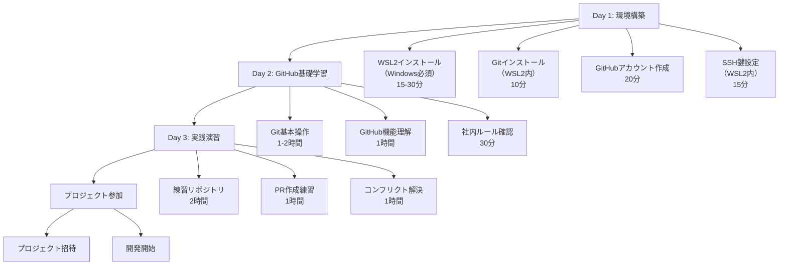
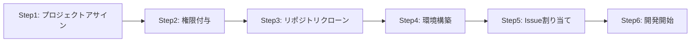
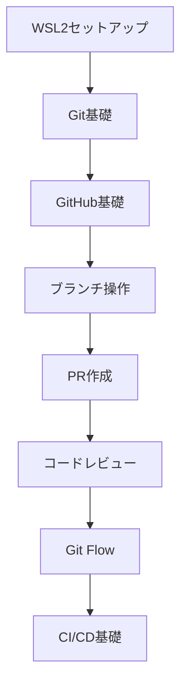

# 新規参画者向け GitHub オンボーディングガイド

**エス・エー・エス株式会社へようこそ！**  
*最終更新: 2025年9月5日*

## 📌 はじめに

このガイドは、エス・エー・エス株式会社のプロジェクトに新しく参画される方向けのGitHub利用開始ガイドです。
順番に進めることで、スムーズに開発業務を開始できます。

---

## 🗺️ オンボーディング全体の流れ

### 📅 完了目安: 2-3日



### ✅ チェックリスト

#### **Day 1: 環境構築**（所要時間: 約1-2時間）
- [ ] WSL2のインストール（Windows必須）
- [ ] Gitのインストールと初期設定
- [ ] GitHubアカウント作成と2FA設定
- [ ] SSH鍵の生成と登録
- [ ] 接続テスト

#### **Day 2: GitHub基礎学習**（所要時間: 約3-4時間）
- [ ] Git基本コマンドの理解
- [ ] ブランチの概念理解
- [ ] コミットメッセージ規約の確認
- [ ] PR（プルリクエスト）の仕組み理解
- [ ] 社内ガイドライン熟読

#### **Day 3: 実践演習**（所要時間: 約4時間）
- [ ] 練習リポジトリでの作業
- [ ] feature ブランチの作成
- [ ] コミットとプッシュ
- [ ] PRの作成とレビュー依頼
- [ ] コンフリクト解決の練習

#### **プロジェクト参加準備**
- [ ] プロジェクトへの招待承認
- [ ] プロジェクトリポジトリのクローン
- [ ] 開発環境の構築
- [ ] 初回タスクの確認

### 🎯 ゴール

このオンボーディングを完了すると、以下ができるようになります：

1. **Git/GitHubの基本操作** - クローン、コミット、プッシュ、PR作成
2. **社内ルールの理解** - コミットメッセージ規約、ブランチ戦略
3. **トラブル対応** - コンフリクト解決、よくあるエラーの対処
4. **セキュアな開発** - SSH接続、2FA設定、機密情報の取り扱い

---

## 📅 Day 1-3: 環境構築

### ✅ チェックリスト

#### 1. 環境構築（所要時間: 約1-2時間）
- [ ] WSL2のインストール（Windows必須）
- [ ] Gitのインストールと初期設定
- [ ] GitHubアカウント作成と2FA設定
- [ ] SSH鍵の生成と登録
- [ ] 接続テスト

📖 **完全な環境構築手順**: [GitHub環境構築ガイド](./GITHUB_ENVIRONMENT_SETUP.md)を参照

#### 2. 組織への参加
- [ ] 招待メールを確認
- [ ] エス・エー・エス株式会社のOrganizationに参加
- [ ] 所属チームの確認

---

## 📅 Day 4-7: 基本操作の習得

### 📚 必須学習項目

#### 1. Git基本コマンド

最低限覚えるコマンド：

| コマンド | 説明 | 使用頻度 |
|---------|------|----------|
| `git clone` | リポジトリをコピー | ⭐ |
| `git status` | 状態確認 | ⭐⭐⭐ |
| `git add` | ステージング | ⭐⭐⭐ |
| `git commit` | コミット | ⭐⭐⭐ |
| `git push` | アップロード | ⭐⭐⭐ |
| `git pull` | ダウンロード | ⭐⭐⭐ |
| `git checkout` | ブランチ切り替え | ⭐⭐ |
| `git branch` | ブランチ一覧 | ⭐⭐ |
| `git log` | 履歴確認 | ⭐ |

### 🎯 演習課題

> 💡 **注意**: GitHub利用経験のある方はこれらの演習課題の実施は不要です。次のセクション「📅 Week 2: プロジェクト参加準備」から開始してください。

以下の課題を順番に実施：

#### 課題0: 練習用リポジトリで基本実習

```bash
# WSL2/ターミナルで実行

# 作業ディレクトリを作成
mkdir ~/projects
cd ~/projects

# 練習用リポジトリをクローン
git clone git@github.com:sas-com/training-sandbox.git
cd training-sandbox

# 自分用のブランチを作成
git checkout -b training/yamada-taro

# ファイルを作成
echo "# 自己紹介" > yamada-taro.md
echo "山田太郎です。よろしくお願いします！" >> yamada-taro.md

# 状態確認
git status

# コミット
git add yamada-taro.md
git commit -m "add: 自己紹介を追加"

# プッシュ
git push origin training/yamada-taro

# PRを作成（ブラウザで）
# 表示されるURLをクリックするか、GitHubでリポジトリを開いて作成
```

#### 課題1: 基本操作
```markdown
1. training-sandboxリポジトリをクローン
2. 自分のブランチを作成
3. 自己紹介ファイルを追加
4. コミット＆プッシュ
5. PRを作成
```

#### 課題2: チーム開発シミュレーション
```markdown
1. devブランチから作業ブランチを作成
2. 簡単な機能を実装（例: Hello World）
3. コミットメッセージ規約に従ってコミット
4. PRを作成してレビューを依頼
5. レビューコメントに対応
```

#### 課題3: コンフリクト解決
```markdown
1. わざとコンフリクトを発生させる
2. コンフリクトを解決
3. 正しくマージする
```

---

## 📅 Week 2: プロジェクト参加準備

### 🏢 社内ルールの理解

#### コミットメッセージ規約
```bash
# 形式
<type>(<scope>): <subject>

# 良い例
feat(auth): ログイン機能を実装
fix(api): ユーザー検索のバグを修正
docs(readme): インストール手順を更新

# 悪い例
update      # 何を更新したか不明
修正         # 具体性がない
WIP         # 未完成のコミットは避ける
```

#### ブランチ構成
```bash
main        # 本番環境（今後構築予定）
staging     # ステージング環境（今後構築予定）
dev         # 開発環境（現在運用中）

# 機能ブランチ（必要に応じて）
feature/[機能名]  # 新機能
bugfix/[説明]     # バグ修正
hotfix/[説明]     # 緊急修正
```

**※現在の運用**: dev環境のみ運用中。devブランチで開発作業を実施。強制プッシュは厳禁。

### 🔐 セキュリティ意識

#### 絶対にやってはいけないこと

```markdown
❌ パスワードやAPIキーをコミット
❌ 個人情報や本番データをコミット
❌ クライアント固有の情報を他で使用
❌ Publicリポジトリの作成（許可なく）
❌ 外部サービスとの無断連携
❌ 強制プッシュ（--force）の使用
```

#### やってしまった時の対処

```markdown
1. 即座に上司・先輩に報告
2. 該当の認証情報を無効化
3. SAS Github管理チームに連絡
4. 履歴から削除作業
```

### 📝 ドキュメント確認

必ず読むドキュメント：

- [ ] [GitHub運用ガイドライン サマリー](./README.md)
- [ ] [GitHub運用ガイドライン 詳細版](./GUIDELINES_DETAIL.md)
- [ ] [クイックリファレンス](./QUICK_REFERENCE.md)
- [ ] プロジェクト固有のREADME

---

## 📅 Week 3-4: 実プロジェクト参加

### 🚀 プロジェクト参加フロー



### 実際のプロジェクト参加手順

#### Step1: プロジェクトアサイン
```markdown
【管理者が実施】
- プロジェクトへのメンバーアサイン
- 役割・責任範囲の明確化
- プロジェクトキックオフ参加

【参加者が実施】
- プロジェクト概要資料の確認
- チームメンバーとの顔合わせ
- 担当領域の理解
```

#### Step2: 権限付与
```markdown
【管理者が実施】
- GitHubリポジトリへのアクセス権限付与
- 開発環境のアカウント作成
- 必要なシステムへのアクセス権限付与

【参加者が実施】
- 権限付与の確認とテスト
- 必要なツールへのログイン確認
```

#### Step3: リポジトリクローン
```bash
# プロジェクトディレクトリを作成
mkdir ~/projects/client-name
cd ~/projects/client-name

# リポジトリをクローン
git clone git@github.com:sas-com/[repository-name].git
cd [repository-name]

# ブランチ構成の確認
git branch -a
git checkout dev  # 現在運用中のdevブランチ
```

#### Step4: 環境構築
```bash
# プロジェクトのREADMEを必ず確認
cat README.md

# 依存関係のインストール
# Node.jsプロジェクトの例
npm install

# Pythonプロジェクトの例
python -m venv venv
source venv/bin/activate  # WSL2
pip install -r requirements.txt

# 環境変数の設定
cp .env.example .env
# .envファイルを編集して必要な値を設定

# 動作確認
npm start  # または python app.py など
```

#### Step5: Issue割り当て
```markdown
【管理者が実施】
- GitHub Issuesで初回タスクを作成
- 適切な難易度のタスクをアサイン
- ラベルとマイルストーンの設定

【参加者が実施】
- アサインされたIssueの確認
- 要件と期待値の理解
- 不明点があれば質問・相談
```

#### Step6: 開発開始
```bash
# 最新の開発ブランチから作業ブランチを作成
git checkout dev
git pull origin dev
git checkout -b feature/123-initial-task

# 開発作業
# ... コーディング作業 ...

# コミット・プッシュ・PR作成
git add .
git commit -m "feat(module): 初回タスクの実装"
git push origin feature/123-initial-task

# GitHubでPR作成後、レビュー依頼
```

### 👥 メンター制度

最初の1ヶ月は先輩がメンターとして付きます：

```markdown
メンターがサポートすること：
- Git/GitHubの操作方法
- コードレビューの方法
- 社内ルールの説明
- 技術的な質問への回答
- PRの作成サポート
```

### 📊 最初のタスク

典型的な最初のタスク：

| 週 | タスク内容 | 目的 |
|----|-----------|------|
| 1週目 | ドキュメント修正 | Git操作に慣れる |
| 2週目 | 簡単なバグ修正 | コードベース理解 |
| 3週目 | 小機能の実装 | 開発フロー習得 |
| 4週目 | 通常タスク開始 | 独立して作業 |

---

## 💪 スキルアップロードマップ

### Level 1: 初心者
```markdown
✅ 基本的なGit操作ができる
✅ PRを作成できる
✅ コミットメッセージ規約を守れる
✅ 簡単なIssueを解決できる
```

### Level 2: 初級
```markdown
✅ ブランチ戦略を理解している
✅ コンフリクトを解決できる
✅ コードレビューに参加できる
✅ 独立してタスクを完了できる
```

### Level 3: 中級
```markdown
✅ 他人のPRをレビューできる
✅ 複雑な機能を実装できる
✅ Git flowを完全に理解している
✅ CI/CDを理解している
```

### Level 4: 上級
```markdown
✅ 新人のメンターができる
✅ リリース作業ができる
✅ 緊急対応（hotfix）ができる
✅ プロジェクトのGit戦略を提案できる
```

---

## 🆘 困ったときは

> ⚠️ **重要**: 以下のトラブルシューティング操作の内容が理解できない場合や、実行結果に不安がある場合は、**実行する前に必ずサポート窓口に連絡してください**。不適切な操作はプロジェクトデータの損失やチーム開発への悪影響を引き起こす可能性があります。

### トラブルシューティング

> 📖 **WSL2やGit関連のトラブルシューティング**: 詳細は[GitHub環境構築ガイド](./GITHUB_ENVIRONMENT_SETUP.md#9️⃣-トラブルシューティング)を参照

### よくあるGitトラブルと解決法

> ⚠️ **注意**: 以下のGit操作は慎重に実行してください。特に`git reset`や`git revert`などの履歴変更コマンドは、不適切に使用するとデータ損失の危険があります。**操作内容が理解できない場合は実行前にサポート窓口に相談してください**。

#### 1. プッシュできない
```bash
# 原因: リモートが先に進んでいる
git pull origin dev
# コンフリクトがあれば解決
git push origin dev
```

#### 2. 間違えて他のブランチにコミットした
```bash
# コミットを取り消し（ローカルのみ）
git reset --soft HEAD^
# 正しいブランチを作成
git checkout -b feature/correct-branch
# コミットし直し
git commit -m "正しいメッセージ"
```

#### 3. コンフリクトの解決方法
```bash
# コンフリクトしたファイルを確認
git status

# VS Codeで開いて編集
code .

# ファイルを編集して解決
# <<<<<<<, =======, >>>>>>> を削除して正しいコードに

# 解決したらadd & commit
git add [resolved-file]
git commit -m "resolve: コンフリクトを解決"
```

### 📞 サポート窓口

> 💡 **トラブルシューティングを試す前に**: 上記の操作内容が理解できない場合、実行結果に不安がある場合は、**迷わずサポート窓口に連絡してください**。15分悩んで解決しない場合も同様です。

| 相談内容 | 連絡先 | 対応内容 |
|---------|--------|----------|
| **トラブルシューティング操作の相談** | **SAS Github管理チーム (github@sas-com.com)** | **操作前の確認・サポート** |
| Git/GitHub操作 | SAS Github管理チーム (github@sas-com.com) | 技術サポート |
| アクセス権限 | SAS Github管理チーム (github@sas-com.com) | 管理者対応 |
| セキュリティインシデント | SAS Github管理チーム (github@sas-com.com) | 即座に連絡 |
| WSL2の問題 | SAS Github管理チーム (github@sas-com.com) | 環境構築サポート |

---

## 📚 学習リソース

### 社内リソース
- 📖 [GitHub運用ガイドライン サマリー](./README.md) - 概要把握
- 📖 [GitHub運用ガイドライン 詳細版](./GUIDELINES_DETAIL.md) - 必読
- 🚀 [クイックリファレンス](./QUICK_REFERENCE.md) - 手元に置いておく
- 🆘 [緊急時対応マニュアル](./EMERGENCY_RESPONSE.md) - 緊急時に確認
- 🎥 社内勉強会アーカイブ - 過去の勉強会動画

### 外部リソース
- 🌐 [GitHub Skills](https://skills.github.com/) - 公式学習コース
- 📘 [Pro Git Book](https://git-scm.com/book/ja/v2) - Git解説書（日本語）
- 🎮 [Learn Git Branching](https://learngitbranching.js.org/?locale=ja) - インタラクティブ学習
- 📺 [GitHub公式YouTube](https://www.youtube.com/github) - チュートリアル動画
- 📚 [WSL2公式ドキュメント](https://docs.microsoft.com/ja-jp/windows/wsl/) - WSL2の詳細

### 推奨学習順序


---

## 📝 オンボーディングチェックリスト

### Day 1-3 環境構築
- [ ] [GitHub環境構築ガイド](./GITHUB_ENVIRONMENT_SETUP.md)に従って完全セットアップ
  - [ ] WSL2インストール（Windows環境）
  - [ ] Gitインストールと初期設定
  - [ ] GitHubアカウント作成
  - [ ] 2FA有効化
  - [ ] SSH鍵設定
  - [ ] 接続テスト完了
- [ ] Organization参加
- [ ] VS Code + WSL拡張機能セットアップ

### Week 1
- [ ] 練習リポジトリで基本操作
- [ ] コミット・プッシュの練習
- [ ] PRの作成練習
- [ ] コンフリクト解決の練習

### Week 2
- [ ] コミットメッセージ規約の理解
- [ ] ブランチ戦略の理解
- [ ] 最初のPR作成
- [ ] コードレビューを受ける
- [ ] セキュリティルールの理解

### Week 3-4
- [ ] 実プロジェクト参加
- [ ] 最初のIssue対応
- [ ] 独立してPR作成
- [ ] 他人のPRにコメント
- [ ] 日常的な開発フローの習得

### 1ヶ月後の目標
```markdown
✅ 環境構築が完全に完了し、スムーズに開発できる
✅ 独立して簡単なタスクを完了できる
✅ PRの作成からマージまでを理解している
✅ チームの開発フローに馴染んでいる
✅ 基本的なトラブルを自己解決できる
```

---

## 💬 先輩からのアドバイス

> 💡 **"SSH鍵は最初に必ず設定する"**  
> HTTPS認証よりも安全で効率的。トークン管理の手間もなく、プッシュ時のパスワード入力も不要です。

> 💡 **"ブランチ名には必ず意味を持たせる"**  
> `feature/123-user-login`のようにIssue番号と機能名を含めると、後から追跡しやすくなります。

> 💡 **"コミットメッセージで『なぜ』を伝える"**  
> 「何を変更したか」ではなく「なぜ変更したか」を書く。例：`fix: ログイン時のメモリリーク修正（セッション管理不備により）`

> 💡 **"PRは小さく、頻繁に"**  
> 大きなPRは レビューが困難でバグの温床に。1つの機能を細分化して複数のPRで実装しましょう。

> 💡 **"レビュー指摘は必ずコメント付きで対応"**  
> 「修正しました」だけでなく、どう修正したか、なぜその方法を選んだかをコメントで説明する。

> 💡 **"gitignore違反は全員に迷惑をかける"**  
> 個人の設定ファイルや一時ファイルをコミットすると、他のメンバーのローカル環境を汚染します。

> 💡 **"困った時はチーム全体で解決する文化"**  
> 個人で抱え込まず、Teamsや相談会で共有。同じ問題で困る人を事前に防げます。

> 💡 **"改行コード統一はチーム全体の責任"**  
> WSL2使用者は特に注意。.gitattributesの設定はプロジェクト参加時に必ず確認しましょう。

---

## 🎉 Welcome to the Team!

エス・エー・エス株式会社の開発チームへようこそ！
分からないことがあれば、遠慮なく質問してください。
一緒に素晴らしいプロダクトを作っていきましょう！

---

**© 2025 エス・エー・エス株式会社 - 新規参画者向けGitHubオンボーディングガイド**