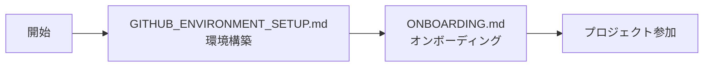
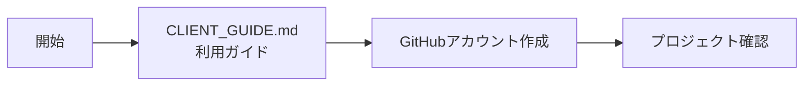
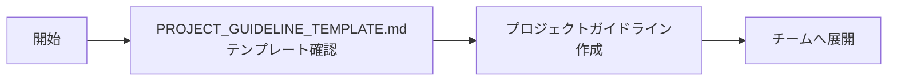

# 📚 オンボーディングドキュメントINDEX

**エス・エー・エス株式会社 GitHub運用ガイドライン**
*オンボーディング関連ドキュメント一覧*
*最終更新: 2025年10月9日*

---

## 📌 概要

このディレクトリには、新規参画者やクライアント様向けのオンボーディングドキュメントが格納されています。
対象者や目的に応じて、適切なドキュメントをご参照ください。

---

## 📂 ドキュメント一覧

### 🎯 新規参画者向け

#### [ONBOARDING.md](./ONBOARDING.md)
**新規参画者向け GitHub オンボーディングガイド**

- **対象者**: エス・エー・エス株式会社のプロジェクトに新しく参画する開発者
- **目的**: GitHub利用開始までの完全ガイド
- **内容**:
  - Day1-3のオンボーディング計画
  - 環境構築からプロジェクト参加までのステップバイステップガイド
  - チェックリスト形式の進捗管理
  - 練習用リポジトリでの実践演習
- **所要時間**: 2-3日
- **難易度**: 初級〜中級

---

### 🤝 クライアント様向け

#### [CLIENT_GUIDE.md](./CLIENT_GUIDE.md)
**クライアント様向け GitHub 利用ガイド**

- **対象者**: プロジェクトのクライアント様、ステークホルダー
- **目的**: GitHubを通じた進捗確認とコミュニケーション方法の説明
- **内容**:
  - GitHubの基本概念説明
  - アカウント作成と招待受諾の手順
  - 進捗確認方法（Issues、PR、Projects）
  - フィードバックの送り方
  - よくある質問と回答
- **所要時間**: 30分〜1時間
- **難易度**: 初級（技術知識不要）

---

### 🔧 環境構築ガイド

#### [GITHUB_ENVIRONMENT_SETUP.md](./GITHUB_ENVIRONMENT_SETUP.md)
**GitHub 環境構築ガイド**

- **対象者**: 開発者、エンジニア
- **目的**: 開発環境の完全セットアップ
- **内容**:
  - WSL2環境構築（Windows必須）
  - Git環境の構築と設定
  - GitHubアカウント作成と2FA設定
  - SSH接続の設定
  - 組織への参加手順
  - 詳細なトラブルシューティング
- **所要時間**: 1-2時間
- **難易度**: 中級（コマンドライン操作含む）

---

### 📋 プロジェクト管理者向け

#### [PROJECT_GUIDELINE_TEMPLATE.md](./PROJECT_GUIDELINE_TEMPLATE.md)
**プロジェクト別ガイドライン作成マニュアル**

- **対象者**: プロジェクトマネージャー、テックリード
- **目的**: 各プロジェクト固有のガイドライン作成支援
- **内容**:
  - 必須・推奨ドキュメント一覧
  - 各種ドキュメントテンプレート
  - ブランチ戦略定義ガイド
  - CI/CD設定例
  - セキュリティ設定チェックリスト
- **所要時間**: プロジェクト規模による
- **難易度**: 上級（プロジェクト管理経験必要）

---

## 🗺️ 読者別ガイドマップ

### 新規開発者の方

### クライアント様

### プロジェクト管理者の方

---

## 📝 クイックスタート

### Q: 初めてGitHubを使います。何から始めれば？
→ **[GITHUB_ENVIRONMENT_SETUP.md](./GITHUB_ENVIRONMENT_SETUP.md)** から始めてください

### Q: すでにGitHub経験があり、プロジェクトに参加します
→ **[ONBOARDING.md](./ONBOARDING.md)** の「Day 2」から確認してください

### Q: クライアントとして進捗を確認したい
→ **[CLIENT_GUIDE.md](./CLIENT_GUIDE.md)** をご覧ください

### Q: 新しいプロジェクトのガイドラインを作成したい
→ **[PROJECT_GUIDELINE_TEMPLATE.md](./PROJECT_GUIDELINE_TEMPLATE.md)** を参考にしてください

---

## 🔄 更新情報

| 日付 | ドキュメント | 更新内容 |
|------|------------|----------|
| 2025-10-09 | README.md | INDEX作成 |
| 2025-09-12 | GITHUB_ENVIRONMENT_SETUP.md | WSL2設定詳細追加 |
| 2025-09-05 | 全ドキュメント | 初版作成 |

---

## 📞 サポート

ドキュメントで不明な点がございましたら、以下までお問い合わせください：

- **GitHub管理チーム**: github@sas-com.com
- **Slack**: #github-support
- **Wiki**: [社内Wiki - GitHub運用](https://wiki.sas-com.com/github)

---

**注意事項**:
- すべてのドキュメントは定期的に更新されます
- 最新情報は各ドキュメントの「最終更新日」をご確認ください
- プロジェクト固有の設定は、各プロジェクトのREADME.mdも併せてご確認ください