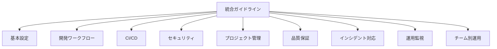
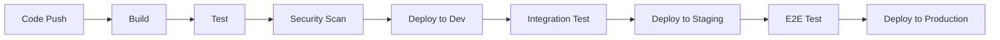
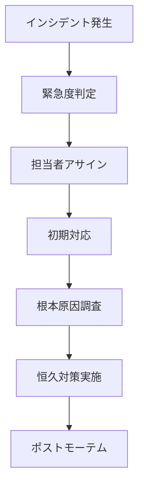

# GitHub運用統合ガイドライン

**エス・エー・エス株式会社**  
*包括的なGitHub運用マスターガイド*

---

## 📚 目次

### [1. はじめに](#1-はじめに)
- [1.1 ガイドラインの目的](#11-ガイドラインの目的)
- [1.2 対象者](#12-対象者)
- [1.3 ガイドライン構成](#13-ガイドライン構成)

### [2. 基本設定とセットアップ](#2-基本設定とセットアップ)
- [2.1 アカウント設定](#21-アカウント設定)
- [2.2 組織アーキテクチャ](#22-組織アーキテクチャ)
- [2.3 初期環境構築](#23-初期環境構築)

### [3. 開発ワークフロー](#3-開発ワークフロー)
- [3.1 ブランチ管理戦略](#31-ブランチ管理戦略)
- [3.2 コミット規約](#32-コミット規約)
- [3.3 プルリクエスト運用](#33-プルリクエスト運用)

### [4. CI/CD・デプロイメント](#4-cicd・デプロイメント)
- [4.1 CI/CD戦略](#41-cicd戦略)
- [4.2 デプロイメント戦略](#42-デプロイメント戦略)
- [4.3 環境管理](#43-環境管理)

### [5. セキュリティとガバナンス](#5-セキュリティとガバナンス)
- [5.1 セキュリティベストプラクティス](#51-セキュリティベストプラクティス)
- [5.2 シークレット管理](#52-シークレット管理)
- [5.3 セキュリティ監視](#53-セキュリティ監視)

### [6. Issue・プロジェクト管理](#6-issue・プロジェクト管理)
- [6.1 Issue管理戦略](#61-issue管理戦略)
- [6.2 プロジェクトボード運用](#62-プロジェクトボード運用)
- [6.3 ラベリング体系](#63-ラベリング体系)

### [7. 品質保証・テスト](#7-品質保証・テスト)
- [7.1 テスト戦略](#71-テスト戦略)
- [7.2 コードレビュー](#72-コードレビュー)
- [7.3 品質ゲート](#73-品質ゲート)

### [8. インシデント対応](#8-インシデント対応)
- [8.1 インシデント分類](#81-インシデント分類)
- [8.2 対応プロセス](#82-対応プロセス)
- [8.3 復旧手順](#83-復旧手順)

### [9. 運用・監視](#9-運用・監視)
- [9.1 監視戦略](#91-監視戦略)
- [9.2 ログ管理](#92-ログ管理)
- [9.3 パフォーマンス最適化](#93-パフォーマンス最適化)

### [10. チーム別運用](#10-チーム別運用)
- [10.1 開発チーム](#101-開発チーム)
- [10.2 インフラチーム](#102-インフラチーム)
- [10.3 セキュリティチーム](#103-セキュリティチーム)

---

## 1. はじめに

### 1.1 ガイドラインの目的

本ガイドラインは、エス・エー・エス株式会社におけるGitHub運用の標準化と効率化を目的とします。

**主要目標**
- 🎯 統一されたワークフローによる開発効率向上
- 🛡️ セキュリティリスクの最小化
- 📊 品質向上とリスク管理の強化
- 🔄 継続的改善プロセスの確立

### 1.2 対象者

- **開発者**: コード開発・レビュー・テスト実装
- **プロジェクトマネージャー**: プロジェクト進行管理・品質管理
- **インフラエンジニア**: CI/CD・デプロイメント・監視
- **セキュリティ担当**: セキュリティレビュー・監査・インシデント対応
- **新規参画者**: オンボーディング・トレーニング

### 1.3 ガイドライン構成



---

## 2. 基本設定とセットアップ

### 2.1 アカウント設定

#### 必須設定項目
- **2FA有効化**: 全アカウントで必須
- **SSO連携**: Azure AD統合
- **プロフィール**: 実名・所属部署明記
- **通知設定**: 適切なレベルに調整

詳細: [GITHUB_ENVIRONMENT_SETUP.md](../onboarding/GITHUB_ENVIRONMENT_SETUP.md)

### 2.2 組織アーキテクチャ

#### 組織構造
```
sas-com/
├── core-platform/          # コアプラットフォーム
├── client-projects/         # クライアントプロジェクト
├── internal-tools/          # 内部ツール
└── shared-libraries/        # 共有ライブラリ
```

詳細: [GITHUB_ORG_ARCHITECTURE.md](./GITHUB_ORG_ARCHITECTURE.md)

### 2.3 初期環境構築

#### 開発環境要件
- **OS**: Windows (WSL2必須)
- **エディタ**: VS Code推奨
- **Git設定**: グローバル設定の標準化
- **必須ツール**: Docker, Node.js, Python

詳細: [ONBOARDING.md](./ONBOARDING.md)

---

## 3. 開発ワークフロー

### 3.1 ブランチ管理戦略

#### ブランチモデル
```
main (本番)
├── staging (ステージング)
├── dev (開発統合)
└── feature/* (機能開発)
    ├── bugfix/* (バグ修正)
    └── hotfix/* (緊急修正)
```

**運用ルール**
- `main`への直接コミット禁止
- `feature/*`から`dev`へのマージはPR必須
- `hotfix/*`は`main`から分岐、直接マージ可

詳細: [BRANCH_MANAGEMENT_RULES.md](./BRANCH_MANAGEMENT_RULES.md)

### 3.2 コミット規約

#### メッセージフォーマット
```
<type>(<scope>): <subject>

<body>

<footer>
```

**Type一覧**
- `feat`: 新機能
- `fix`: バグ修正
- `docs`: ドキュメント
- `style`: フォーマット
- `refactor`: リファクタリング
- `test`: テスト
- `chore`: その他

詳細: [COMMIT_CONVENTION_GUIDE.md](./COMMIT_CONVENTION_GUIDE.md)

### 3.3 プルリクエスト運用

#### PR作成要件
- [ ] 適切なテンプレート使用
- [ ] レビュアー2名以上アサイン
- [ ] CI/CDチェック完了
- [ ] セキュリティスキャン通過

詳細: [PR_REVIEW_GUIDELINES.md](./PR_REVIEW_GUIDELINES.md)

---

## 4. CI/CD・デプロイメント

### 4.1 CI/CD戦略

#### パイプライン構成


詳細: [CICD_WORKFLOW_DESIGN.md](./CICD_WORKFLOW_DESIGN.md)

### 4.2 デプロイメント戦略

#### 環境別戦略
- **Dev**: 自動デプロイ（PRマージ時）
- **Staging**: 手動承認後デプロイ
- **Production**: Blue-Greenデプロイ

詳細: [CICD_DEPLOYMENT_STRATEGY.md](./CICD_DEPLOYMENT_STRATEGY.md)

### 4.3 環境管理

#### 環境設定
- Environment Protection Rules
- Required Reviewers
- Deployment Timeout
- Environment Variables

詳細: [ENVIRONMENT_DEPLOYMENT_STRATEGY.md](./ENVIRONMENT_DEPLOYMENT_STRATEGY.md)

---

## 5. セキュリティとガバナンス

### 5.1 セキュリティベストプラクティス

#### 必須対策
- **依存関係スキャン**: Dependabot有効化
- **コードスキャン**: CodeQL導入
- **シークレットスキャン**: 自動検出・無効化
- **脆弱性アラート**: 即座対応

詳細: [GITHUB_SECURITY_BEST_PRACTICES.md](./GITHUB_SECURITY_BEST_PRACTICES.md)

### 5.2 シークレット管理

#### 管理原則
- GitHub Secretsでの一元管理
- 環境別権限分離
- 定期的なローテーション
- アクセス履歴監査

詳細: [SECRETS_MANAGEMENT_GUIDE.md](./SECRETS_MANAGEMENT_GUIDE.md)

### 5.3 セキュリティ監視

#### 監視項目
- 不正アクセス試行
- 権限昇格
- 異常なAPI使用
- リポジトリ操作ログ

詳細: [SECURITY_MONITORING_SETUP.md](./SECURITY_MONITORING_SETUP.md)

---

## 6. Issue・プロジェクト管理

### 6.1 Issue管理戦略

#### Issue分類体系
```
Priority: critical, high, medium, low
Type: bug, feature, enhancement, security
Status: todo, in-progress, review, blocked
Component: api, database, auth, frontend
```

### 6.2 プロジェクトボード運用

#### ボードテンプレート
- **スプリントボード**: Backlog → Ready → In Progress → Review → Done
- **機能開発ボード**: Planning → Development → Testing → Release
- **バグ修正ボード**: Reported → Triaged → Fixing → Verified

### 6.3 ラベリング体系

#### 自動ラベル付与ルール
- タイトルキーワード基準
- 担当者基準
- ファイル変更パターン基準

詳細: [ISSUE_PROJECT_MANAGEMENT_GUIDE.md](./ISSUE_PROJECT_MANAGEMENT_GUIDE.md)

---

## 7. 品質保証・テスト

### 7.1 テスト戦略

#### テストレベル
- **単体テスト**: 80%以上カバレッジ
- **統合テスト**: API・DB連携
- **E2Eテスト**: 主要ユーザーフロー
- **パフォーマンステスト**: 負荷・ストレス

詳細: [TEST_STRATEGY.md](./TEST_STRATEGY.md)

### 7.2 コードレビュー

#### レビュー観点
- [ ] 機能仕様準拠
- [ ] セキュリティ考慮
- [ ] パフォーマンス影響
- [ ] 保守性・可読性

詳細: [PR_REVIEW_CHECKLIST.md](./PR_REVIEW_CHECKLIST.md)

### 7.3 品質ゲート

#### ゲート条件
- 全テスト成功
- セキュリティスキャン通過  
- コードレビュー承認
- ドキュメント更新完了

---

## 8. インシデント対応

### 8.1 インシデント分類

#### 緊急度レベル
- **L1 (Critical)**: システム停止・データ損失
- **L2 (High)**: 主要機能障害
- **L3 (Medium)**: 一部機能障害
- **L4 (Low)**: 軽微な問題

### 8.2 対応プロセス

#### 対応フロー


### 8.3 復旧手順

#### ロールバック手順
1. 影響範囲確認
2. ロールバック実行
3. 動作確認
4. ステークホルダー通知

詳細: [SECURITY_INCIDENT_RESPONSE_PLAN.md](./SECURITY_INCIDENT_RESPONSE_PLAN.md)

---

## 9. 運用・監視

### 9.1 監視戦略

#### 監視項目
- **パフォーマンス**: 応答時間、スループット
- **可用性**: アップタイム、エラー率
- **リソース**: CPU、メモリ、ディスク
- **セキュリティ**: アクセスログ、異常検知

### 9.2 ログ管理

#### ログ戦略
- 集中ログ管理
- 構造化ログ出力
- 適切なログレベル
- 長期保存・アーカイブ

### 9.3 パフォーマンス最適化

#### 最適化項目
- ビルド時間短縮
- テスト実行時間改善
- デプロイ時間最適化
- リソース使用効率化

詳細: [CICD_PERFORMANCE_OPTIMIZATION_GUIDE.md](./CICD_PERFORMANCE_OPTIMIZATION_GUIDE.md)

---

## 10. チーム別運用

### 10.1 開発チーム

#### 主要責務
- 機能開発・バグ修正
- コードレビュー・品質確保
- テスト実装・実行
- ドキュメント作成・更新

#### 推奨ワークフロー
1. Issue作成・プランニング
2. ブランチ作成・開発
3. テスト実装・実行
4. PR作成・レビュー依頼
5. マージ・デプロイ

### 10.2 インフラチーム

#### 主要責務
- CI/CD設計・構築
- インフラ管理・監視
- セキュリティ対策実装
- パフォーマンス最適化

#### 運用フォーカス
- Infrastructure as Code
- 自動化推進
- 監視・アラート設定
- キャパシティプランニング

### 10.3 セキュリティチーム

#### 主要責務
- セキュリティポリシー策定
- 脆弱性評価・対策
- インシデント対応
- セキュリティ教育

#### セキュリティチェックポイント
- 依存関係脆弱性
- コード品質・セキュリティ
- アクセス制御・権限
- データ保護・暗号化

---

## 📋 クイックリファレンス

### よく使うコマンド
```bash
# ブランチ操作
git checkout -b feature/new-feature
git checkout dev
git merge --no-ff feature/new-feature

# リモート操作
git fetch origin
git pull origin dev
git push origin feature/new-feature

# 確認コマンド
git status
git diff
git log --oneline -10
```

### 緊急時連絡先
- **GitHub管理チーム**: github@sas-com.com
- **セキュリティチーム**: security@sas-com.com
- **インフラチーム**: infra@sas-com.com
- **24時間対応**: emergency@sas-com.com

### 関連リンク
- [QUICK_REFERENCE.md](./QUICK_REFERENCE.md) - 日常操作リファレンス
- [TROUBLESHOOTING.md](./TROUBLESHOOTING.md) - トラブルシューティング
- [EMERGENCY_RESPONSE.md](./EMERGENCY_RESPONSE.md) - 緊急時対応手順

---

**更新日**: 2025-09-11  
**版数**: v1.0  
**承認者**: SAS Github管理チーム  
**次回レビュー**: 2025-12-11

**注意事項**
- 本ガイドラインは継続的に更新されます
- 疑問点は速やかにGitHub管理チームに相談してください
- 緊急時は24時間対応窓口をご利用ください