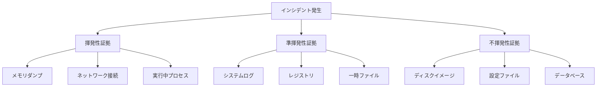

# フォレンジック・証拠保全マニュアル

**エス・エー・エス株式会社**  
*デジタルフォレンジックと証拠保全のための包括的ガイド*

## 目次

1. [概要](#概要)
2. [証拠収集プロトコル](#証拠収集プロトコル)
3. [デジタルフォレンジック手法](#デジタルフォレンジック手法)
4. [証拠の整合性保証](#証拠の整合性保証)
5. [法的要件と規制対応](#法的要件と規制対応)
6. [証拠管理システム](#証拠管理システム)
7. [ツールとスクリプト](#ツールとスクリプト)
8. [ケーススタディ](#ケーススタディ)

## 概要

### 目的
本マニュアルは、セキュリティインシデント発生時のデジタル証拠の適切な収集、保全、分析、および法的手続きに必要な証拠能力の確保を目的としています。

### 基本原則

#### 証拠保全の5原則
1. **完全性 (Integrity)**: 証拠の改変・破壊を防ぐ
2. **真正性 (Authenticity)**: 証拠の出所と信頼性を保証
3. **網羅性 (Completeness)**: 必要な証拠をすべて収集
4. **連続性 (Chain of Custody)**: 証拠の管理履歴を記録
5. **適時性 (Timeliness)**: 証拠の消失前に迅速に収集

### 法的考慮事項
- 個人情報保護法の遵守
- 不正アクセス禁止法の考慮
- 電子署名法に基づく証拠能力
- 国際的な証拠収集基準（ISO/IEC 27037）

## 証拠収集プロトコル

### 証拠収集の優先順位



### GitHub環境での証拠収集

#### 1. GitHub固有の証拠

```bash
#!/bin/bash
# scripts/forensics/github-evidence-collector.sh

CASE_ID=$1
TIMESTAMP=$(date +%Y%m%d_%H%M%S)
EVIDENCE_DIR="/secure/forensics/${CASE_ID}/${TIMESTAMP}"

# 証拠ディレクトリの作成
mkdir -p ${EVIDENCE_DIR}/{audit,repos,users,webhooks,actions}

echo "[$(date)] Starting GitHub evidence collection for case ${CASE_ID}"

# 1. Organization Audit Log
echo "[$(date)] Collecting Organization Audit Log..."
gh api \
  -H "Accept: application/vnd.github+json" \
  /orgs/sas-com/audit-log \
  --paginate \
  > ${EVIDENCE_DIR}/audit/org_audit_log.json

# 2. Repository情報
echo "[$(date)] Collecting Repository Information..."
for repo in $(gh repo list sas-com --json name -q '.[].name'); do
  echo "  Processing repository: ${repo}"
  
  # リポジトリメタデータ
  gh api /repos/sas-com/${repo} \
    > ${EVIDENCE_DIR}/repos/${repo}_metadata.json
  
  # コミット履歴（直近1000件）
  gh api /repos/sas-com/${repo}/commits \
    --paginate \
    -F per_page=100 \
    --limit 1000 \
    > ${EVIDENCE_DIR}/repos/${repo}_commits.json
  
  # ブランチ保護設定
  gh api /repos/sas-com/${repo}/branches \
    > ${EVIDENCE_DIR}/repos/${repo}_branches.json
  
  # セキュリティアラート
  gh api /repos/sas-com/${repo}/security-advisories \
    > ${EVIDENCE_DIR}/repos/${repo}_security.json 2>/dev/null || true
  
  # Webhook設定
  gh api /repos/sas-com/${repo}/hooks \
    > ${EVIDENCE_DIR}/webhooks/${repo}_hooks.json
done

# 3. ユーザー・アクセス情報
echo "[$(date)] Collecting User and Access Information..."
gh api /orgs/sas-com/members \
  --paginate \
  > ${EVIDENCE_DIR}/users/members.json

gh api /orgs/sas-com/teams \
  --paginate \
  > ${EVIDENCE_DIR}/users/teams.json

# 4. GitHub Actions実行履歴
echo "[$(date)] Collecting GitHub Actions History..."
for repo in $(gh repo list sas-com --json name -q '.[].name'); do
  gh api /repos/sas-com/${repo}/actions/runs \
    --paginate \
    -F per_page=100 \
    --limit 500 \
    > ${EVIDENCE_DIR}/actions/${repo}_runs.json 2>/dev/null || true
done

# 5. ハッシュ値の計算
echo "[$(date)] Calculating hash values..."
find ${EVIDENCE_DIR} -type f -exec sha256sum {} \; \
  > ${EVIDENCE_DIR}/SHA256SUMS.txt

# 6. タイムスタンプの記録
echo "[$(date)] Recording timestamps..."
cat > ${EVIDENCE_DIR}/collection_info.txt << EOF
Case ID: ${CASE_ID}
Collection Started: ${TIMESTAMP}
Collection Completed: $(date +%Y%m%d_%H%M%S)
Collector: $(whoami)
Host: $(hostname)
GitHub CLI Version: $(gh version)
EOF

echo "[$(date)] GitHub evidence collection completed"
```

#### 2. システムレベルの証拠

```python
#!/usr/bin/env python3
# scripts/forensics/system-evidence-collector.py

import os
import sys
import json
import hashlib
import subprocess
import datetime
from pathlib import Path
import psutil
import platform

class SystemEvidenceCollector:
    """システムレベルの証拠収集クラス"""
    
    def __init__(self, case_id: str):
        self.case_id = case_id
        self.timestamp = datetime.datetime.now().strftime("%Y%m%d_%H%M%S")
        self.evidence_dir = Path(f"/secure/forensics/{case_id}/{self.timestamp}/system")
        self.evidence_dir.mkdir(parents=True, exist_ok=True)
        self.evidence_log = []
    
    def collect_all(self):
        """全証拠の収集"""
        print(f"[{datetime.datetime.now()}] Starting system evidence collection")
        
        self.collect_volatile_data()
        self.collect_semi_volatile_data()
        self.collect_non_volatile_data()
        self.create_evidence_manifest()
        
        print(f"[{datetime.datetime.now()}] System evidence collection completed")
    
    def collect_volatile_data(self):
        """揮発性データの収集"""
        volatile_dir = self.evidence_dir / "volatile"
        volatile_dir.mkdir(exist_ok=True)
        
        # メモリ情報
        self._collect_memory_info(volatile_dir)
        
        # ネットワーク接続
        self._collect_network_connections(volatile_dir)
        
        # 実行中プロセス
        self._collect_running_processes(volatile_dir)
        
        # システム情報
        self._collect_system_info(volatile_dir)
    
    def collect_semi_volatile_data(self):
        """準揮発性データの収集"""
        semi_volatile_dir = self.evidence_dir / "semi_volatile"
        semi_volatile_dir.mkdir(exist_ok=True)
        
        # ログファイル
        self._collect_logs(semi_volatile_dir)
        
        # 一時ファイル
        self._collect_temp_files(semi_volatile_dir)
        
        # 環境変数
        self._collect_environment(semi_volatile_dir)
    
    def collect_non_volatile_data(self):
        """不揮発性データの収集"""
        non_volatile_dir = self.evidence_dir / "non_volatile"
        non_volatile_dir.mkdir(exist_ok=True)
        
        # 設定ファイル
        self._collect_config_files(non_volatile_dir)
        
        # ユーザー情報
        self._collect_user_data(non_volatile_dir)
        
        # インストール済みパッケージ
        self._collect_installed_packages(non_volatile_dir)
    
    def _collect_memory_info(self, output_dir: Path):
        """メモリ情報の収集"""
        memory_info = {
            "timestamp": datetime.datetime.now().isoformat(),
            "virtual_memory": dict(psutil.virtual_memory()._asdict()),
            "swap_memory": dict(psutil.swap_memory()._asdict()),
            "process_memory": []
        }
        
        for proc in psutil.process_iter(['pid', 'name', 'memory_info']):
            try:
                memory_info["process_memory"].append({
                    "pid": proc.info['pid'],
                    "name": proc.info['name'],
                    "memory": proc.info['memory_info']._asdict() if proc.info['memory_info'] else None
                })
            except (psutil.NoSuchProcess, psutil.AccessDenied):
                continue
        
        self._save_json(output_dir / "memory_info.json", memory_info)
        self._log_evidence("memory_info", "Memory information collected")
    
    def _collect_network_connections(self, output_dir: Path):
        """ネットワーク接続情報の収集"""
        connections = []
        
        for conn in psutil.net_connections(kind='inet'):
            connections.append({
                "fd": conn.fd,
                "family": str(conn.family),
                "type": str(conn.type),
                "local_addr": f"{conn.laddr.ip}:{conn.laddr.port}" if conn.laddr else None,
                "remote_addr": f"{conn.raddr.ip}:{conn.raddr.port}" if conn.raddr else None,
                "status": conn.status,
                "pid": conn.pid
            })
        
        network_data = {
            "timestamp": datetime.datetime.now().isoformat(),
            "connections": connections,
            "interfaces": self._get_network_interfaces()
        }
        
        self._save_json(output_dir / "network_connections.json", network_data)
        self._log_evidence("network_connections", "Network connections collected")
    
    def _collect_running_processes(self, output_dir: Path):
        """実行中プロセスの収集"""
        processes = []
        
        for proc in psutil.process_iter(['pid', 'ppid', 'name', 'username', 
                                        'cmdline', 'create_time', 'cwd']):
            try:
                proc_info = proc.info
                proc_info['cmdline'] = ' '.join(proc_info['cmdline']) if proc_info['cmdline'] else ''
                proc_info['create_time'] = datetime.datetime.fromtimestamp(
                    proc_info['create_time']
                ).isoformat() if proc_info['create_time'] else None
                processes.append(proc_info)
            except (psutil.NoSuchProcess, psutil.AccessDenied):
                continue
        
        process_data = {
            "timestamp": datetime.datetime.now().isoformat(),
            "process_count": len(processes),
            "processes": processes
        }
        
        self._save_json(output_dir / "running_processes.json", process_data)
        self._log_evidence("running_processes", f"Collected {len(processes)} processes")
    
    def _collect_system_info(self, output_dir: Path):
        """システム情報の収集"""
        system_info = {
            "timestamp": datetime.datetime.now().isoformat(),
            "platform": platform.platform(),
            "hostname": platform.node(),
            "architecture": platform.machine(),
            "processor": platform.processor(),
            "python_version": platform.python_version(),
            "boot_time": datetime.datetime.fromtimestamp(psutil.boot_time()).isoformat(),
            "cpu": {
                "physical_cores": psutil.cpu_count(logical=False),
                "logical_cores": psutil.cpu_count(logical=True),
                "current_freq": psutil.cpu_freq().current if psutil.cpu_freq() else None,
                "usage_percent": psutil.cpu_percent(interval=1)
            },
            "disk": []
        }
        
        for partition in psutil.disk_partitions():
            try:
                usage = psutil.disk_usage(partition.mountpoint)
                system_info["disk"].append({
                    "device": partition.device,
                    "mountpoint": partition.mountpoint,
                    "fstype": partition.fstype,
                    "total": usage.total,
                    "used": usage.used,
                    "free": usage.free,
                    "percent": usage.percent
                })
            except PermissionError:
                continue
        
        self._save_json(output_dir / "system_info.json", system_info)
        self._log_evidence("system_info", "System information collected")
    
    def _collect_logs(self, output_dir: Path):
        """ログファイルの収集"""
        log_sources = [
            "/var/log/syslog",
            "/var/log/auth.log",
            "/var/log/kern.log",
            "/var/log/apache2/access.log",
            "/var/log/apache2/error.log",
            "/var/log/nginx/access.log",
            "/var/log/nginx/error.log"
        ]
        
        logs_collected = []
        
        for log_path in log_sources:
            if os.path.exists(log_path):
                try:
                    # 最新の1000行を収集
                    result = subprocess.run(
                        ["tail", "-n", "1000", log_path],
                        capture_output=True,
                        text=True
                    )
                    
                    log_filename = Path(log_path).name
                    output_file = output_dir / f"{log_filename}.txt"
                    output_file.write_text(result.stdout)
                    
                    logs_collected.append(log_path)
                    self._log_evidence(f"log_{log_filename}", f"Collected {log_path}")
                except Exception as e:
                    print(f"Error collecting {log_path}: {e}")
        
        # ログ収集サマリー
        summary = {
            "timestamp": datetime.datetime.now().isoformat(),
            "logs_collected": logs_collected,
            "total_logs": len(logs_collected)
        }
        
        self._save_json(output_dir / "logs_summary.json", summary)
    
    def _collect_temp_files(self, output_dir: Path):
        """一時ファイルの収集"""
        temp_dirs = ["/tmp", "/var/tmp"]
        temp_files = []
        
        for temp_dir in temp_dirs:
            if os.path.exists(temp_dir):
                for root, dirs, files in os.walk(temp_dir):
                    for file in files[:100]:  # 最初の100ファイルのみ
                        file_path = os.path.join(root, file)
                        try:
                            stat = os.stat(file_path)
                            temp_files.append({
                                "path": file_path,
                                "size": stat.st_size,
                                "modified": datetime.datetime.fromtimestamp(stat.st_mtime).isoformat(),
                                "accessed": datetime.datetime.fromtimestamp(stat.st_atime).isoformat()
                            })
                        except Exception:
                            continue
        
        temp_data = {
            "timestamp": datetime.datetime.now().isoformat(),
            "temp_files_count": len(temp_files),
            "temp_files": temp_files
        }
        
        self._save_json(output_dir / "temp_files.json", temp_data)
        self._log_evidence("temp_files", f"Cataloged {len(temp_files)} temp files")
    
    def _collect_environment(self, output_dir: Path):
        """環境変数の収集"""
        env_data = {
            "timestamp": datetime.datetime.now().isoformat(),
            "environment_variables": dict(os.environ)
        }
        
        self._save_json(output_dir / "environment.json", env_data)
        self._log_evidence("environment", "Environment variables collected")
    
    def _collect_config_files(self, output_dir: Path):
        """設定ファイルの収集"""
        config_files = [
            "/etc/passwd",
            "/etc/shadow",
            "/etc/group",
            "/etc/hosts",
            "/etc/hostname",
            "/etc/resolv.conf",
            "/etc/ssh/sshd_config",
            "/etc/crontab"
        ]
        
        configs_collected = []
        
        for config_path in config_files:
            if os.path.exists(config_path) and os.access(config_path, os.R_OK):
                try:
                    config_content = Path(config_path).read_text()
                    config_filename = Path(config_path).name
                    output_file = output_dir / f"{config_filename}.txt"
                    output_file.write_text(config_content)
                    
                    configs_collected.append(config_path)
                    self._log_evidence(f"config_{config_filename}", f"Collected {config_path}")
                except Exception as e:
                    print(f"Error collecting {config_path}: {e}")
        
        # 設定ファイル収集サマリー
        summary = {
            "timestamp": datetime.datetime.now().isoformat(),
            "configs_collected": configs_collected,
            "total_configs": len(configs_collected)
        }
        
        self._save_json(output_dir / "configs_summary.json", summary)
    
    def _collect_user_data(self, output_dir: Path):
        """ユーザー情報の収集"""
        users = []
        
        try:
            with open("/etc/passwd", "r") as f:
                for line in f:
                    parts = line.strip().split(":")
                    if len(parts) >= 7:
                        users.append({
                            "username": parts[0],
                            "uid": parts[2],
                            "gid": parts[3],
                            "home": parts[5],
                            "shell": parts[6]
                        })
        except Exception as e:
            print(f"Error reading user data: {e}")
        
        # 現在ログイン中のユーザー
        logged_in_users = []
        try:
            result = subprocess.run(["who"], capture_output=True, text=True)
            for line in result.stdout.strip().split("\n"):
                if line:
                    parts = line.split()
                    logged_in_users.append({
                        "user": parts[0] if len(parts) > 0 else "",
                        "terminal": parts[1] if len(parts) > 1 else "",
                        "login_time": " ".join(parts[2:]) if len(parts) > 2 else ""
                    })
        except Exception:
            pass
        
        user_data = {
            "timestamp": datetime.datetime.now().isoformat(),
            "total_users": len(users),
            "users": users,
            "logged_in_users": logged_in_users
        }
        
        self._save_json(output_dir / "user_data.json", user_data)
        self._log_evidence("user_data", f"Collected data for {len(users)} users")
    
    def _collect_installed_packages(self, output_dir: Path):
        """インストール済みパッケージの収集"""
        packages = []
        
        # Python packages
        try:
            result = subprocess.run(
                ["pip", "list", "--format=json"],
                capture_output=True,
                text=True
            )
            python_packages = json.loads(result.stdout)
            packages.extend([{"type": "python", **pkg} for pkg in python_packages])
        except Exception:
            pass
        
        # System packages (dpkg for Debian/Ubuntu)
        try:
            result = subprocess.run(
                ["dpkg", "-l"],
                capture_output=True,
                text=True
            )
            for line in result.stdout.split("\n")[5:]:  # Skip header
                if line.startswith("ii"):
                    parts = line.split()
                    if len(parts) >= 3:
                        packages.append({
                            "type": "system",
                            "name": parts[1],
                            "version": parts[2]
                        })
        except Exception:
            pass
        
        package_data = {
            "timestamp": datetime.datetime.now().isoformat(),
            "total_packages": len(packages),
            "packages": packages
        }
        
        self._save_json(output_dir / "installed_packages.json", package_data)
        self._log_evidence("installed_packages", f"Collected {len(packages)} packages")
    
    def _get_network_interfaces(self):
        """ネットワークインターフェース情報の取得"""
        interfaces = []
        
        for interface, addrs in psutil.net_if_addrs().items():
            interface_info = {"name": interface, "addresses": []}
            
            for addr in addrs:
                interface_info["addresses"].append({
                    "family": str(addr.family),
                    "address": addr.address,
                    "netmask": addr.netmask,
                    "broadcast": addr.broadcast
                })
            
            interfaces.append(interface_info)
        
        return interfaces
    
    def _save_json(self, filepath: Path, data: dict):
        """JSONデータの保存"""
        with open(filepath, 'w') as f:
            json.dump(data, f, indent=2, default=str)
    
    def _log_evidence(self, evidence_type: str, description: str):
        """証拠収集ログの記録"""
        self.evidence_log.append({
            "timestamp": datetime.datetime.now().isoformat(),
            "type": evidence_type,
            "description": description
        })
    
    def create_evidence_manifest(self):
        """証拠マニフェストの作成"""
        manifest = {
            "case_id": self.case_id,
            "collection_timestamp": self.timestamp,
            "collector": os.environ.get("USER", "unknown"),
            "hostname": platform.node(),
            "evidence_log": self.evidence_log,
            "file_hashes": {}
        }
        
        # 全ファイルのハッシュ値計算
        for file_path in self.evidence_dir.rglob("*"):
            if file_path.is_file():
                with open(file_path, 'rb') as f:
                    file_hash = hashlib.sha256(f.read()).hexdigest()
                    relative_path = file_path.relative_to(self.evidence_dir)
                    manifest["file_hashes"][str(relative_path)] = file_hash
        
        # マニフェストの保存
        manifest_path = self.evidence_dir / "MANIFEST.json"
        self._save_json(manifest_path, manifest)
        
        print(f"Evidence manifest created: {manifest_path}")

if __name__ == "__main__":
    if len(sys.argv) != 2:
        print("Usage: python system-evidence-collector.py <case_id>")
        sys.exit(1)
    
    case_id = sys.argv[1]
    collector = SystemEvidenceCollector(case_id)
    collector.collect_all()
```

## デジタルフォレンジック手法

### メモリフォレンジック

#### メモリダンプの取得

```bash
#!/bin/bash
# scripts/forensics/memory-dump.sh

CASE_ID=$1
OUTPUT_DIR="/secure/forensics/${CASE_ID}/memory"
mkdir -p ${OUTPUT_DIR}

# Linux Memory Dumper (LiME)の使用
if [ -f /proc/kcore ]; then
    echo "Creating memory dump using dd..."
    sudo dd if=/proc/kcore of=${OUTPUT_DIR}/memory.dump bs=1M
    
    # ハッシュ値の計算
    sha256sum ${OUTPUT_DIR}/memory.dump > ${OUTPUT_DIR}/memory.dump.sha256
fi

# プロセスメモリの個別ダンプ
for pid in $(ps -eo pid --no-headers); do
    if [ -r /proc/$pid/maps ] && [ -r /proc/$pid/mem ]; then
        echo "Dumping memory for PID $pid..."
        gcore -o ${OUTPUT_DIR}/process_${pid} ${pid} 2>/dev/null || true
    fi
done
```

### ディスクフォレンジック

#### ディスクイメージの作成

```python
#!/usr/bin/env python3
# scripts/forensics/disk-imaging.py

import os
import sys
import hashlib
import subprocess
from datetime import datetime
from pathlib import Path

class DiskImager:
    """ディスクイメージング用クラス"""
    
    def __init__(self, case_id: str):
        self.case_id = case_id
        self.output_dir = Path(f"/secure/forensics/{case_id}/disk")
        self.output_dir.mkdir(parents=True, exist_ok=True)
    
    def create_disk_image(self, source_device: str, image_name: str):
        """ディスクイメージの作成"""
        
        image_path = self.output_dir / f"{image_name}.dd"
        hash_path = self.output_dir / f"{image_name}.sha256"
        log_path = self.output_dir / f"{image_name}.log"
        
        print(f"Creating disk image: {source_device} -> {image_path}")
        
        # ddを使用したイメージング
        dd_command = [
            "sudo", "dd",
            f"if={source_device}",
            f"of={image_path}",
            "bs=4M",
            "conv=noerror,sync",
            "status=progress"
        ]
        
        # イメージング実行
        with open(log_path, 'w') as log_file:
            log_file.write(f"Imaging started: {datetime.now()}\n")
            log_file.write(f"Source: {source_device}\n")
            log_file.write(f"Destination: {image_path}\n")
            log_file.write(f"Command: {' '.join(dd_command)}\n\n")
            
            result = subprocess.run(
                dd_command,
                stderr=subprocess.PIPE,
                text=True
            )
            
            log_file.write(result.stderr)
            log_file.write(f"\nImaging completed: {datetime.now()}\n")
        
        # ハッシュ値の計算
        print("Calculating SHA256 hash...")
        sha256_hash = self._calculate_hash(image_path)
        hash_path.write_text(f"{sha256_hash}  {image_path.name}\n")
        
        # 検証用の情報
        self._create_verification_info(source_device, image_path, sha256_hash)
        
        return image_path, sha256_hash
    
    def _calculate_hash(self, file_path: Path, chunk_size: int = 8192) -> str:
        """ファイルのSHA256ハッシュ値を計算"""
        
        sha256 = hashlib.sha256()
        
        with open(file_path, 'rb') as f:
            while chunk := f.read(chunk_size):
                sha256.update(chunk)
        
        return sha256.hexdigest()
    
    def _create_verification_info(self, source: str, image: Path, hash_value: str):
        """検証情報の作成"""
        
        info = {
            "case_id": self.case_id,
            "imaging_date": datetime.now().isoformat(),
            "source_device": source,
            "image_file": str(image),
            "image_size": image.stat().st_size,
            "sha256_hash": hash_value,
            "imager": os.environ.get("USER", "unknown"),
            "tool": "dd (GNU coreutils)"
        }
        
        info_path = self.output_dir / f"{image.stem}_info.json"
        
        import json
        with open(info_path, 'w') as f:
            json.dump(info, f, indent=2)

if __name__ == "__main__":
    if len(sys.argv) != 4:
        print("Usage: python disk-imaging.py <case_id> <source_device> <image_name>")
        sys.exit(1)
    
    case_id = sys.argv[1]
    source_device = sys.argv[2]
    image_name = sys.argv[3]
    
    imager = DiskImager(case_id)
    image_path, hash_value = imager.create_disk_image(source_device, image_name)
    
    print(f"Image created: {image_path}")
    print(f"SHA256: {hash_value}")
```

### ネットワークフォレンジック

```python
#!/usr/bin/env python3
# scripts/forensics/network-forensics.py

import os
import sys
import json
import pcapy
import dpkt
from datetime import datetime
from pathlib import Path

class NetworkForensics:
    """ネットワークフォレンジッククラス"""
    
    def __init__(self, case_id: str):
        self.case_id = case_id
        self.output_dir = Path(f"/secure/forensics/{case_id}/network")
        self.output_dir.mkdir(parents=True, exist_ok=True)
    
    def capture_traffic(self, interface: str, duration: int = 60):
        """ネットワークトラフィックのキャプチャ"""
        
        pcap_file = self.output_dir / f"capture_{datetime.now().strftime('%Y%m%d_%H%M%S')}.pcap"
        
        print(f"Capturing traffic on {interface} for {duration} seconds...")
        
        # pcapyを使用したパケットキャプチャ
        cap = pcapy.open_live(interface, 65536, 1, 0)
        dumper = cap.dump_open(str(pcap_file))
        
        start_time = datetime.now()
        packet_count = 0
        
        while (datetime.now() - start_time).seconds < duration:
            try:
                (header, packet) = cap.next()
                if header:
                    dumper.dump(header, packet)
                    packet_count += 1
            except KeyboardInterrupt:
                break
        
        print(f"Captured {packet_count} packets")
        return pcap_file
    
    def analyze_pcap(self, pcap_file: Path):
        """PCAPファイルの分析"""
        
        analysis = {
            "file": str(pcap_file),
            "analysis_time": datetime.now().isoformat(),
            "statistics": {},
            "connections": [],
            "suspicious_activity": []
        }
        
        with open(pcap_file, 'rb') as f:
            pcap = dpkt.pcap.Reader(f)
            
            for timestamp, buf in pcap:
                try:
                    eth = dpkt.ethernet.Ethernet(buf)
                    
                    if isinstance(eth.data, dpkt.ip.IP):
                        ip = eth.data
                        
                        # 接続情報の抽出
                        connection = {
                            "timestamp": datetime.fromtimestamp(timestamp).isoformat(),
                            "src": self._inet_to_str(ip.src),
                            "dst": self._inet_to_str(ip.dst),
                            "protocol": ip.p
                        }
                        
                        if isinstance(ip.data, dpkt.tcp.TCP):
                            tcp = ip.data
                            connection["src_port"] = tcp.sport
                            connection["dst_port"] = tcp.dport
                            connection["flags"] = self._tcp_flags_to_str(tcp.flags)
                            
                            # 疑わしい活動の検出
                            if tcp.dport in [22, 23, 3389]:  # SSH, Telnet, RDP
                                analysis["suspicious_activity"].append({
                                    "type": "remote_access",
                                    "details": connection
                                })
                        
                        elif isinstance(ip.data, dpkt.udp.UDP):
                            udp = ip.data
                            connection["src_port"] = udp.sport
                            connection["dst_port"] = udp.dport
                        
                        analysis["connections"].append(connection)
                
                except Exception as e:
                    continue
        
        # 統計情報の生成
        analysis["statistics"] = {
            "total_connections": len(analysis["connections"]),
            "suspicious_activities": len(analysis["suspicious_activity"])
        }
        
        # 分析結果の保存
        analysis_file = self.output_dir / f"{pcap_file.stem}_analysis.json"
        with open(analysis_file, 'w') as f:
            json.dump(analysis, f, indent=2)
        
        return analysis
    
    def _inet_to_str(self, inet):
        """IPアドレスを文字列に変換"""
        try:
            return ".".join(str(b) for b in inet)
        except:
            return str(inet)
    
    def _tcp_flags_to_str(self, flags):
        """TCPフラグを文字列に変換"""
        flag_names = []
        if flags & dpkt.tcp.TH_FIN:
            flag_names.append("FIN")
        if flags & dpkt.tcp.TH_SYN:
            flag_names.append("SYN")
        if flags & dpkt.tcp.TH_RST:
            flag_names.append("RST")
        if flags & dpkt.tcp.TH_PUSH:
            flag_names.append("PSH")
        if flags & dpkt.tcp.TH_ACK:
            flag_names.append("ACK")
        if flags & dpkt.tcp.TH_URG:
            flag_names.append("URG")
        return "|".join(flag_names)
```

## 証拠の整合性保証

### デジタル署名とタイムスタンプ

```python
#!/usr/bin/env python3
# scripts/forensics/evidence-integrity.py

import os
import json
import hashlib
import subprocess
from datetime import datetime
from pathlib import Path
from cryptography import x509
from cryptography.hazmat.primitives import hashes, serialization
from cryptography.hazmat.primitives.asymmetric import rsa, padding
from cryptography.x509.oid import NameOID

class EvidenceIntegrity:
    """証拠の整合性保証クラス"""
    
    def __init__(self, case_id: str):
        self.case_id = case_id
        self.keys_dir = Path(f"/secure/forensics/{case_id}/keys")
        self.keys_dir.mkdir(parents=True, exist_ok=True)
        self.private_key = None
        self.public_key = None
        self.certificate = None
    
    def generate_keys(self):
        """証拠署名用の鍵ペア生成"""
        
        # 秘密鍵の生成
        self.private_key = rsa.generate_private_key(
            public_exponent=65537,
            key_size=4096
        )
        
        # 公開鍵の取得
        self.public_key = self.private_key.public_key()
        
        # 秘密鍵の保存
        private_pem = self.private_key.private_bytes(
            encoding=serialization.Encoding.PEM,
            format=serialization.PrivateFormat.TraditionalOpenSSL,
            encryption_algorithm=serialization.BestAvailableEncryption(b'forensics_key')
        )
        
        private_key_path = self.keys_dir / "private_key.pem"
        private_key_path.write_bytes(private_pem)
        os.chmod(private_key_path, 0o600)
        
        # 公開鍵の保存
        public_pem = self.public_key.public_bytes(
            encoding=serialization.Encoding.PEM,
            format=serialization.PublicFormat.SubjectPublicKeyInfo
        )
        
        public_key_path = self.keys_dir / "public_key.pem"
        public_key_path.write_bytes(public_pem)
        
        # 自己署名証明書の生成
        self._generate_certificate()
        
        return private_key_path, public_key_path
    
    def _generate_certificate(self):
        """自己署名証明書の生成"""
        
        subject = issuer = x509.Name([
            x509.NameAttribute(NameOID.COUNTRY_NAME, "JP"),
            x509.NameAttribute(NameOID.STATE_OR_PROVINCE_NAME, "Tokyo"),
            x509.NameAttribute(NameOID.LOCALITY_NAME, "Tokyo"),
            x509.NameAttribute(NameOID.ORGANIZATION_NAME, "SAS Corporation"),
            x509.NameAttribute(NameOID.COMMON_NAME, f"Forensics Case {self.case_id}"),
        ])
        
        cert = x509.CertificateBuilder().subject_name(
            subject
        ).issuer_name(
            issuer
        ).public_key(
            self.public_key
        ).serial_number(
            x509.random_serial_number()
        ).not_valid_before(
            datetime.utcnow()
        ).not_valid_after(
            datetime.utcnow() + timedelta(days=365)
        ).add_extension(
            x509.SubjectAlternativeName([x509.DNSName("localhost")]),
            critical=False,
        ).sign(self.private_key, hashes.SHA256())
        
        cert_path = self.keys_dir / "certificate.pem"
        cert_path.write_bytes(cert.public_bytes(serialization.Encoding.PEM))
        
        self.certificate = cert
    
    def sign_evidence(self, evidence_path: Path) -> Path:
        """証拠ファイルのデジタル署名"""
        
        if not self.private_key:
            raise ValueError("Private key not loaded")
        
        # ファイルのハッシュ値計算
        file_hash = self._calculate_hash(evidence_path)
        
        # メタデータの作成
        metadata = {
            "case_id": self.case_id,
            "file_path": str(evidence_path),
            "file_size": evidence_path.stat().st_size,
            "sha256_hash": file_hash,
            "signed_at": datetime.now().isoformat(),
            "signer": os.environ.get("USER", "unknown")
        }
        
        # メタデータの署名
        metadata_bytes = json.dumps(metadata, sort_keys=True).encode()
        signature = self.private_key.sign(
            metadata_bytes,
            padding.PSS(
                mgf=padding.MGF1(hashes.SHA256()),
                salt_length=padding.PSS.MAX_LENGTH
            ),
            hashes.SHA256()
        )
        
        # 署名ファイルの作成
        signature_data = {
            "metadata": metadata,
            "signature": signature.hex()
        }
        
        signature_path = evidence_path.parent / f"{evidence_path.name}.sig"
        with open(signature_path, 'w') as f:
            json.dump(signature_data, f, indent=2)
        
        return signature_path
    
    def verify_signature(self, evidence_path: Path, signature_path: Path) -> bool:
        """デジタル署名の検証"""
        
        # 署名ファイルの読み込み
        with open(signature_path, 'r') as f:
            signature_data = json.load(f)
        
        metadata = signature_data["metadata"]
        signature = bytes.fromhex(signature_data["signature"])
        
        # 現在のファイルハッシュ値
        current_hash = self._calculate_hash(evidence_path)
        
        # ハッシュ値の検証
        if current_hash != metadata["sha256_hash"]:
            print(f"Hash mismatch! File may have been modified.")
            return False
        
        # 署名の検証
        metadata_bytes = json.dumps(metadata, sort_keys=True).encode()
        
        try:
            self.public_key.verify(
                signature,
                metadata_bytes,
                padding.PSS(
                    mgf=padding.MGF1(hashes.SHA256()),
                    salt_length=padding.PSS.MAX_LENGTH
                ),
                hashes.SHA256()
            )
            print("Signature verified successfully")
            return True
        except Exception as e:
            print(f"Signature verification failed: {e}")
            return False
    
    def create_timestamp(self, evidence_path: Path):
        """タイムスタンプの作成（RFC 3161準拠）"""
        
        # OpenSSL TSAを使用したタイムスタンプ
        timestamp_request = evidence_path.parent / f"{evidence_path.name}.tsq"
        timestamp_response = evidence_path.parent / f"{evidence_path.name}.tsr"
        
        # タイムスタンプリクエストの生成
        subprocess.run([
            "openssl", "ts", "-query",
            "-data", str(evidence_path),
            "-sha256",
            "-out", str(timestamp_request)
        ])
        
        # TSAサーバーへの送信（実際の実装では外部TSAサービスを使用）
        # ここではローカルTSAをシミュレート
        
        timestamp_info = {
            "case_id": self.case_id,
            "file": str(evidence_path),
            "hash": self._calculate_hash(evidence_path),
            "timestamp": datetime.now().isoformat(),
            "tsa": "Local TSA Simulator"
        }
        
        timestamp_file = evidence_path.parent / f"{evidence_path.name}.timestamp"
        with open(timestamp_file, 'w') as f:
            json.dump(timestamp_info, f, indent=2)
        
        return timestamp_file
    
    def _calculate_hash(self, file_path: Path) -> str:
        """ファイルのSHA256ハッシュ値計算"""
        
        sha256 = hashlib.sha256()
        
        with open(file_path, 'rb') as f:
            while chunk := f.read(8192):
                sha256.update(chunk)
        
        return sha256.hexdigest()
    
    def create_chain_of_custody(self, evidence_path: Path):
        """証拠保管の連鎖記録"""
        
        custody_file = evidence_path.parent / f"{evidence_path.name}.custody"
        
        # 既存の記録を読み込み
        if custody_file.exists():
            with open(custody_file, 'r') as f:
                custody_log = json.load(f)
        else:
            custody_log = {
                "case_id": self.case_id,
                "evidence_file": str(evidence_path),
                "created": datetime.now().isoformat(),
                "entries": []
            }
        
        # 新しいエントリの追加
        entry = {
            "timestamp": datetime.now().isoformat(),
            "action": input("Action performed: "),
            "person": os.environ.get("USER", "unknown"),
            "location": os.environ.get("HOSTNAME", "unknown"),
            "hash": self._calculate_hash(evidence_path),
            "notes": input("Notes (optional): ")
        }
        
        custody_log["entries"].append(entry)
        
        # 保存
        with open(custody_file, 'w') as f:
            json.dump(custody_log, f, indent=2)
        
        return custody_file
```

## 法的要件と規制対応

### 日本国内法への準拠

#### 個人情報保護法対応

```python
# scripts/forensics/privacy-compliance.py

class PrivacyCompliance:
    """個人情報保護法準拠クラス"""
    
    def __init__(self):
        self.pii_patterns = {
            'email': r'[a-zA-Z0-9._%+-]+@[a-zA-Z0-9.-]+\.[a-zA-Z]{2,}',
            'phone': r'0\d{1,4}-\d{1,4}-\d{4}',
            'credit_card': r'\d{4}[-\s]?\d{4}[-\s]?\d{4}[-\s]?\d{4}',
            'mynumber': r'\d{4}\s?\d{4}\s?\d{4}',
            'passport': r'[A-Z]{2}\d{7}'
        }
    
    def redact_pii(self, text: str) -> str:
        """個人情報の秘匿化"""
        import re
        
        redacted_text = text
        
        for pii_type, pattern in self.pii_patterns.items():
            redacted_text = re.sub(
                pattern,
                f"[REDACTED_{pii_type.upper()}]",
                redacted_text
            )
        
        return redacted_text
    
    def create_disclosure_report(self, incident_data: dict) -> dict:
        """個人情報漏洩報告書の作成"""
        
        report = {
            "report_date": datetime.now().isoformat(),
            "incident_date": incident_data.get("incident_date"),
            "discovery_date": incident_data.get("discovery_date"),
            "affected_individuals": incident_data.get("affected_count"),
            "data_types": incident_data.get("data_types", []),
            "cause": incident_data.get("cause"),
            "measures_taken": incident_data.get("measures", []),
            "prevention_measures": incident_data.get("prevention", []),
            "contact_info": {
                "organization": "エス・エー・エス株式会社",
                "contact": "privacy@sas-com.com",
                "phone": "03-XXXX-XXXX"
            }
        }
        
        return report
```

### 国際規格への準拠

#### ISO/IEC 27037準拠

```yaml
証拠取扱いプロセス:
  識別:
    - 潜在的証拠源の特定
    - 証拠の重要性評価
    - 収集優先順位の決定
    
  収集:
    - 適切な収集方法の選択
    - 証拠の複製作成
    - オリジナルの保護
    
  取得:
    - 論理的/物理的取得
    - 完全性の維持
    - 検証可能な方法
    
  保全:
    - アクセス制御
    - 環境管理
    - 定期的な検証
```

## 証拠管理システム

### 証拠データベース

```sql
-- 証拠管理データベーススキーマ
CREATE DATABASE forensics_db;

USE forensics_db;

-- ケーステーブル
CREATE TABLE cases (
    case_id VARCHAR(50) PRIMARY KEY,
    case_name VARCHAR(200),
    incident_date DATETIME,
    created_date DATETIME DEFAULT CURRENT_TIMESTAMP,
    status ENUM('open', 'closed', 'archived'),
    lead_investigator VARCHAR(100),
    description TEXT
);

-- 証拠テーブル
CREATE TABLE evidence (
    evidence_id INT AUTO_INCREMENT PRIMARY KEY,
    case_id VARCHAR(50),
    evidence_type VARCHAR(50),
    file_path VARCHAR(500),
    file_hash VARCHAR(64),
    collected_date DATETIME,
    collector VARCHAR(100),
    description TEXT,
    FOREIGN KEY (case_id) REFERENCES cases(case_id)
);

-- 保管記録テーブル
CREATE TABLE chain_of_custody (
    custody_id INT AUTO_INCREMENT PRIMARY KEY,
    evidence_id INT,
    action VARCHAR(100),
    performed_by VARCHAR(100),
    performed_date DATETIME,
    location VARCHAR(200),
    notes TEXT,
    FOREIGN KEY (evidence_id) REFERENCES evidence(evidence_id)
);

-- 分析結果テーブル
CREATE TABLE analysis_results (
    analysis_id INT AUTO_INCREMENT PRIMARY KEY,
    evidence_id INT,
    analysis_type VARCHAR(50),
    performed_date DATETIME,
    analyst VARCHAR(100),
    findings TEXT,
    report_path VARCHAR(500),
    FOREIGN KEY (evidence_id) REFERENCES evidence(evidence_id)
);
```

## ツールとスクリプト

### 統合フォレンジックツール

```python
#!/usr/bin/env python3
# scripts/forensics/integrated-forensics-tool.py

import argparse
import sys
from pathlib import Path

class ForensicsToolkit:
    """統合フォレンジックツールキット"""
    
    def __init__(self):
        self.tools = {
            'collect': self.collect_evidence,
            'analyze': self.analyze_evidence,
            'sign': self.sign_evidence,
            'verify': self.verify_evidence,
            'report': self.generate_report
        }
    
    def run(self, args):
        """ツールの実行"""
        
        if args.command in self.tools:
            self.tools[args.command](args)
        else:
            print(f"Unknown command: {args.command}")
            sys.exit(1)
    
    def collect_evidence(self, args):
        """証拠収集"""
        print(f"Collecting evidence for case {args.case_id}")
        # 各種コレクターの実行
        
    def analyze_evidence(self, args):
        """証拠分析"""
        print(f"Analyzing evidence: {args.evidence_path}")
        # 分析処理の実行
        
    def sign_evidence(self, args):
        """証拠署名"""
        print(f"Signing evidence: {args.evidence_path}")
        # デジタル署名の実行
        
    def verify_evidence(self, args):
        """証拠検証"""
        print(f"Verifying evidence: {args.evidence_path}")
        # 署名検証の実行
        
    def generate_report(self, args):
        """レポート生成"""
        print(f"Generating report for case {args.case_id}")
        # レポート生成の実行

if __name__ == "__main__":
    parser = argparse.ArgumentParser(description="Integrated Forensics Toolkit")
    parser.add_argument("command", choices=['collect', 'analyze', 'sign', 'verify', 'report'])
    parser.add_argument("--case-id", required=True, help="Case ID")
    parser.add_argument("--evidence-path", help="Path to evidence file")
    
    args = parser.parse_args()
    
    toolkit = ForensicsToolkit()
    toolkit.run(args)
```

## ケーススタディ

### ケース1: 内部不正による情報漏洩

**状況**: 退職予定の従業員による顧客データの不正取得

**証拠収集手順**:
1. GitHubアクセスログの収集
2. リポジトリクローン履歴の確認
3. ファイルダウンロード記録の取得
4. メール送信ログの確認
5. USB使用履歴の調査

**分析結果**:
- 大量のgit clone操作を検出
- 通常と異なる時間帯のアクセス
- 個人メールアドレスへの転送

**法的対応**:
- 証拠の保全と公証
- 弁護士との協議
- 警察への被害届提出

### ケース2: 外部からのサイバー攻撃

**状況**: SQLインジェクション攻撃による情報流出

**証拠収集手順**:
1. Webサーバーログの収集
2. データベースクエリログの取得
3. ネットワークトラフィックの記録
4. 攻撃者のIPアドレス特定
5. 被害範囲の特定

**分析結果**:
- 攻撃パターンの特定
- 流出データの範囲確定
- 攻撃者の手法分析

**法的対応**:
- JPCERT/CCへの報告
- 個人情報保護委員会への報告
- 被害者への通知

---

**改訂履歴**
- 2025-09-10: 初版作成

**次回レビュー予定**: 2026-01-10