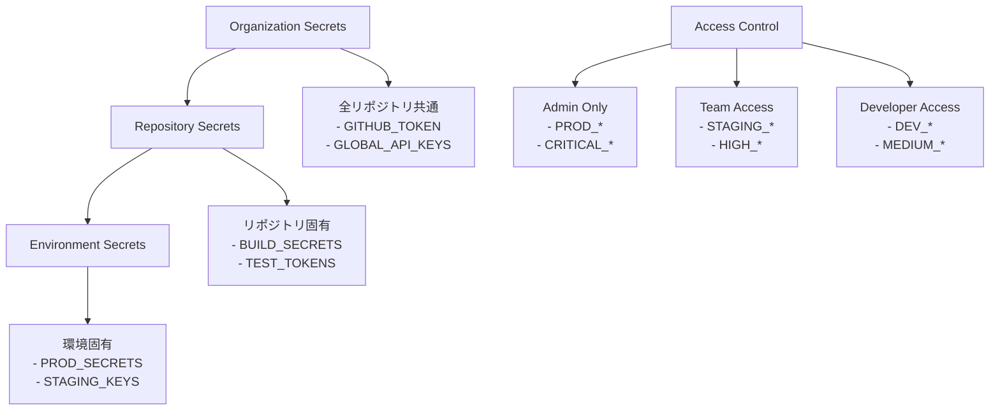

# シークレット管理・セキュリティガイド

**エス・エー・エス株式会社**  
*GitHub Actions CI/CDパイプラインのセキュリティ運用ガイド*

## 📋 目次

- [シークレット管理戦略](#シークレット管理戦略)
- [GitHub Secretsの設定](#github-secretsの設定)
- [セキュリティベストプラクティス](#セキュリティベストプラクティス)
- [監査・コンプライアンス](#監査コンプライアンス)
- [インシデント対応](#インシデント対応)
- [チェックリスト](#チェックリスト)

## 🔐 シークレット管理戦略

### シークレット分類

```yaml
secret_classification:
  critical:
    description: "漏洩時に重大な影響"
    examples:
      - 本番環境API キー
      - データベース接続文字列
      - 暗号化キー
      - 証明書秘密鍵
    rotation_frequency: "月次"
    access_level: "最小限"
    
  high:
    description: "漏洩時に大きな影響"
    examples:
      - ステージング環境API キー
      - 外部サービストークン
      - 通知システムWebhook URL
    rotation_frequency: "四半期"
    access_level: "制限あり"
    
  medium:
    description: "漏洩時に軽微な影響"
    examples:
      - 開発環境API キー
      - テスト用トークン
      - 監視システム認証情報
    rotation_frequency: "半年"
    access_level: "チーム内"
    
  low:
    description: "公開されても問題なし"
    examples:
      - 公開API エンドポイント
      - ドキュメントURL
      - 設定パラメータ
    rotation_frequency: "必要時"
    access_level: "制限なし"
```

### シークレット命名規則

```bash
# 環境プレフィックス
PROD_*        # 本番環境
STAGING_*     # ステージング環境
DEV_*         # 開発環境

# サービス識別子
*_API_KEY     # API キー
*_TOKEN       # アクセストークン
*_SECRET      # 汎用シークレット
*_WEBHOOK_URL # Webhook URL
*_DB_*        # データベース関連

# 実例
PROD_GITHUB_TOKEN
STAGING_SLACK_WEBHOOK_URL
DEV_DATABASE_PASSWORD
SEMGREP_APP_TOKEN
TEAMS_WEBHOOK_URL
```

### アクセス制御戦略



## 🔑 GitHub Secretsの設定

### Repository Secrets設定

```yaml
# 必須シークレット一覧
required_secrets:
  security_scanning:
    - SEMGREP_APP_TOKEN
    - GITLEAKS_LICENSE
    - SNYK_TOKEN
    
  build_deployment:
    - GITHUB_TOKEN  # 自動生成
    - AWS_ACCESS_KEY_ID
    - AWS_SECRET_ACCESS_KEY
    - DOCKER_HUB_USERNAME
    - DOCKER_HUB_TOKEN
    
  notifications:
    - SLACK_WEBHOOK_URL
    - TEAMS_WEBHOOK_URL
    - EMAIL_SMTP_PASSWORD
    
  monitoring:
    - DATADOG_API_KEY
    - NEW_RELIC_LICENSE_KEY
    - PROMETHEUS_TOKEN
```

### Environment Secrets設定

#### Production Environment

```yaml
production_secrets:
  required_reviewers: 2
  deployment_branch_policy: "main"
  
  secrets:
    PROD_API_ENDPOINT: "https://api.sas-com.co.jp"
    PROD_DATABASE_URL: "[暗号化されたDB接続文字列]"
    PROD_JWT_SECRET: "[256bit暗号化キー]"
    PROD_SSL_CERT: "[SSL証明書]"
    PROD_SSL_KEY: "[SSL秘密鍵]"
    
  wait_timer: 5  # 5分間の待機時間
  prevent_self_review: true
```

#### Staging Environment

```yaml
staging_secrets:
  required_reviewers: 1
  deployment_branch_policy: "staging"
  
  secrets:
    STAGING_API_ENDPOINT: "https://api-staging.sas-com.local"
    STAGING_DATABASE_URL: "[ステージング DB接続文字列]"
    STAGING_JWT_SECRET: "[テスト用暗号化キー]"
    
  wait_timer: 0
  prevent_self_review: false
```

#### Development Environment

```yaml
dev_secrets:
  required_reviewers: 0
  deployment_branch_policy: "dev"
  
  secrets:
    DEV_API_ENDPOINT: "https://api-dev.sas-com.local"
    DEV_DATABASE_URL: "[開発用DB接続文字列]"
    DEV_JWT_SECRET: "[開発用暗号化キー]"
```

### シークレット設定スクリプト

```bash
#!/bin/bash
# setup-secrets.sh - GitHub Secretsの一括設定スクリプト

set -euo pipefail

REPO="sas-com/github-guidelines"
GH_TOKEN="${GITHUB_TOKEN}"

echo "🔐 GitHub Secretsの設定を開始..."

# Repository Secrets設定
gh secret set SEMGREP_APP_TOKEN --body "${SEMGREP_TOKEN}" --repo "${REPO}"
gh secret set TEAMS_WEBHOOK_URL --body "${TEAMS_WEBHOOK}" --repo "${REPO}"
gh secret set SLACK_WEBHOOK_URL --body "${SLACK_WEBHOOK}" --repo "${REPO}"

# Environment Secrets設定
gh secret set PROD_API_ENDPOINT --body "https://api.sas-com.co.jp" --env production --repo "${REPO}"
gh secret set STAGING_API_ENDPOINT --body "https://api-staging.sas-com.local" --env staging --repo "${REPO}"
gh secret set DEV_API_ENDPOINT --body "https://api-dev.sas-com.local" --env development --repo "${REPO}"

echo "✅ GitHub Secrets設定完了"

# 設定確認
echo "🔍 設定されたシークレットの確認:"
gh secret list --repo "${REPO}"
```

## 🛡️ セキュリティベストプラクティス

### 1. シークレットの検知・防止

#### .gitignore設定

```gitignore
# GitHub Guidelines - .gitignore

# 機密情報ファイル
*.key
*.pem
*.p12
*.pfx
*.jks
.env
.env.local
.env.production
.env.staging
.env.development
secrets.yml
secrets.json
config/secrets/*

# ログファイル
*.log
logs/
tmp/
temp/

# IDEファイル
.vscode/settings.json
.idea/
*.swp
*.swo

# OS固有ファイル
.DS_Store
Thumbs.db
```

#### Pre-commit Hook設定

```yaml
# .pre-commit-config.yaml
repos:
  - repo: https://github.com/Yelp/detect-secrets
    rev: v1.4.0
    hooks:
      - id: detect-secrets
        args: ['--baseline', '.secrets.baseline']
        
  - repo: https://github.com/zricethezav/gitleaks
    rev: v8.18.0
    hooks:
      - id: gitleaks
      
  - repo: https://github.com/thoughtworks/talisman
    rev: v1.32.0
    hooks:
      - id: talisman-commit
```

#### GitLeaks設定

```toml
# .gitleaks.toml
title = "SAS GitHub Guidelines - GitLeaks設定"

[extend]
useDefault = true

[[rules]]
description = "SAS固有のシークレットパターン"
id = "sas-secrets"
regex = '''(?i)(sas|エスエーエス).{0,20}(secret|key|token|pass)'''
tags = ["sas", "secret"]

[[rules]]
description = "日本語コメント内のパスワード"
id = "japanese-password"
regex = '''パスワード.{0,10}[:=]\s*['"][^'"]{8,}['"]'''
tags = ["japanese", "password"]

[allowlist]
description = "許可されたファイル"
files = [
  '.*\.(md|txt|example)$',
  'README.*',
  'CHANGELOG.*'
]

paths = [
  '.github/workflows/.*\.yml$'
]

regexes = [
  'example-secret',
  'placeholder-token',
  'YOUR_SECRET_HERE'
]
```

### 2. シークレットのローテーション

#### 自動ローテーション戦略

```yaml
# .github/workflows/secret-rotation.yml
name: シークレット定期ローテーション

on:
  schedule:
    # 毎月第1月曜日の午前2時
    - cron: '0 2 * * 1#1'
  workflow_dispatch:

jobs:
  rotate-secrets:
    name: シークレットローテーション
    runs-on: ubuntu-latest
    permissions:
      contents: read
      actions: write
    
    steps:
      - name: Critical Secretsローテーション通知
        run: |
          echo "🔄 Critical Secretsのローテーション時期です"
          
          # ローテーション対象の確認
          SECRETS_TO_ROTATE=(
            "PROD_API_KEY"
            "PROD_DATABASE_PASSWORD"
            "JWT_SECRET"
            "SSL_PRIVATE_KEY"
          )
          
          echo "対象シークレット:"
          printf '%s\n' "${SECRETS_TO_ROTATE[@]}"
      
      - name: Teams通知送信
        uses: skitionek/notify-microsoft-teams@master
        with:
          webhook_url: ${{ secrets.TEAMS_WEBHOOK_URL }}
          title: "🔐 シークレットローテーション通知"
          message: |
            ## 定期シークレットローテーション
            
            **実行日**: $(date)
            **対象**: Critical Secrets
            
            **必要なアクション**:
            1. 新しいシークレット生成
            2. GitHub Secrets更新
            3. 依存サービス更新
            4. 旧シークレット無効化
            
            **担当者**: SAS GitHub管理チーム
```

#### 手動ローテーション手順

```bash
#!/bin/bash
# rotate-secret.sh - 手動シークレットローテーション

SECRET_NAME="${1}"
NEW_SECRET_VALUE="${2}"
ENVIRONMENT="${3:-production}"

if [[ -z "${SECRET_NAME}" || -z "${NEW_SECRET_VALUE}" ]]; then
    echo "使用法: ./rotate-secret.sh SECRET_NAME NEW_VALUE [ENVIRONMENT]"
    exit 1
fi

echo "🔄 シークレットローテーション: ${SECRET_NAME}"

# 1. 新しいシークレットの設定
echo "1. 新しいシークレットを設定中..."
gh secret set "${SECRET_NAME}" \
   --body "${NEW_SECRET_VALUE}" \
   --env "${ENVIRONMENT}" \
   --repo "sas-com/github-guidelines"

# 2. デプロイメントテスト
echo "2. デプロイメントテストを実行中..."
gh workflow run ci-cd-main.yml \
   --ref main \
   -f environment="${ENVIRONMENT}" \
   -f skip_tests=false

# 3. 動作確認
echo "3. 動作確認のための待機..."
sleep 300

# 4. 確認完了通知
echo "✅ シークレットローテーション完了: ${SECRET_NAME}"
echo "新しいワークフロー実行を確認してください。"
```

### 3. アクセス制御・監査

#### RBAC設定

```yaml
# GitHub Teams権限設定
teams_permissions:
  sas-github-admin:
    permissions:
      - admin
      - secrets_write
      - environments_admin
    members:
      - sas-admin-1
      - sas-admin-2
    
  sas-tech-leads:
    permissions:
      - maintain
      - secrets_read
      - environments_write
    members:
      - tech-lead-1
      - tech-lead-2
    
  sas-developers:
    permissions:
      - push
      - pull
    members:
      - dev-1
      - dev-2
      - dev-3
```

#### 監査ログ設定

```yaml
# .github/workflows/audit-log.yml
name: セキュリティ監査ログ

on:
  schedule:
    # 毎日午前1時に実行
    - cron: '0 1 * * *'
  workflow_dispatch:

jobs:
  security-audit:
    name: セキュリティ監査
    runs-on: ubuntu-latest
    permissions:
      contents: read
      actions: read
    
    steps:
      - name: GitHub API監査ログ取得
        env:
          GH_TOKEN: ${{ secrets.GITHUB_TOKEN }}
        run: |
          echo "📋 セキュリティ監査ログを収集中..."
          
          # 最近24時間のアクティビティ取得
          SINCE=$(date -d '1 day ago' -Iseconds)
          
          # シークレット関連のアクティビティ
          gh api graphql -f query='
            query($owner: String!, $repo: String!) {
              repository(owner: $owner, name: $repo) {
                secretScanningAlerts(first: 50, states: OPEN) {
                  nodes {
                    number
                    createdAt
                    state
                    secretType
                  }
                }
              }
            }
          ' -f owner="sas-com" -f repo="github-guidelines" > security-alerts.json
          
          # ワークフロー実行履歴
          gh run list --limit 50 --json status,conclusion,createdAt > workflow-runs.json
          
          echo "✅ 監査ログ収集完了"
      
      - name: 異常検知分析
        run: |
          echo "🔍 異常検知分析を実行中..."
          
          # 失敗したワークフロー実行の分析
          FAILED_RUNS=$(jq '.[] | select(.conclusion == "failure") | .createdAt' workflow-runs.json | wc -l)
          
          if [ "${FAILED_RUNS}" -gt 5 ]; then
            echo "⚠️  警告: 24時間以内に${FAILED_RUNS}件の失敗したワークフローがあります"
          fi
          
          # セキュリティアラートの確認
          OPEN_ALERTS=$(jq '.data.repository.secretScanningAlerts.nodes | length' security-alerts.json)
          
          if [ "${OPEN_ALERTS}" -gt 0 ]; then
            echo "🚨 重要: ${OPEN_ALERTS}件のセキュリティアラートがあります"
          fi
      
      - name: 監査レポート作成
        run: |
          cat > audit-report.md << EOF
          # セキュリティ監査レポート
          
          **実行日時**: $(date -Iseconds)
          **対象期間**: 過去24時間
          
          ## サマリー
          - ワークフロー実行数: $(jq '. | length' workflow-runs.json)
          - 失敗したワークフロー: ${FAILED_RUNS}件
          - セキュリティアラート: ${OPEN_ALERTS}件
          
          ## 推奨アクション
          $(if [ "${FAILED_RUNS}" -gt 5 ]; then echo "- ワークフローの失敗原因を調査"; fi)
          $(if [ "${OPEN_ALERTS}" -gt 0 ]; then echo "- セキュリティアラートの対応"; fi)
          
          ---
          *自動生成されたレポート*
          EOF
      
      - name: レポートアップロード
        uses: actions/upload-artifact@v3
        with:
          name: security-audit-report-$(date +%Y%m%d)
          path: |
            audit-report.md
            security-alerts.json
            workflow-runs.json
          retention-days: 90
```

## 📊 監査・コンプライアンス

### コンプライアンス要件

```yaml
compliance_requirements:
  data_protection:
    - "個人情報の暗号化保存"
    - "アクセスログの記録・保管"
    - "データ処理の透明性確保"
    
  security_standards:
    - "ISO 27001準拠"
    - "SOC 2 Type II要件"
    - "NIST Cybersecurity Framework"
    
  audit_requirements:
    - "四半期セキュリティ監査"
    - "年次コンプライアンス評価"
    - "インシデント報告体制"
    
  retention_policy:
    secrets: "3年間"
    logs: "7年間"
    audit_trails: "7年間"
```

### 定期監査チェックリスト

```markdown
# 四半期セキュリティ監査チェックリスト

## シークレット管理
- [ ] 全シークレットの棚卸完了
- [ ] Critical Secretsのローテーション実施
- [ ] 不要なシークレットの削除完了
- [ ] アクセス権限の見直し完了

## アクセス制御
- [ ] チームメンバーの権限確認
- [ ] 退職者のアクセス権限削除
- [ ] 外部協力者の権限見直し
- [ ] 管理者権限の適切性確認

## セキュリティスキャン
- [ ] 脆弱性スキャン結果の確認
- [ ] セキュリティアラートの対応完了
- [ ] 依存関係の脆弱性確認
- [ ] ライセンスコンプライアンス確認

## 監査証跡
- [ ] アクセスログの確認
- [ ] 変更履歴の記録確認
- [ ] インシデント対応記録の整備
- [ ] 監査レポートの作成完了

## 改善計画
- [ ] セキュリティ改善提案の策定
- [ ] 次四半期の監査計画確定
- [ ] 教育・訓練計画の更新
- [ ] ポリシー・手順の見直し
```

## 🚨 インシデント対応

### セキュリティインシデント分類

```yaml
incident_classification:
  critical_security:
    examples:
      - "シークレット漏洩"
      - "不正アクセス検知"
      - "データ改ざん"
    response_time: "即座（15分以内）"
    escalation: "CISO・経営陣"
    
  high_security:
    examples:
      - "権限昇格の試行"
      - "大量のログイン失敗"
      - "異常なAPI呼び出し"
    response_time: "1時間以内"
    escalation: "セキュリティチーム"
    
  medium_security:
    examples:
      - "脆弱性の発見"
      - "ポリシー違反"
      - "設定ミス"
    response_time: "4時間以内"
    escalation: "技術チーム"
```

### インシデント対応プレイブック

#### 1. シークレット漏洩対応

```yaml
secret_leak_response:
  immediate_actions:
    - step: "漏洩したシークレットの特定"
      time_limit: "5分"
      responsible: "発見者"
      
    - step: "該当シークレットの無効化"
      time_limit: "10分"
      responsible: "GitHub管理者"
      
    - step: "新しいシークレットの生成・設定"
      time_limit: "15分"
      responsible: "技術責任者"
      
    - step: "影響範囲の調査開始"
      time_limit: "30分"
      responsible: "セキュリティチーム"
  
  communication:
    - step: "初期通知送信（Teams/Email）"
      time_limit: "5分"
      
    - step: "ステークホルダーへの報告"
      time_limit: "1時間"
      
    - step: "顧客・パートナーへの通知判定"
      time_limit: "2時間"
  
  recovery:
    - step: "システムの正常性確認"
      time_limit: "1時間"
      
    - step: "監視強化の実施"
      time_limit: "継続"
      
    - step: "事後分析レポート作成"
      time_limit: "48時間"
```

#### 2. 不正アクセス対応

```bash
#!/bin/bash
# incident-response.sh - インシデント自動対応スクリプト

INCIDENT_TYPE="${1}"
SEVERITY="${2}"
AFFECTED_RESOURCES="${3}"

echo "🚨 セキュリティインシデント対応開始"
echo "種類: ${INCIDENT_TYPE}"
echo "深刻度: ${SEVERITY}"

case "${INCIDENT_TYPE}" in
    "unauthorized_access")
        echo "不正アクセス対応を実行中..."
        
        # 1. 影響を受けたアカウントの無効化
        gh api -X PUT /orgs/sas-com/members/suspicious-user \
           -f role=pending
        
        # 2. セッションの強制終了
        gh auth logout --hostname github.com
        
        # 3. パスワードリセット通知
        echo "パスワードリセットが必要です" | \
        mail -s "緊急: セキュリティインシデント" security@sas-com.com
        ;;
        
    "secret_leak")
        echo "シークレット漏洩対応を実行中..."
        
        # 1. 該当シークレットの削除
        for secret in ${AFFECTED_RESOURCES}; do
            gh secret delete "${secret}" --repo sas-com/github-guidelines
        done
        
        # 2. 新しいシークレットの生成指示
        echo "新しいシークレットを生成してください: ${AFFECTED_RESOURCES}"
        ;;
esac

echo "✅ 初期対応完了"
echo "詳細調査を継続してください"
```

### インシデント報告テンプレート

```markdown
# セキュリティインシデント報告書

## 基本情報
- **インシデントID**: SEC-$(date +%Y%m%d)-XXX
- **発生日時**: YYYY-MM-DD HH:MM:SS
- **検知日時**: YYYY-MM-DD HH:MM:SS
- **報告者**: [名前・部署]
- **深刻度**: [Critical/High/Medium/Low]

## インシデントの概要
### 何が起こったか
- 

### 影響範囲
- **影響を受けたシステム**: 
- **影響を受けたユーザー**: 
- **影響を受けたデータ**: 

### 根本原因
- 

## 対応履歴
### 即座対応（発生から1時間以内）
- [ ] インシデント検知・報告
- [ ] 初期封じ込め実施
- [ ] 関係者への通知完了

### 短期対応（24時間以内）
- [ ] 詳細調査完了
- [ ] 根本原因特定
- [ ] 完全な封じ込め実施

### 長期対応（1週間以内）
- [ ] システム復旧完了
- [ ] 再発防止策実装
- [ ] 関係者への最終報告

## 学んだ教訓
### うまくいったこと
- 

### 改善が必要なこと
- 

## 再発防止策
### 技術的対策
- [ ] 
- [ ] 

### プロセス改善
- [ ] 
- [ ] 

### 教育・訓練
- [ ] 
- [ ] 

## コスト影響
- **直接コスト**: 
- **間接コスト**: 
- **機会損失**: 

---
**報告者サイン**: ________________  **日付**: __________
**承認者サイン**: ________________  **日付**: __________
```

## ✅ チェックリスト

### セットアップチェックリスト

```markdown
# GitHub Actions セキュリティセットアップチェックリスト

## 初期設定
- [ ] リポジトリの可視性設定（Private）
- [ ] ブランチ保護ルール設定
- [ ] 必要最小限の権限設定
- [ ] Teams・メンバー権限設定

## シークレット設定
- [ ] Repository Secrets設定
- [ ] Environment Secrets設定
- [ ] Organization Secrets設定
- [ ] シークレット命名規則遵守

## セキュリティツール
- [ ] GitLeaks設定
- [ ] Semgrep設定
- [ ] Pre-commit hooks設定
- [ ] 依存関係スキャン設定

## 監視・通知
- [ ] セキュリティアラート有効化
- [ ] 依存関係アラート有効化
- [ ] 通知先設定（Teams/Email）
- [ ] 監査ログ設定

## ドキュメント
- [ ] セキュリティポリシー作成
- [ ] インシデント対応手順作成
- [ ] 運用マニュアル作成
- [ ] 教育資料作成
```

### 運用チェックリスト

```markdown
# 日次セキュリティチェックリスト

## セキュリティアラート確認
- [ ] セキュリティアドバイザリ確認
- [ ] 依存関係アラート確認
- [ ] シークレットスキャン結果確認
- [ ] ワークフロー実行結果確認

## アクセス制御確認
- [ ] 新規メンバーのアクセス権限確認
- [ ] 退職者のアクセス権限削除
- [ ] 外部協力者のアクセス権限確認
- [ ] 管理者権限の適切性確認

## システム健全性
- [ ] ワークフローの正常動作確認
- [ ] デプロイメント成功率確認
- [ ] パフォーマンス指標確認
- [ ] エラーログ確認

## コンプライアンス
- [ ] 監査ログの記録確認
- [ ] データ保護要件遵守確認
- [ ] ポリシー違反の有無確認
- [ ] 教育・訓練実施状況確認
```

---

## 📞 緊急連絡先

### セキュリティインシデント
- **緊急時**: github@sas-com.com（24時間対応）
- **セキュリティチーム**: security@sas-com.com
- **技術責任者**: tech-lead@sas-com.com

### エスカレーション
- **Critical**: 即座に全連絡先に通知
- **High**: 1時間以内にセキュリティチームに通知
- **Medium**: 4時間以内に技術チームに通知
- **Low**: 翌営業日に担当者に通知

---

*このガイドは定期的に更新され、最新のセキュリティ要件に準拠します。*