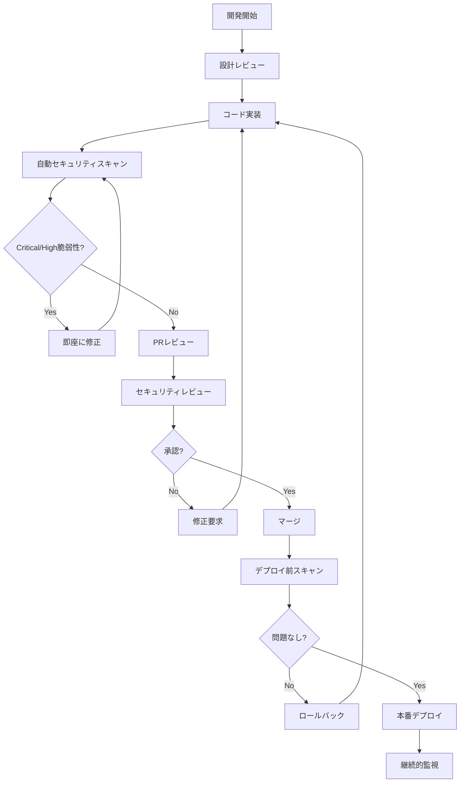

# セキュリティレビュープロセス

**エス・エー・エス株式会社**  
*最終更新日: 2025年9月10日*  
*バージョン: 1.0.0*

## 📋 概要

本ドキュメントは、エス・エー・エス株式会社におけるソフトウェア開発のセキュリティレビュープロセスを定義します。
DevSecOpsの原則に基づき、開発ライフサイクル全体を通じてセキュリティを組み込む体系的なアプローチを提供します。

## 🎯 目的

- セキュリティ脆弱性の早期発見と修正
- セキュリティインシデントの予防
- コンプライアンス要件の遵守
- セキュアな開発文化の醸成
- 継続的なセキュリティ改善

---

## 📊 セキュリティレビューフロー



---

## 🔄 フェーズ別セキュリティレビュー

### Phase 1: 設計・計画フェーズ

#### 脅威モデリング

**実施タイミング**: 詳細設計前

**使用手法**:
- STRIDE（Spoofing、Tampering、Repudiation、Information Disclosure、DoS、Elevation of Privilege）
- PASTA（Process for Attack Simulation and Threat Analysis）
- Attack Trees

**成果物**:
```markdown
1. 脅威モデル図
2. 脅威一覧と対策マトリックス
3. セキュリティ要件定義書
4. リスク評価レポート
```

#### セキュリティ要件定義

**必須要件チェックリスト**:
- [ ] 認証・認可要件の明確化
- [ ] データ分類と暗号化要件
- [ ] 監査ログ要件
- [ ] コンプライアンス要件（GDPR、個人情報保護法等）
- [ ] インシデント対応要件
- [ ] バックアップ・リカバリ要件

### Phase 2: 開発フェーズ

#### セキュアコーディング実践

**開発者チェックリスト**:
```yaml
pre-commit:
  - セキュリティリンター実行
  - 機密情報スキャン
  - 依存関係チェック
  
commit:
  - コミットメッセージにセキュリティ関連の変更を明記
  - セキュリティテストの追加/更新
  
push:
  - ユニットテスト（セキュリティケース含む）
  - 統合テスト実行
```

#### ペアプログラミング・レビュー

**セキュリティ観点**:
- 入力検証ロジックの確認
- 認証・認可実装の確認
- エラーハンドリングの適切性
- ログ出力内容の確認

### Phase 3: CI/CDパイプライン

#### 自動セキュリティテスト構成

```yaml
# .github/workflows/security.yml
name: Security Pipeline

on:
  pull_request:
    branches: [main, develop]
  push:
    branches: [main]

jobs:
  # 1. Secret Detection
  secret-scan:
    runs-on: ubuntu-latest
    steps:
      - uses: actions/checkout@v3
      - name: Run GitLeaks
        run: |
          docker run --rm -v "$PWD":/path zricethezav/gitleaks:latest \
            detect --source="/path" --verbose

  # 2. SAST - Static Application Security Testing
  sast:
    runs-on: ubuntu-latest
    steps:
      - uses: actions/checkout@v3
      
      # JavaScript/TypeScript
      - name: Semgrep Scan
        if: contains(github.repository, 'frontend') || contains(github.repository, 'backend')
        uses: returntocorp/semgrep-action@v1
        with:
          config: >-
            p/security-audit
            p/owasp-top-ten
            p/nodejs
            p/typescript
          
      # Python
      - name: Bandit Security Scan
        if: contains(github.repository, 'python')
        run: |
          pip install bandit
          bandit -r . -f json -o bandit-report.json
          
      # Java
      - name: SpotBugs Scan
        if: contains(github.repository, 'java')
        run: |
          mvn compile spotbugs:check
          
      # Go
      - name: Gosec Scan
        if: contains(github.repository, 'go')
        run: |
          go install github.com/securego/gosec/v2/cmd/gosec@latest
          gosec -fmt json -out gosec-report.json ./...

  # 3. Dependency Check
  dependency-check:
    runs-on: ubuntu-latest
    steps:
      - uses: actions/checkout@v3
      
      - name: Run Snyk
        uses: snyk/actions/node@master
        env:
          SNYK_TOKEN: ${{ secrets.SNYK_TOKEN }}
        with:
          args: --severity-threshold=high
          
      - name: OWASP Dependency Check
        uses: dependency-check/Dependency-Check_Action@main
        with:
          project: ${{ github.repository }}
          path: .
          format: HTML
          args: >
            --enableRetired
            --enableExperimental

  # 4. Container Scanning
  container-scan:
    if: contains(github.repository, 'docker')
    runs-on: ubuntu-latest
    steps:
      - uses: actions/checkout@v3
      
      - name: Run Trivy
        uses: aquasecurity/trivy-action@master
        with:
          image-ref: ${{ github.repository }}:${{ github.sha }}
          format: sarif
          severity: CRITICAL,HIGH
          
      - name: Run Anchore Grype
        run: |
          curl -sSfL https://raw.githubusercontent.com/anchore/grype/main/install.sh | sh -s -- -b /usr/local/bin
          grype ${{ github.repository }}:${{ github.sha }} -o json

  # 5. License Compliance
  license-check:
    runs-on: ubuntu-latest
    steps:
      - uses: actions/checkout@v3
      - name: License Scan
        uses: fossas/fossa-action@main
        with:
          api-key: ${{ secrets.FOSSA_API_KEY }}

  # 6. Infrastructure as Code Scan
  iac-scan:
    if: contains(github.repository, 'terraform') || contains(github.repository, 'cloudformation')
    runs-on: ubuntu-latest
    steps:
      - uses: actions/checkout@v3
      
      - name: Checkov Scan
        uses: bridgecrewio/checkov-action@master
        with:
          framework: terraform
          output_format: sarif
          
      - name: Terrascan
        run: |
          docker run --rm -v "$PWD":/src accurics/terrascan scan -t aws -i terraform
```

### Phase 4: プルリクエストレビュー

#### セキュリティレビュー担当者の決定

**自動アサイン規則**:
```yaml
# .github/CODEOWNERS
# セキュリティクリティカルなファイル
/src/auth/                @security-team
/src/crypto/              @security-team
/src/api/authentication/  @security-team
*.env*                    @security-team
*secret*                  @security-team
/infrastructure/          @devops-team @security-team
```

#### レビュープロセス

**ステップ1: 自動スキャン結果確認**
- [ ] GitLeaksレポート確認
- [ ] SASTレポート確認
- [ ] 依存関係脆弱性レポート確認
- [ ] ライセンスコンプライアンス確認

**ステップ2: 手動セキュリティレビュー**
- [ ] [PR_SECURITY_CHECKLIST.md](./PR_SECURITY_CHECKLIST.md)に基づくレビュー
- [ ] ビジネスロジックの脆弱性確認
- [ ] セキュリティテストカバレッジ確認

**ステップ3: リスク評価**
```markdown
Risk Score = (影響度 × 発生確率) / 対策の有効性

影響度: 1-5 (1:最小, 5:最大)
発生確率: 1-5 (1:低, 5:高)
対策の有効性: 1-5 (1:低, 5:高)

リスクレベル:
- 15以上: Critical - 即座の対応必要
- 10-14: High - 当日中の対応必要
- 5-9: Medium - 3営業日以内の対応
- 1-4: Low - 次回リリースまでに対応
```

### Phase 5: デプロイ前検証

#### プリプロダクション環境でのテスト

**DAST（動的アプリケーションセキュリティテスト）**:
```bash
# OWASP ZAP自動スキャン
docker run -t owasp/zap2docker-stable zap-baseline.py \
  -t https://staging.example.com \
  -r zap-report.html \
  -I

# Nucleiによる脆弱性スキャン
nuclei -u https://staging.example.com \
  -t nuclei-templates/cves/ \
  -t nuclei-templates/vulnerabilities/ \
  -severity critical,high \
  -o nuclei-report.txt
```

**ペネトレーションテスト項目**:
- [ ] 認証バイパステスト
- [ ] セッション管理テスト
- [ ] 入力検証テスト
- [ ] アクセス制御テスト
- [ ] 暗号化実装テスト

### Phase 6: 本番デプロイ

#### デプロイチェックリスト

**セキュリティ確認項目**:
- [ ] すべてのセキュリティテスト合格
- [ ] セキュリティ設定の最終確認
- [ ] 本番環境のセキュリティグループ/ファイアウォール設定
- [ ] ログ・監視設定の確認
- [ ] インシデント対応体制の確認

#### ロールバック計画

```yaml
rollback_criteria:
  - Critical脆弱性の発見
  - データ漏洩の兆候
  - 異常なトラフィックパターン
  - 認証システムの障害
  
rollback_procedure:
  1. インシデント通知
  2. 影響範囲の特定
  3. Blue/Greenデプロイメントの切り替え
  4. データ整合性の確認
  5. インシデントレポート作成
```

### Phase 7: 継続的監視

#### リアルタイム脅威検知

**監視項目**:
```yaml
security_monitoring:
  authentication:
    - ログイン失敗率 > 10%/分
    - 異常な地理的位置からのアクセス
    - ブルートフォース攻撃パターン
    
  api:
    - レート制限超過
    - 異常なAPIコールパターン
    - 認可エラー率の急増
    
  data:
    - 大量データエクスポート
    - 権限外データアクセス
    - SQLインジェクション試行
    
  infrastructure:
    - 設定変更の検知
    - 新規ポート開放
    - 異常なネットワークトラフィック
```

**アラート設定**:
```yaml
alerts:
  critical:
    - 認証システム障害
    - データ漏洩検知
    - マルウェア検知
    notification: 
      - email: security@sas-com.com
      - slack: #security-incidents
      - pagerduty: security-oncall
    
  high:
    - 複数の認証失敗
    - DDoS攻撃検知
    - 脆弱性悪用試行
    notification:
      - email: security@sas-com.com
      - slack: #security-alerts
```

---

## 🛠️ セキュリティツールチェーン

### SAST（静的解析）ツール

| 言語/フレームワーク | 推奨ツール | 代替ツール | 設定ファイル |
|-------------------|-----------|-----------|------------|
| JavaScript/TypeScript | Semgrep, ESLint | SonarQube, CodeQL | `.semgrep.yml` |
| Python | Bandit, Pylint | PyCharm Security | `.bandit` |
| Java | SpotBugs, PMD | Checkmarx, Fortify | `spotbugs.xml` |
| Go | Gosec, StaticCheck | SonarGo | `.gosec.json` |
| C/C++ | Flawfinder, CPPCheck | PVS-Studio | `.cppcheck` |
| Ruby | Brakeman, RuboCop | | `.rubocop.yml` |
| PHP | RIPS, Psalm | | `psalm.xml` |
| .NET | Security Code Scan | | `.editorconfig` |

### DAST（動的解析）ツール

| ツール | 用途 | 自動化 | ライセンス |
|--------|------|--------|-----------|
| OWASP ZAP | Webアプリスキャン | ✅ | OSS |
| Nuclei | 脆弱性検証 | ✅ | OSS |
| Burp Suite | 詳細テスト | 半自動 | 商用 |
| Nessus | インフラスキャン | ✅ | 商用 |
| Metasploit | ペネトレーション | 手動 | OSS/商用 |

### SCA（ソフトウェア構成分析）ツール

| ツール | 特徴 | 統合 | コスト |
|--------|------|------|--------|
| Snyk | リアルタイム脆弱性DB | GitHub, GitLab | Free/Paid |
| WhiteSource | 自動修正PR | CI/CD全般 | Paid |
| OWASP Dependency-Check | 包括的スキャン | Jenkins, GitHub Actions | Free |
| GitHub Dependabot | GitHub統合 | GitHub | Free |
| npm audit | Node.js専用 | npm | Free |

### シークレット検出ツール

| ツール | 検出パターン | False Positive率 | パフォーマンス |
|--------|------------|----------------|--------------|
| GitLeaks | 高精度 | 低 | 高速 |
| TruffleHog | エントロピーベース | 中 | 中速 |
| detect-secrets | カスタマイズ可能 | 低 | 高速 |
| git-secrets | AWS特化 | 低 | 高速 |

---

## 📈 メトリクスとKPI

### セキュリティメトリクス

**定量的指標**:
```yaml
vulnerability_metrics:
  mean_time_to_detect: < 24時間
  mean_time_to_remediate:
    critical: < 4時間
    high: < 24時間
    medium: < 72時間
    low: < 1週間
  
  false_positive_rate: < 20%
  vulnerability_escape_rate: < 5%
  
security_coverage:
  code_coverage: > 80%
  sast_coverage: 100%
  dast_coverage: > 90%
  dependency_scan_frequency: 毎日
  
compliance:
  policy_violation_rate: < 5%
  audit_finding_closure_rate: > 95%
  security_training_completion: 100%
```

**定性的指標**:
- セキュリティ文化の成熟度
- 開発者のセキュリティ意識
- インシデント対応能力
- 脅威インテリジェンス活用度

### レポーティング

**週次レポート**:
```markdown
## セキュリティ週次レポート

### サマリー
- 新規脆弱性: X件（Critical: X, High: X, Medium: X, Low: X）
- 修正済み: X件
- 未対応: X件

### 詳細
1. 脆弱性トレンド
2. 上位リスク項目
3. 対応状況
4. 次週の優先事項

### 推奨事項
- セキュリティパッチ適用
- 設定変更
- プロセス改善
```

**月次レポート**:
- セキュリティKPIダッシュボード
- 脆弱性傾向分析
- インシデント分析
- コンプライアンス状況
- セキュリティ投資ROI

---

## 👥 役割と責任

### セキュリティチーム

**責任範囲**:
- セキュリティポリシーの策定と維持
- セキュリティツールの選定と管理
- セキュリティレビューの実施
- インシデント対応のリード
- セキュリティ教育の実施

**SLA**:
- Criticalレビュー: 2時間以内
- Highレビュー: 4時間以内
- 通常レビュー: 1営業日以内

### 開発チーム

**責任範囲**:
- セキュアコーディング実践
- セキュリティテスト作成
- 脆弱性の修正
- セキュリティドキュメント更新

### DevOpsチーム

**責任範囲**:
- セキュリティパイプライン構築
- インフラセキュリティ管理
- ログ・監視設定
- インシデント対応支援

### プロジェクトマネージャー

**責任範囲**:
- セキュリティ要件の確保
- リソース配分
- ステークホルダー調整
- コンプライアンス管理

---

## 🎓 セキュリティ教育プログラム

### 必須研修

**新入社員向け**:
1. セキュリティ基礎（4時間）
2. OWASP Top 10理解（2時間）
3. セキュアコーディング基礎（4時間）
4. インシデント対応基礎（2時間）

**既存社員向け（年次）**:
1. 最新脅威動向（2時間）
2. セキュリティツール活用（2時間）
3. コンプライアンス更新（1時間）

### 推奨研修

- CISSP/CCSP認定準備
- ペネトレーションテスト実践
- クラウドセキュリティ専門
- セキュリティアーキテクチャ設計

### ハンズオン演習

**Capture The Flag (CTF)**:
- 月次社内CTF開催
- OWASP WebGoat演習
- セキュリティシナリオ演習

**セキュリティチャンピオン制度**:
- 各チーム1名選出
- 月次ミーティング
- セキュリティ知識共有
- ベストプラクティス展開

---

## 🚨 エスカレーションマトリックス

| レベル | 条件 | 初動対応 | エスカレーション先 | 対応時間 |
|--------|------|----------|------------------|----------|
| **L1 - Critical** | データ漏洩、システム侵害、ゼロデイ攻撃 | セキュリティチームリード | CISO → CEO | 15分以内 |
| **L2 - High** | 認証バイパス、重大な脆弱性発見 | セキュリティエンジニア | セキュリティマネージャー | 1時間以内 |
| **L3 - Medium** | 中程度の脆弱性、設定不備 | 開発リード | プロジェクトマネージャー | 4時間以内 |
| **L4 - Low** | 軽微な問題、改善提案 | 開発者 | チームリード | 翌営業日 |

---

## 📚 テンプレート・チェックリスト

### 脅威モデリングテンプレート

```markdown
## 脅威モデル - [システム名]

### 1. システム概要
- 目的:
- スコープ:
- ステークホルダー:

### 2. アーキテクチャ図
[図を挿入]

### 3. データフロー図
[図を挿入]

### 4. 脅威識別（STRIDE）
| ID | 脅威カテゴリ | 脅威の説明 | 影響度 | 発生確率 | リスクレベル |
|----|------------|-----------|--------|---------|------------|
| T001 | Spoofing | | | | |
| T002 | Tampering | | | | |

### 5. 対策
| 脅威ID | 対策 | 実装状況 | 担当者 | 期限 |
|-------|------|---------|--------|------|
| T001 | | | | |

### 6. 残存リスク
- 受容リスク:
- 軽減計画:
```

### セキュリティレビューチェックシート

```markdown
## セキュリティレビュー記録

**PR番号**: #
**レビュー日**: 
**レビュアー**: 

### 自動スキャン結果
- [ ] GitLeaks: Pass/Fail
- [ ] SAST: Pass/Fail (Critical: 0, High: 0)
- [ ] Dependency Check: Pass/Fail
- [ ] License Check: Pass/Fail

### 手動レビュー項目
- [ ] 認証・認可実装確認
- [ ] 入力検証確認
- [ ] エラーハンドリング確認
- [ ] ログ出力確認
- [ ] 暗号化実装確認

### 発見事項
| 項目 | 重要度 | 詳細 | 対応状況 |
|------|--------|------|----------|
| | | | |

### 承認
- [ ] セキュリティ承認
- [ ] 条件付き承認（要対応事項:）
- [ ] 却下（理由:）

**署名**: 
**日付**: 
```

---

## 🔄 継続的改善

### レトロスペクティブ

**月次セキュリティレトロスペクティブ**:
- What went well?
- What could be improved?
- Action items for next sprint

### プロセス改善

**改善サイクル**:
1. 問題の特定（インシデント、監査指摘等）
2. 根本原因分析（RCA）
3. 改善策の立案
4. パイロット実施
5. 効果測定
6. 全社展開

### ベンチマーキング

**業界標準との比較**:
- OWASP SAMM成熟度評価
- BSIMM（Building Security In Maturity Model）
- NIST CSFとの整合性

---

## 📞 サポート・連絡先

| 種別 | 連絡先 | 対応時間 |
|------|--------|----------|
| セキュリティインシデント | security@sas-com.com | 24/7 |
| セキュリティレビュー依頼 | security-review@sas-com.com | 営業時間 |
| セキュリティ相談 | security-help@sas-com.com | 営業時間 |
| 脆弱性報告 | vulnerability@sas-com.com | 24/7 |

---

**© 2025 エス・エー・エス株式会社 - セキュリティレビュープロセス**