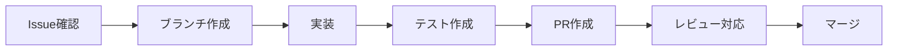

# GitHub運用ガイドライン - 開発チーム版

**エス・エー・エス株式会社 開発チーム向け**  
*効率的な開発ワークフローとコード品質向上のための実践ガイド*

---

## 📚 目次

1. [クイックスタート](#クイックスタート)
2. [日常開発ワークフロー](#日常開発ワークフロー)
3. [コード品質とレビュー](#コード品質とレビュー)
4. [自動化とツール活用](#自動化とツール活用)
5. [テスト戦略](#テスト戦略)
6. [トラブルシューティング](#トラブルシューティング)
7. [成功指標とKPI](#成功指標とkpi)

---

## クイックスタート

### 🚀 30秒で始める開発フロー

```bash
# 1. 最新のdevブランチを取得
git checkout dev && git pull origin dev

# 2. 機能ブランチを作成
git checkout -b feature/TICKET-123-user-authentication

# 3. 開発・コミット
git add . && git commit -m "feat(auth): ユーザー認証機能を実装"

# 4. プッシュとPR作成
git push -u origin feature/TICKET-123-user-authentication
# GitHub上でPRを作成
```

### 📋 開発前チェックリスト

- [ ] Issue/チケット番号を確認
- [ ] 最新のdevブランチから分岐
- [ ] 開発環境が正常に動作
- [ ] 必要な環境変数を設定
- [ ] テストが全てパス

---

## 日常開発ワークフロー

### 1. Issue駆動開発



### 2. ブランチ命名規則（簡略版）

```
feature/TICKET-番号-簡潔な説明
bugfix/TICKET-番号-修正内容
hotfix/緊急度-修正内容
```

**例**:
- `feature/PROJ-123-add-login`
- `bugfix/PROJ-456-fix-validation`
- `hotfix/critical-auth-bypass`

### 3. コミットメッセージテンプレート

```bash
# ~/.gitmessageに保存して使用
git config --global commit.template ~/.gitmessage
```

```
# <type>(<scope>): <subject>

# 種別:
# feat: 新機能
# fix: バグ修正
# refactor: リファクタリング
# test: テスト追加・修正
# docs: ドキュメント更新
# style: コードスタイル修正

# 例:
# feat(auth): ログイン機能を実装
# fix(api): ユーザー検索のバグを修正
```

---

## コード品質とレビュー

### 開発者用セルフレビューチェックリスト

#### 📝 コミット前の確認

```bash
# 自動チェックスクリプト
./scripts/pre-commit-check.sh
```

**手動確認項目**:
- [ ] 不要なconsole.logやdebugコードを削除
- [ ] TODO/FIXMEコメントに期日とチケット番号
- [ ] エラーハンドリングが適切
- [ ] パフォーマンスへの影響を考慮
- [ ] セキュリティリスクがない

### コードレビュー効率化

#### レビュー依頼テンプレート

```markdown
## 概要
<!-- 変更の概要を2-3行で -->

## 変更内容
- [ ] 機能A: 説明
- [ ] 機能B: 説明

## テスト
- [ ] 単体テスト追加
- [ ] 手動テスト完了
- [ ] E2Eテスト更新

## 影響範囲
<!-- 影響を受ける機能や画面 -->

## レビューポイント
<!-- 特に見てほしい箇所 -->

## スクリーンショット
<!-- UI変更がある場合 -->
```

---

## 自動化とツール活用

### 開発効率化ツール

#### 1. VS Code設定

```json
// .vscode/settings.json
{
  "editor.formatOnSave": true,
  "editor.codeActionsOnSave": {
    "source.fixAll.eslint": true
  },
  "git.enableSmartCommit": true,
  "git.confirmSync": false,
  "typescript.updateImportsOnFileMove.enabled": "always"
}
```

#### 2. Git エイリアス設定

```bash
# ~/.gitconfig
[alias]
    st = status -sb
    co = checkout
    br = branch
    cm = commit -m
    pl = pull origin
    ps = push origin
    dev = checkout dev
    feat = "!f() { git checkout -b feature/$1; }; f"
    sync = "!f() { git checkout dev && git pull origin dev; }; f"
```

#### 3. 開発用Dockerコマンド

```bash
# Makefile
.PHONY: dev test build

dev:
	docker-compose up -d
	docker-compose logs -f app

test:
	docker-compose run --rm app npm test

build:
	docker-compose build --no-cache

clean:
	docker-compose down -v
	docker system prune -f
```

### GitHub Actions 開発者向け

```yaml
# .github/workflows/dev-automation.yml
name: 開発者サポート

on:
  pull_request:
    types: [opened, synchronize]

jobs:
  auto-checks:
    runs-on: ubuntu-latest
    steps:
      - uses: actions/checkout@v3
      
      - name: Linting
        run: npm run lint
        
      - name: Type Check
        run: npm run type-check
        
      - name: Unit Tests
        run: npm run test:unit
        
      - name: Build Check
        run: npm run build
        
      - name: Bundle Size Check
        run: npm run size
```

---

## テスト戦略

### テスト優先順位

1. **必須テスト** (ブロッカー)
   - 認証・認可
   - 決済処理
   - データ整合性

2. **重要テスト** (警告)
   - 主要機能のハッピーパス
   - エラーハンドリング
   - バリデーション

3. **推奨テスト** (情報)
   - UI/UXテスト
   - パフォーマンステスト
   - エッジケース

### テストコマンド集

```bash
# 単体テスト
npm run test:unit

# 統合テスト
npm run test:integration

# カバレッジ確認
npm run test:coverage

# 特定ファイルのテスト
npm test -- --testPathPattern=auth

# ウォッチモード
npm test -- --watch
```

---

## トラブルシューティング

### よくある問題と解決法

#### 1. マージコンフリクト

```bash
# 安全な解決手順
git checkout dev
git pull origin dev
git checkout feature/your-branch
git rebase dev
# コンフリクト解決
git add .
git rebase --continue
```

#### 2. 誤ったコミット

```bash
# 直前のコミットを修正
git commit --amend

# 特定のコミットを取り消し
git revert <commit-hash>

# ローカルの変更を一時保存
git stash
git stash pop
```

#### 3. CI/CDエラー

```bash
# ローカルでCIチェック
npm run ci:local

# キャッシュクリア
npm ci --cache /tmp/empty-cache

# 依存関係の再インストール
rm -rf node_modules package-lock.json
npm install
```

---

## 成功指標とKPI

### 開発チームKPI

#### コード品質指標

| 指標 | 目標値 | 測定方法 |
|------|--------|----------|
| コードカバレッジ | 80%以上 | Jest/NYC |
| 技術的負債 | 5日以下 | SonarQube |
| バグ密度 | 1件/1000行以下 | GitHub Issues |
| ビルド成功率 | 95%以上 | GitHub Actions |

#### 生産性指標

| 指標 | 目標値 | 測定方法 |
|------|--------|----------|
| PR作成からマージまでの時間 | 24時間以内 | GitHub Insights |
| レビューサイクル数 | 2回以下 | PR履歴 |
| デプロイ頻度 | 週3回以上 | デプロイログ |
| MTTR（平均復旧時間） | 1時間以内 | インシデントログ |

### 週次レビューテンプレート

```markdown
## 週次開発レビュー

### 今週の成果
- [ ] 完了したチケット数: X件
- [ ] マージされたPR数: X件
- [ ] リリースした機能: X件

### 改善点
- 課題1: 対策
- 課題2: 対策

### 来週の計画
- [ ] 優先度高: タスク
- [ ] 優先度中: タスク
- [ ] 優先度低: タスク
```

---

## 🚀 クイックアクション

### 便利なブックマークレット

```javascript
// PR作成リンク
javascript:(function(){
  const branch = prompt('ブランチ名:');
  window.open(`https://github.com/sas-com/repo/compare/dev...${branch}`);
})();

// Issue作成リンク
javascript:(function(){
  window.open('https://github.com/sas-com/repo/issues/new?template=bug_report.md');
})();
```

### VS Code スニペット

```json
// .vscode/snippets.json
{
  "Console Log": {
    "prefix": "cl",
    "body": [
      "console.log('$1:', $1);"
    ]
  },
  "Try Catch": {
    "prefix": "tc",
    "body": [
      "try {",
      "  $1",
      "} catch (error) {",
      "  console.error('Error:', error);",
      "  throw error;",
      "}"
    ]
  }
}
```

---

## 📞 サポート

### 開発チーム向け連絡先

- **技術的な質問**: dev-support@sas-com.com
- **緊急時**: dev-emergency@sas-com.com
- **Slackチャンネル**: #dev-team
- **Wiki**: https://wiki.sas-com.com/dev

### よくある質問（FAQ）

- [開発環境セットアップ](./FAQ_DEV_SETUP.md)
- [Git操作トラブル](./FAQ_GIT_TROUBLE.md)
- [CI/CDエラー対応](./FAQ_CICD_ERROR.md)

---

**更新日**: 2025-09-11  
**バージョン**: 1.0.0  
**対象**: 開発チーム