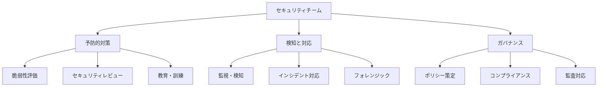
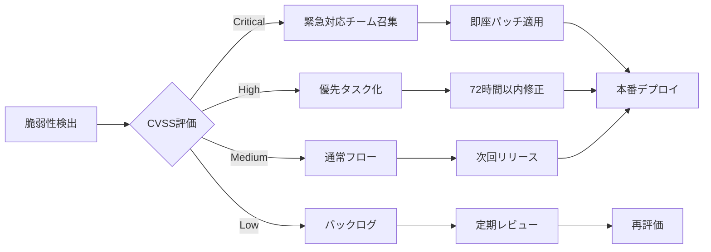

# GitHub運用ガイドライン - セキュリティチーム版

**エス・エー・エス株式会社 セキュリティチーム向け**  
*脅威対策、コンプライアンス、インシデント対応のための包括的セキュリティガイド*

---

## 📚 目次

1. [セキュリティチーム責務](#セキュリティチーム責務)
2. [セキュリティレビュープロセス](#セキュリティレビュープロセス)
3. [脆弱性管理](#脆弱性管理)
4. [インシデント対応](#インシデント対応)
5. [コンプライアンスと監査](#コンプライアンスと監査)
6. [セキュリティ自動化](#セキュリティ自動化)
7. [脅威モデリング](#脅威モデリング)
8. [成功指標とKRI](#成功指標とkri)

---

## セキュリティチーム責務

### セキュリティ責任分担



### 日次セキュリティタスク

```yaml
# daily-security-tasks.yml
daily_tasks:
  morning:
    - check_security_alerts
    - review_overnight_incidents
    - scan_vulnerability_reports
    - check_compliance_dashboards
    
  continuous:
    - monitor_security_events
    - review_pull_requests
    - respond_to_security_questions
    - update_threat_intelligence
    
  evening:
    - daily_security_report
    - update_incident_tracker
    - plan_next_day_priorities
```

---

## セキュリティレビュープロセス

### プルリクエストセキュリティレビュー

```markdown
## セキュリティレビューチェックリスト

### 認証・認可
- [ ] 適切な認証メカニズムの実装
- [ ] 最小権限の原則の遵守
- [ ] セッション管理の安全性
- [ ] トークンの適切な有効期限設定

### 入力検証
- [ ] すべてのユーザー入力の検証
- [ ] SQLインジェクション対策
- [ ] XSS対策の実装
- [ ] パストラバーサル対策

### データ保護
- [ ] 機密データの暗号化
- [ ] 安全な通信プロトコルの使用
- [ ] PII（個人識別情報）の適切な処理
- [ ] ログへの機密情報記録防止

### エラーハンドリング
- [ ] 詳細なエラー情報の非表示
- [ ] 適切なエラーログの実装
- [ ] フェイルセーフメカニズム

### 依存関係
- [ ] 既知の脆弱性がないことの確認
- [ ] 最新のセキュリティパッチ適用
- [ ] ライセンスコンプライアンス
```

### セキュリティゲートチェック

```yaml
# .github/workflows/security-gates.yml
name: Security Gates

on:
  pull_request:
    branches: [main, staging]

jobs:
  security-scan:
    runs-on: ubuntu-latest
    steps:
      - uses: actions/checkout@v3
      
      - name: SAST - CodeQL
        uses: github/codeql-action/analyze@v2
        with:
          languages: javascript, python
          
      - name: Dependency Check
        uses: dependency-check/Dependency-Check_Action@main
        with:
          project: 'deps'
          path: '.'
          format: 'HTML'
          
      - name: Secret Scanning
        uses: trufflesecurity/trufflehog@main
        with:
          path: ./
          base: main
          head: HEAD
          
      - name: Container Scanning
        uses: aquasecurity/trivy-action@master
        with:
          image-ref: 'docker.io/my-app:${{ github.sha }}'
          format: 'sarif'
          output: 'trivy-results.sarif'
          
      - name: IaC Security
        uses: bridgecrewio/checkov-action@master
        with:
          directory: .
          framework: all
          output_format: sarif
          
      - name: Upload Results
        uses: github/codeql-action/upload-sarif@v2
        if: always()
        with:
          sarif_file: 'trivy-results.sarif'
```

---

## 脆弱性管理

### 脆弱性評価マトリックス

| CVSS Score | 緊急度 | 対応期限 | アクション |
|------------|--------|----------|------------|
| 9.0-10.0 | Critical | 24時間 | 即座に修正・緊急パッチ |
| 7.0-8.9 | High | 72時間 | 優先対応・計画的修正 |
| 4.0-6.9 | Medium | 1週間 | 通常対応・次回リリース |
| 0.1-3.9 | Low | 1ヶ月 | バックログ・監視継続 |

### 脆弱性対応フロー



### 脆弱性スキャン自動化

```bash
#!/bin/bash
# scripts/vulnerability-scan.sh

set -e

SCAN_DATE=$(date +%Y%m%d)
REPORT_DIR="/security/reports/${SCAN_DATE}"
mkdir -p ${REPORT_DIR}

echo "Starting comprehensive vulnerability scan..."

# 1. 依存関係スキャン
echo "Scanning dependencies..."
npm audit --json > ${REPORT_DIR}/npm-audit.json
pip-audit --format json > ${REPORT_DIR}/pip-audit.json
bundle-audit check --format json > ${REPORT_DIR}/bundle-audit.json

# 2. コンテナスキャン
echo "Scanning containers..."
trivy image --format json --output ${REPORT_DIR}/container-scan.json myapp:latest

# 3. IaCスキャン
echo "Scanning Infrastructure as Code..."
checkov -d ./terraform --output json > ${REPORT_DIR}/iac-scan.json

# 4. シークレットスキャン
echo "Scanning for secrets..."
trufflehog git file://. --json > ${REPORT_DIR}/secret-scan.json

# 5. SAST
echo "Running static analysis..."
semgrep --config=auto --json > ${REPORT_DIR}/sast-scan.json

# 6. レポート生成
echo "Generating consolidated report..."
python3 /scripts/generate_security_report.py ${REPORT_DIR}

# 7. 通知
if [ -f ${REPORT_DIR}/critical_findings.txt ]; then
    echo "CRITICAL vulnerabilities found!"
    cat ${REPORT_DIR}/critical_findings.txt
    /scripts/send_alert.sh "CRITICAL" ${REPORT_DIR}/critical_findings.txt
fi

echo "Vulnerability scan completed. Report: ${REPORT_DIR}/summary.html"
```

---

## インシデント対応

### インシデント分類と対応

```yaml
# incident-classification.yml
incident_levels:
  P1_critical:
    description: "データ漏洩、システム侵害、ランサムウェア"
    response_time: "15分以内"
    team: "全セキュリティチーム + 経営層"
    actions:
      - isolate_affected_systems
      - preserve_evidence
      - notify_stakeholders
      - initiate_forensics
      
  P2_high:
    description: "不正アクセス試行、重要脆弱性発見"
    response_time: "1時間以内"
    team: "セキュリティアナリスト + チームリード"
    actions:
      - investigate_scope
      - implement_countermeasures
      - monitor_closely
      
  P3_medium:
    description: "疑わしい活動、設定ミス"
    response_time: "4時間以内"
    team: "当番セキュリティアナリスト"
    actions:
      - analyze_logs
      - correct_configurations
      - update_rules
      
  P4_low:
    description: "情報収集、軽微な異常"
    response_time: "24時間以内"
    team: "ジュニアアナリスト"
    actions:
      - document_findings
      - trend_analysis
```

### インシデント対応プレイブック

```markdown
# データ漏洩インシデント対応プレイブック

## 1. 初期対応（0-15分）
- [ ] インシデント確認と記録開始
- [ ] 影響システムの特定
- [ ] 証拠保全の開始
- [ ] インシデント対応チーム召集

## 2. 封じ込め（15-60分）
- [ ] 影響システムの隔離
- [ ] 攻撃ベクトルの遮断
- [ ] 追加被害の防止
- [ ] 暫定対策の実施

## 3. 調査（1-4時間）
- [ ] ログ分析
- [ ] フォレンジック調査
- [ ] 影響範囲の特定
- [ ] タイムライン作成

## 4. 根絶（4-24時間）
- [ ] マルウェア除去
- [ ] 脆弱性修正
- [ ] システム再構築
- [ ] セキュリティ強化

## 5. 復旧（1-3日）
- [ ] システム復旧計画
- [ ] 段階的復旧実施
- [ ] 監視強化
- [ ] 正常性確認

## 6. 事後対応（3-7日）
- [ ] インシデントレポート作成
- [ ] 教訓の文書化
- [ ] プロセス改善
- [ ] ステークホルダー報告
```

### フォレンジックツールキット

```bash
#!/bin/bash
# scripts/forensics-toolkit.sh

# メモリダンプ取得
sudo ./tools/avml /forensics/memory.dump

# ディスクイメージ作成
sudo dd if=/dev/sda of=/forensics/disk.img bs=4M status=progress

# ネットワークトラフィック記録
sudo tcpdump -i eth0 -w /forensics/network.pcap

# プロセスリスト保存
ps auxww > /forensics/processes.txt

# ネットワーク接続保存
netstat -antp > /forensics/connections.txt

# ファイルハッシュ計算
find / -type f -exec sha256sum {} \; > /forensics/file_hashes.txt

# ログ収集
tar -czf /forensics/logs.tar.gz /var/log/

# タイムライン作成
./tools/plaso/log2timeline.py /forensics/timeline.plaso /
```

---

## コンプライアンスと監査

### コンプライアンスチェックリスト

```yaml
# compliance-checklist.yml
compliance_requirements:
  pci_dss:
    - requirement_1: "ファイアウォール設定"
    - requirement_2: "デフォルトパスワード変更"
    - requirement_3: "カード会員データ保護"
    - requirement_4: "暗号化通信"
    - requirement_5: "アンチウイルス"
    - requirement_6: "セキュアな開発"
    
  gdpr:
    - article_25: "プライバシーバイデザイン"
    - article_32: "適切なセキュリティ"
    - article_33: "侵害通知（72時間）"
    - article_35: "データ保護影響評価"
    
  iso27001:
    - a5: "情報セキュリティ方針"
    - a6: "組織"
    - a7: "人的セキュリティ"
    - a8: "資産管理"
    - a9: "アクセス制御"
    - a10: "暗号"
```

### 監査ログ管理

```python
# scripts/audit_log_manager.py
import json
import hashlib
import datetime
from cryptography.fernet import Fernet

class AuditLogger:
    def __init__(self, key_file):
        with open(key_file, 'rb') as f:
            self.cipher = Fernet(f.read())
    
    def log_event(self, event_type, user, action, resource, result):
        timestamp = datetime.datetime.utcnow().isoformat()
        
        log_entry = {
            'timestamp': timestamp,
            'event_type': event_type,
            'user': user,
            'action': action,
            'resource': resource,
            'result': result,
            'hash': None
        }
        
        # Calculate hash for integrity
        log_string = json.dumps(log_entry, sort_keys=True)
        log_entry['hash'] = hashlib.sha256(log_string.encode()).hexdigest()
        
        # Encrypt sensitive data
        encrypted_log = self.cipher.encrypt(json.dumps(log_entry).encode())
        
        # Store in tamper-proof storage
        self.store_log(encrypted_log)
    
    def store_log(self, encrypted_log):
        # Implementation for secure storage
        pass
    
    def verify_integrity(self, log_entry):
        original_hash = log_entry.pop('hash')
        calculated_hash = hashlib.sha256(
            json.dumps(log_entry, sort_keys=True).encode()
        ).hexdigest()
        return original_hash == calculated_hash
```

---

## セキュリティ自動化

### セキュリティオーケストレーション

```yaml
# security-automation/playbook.yml
name: Automated Security Response
trigger:
  - type: webhook
    source: security_tools
  - type: schedule
    cron: "0 */6 * * *"

actions:
  malware_detected:
    steps:
      - isolate_host:
          api: aws_ec2
          action: modify_security_group
          params:
            remove_all_ingress: true
            
      - snapshot_evidence:
          api: aws_ec2
          action: create_snapshot
          
      - notify_team:
          api: slack
          channel: "#security-incidents"
          message: "Malware detected on {host}"
          
      - create_ticket:
          api: jira
          project: SECURITY
          type: incident
          priority: high
          
  suspicious_login:
    steps:
      - disable_account:
          api: active_directory
          action: disable_user
          
      - reset_sessions:
          api: application
          action: invalidate_all_sessions
          
      - require_mfa:
          api: auth_provider
          action: enforce_mfa
```

### 自動化スクリプト集

```bash
#!/bin/bash
# scripts/security-automation/auto-patch.sh

# 自動パッチ適用スクリプト
set -e

LOG_FILE="/var/log/auto-patch-$(date +%Y%m%d).log"

echo "Starting automated security patching..." | tee -a $LOG_FILE

# 1. システムアップデート
apt-get update >> $LOG_FILE 2>&1
apt-get upgrade -y >> $LOG_FILE 2>&1

# 2. セキュリティパッチのみ適用
unattended-upgrade -d >> $LOG_FILE 2>&1

# 3. 依存関係アップデート
npm audit fix --force >> $LOG_FILE 2>&1
pip install --upgrade pip >> $LOG_FILE 2>&1
pip list --outdated --format=freeze | grep -v '^\-e' | cut -d = -f 1 | xargs -n1 pip install -U >> $LOG_FILE 2>&1

# 4. コンテナイメージ更新
docker images | grep -v REPOSITORY | awk '{print $1":"$2}' | while read image; do
    docker pull $image >> $LOG_FILE 2>&1
done

# 5. 再起動判定
if [ -f /var/run/reboot-required ]; then
    echo "Reboot required. Scheduling maintenance window..." | tee -a $LOG_FILE
    shutdown -r +60 "System reboot for security updates in 60 minutes"
fi

echo "Automated patching completed." | tee -a $LOG_FILE
```

---

## 脅威モデリング

### STRIDE脅威分析

```markdown
## STRIDE脅威モデル

### S - Spoofing (なりすまし)
- **脅威**: 偽の認証情報での不正アクセス
- **対策**: MFA実装、証明書ベース認証

### T - Tampering (改ざん)
- **脅威**: データやコードの不正な変更
- **対策**: デジタル署名、整合性チェック

### R - Repudiation (否認)
- **脅威**: 行動の否定、証跡の欠如
- **対策**: 監査ログ、タイムスタンプ

### I - Information Disclosure (情報漏洩)
- **脅威**: 機密情報の不正な開示
- **対策**: 暗号化、アクセス制御

### D - Denial of Service (サービス拒否)
- **脅威**: システムの可用性への攻撃
- **対策**: レート制限、DDoS対策

### E - Elevation of Privilege (権限昇格)
- **脅威**: 不正な権限取得
- **対策**: 最小権限原則、権限分離
```

### Attack Tree分析

```yaml
# threat-models/payment-system.yml
attack_goal: "不正な決済実行"

attack_tree:
  - node: "認証をバイパス"
    children:
      - "セッショントークン窃取"
        mitigations:
          - "HTTPOnly Cookie"
          - "Secure Flag"
          - "SameSite属性"
      - "認証情報の総当たり"
        mitigations:
          - "レート制限"
          - "アカウントロック"
          - "CAPTCHA"
          
  - node: "決済データ改ざん"
    children:
      - "中間者攻撃"
        mitigations:
          - "TLS 1.3"
          - "証明書ピンニング"
      - "APIパラメータ改ざん"
        mitigations:
          - "署名検証"
          - "入力検証"
```

---

## 成功指標とKRI

### Key Risk Indicators (KRI)

```yaml
# kri-dashboard.yml
security_kris:
  vulnerability_metrics:
    critical_vulns_open: 
      threshold: 0
      current: 0
      trend: stable
    mean_time_to_patch:
      threshold: "< 72 hours"
      current: "48 hours"
      trend: improving
      
  incident_metrics:
    incidents_per_month:
      threshold: "< 5"
      current: 3
      trend: decreasing
    mean_time_to_detect:
      threshold: "< 1 hour"
      current: "45 minutes"
      trend: improving
    mean_time_to_respond:
      threshold: "< 30 minutes"
      current: "25 minutes"
      trend: stable
      
  compliance_metrics:
    policy_violations:
      threshold: "< 2%"
      current: "1.5%"
      trend: decreasing
    audit_findings:
      threshold: "< 5"
      current: 3
      trend: stable
      
  training_metrics:
    security_training_completion:
      threshold: "> 95%"
      current: "97%"
      trend: stable
    phishing_test_failure_rate:
      threshold: "< 5%"
      current: "3%"
      trend: improving
```

### セキュリティダッシュボード

```python
# scripts/security_dashboard.py
import pandas as pd
import plotly.graph_objects as go
from datetime import datetime, timedelta

class SecurityDashboard:
    def __init__(self):
        self.metrics = self.load_metrics()
    
    def generate_executive_summary(self):
        return {
            'security_score': self.calculate_security_score(),
            'top_risks': self.get_top_risks(),
            'compliance_status': self.get_compliance_status(),
            'incident_trend': self.get_incident_trend(),
            'recommendations': self.generate_recommendations()
        }
    
    def calculate_security_score(self):
        weights = {
            'vulnerability_management': 0.3,
            'incident_response': 0.25,
            'compliance': 0.2,
            'access_control': 0.15,
            'training': 0.1
        }
        
        scores = {
            'vulnerability_management': self.vuln_score(),
            'incident_response': self.incident_score(),
            'compliance': self.compliance_score(),
            'access_control': self.access_score(),
            'training': self.training_score()
        }
        
        total_score = sum(scores[k] * weights[k] for k in weights)
        return round(total_score, 2)
    
    def generate_report(self):
        # Implementation for automated report generation
        pass
```

---

## 🔐 セキュリティツールボックス

### 必須セキュリティツール

```bash
# セキュリティツールインストール
#!/bin/bash

# SAST Tools
pip install semgrep bandit safety
npm install -g snyk eslint-plugin-security

# DAST Tools
apt-get install -y nikto sqlmap zaproxy

# Network Security
apt-get install -y nmap wireshark tcpdump netcat

# Forensics
apt-get install -y volatility sleuthkit autopsy

# Cryptography
apt-get install -y openssl gnupg hashcat john
```

### 緊急対応コマンド集

```bash
# 即座にシステムを隔離
iptables -P INPUT DROP
iptables -P OUTPUT DROP
iptables -P FORWARD DROP

# 不審なプロセスの検出
ps aux | grep -v "^USER" | awk '{print $1}' | sort | uniq -c | sort -rn

# 不審なネットワーク接続
netstat -tulpn | grep ESTABLISHED

# 最近変更されたファイル
find / -type f -mtime -1 -ls 2>/dev/null

# ユーザーアクティビティ確認
last -F
who -a
w
```

---

## 📞 セキュリティチームサポート

### 24時間対応体制

```yaml
oncall_rotation:
  primary:
    name: "Security Analyst"
    phone: "+81-XXX-XXXX"
    email: "oncall-primary@sas-com.com"
    
  secondary:
    name: "Senior Security Engineer"
    phone: "+81-XXX-XXXX"
    email: "oncall-secondary@sas-com.com"
    
  escalation:
    name: "CISO"
    phone: "+81-XXX-XXXX"
    email: "ciso@sas-com.com"
```

### 外部連携先

- **JPCERT/CC**: incident@jpcert.or.jp
- **IPA**: isec-info@ipa.go.jp
- **警察サイバー犯罪対策**: 各都道府県警察
- **フォレンジック専門業者**: 契約業者連絡先

---

**更新日**: 2025-09-11  
**バージョン**: 1.0.0  
**対象**: セキュリティチーム  
**機密度**: Confidential