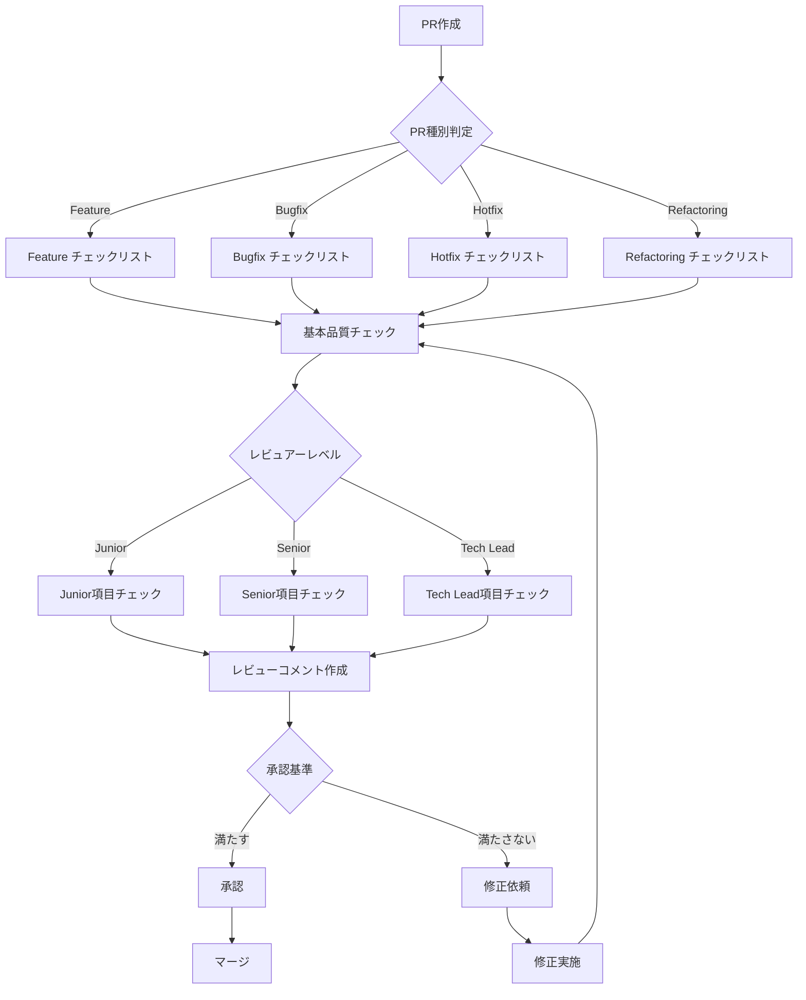

# プルリクエストレビューチェックリスト

**エス・エー・エス株式会社**  
*包括的なPRレビューチェックリスト*

## 📋 概要

このチェックリストは、PRレビュープロセスの標準化と品質向上を目的として作成されています。レビュアーのレベルやPRの種類に応じて、適切なチェック項目を選択してご利用ください。

## 🎯 基本品質チェックリスト

### コード品質・可読性
- [ ] **命名規則準拠**: 変数名、関数名、クラス名が規約に従っているか
- [ ] **コードの可読性**: 第三者が理解しやすいコードか
- [ ] **適切なコメント**: 複雑なロジックに説明があるか
- [ ] **マジックナンバー回避**: 定数として定義されているか
- [ ] **適切な行数**: 関数・メソッドが適切な長さか（目安：50行以内）
- [ ] **重複コード排除**: DRY原則に従っているか
- [ ] **エラーメッセージ**: ユーザーフレンドリーで詳細な内容か

### 設計・アーキテクチャ
- [ ] **SOLID原則準拠**: 単一責任、開放閉鎖原則など
- [ ] **適切な抽象化**: 過度な抽象化や不足がないか
- [ ] **依存関係の方向**: 依存性逆転の原則に従っているか
- [ ] **レイヤー分離**: プレゼンテーション層、ビジネスロジック層、データ層が分離されているか
- [ ] **デザインパターン**: 適切なパターンが使用されているか
- [ ] **循環参照**: 循環参照が存在しないか
- [ ] **疎結合**: モジュール間の結合度が低いか

### パフォーマンス
- [ ] **アルゴリズム効率**: 時間計算量・空間計算量が適切か
- [ ] **データベースクエリ**: N+1問題が発生していないか
- [ ] **キャッシュ戦略**: 適切なキャッシュが実装されているか
- [ ] **非同期処理**: 重い処理が非同期化されているか
- [ ] **メモリリーク**: メモリリークの可能性がないか
- [ ] **リソース管理**: ファイルやDB接続が適切にクローズされているか
- [ ] **バッチ処理**: 大量データ処理時の最適化がされているか

## 🧪 機能・テスト品質チェックリスト

### 機能仕様との整合性
- [ ] **要件充足**: ビジネス要件を満たしているか
- [ ] **仕様書準拠**: 設計書・仕様書と一致しているか
- [ ] **UI/UX整合性**: デザインモックアップと一致しているか
- [ ] **API仕様準拠**: APIドキュメントと一致しているか
- [ ] **互換性維持**: 後方互換性が保たれているか
- [ ] **国際化対応**: i18n対応が必要な場合、実装されているか

### テストカバレッジと品質
- [ ] **単体テスト**: 主要な関数・メソッドがテストされているか
- [ ] **統合テスト**: システム間の連携がテストされているか
- [ ] **E2Eテスト**: 重要なユーザーフローがテストされているか
- [ ] **カバレッジ基準**: 80%以上のカバレッジが達成されているか
- [ ] **テストの独立性**: テストが他のテストに依存していないか
- [ ] **テストの再現性**: 同じ条件で同じ結果が得られるか
- [ ] **テストデータ**: 適切なテストデータが使用されているか

### エラーハンドリング
- [ ] **例外処理**: 適切な例外がキャッチされているか
- [ ] **エラーログ**: エラーが適切にログ出力されているか
- [ ] **フォールバック**: 障害時の代替処理があるか
- [ ] **リトライ機構**: 一時的な障害に対するリトライがあるか
- [ ] **タイムアウト設定**: 適切なタイムアウトが設定されているか
- [ ] **エラー通知**: 重要なエラーが通知される仕組みがあるか

### エッジケース対応
- [ ] **境界値テスト**: 最小値・最大値のテストがあるか
- [ ] **NULL/undefined処理**: NULL安全な実装か
- [ ] **空配列・空文字列**: 適切に処理されているか
- [ ] **同時実行**: 並行処理時の問題がないか
- [ ] **タイムゾーン**: タイムゾーンが考慮されているか
- [ ] **文字エンコーディング**: UTF-8等の処理が適切か

## 🔐 セキュリティチェックリスト

### 入力検証・サニタイゼーション
- [ ] **入力値検証**: すべての外部入力が検証されているか
- [ ] **型チェック**: 適切な型チェックが行われているか
- [ ] **長さ制限**: 入力値の長さが制限されているか
- [ ] **正規表現検証**: 適切なパターンマッチングが行われているか
- [ ] **ホワイトリスト方式**: 許可リスト方式が採用されているか

### 認証・認可
- [ ] **認証実装**: 適切な認証メカニズムが実装されているか
- [ ] **認可チェック**: アクセス権限が適切にチェックされているか
- [ ] **セッション管理**: セッションが安全に管理されているか
- [ ] **トークン管理**: JWTなどのトークンが適切に扱われているか
- [ ] **多要素認証**: 必要に応じてMFAが実装されているか

### 脆弱性対策
- [ ] **SQLインジェクション**: パラメータ化クエリが使用されているか
- [ ] **XSS対策**: 出力エスケープが適切に行われているか
- [ ] **CSRF対策**: CSRFトークンが実装されているか
- [ ] **XXE対策**: XMLパーサーが安全に設定されているか
- [ ] **パストラバーサル**: ファイルパスが安全に処理されているか
- [ ] **機密情報**: APIキーやパスワードがハードコードされていないか

## 📦 保守性・拡張性チェックリスト

### コードの保守性
- [ ] **モジュール性**: 適切にモジュール化されているか
- [ ] **単一責任**: 各コンポーネントが単一の責任を持っているか
- [ ] **設定の外部化**: 設定値が外部ファイルに切り出されているか
- [ ] **ログ出力**: デバッグに必要なログが出力されているか
- [ ] **エラー追跡**: エラーが追跡可能な形で記録されているか

### ドキュメント
- [ ] **コードコメント**: 重要な処理にコメントがあるか
- [ ] **README更新**: 必要に応じてREADMEが更新されているか
- [ ] **API文書**: APIドキュメントが更新されているか
- [ ] **設計書更新**: 設計書が最新の状態か
- [ ] **変更履歴**: CHANGELOGが更新されているか

### 将来の拡張性
- [ ] **インターフェース設計**: 拡張しやすい設計か
- [ ] **プラグイン対応**: 必要に応じてプラグイン機構があるか
- [ ] **バージョニング**: APIバージョニングが考慮されているか
- [ ] **マイグレーション**: データベースマイグレーションが準備されているか
- [ ] **フィーチャーフラグ**: 機能の有効/無効が切り替え可能か

## 👥 レベル別チェックリスト

### 🟢 Junior Reviewer（必須項目）
```markdown
## 基本チェック項目
- [ ] コーディング規約に準拠しているか
- [ ] 明らかなバグがないか
- [ ] テストが存在し、通っているか
- [ ] 変更内容がPR説明と一致しているか
- [ ] 機密情報が含まれていないか
- [ ] ビルドが成功しているか
- [ ] リンターエラーがないか

## 学習ポイント
- [ ] 新しい技術・手法を理解できたか
- [ ] 不明点を質問したか
- [ ] ベストプラクティスを学べたか
```

### 🔵 Senior Reviewer（詳細項目）
```markdown
## 設計レビュー
- [ ] アーキテクチャとの整合性
- [ ] 設計パターンの適切性
- [ ] 技術的負債の評価
- [ ] スケーラビリティの考慮
- [ ] 保守性の評価

## パフォーマンスレビュー
- [ ] ボトルネックの特定
- [ ] 最適化の機会
- [ ] リソース使用効率
- [ ] 負荷テスト結果の評価

## セキュリティレビュー
- [ ] 脆弱性の評価
- [ ] 認証・認可の実装
- [ ] データ保護の実装
- [ ] 監査ログの実装
```

### 🟣 Tech Lead / Architect（戦略項目）
```markdown
## アーキテクチャレビュー
- [ ] システム全体への影響評価
- [ ] 技術スタックとの整合性
- [ ] 長期的な保守性
- [ ] 技術的意思決定の妥当性
- [ ] 非機能要件の充足

## ビジネス影響評価
- [ ] ROIの評価
- [ ] リスク評価
- [ ] コンプライアンス準拠
- [ ] SLA影響評価
- [ ] 運用影響評価

## チーム・組織影響
- [ ] 知識移転の必要性
- [ ] チームスキルとの適合性
- [ ] 組織標準との整合性
- [ ] 他チームへの影響
```

## 📝 PR種別チェックリスト

### 🚀 Feature PR（新機能）
```markdown
## 機能要件
- [ ] ユーザーストーリーを満たしているか
- [ ] 受け入れ基準を満たしているか
- [ ] デモが可能な状態か
- [ ] ユーザビリティが考慮されているか

## 影響範囲
- [ ] 既存機能への影響を評価したか
- [ ] データベーススキーマの変更があるか
- [ ] API仕様の変更があるか
- [ ] 設定変更が必要か

## テスト
- [ ] 機能テストが網羅的か
- [ ] 回帰テストが実施されているか
- [ ] パフォーマンステストが必要か
- [ ] セキュリティテストが必要か
```

### 🐛 Bugfix PR（バグ修正）
```markdown
## 問題分析
- [ ] 根本原因が特定されているか
- [ ] 影響範囲が明確か
- [ ] 再現手順が文書化されているか
- [ ] 回避策が存在するか

## 修正内容
- [ ] 最小限の変更で修正されているか
- [ ] 副作用がないか確認したか
- [ ] 同様のバグが他にないか確認したか
- [ ] 根本的な解決になっているか

## 再発防止
- [ ] テストケースが追加されているか
- [ ] 監視・アラートが必要か
- [ ] ドキュメント更新が必要か
- [ ] プロセス改善が必要か
```

### 🔥 Hotfix PR（緊急修正）
```markdown
## 緊急度評価
- [ ] 影響度レベル（L1-L4）が明確か
- [ ] 影響を受けるユーザー数が把握されているか
- [ ] ビジネスへの影響が評価されているか
- [ ] ロールバック計画があるか

## 修正内容
- [ ] 最小限の変更か
- [ ] リスクが最小化されているか
- [ ] 緊急テストが実施されているか
- [ ] 本番環境での動作確認方法が明確か

## フォローアップ
- [ ] 恒久対応が計画されているか
- [ ] インシデントレポートが作成されるか
- [ ] 再発防止策が検討されているか
- [ ] 関係者への通知が完了しているか
```

### ♻️ Refactoring PR（リファクタリング）
```markdown
## リファクタリング妥当性
- [ ] 目的が明確か
- [ ] 機能変更がないことを確認したか
- [ ] パフォーマンスが維持/向上しているか
- [ ] テストが維持されているか

## 品質向上
- [ ] コードの可読性が向上したか
- [ ] 保守性が向上したか
- [ ] テスタビリティが向上したか
- [ ] 技術的負債が削減されたか

## リスク評価
- [ ] 既存機能への影響がないか
- [ ] 段階的な適用が可能か
- [ ] ロールバック可能か
- [ ] 十分なテストカバレッジがあるか
```

## 🔄 チェックリスト使用フロー



## 📊 チェックリスト運用ガイド

### 優先度の考え方
1. **Critical（必須）**: セキュリティ、データ整合性に関わる項目
2. **High（重要）**: パフォーマンス、保守性に関わる項目
3. **Medium（推奨）**: コード品質、可読性に関わる項目
4. **Low（任意）**: スタイル、最適化に関わる項目

### 効率的な使用方法
- PR作成時にセルフチェックとして使用
- レビュー開始時にチェック項目を確認
- チーム固有の項目を追加してカスタマイズ
- 定期的にチェックリストを見直し・更新

## 🔧 ツール連携

### GitHub PR Template連携
PRテンプレートにチェックリストを組み込むことで、作成時から品質を意識した開発が可能です。

### CI/CD連携
自動チェック可能な項目はCI/CDパイプラインで自動化し、人的レビューは本質的な部分に集中できます。

### VS Code Extension
チェックリストをVS Code内で確認できる拡張機能により、開発中から品質を意識できます。

## 📚 参考資料

- [PR_REVIEW_GUIDELINES.md](./PR_REVIEW_GUIDELINES.md) - 詳細なレビューガイドライン
- [CODING_STANDARDS.md](./CODING_STANDARDS.md) - コーディング規約
- [SECURITY_GUIDELINES.md](./SECURITY_GUIDELINES.md) - セキュリティガイドライン

## 🔄 更新履歴

- **2025-09-10**: 初版作成
- **2025-09-10**: レベル別チェックリスト追加
- **2025-09-10**: PR種別チェックリスト追加

---

**注意**: このチェックリストは継続的に改善されます。フィードバックや改善提案は github@sas-com.com までお願いします。