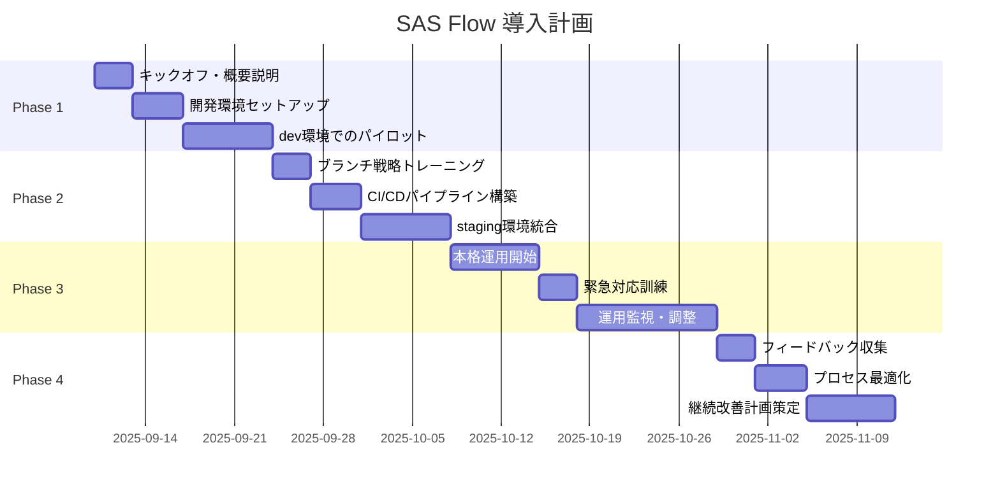

# SAS Flow 教育・導入計画書

**エス・エー・エス株式会社**  
**段階的導入とチーム教育戦略**

## 1. 導入計画概要

### 1.1 導入方針
- **段階的移行**: リスクを最小化する8週間の段階的導入
- **実践重視**: 座学より実際の操作を通じた学習
- **継続サポート**: 導入後3か月間の継続的フォローアップ
- **柔軟性確保**: チームの習熟度に応じたペース調整

### 1.2 成功指標（KPI）
```yaml
training_kpis:
  completion_rate:
    target: ">= 95%"
    measurement: "全対象者のトレーニング完了率"
  
  competency_score:
    target: ">= 80%"
    measurement: "実技テスト平均スコア"
  
  adoption_rate:
    target: ">= 90%"
    measurement: "SAS Flow利用率（4週間後）"
  
  incident_reduction:
    target: "< 50%"
    measurement: "Git関連インシデント削減率"
  
  productivity_improvement:
    target: "> 20%"
    measurement: "デプロイメント頻度向上"
```

## 2. 8週間導入スケジュール

### 2.1 導入タイムライン


### 2.2 Phase 1: 基盤準備（Week 1-2）

#### Week 1: キックオフ・基礎理解
**目標**: SAS Flowの全体像理解と基本概念の習得

**対象者**: 全開発メンバー（20名）  
**形式**: 全体会議 + ハンズオン

```bash
# Day 1: キックオフセッション（2時間）
講義内容:
- SAS Flow概要とメリット
- 従来手法との比較
- 導入スケジュールと期待値設定
- Q&A セッション

資料:
- SAS_FLOW_SPECIFICATION.md
- 比較表: Git Flow vs GitHub Flow vs SAS Flow

# Day 2-3: 基礎ハンズオン（各3時間）
実習内容:
1. ブランチ命名規則の実践
2. PR作成・レビューフロー
3. マージ戦略の理解
4. 基本的なGitコマンド復習

# 評価: 基礎理解度テスト（30問、85%以上で合格）
./scripts/run-basic-assessment.sh
```

#### Week 2: 環境セットアップ・個別指導
**目標**: 開発環境の完全移行と個別スキルアップ

```bash
# 個別環境セットアップ（各1時間）
1. ローカル開発環境の設定
   - Pre-commit hooks設定
   - IDE拡張機能インストール
   - SAS Flow用エイリアス設定

2. 権限・アクセス設定
   - GitHub Team配置
   - Branch protection有効化
   - 2FA設定確認

# 個別スキルアセスメント（各30分）
レベル別グループ分け:
- Beginner: Git基礎から
- Intermediate: ブランチ戦略フォーカス  
- Advanced: CI/CD統合・運用
```

### 2.3 Phase 2: パイロット運用（Week 3-4）

#### Week 3: 実プロジェクトでのパイロット実施
**目標**: 選択されたマイクロサービス1つでSAS Flow実践

```bash
# パイロット対象サービス選定基準
selection_criteria:
  - 開発アクティビティが中程度
  - 依存関係が比較的シンプル
  - チームの習熟度が高い
  - 本番への影響が限定的

# パイロット実施内容
1. feature/user-service/pilot-sas-flow ブランチでの開発
2. dev環境での自動デプロイ検証
3. レビュープロセスの実践
4. 問題点・改善点の収集

# 日次振り返りミーティング（30分）
- 遭遇した問題と解決策
- プロセスの改善提案
- 翌日の作業計画
```

#### Week 4: CI/CDパイプライン統合
**目標**: 完全なCI/CDパイプラインとの統合実現

```bash
# CI/CDパイプライン設定ワークショップ（4時間）
実習内容:
1. GitHub Actions ワークフロー作成
2. 環境別デプロイメント設定
3. セキュリティスキャン統合
4. 監視・アラート設定

# 統合テスト実習（3時間）
1. 依存サービス間のテスト実行
2. Contract Testの実装
3. Performance Testの実行
4. セキュリティテストの自動化
```

### 2.4 Phase 3: 本格展開（Week 5-6）

#### Week 5-6: 全サービスへの展開
**目標**: 全マイクロサービスでSAS Flow運用開始

```bash
# サービス別展開計画
rollout_schedule:
  week5:
    - Core Services (user-service, auth-service)
    - Platform Services (logging, monitoring)
  
  week6:  
    - Business Services (order, payment, inventory)
    - Edge Services (api-gateway, proxy)

# 展開支援体制
1. 各サービスチームにSAS Flow Champion配置
2. 技術的質問への即時対応（Slack チャンネル）
3. 毎日のオフィスアワー（16:00-17:00）
4. 緊急時のエスカレーション体制
```

### 2.5 Phase 4: 運用定着（Week 7-8）

#### Week 7-8: 運用最適化・継続改善
**目標**: 安定した運用体制の確立と継続改善プロセス構築

```bash
# 運用メトリクス収集・分析
metrics_collection:
  - デプロイメント頻度の測定
  - リードタイムの短縮効果分析
  - エラー率・復旧時間の改善確認
  - 開発者満足度調査

# 最終評価・認定試験
certification_exam:
  - 実技テスト（Git操作、PR作成・レビュー）
  - 緊急対応シミュレーション
  - ケーススタディ分析
  - 80%以上で合格、認定書発行
```

## 3. 対象者別教育プログラム

### 3.1 開発者向けトレーニング

#### 3.1.1 新人開発者（経験 < 1年）
**期間**: 4週間  
**目標**: SAS Flowを使った基本的な開発フローの習得

```yaml
curriculum:
  week1: 
    - Git基礎復習（コマンド操作、概念理解）
    - GitHub UI操作（Issue、PR、Review）
    - SAS Flow概要と命名規則
  
  week2:
    - ブランチ操作実習
    - コミットメッセージ規約
    - 基本的なPRフロー
  
  week3:
    - レビュープロセス参加
    - マージ・コンフリクト解決
    - CI/CD基礎
  
  week4:
    - 実際のタスクでの実践
    - メンター指導下での作業
    - 評価・フィードバック

assessment:
  - 実技テスト: 70%以上
  - コードレビュー参加: 5回以上
  - 独立したPR作成: 3回以上
```

#### 3.1.2 中級開発者（経験 1-3年）
**期間**: 2週間  
**目標**: SAS Flowを活用した効率的な開発プロセス習得

```yaml
curriculum:
  week1:
    - SAS Flow vs 従来手法の比較理解
    - 高度なブランチ戦略
    - レビュー手法・品質管理
  
  week2:
    - CI/CDパイプライン理解・カスタマイズ
    - パフォーマンス・セキュリティ観点
    - チーム内でのベストプラクティス共有

assessment:
  - コードレビューリード: 2回以上
  - 改善提案: 1件以上
  - 新人指導参加: 必須
```

#### 3.1.3 シニア開発者（経験 3年以上）
**期間**: 1週間  
**目標**: SAS Flow運用のリーダーシップと技術的深化

```yaml
curriculum:
  - アーキテクチャ観点でのSAS Flow最適化
  - 緊急対応・トラブルシューティング
  - チーム全体の生産性向上施策
  - 他チームへの展開支援

responsibilities:
  - SAS Flow Champion役割
  - 技術的問題の解決支援
  - ベストプラクティスの策定
  - 継続改善のリーダーシップ
```

### 3.2 チームリーダー・管理職向け

#### 3.2.1 テックリード向け（2日間）
```yaml
day1:
  morning:
    - SAS Flow の技術的アーキテクチャ
    - 品質・セキュリティ管理の強化点
    - パフォーマンス監視・改善方法
  
  afternoon:
    - チーム運用での注意点
    - 問題発生時のエスカレーション
    - 技術的負債への対処法

day2:
  morning:
    - メトリクス分析・改善計画策定
    - 他チーム・ステークホルダーとの調整
    - 継続的改善プロセスの設計
  
  afternoon:
    - 緊急対応時のリーダーシップ
    - チームメンバーのスキルアップ支援
    - 実践的な問題対応シミュレーション
```

#### 3.2.2 プロジェクトマネージャー向け（1日間）
```yaml
program:
  morning:
    - SAS Flow導入による業務影響
    - スケジュール・リソース計画への影響
    - ステークホルダー向け説明資料

  afternoon:
    - リスク管理・緊急時対応
    - 品質・セキュリティ保証プロセス
    - ROI測定・継続改善計画
```

## 4. 教材・リソース

### 4.1 トレーニング教材

#### 4.1.1 動画教材
```yaml
video_content:
  - "SAS Flow 概要説明" (15分)
  - "ブランチ作成からマージまで" (20分)
  - "コンフリクト解決実演" (10分)
  - "緊急対応フロー説明" (12分)
  - "CI/CD統合のポイント" (18分)

recording_schedule:
  - 各トレーニングセッションの録画
  - 質問・回答集の動画化
  - ベストプラクティス事例紹介
```

#### 4.1.2 実習環境
```bash
# サンドボックス環境の提供
repository: sas-com/training-sandbox
branches:
  - training/dev
  - training/staging  
  - training/main

# 実習用シナリオ
scenarios:
  1. 基本的な機能開発フロー
  2. バグ修正・ホットフィックス
  3. マージコンフリクト解決
  4. 緊急対応シミュレーション
  5. 複数人での同時開発
```

#### 4.1.3 チートシート・クイックリファレンス
```bash
# SAS Flow コマンドチートシート
./docs/sas-flow-cheatsheet.pdf

# よく使うGitコマンド集
./docs/git-commands-reference.md

# トラブルシューティングガイド
./docs/troubleshooting-guide.md

# 緊急時対応フローチャート  
./docs/emergency-flowchart.pdf
```

### 4.2 継続学習支援

#### 4.2.1 メンタリングプログラム
```yaml
mentoring:
  duration: "3ヶ月"
  frequency: "週1回、30分"
  
  mentor_responsibilities:
    - 技術的質問への回答
    - 実践的アドバイス提供
    - 成長計画策定・進捗確認
    
  mentee_commitments:
    - 定期的な学習進捗報告
    - 実践的課題への取り組み
    - フィードバック・改善提案
```

#### 4.2.2 コミュニティ活動
```bash
# 社内勉強会（月1回）
study_sessions:
  - "SAS Flow Tips & Tricks"
  - "事例紹介・失敗談共有" 
  - "新機能・改善点の紹介"
  - "他社事例・業界動向"

# Slack チャンネル
channels:
  - #sas-flow-help: 技術的質問・サポート
  - #sas-flow-tips: ベストプラクティス共有
  - #sas-flow-updates: アップデート情報
```

## 5. 評価・認定システム

### 5.1 スキルレベル認定

#### 5.1.1 認定レベル
```yaml
certifications:
  bronze:
    requirements:
      - 基礎トレーニング完了
      - 実技テスト 70%以上
      - PR作成・レビュー参加 5回以上
    
  silver:
    requirements:
      - Bronze認定取得
      - 独立したプロジェクト完遂
      - 技術的問題解決 3件以上
      - 新人指導経験 1回以上
    
  gold:
    requirements:
      - Silver認定取得
      - SAS Flow改善提案・実装
      - 緊急対応リード経験
      - チーム生産性向上貢献
    
  champion:
    requirements:
      - Gold認定取得
      - 他チーム支援・指導
      - 技術的リーダーシップ発揮
      - 継続的改善推進
```

#### 5.1.2 認定試験内容
```bash
# 実技テスト（Bronze）
1. Git基本操作（20点）
2. ブランチ作成・命名規則（15点）
3. PR作成・説明記載（20点）
4. コードレビュー実施（15点）
5. マージ・コンフリクト解決（20点）
6. 基本的なトラブルシューティング（10点）

# ケーススタディ（Silver以上）
- 緊急対応シナリオ分析
- 技術的問題解決アプローチ
- チーム運用改善提案
- ステークホルダー説明資料作成
```

## 6. サポート体制

### 6.1 導入期間中のサポート

#### 6.1.1 専任サポートチーム
```yaml
support_team:
  tech_lead:
    name: "山田太郎"
    role: "技術的指導・問題解決"
    availability: "平日 9:00-18:00"
  
  training_specialist:
    name: "佐藤花子"
    role: "教育プログラム運営・個別指導"
    availability: "平日 9:00-17:00"
  
  change_manager:
    name: "田中次郎"
    role: "組織変更・プロセス調整"
    availability: "平日 10:00-16:00"
```

#### 6.1.2 サポートチャンネル
```bash
# 即座対応（15分以内）
- 本番障害・緊急時: github@sas-com.com
- Slack: #emergency-support

# 日常サポート（2時間以内）  
- 技術的質問: #sas-flow-help
- 教育・学習: #sas-flow-training

# 計画・改善（翌営業日）
- プロセス改善: #sas-flow-feedback
- 長期計画: github-admin@sas-com.com
```

### 6.2 導入後継続サポート

#### 6.2.1 定期レビュー
```bash
# 週次運用レビュー（30分）
- 問題・課題の確認
- メトリクス分析
- 来週の改善計画

# 月次成果レビュー（1時間）
- KPI達成状況確認
- 成功事例・失敗事例共有
- プロセス・ツールの改善検討

# 四半期戦略レビュー（2時間）
- 全体戦略の見直し
- 技術トレンドへの対応
- 次四半期の目標設定
```

## 7. リスク管理・緊急時対応

### 7.1 導入リスクと対策

#### 7.1.1 技術的リスク
```yaml
risks:
  learning_curve:
    probability: "High"
    impact: "Medium" 
    mitigation:
      - 段階的導入で習熟期間確保
      - 個別指導・メンタリング強化
      - 実践的な練習環境提供
  
  production_issues:
    probability: "Medium"
    impact: "High"
    mitigation:
      - パイロット期間での十分な検証
      - ロールバック手順の明確化
      - 24時間サポート体制
  
  team_resistance:
    probability: "Medium" 
    impact: "Medium"
    mitigation:
      - 早期からの巻き込み・説明
      - 成功事例・メリットの可視化  
      - 段階的な権限移行
```

#### 7.1.2 組織的リスク
```yaml
organizational_risks:
  skill_gap:
    mitigation:
      - スキルアセスメント実施
      - 個別化された教育プログラム
      - 外部専門家の活用
  
  resource_shortage:
    mitigation:
      - 現実的な導入スケジュール
      - 優先順位付けによる段階的展開
      - 一時的な外部リソース活用
  
  stakeholder_alignment:
    mitigation:
      - 定期的な進捗報告・調整
      - 明確なROI指標設定
      - 早期の課題エスカレーション
```

### 7.2 緊急時対応計画
```bash
# Phase 1-2 での重大問題発生時
emergency_procedures:
  immediate_action:
    - 影響範囲の特定・隔離
    - 既存フローへの一時的復帰
    - ステークホルダーへの通知
  
  recovery_plan:
    - 根本原因分析
    - 修正・再テスト実施
    - 段階的な復旧
    - 再発防止策実装

# 完全ロールバック基準
rollback_criteria:
  - 本番サービスへの重大な影響
  - 2回以上の同種問題発生
  - チーム生産性の著しい低下（>30%）
  - 予定を2週間以上超過
```

## 8. 成功事例・改善提案収集

### 8.1 成功事例の収集・共有
```bash
# 月次成功事例発表会
success_stories:
  format: "5分プレゼン + 5分質疑応答"
  categories:
    - 生産性向上事例
    - 品質改善事例  
    - チーム協力事例
    - 創意工夫・改善事例
  
  rewards:
    - 最優秀事例: 特別休暇1日
    - 優秀事例: 書籍購入支援
    - 参加者全員: 軽食・ドリンク
```

### 8.2 継続改善サイクル
```bash
# Plan-Do-Check-Act サイクル
improvement_cycle:
  plan:
    - 月次メトリクス分析
    - 問題点・改善機会の特定
    - 改善計画策定
  
  do:
    - 小規模テスト実施
    - フィードバック収集
    - 段階的展開
  
  check:
    - 効果測定・分析
    - 予期しない副作用の確認
    - ステークホルダー満足度調査
  
  act:
    - 成功した改善の標準化
    - 失敗事例からの学習
    - 次サイクルの計画策定
```

---

**実施責任者**: GitHub管理チーム、人事部、各開発チーム  
**予算**: 1,200万円（教育費用、外部講師、ツール導入等）  
**開始日**: 2025-09-10  
**完了予定日**: 2025-11-05

**更新履歴**
- 2025-09-10: 初版作成（v1.0.0）

**関連ドキュメント**:
- [SAS_FLOW_SPECIFICATION.md](/home/kurosawa/github-guidelines/SAS_FLOW_SPECIFICATION.md)
- [SAS_FLOW_OPERATIONS_GUIDE.md](/home/kurosawa/github-guidelines/SAS_FLOW_OPERATIONS_GUIDE.md)
- [ONBOARDING.md](/home/kurosawa/github-guidelines/ONBOARDING.md)