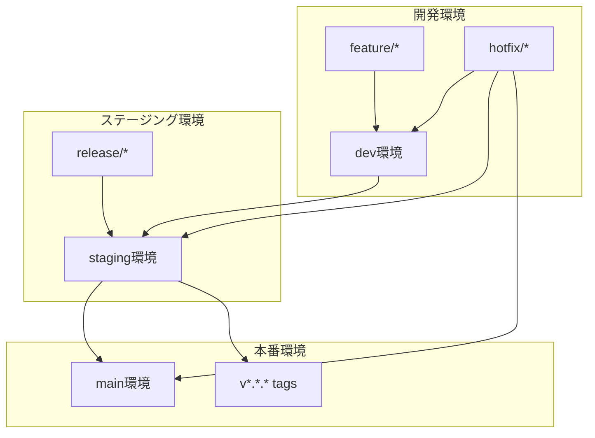

# SAS Git Flow 実装仕様書

**エス・エー・エス株式会社**  
**統合ブランチ戦略 - あらゆる開発プロジェクト対応**

## 1. 概要

### 1.1 SAS Git Flowとは
GitLab FlowとGitHub Flowのベストプラクティスを統合したエス・エー・エス株式会社の統合ブランチ戦略です。Web アプリケーション、モバイルアプリ、API サービス、ライブラリ、ドキュメントプロジェクトなど、あらゆる開発プロジェクトに対応できる柔軟性を持ちます。

### 1.2 設計原則
- **汎用性**: あらゆる技術スタック・プロジェクト規模に対応
- **安全性**: 強制プッシュ禁止、段階的環境昇格による品質保証
- **俊敏性**: 緊急時（L1-L4）レベル別対応フローによる迅速な問題解決
- **拡張性**: チーム規模やプロジェクト複雑度の変化に柔軟に対応
- **簡潔性**: 学習コストを抑えた直感的なワークフロー

## 2. アーキテクチャ設計

### 2.1 環境構成


### 2.2 ブランチ階層
```
main (本番環境)
├── staging (ステージング環境)
│   ├── dev (開発環境)
│   │   ├── feature/service-name/feature-description
│   │   ├── feature/shared/library-update
│   │   └── bugfix/service-name/issue-description
│   ├── release/v1.2.0
│   └── integration/batch-deployment-20250910
├── hotfix/critical/service-name/issue-id
└── tags/v1.2.0
```

### 2.3 プロジェクト管理戦略

#### 2.3.1 プロジェクトタイプ別対応
- **モノリシックアプリケーション**: 単一リポジトリでの機能ベース管理
- **ライブラリ/パッケージ**: バージョン管理とAPI互換性保持
- **Web/モバイルアプリ**: フロントエンド・UIコンポーネント管理
- **APIサービス**: エンドポイントベース管理
- **マイクロサービス**: サービス単位での独立デプロイ管理
- **ドキュメントプロジェクト**: コンテンツベース管理

#### 2.3.2 依存関係管理（プロジェクトタイプ別）
```yaml
# dependency-config.yaml
project_types:
  monolith:
    dependencies:
      - framework: ">=3.0.0"
      - database: ">=5.7.0"
    components:
      - frontend
      - backend
      - database
  
  library:
    dependencies:
      - runtime: ">=16.0.0"
    peer_dependencies:
      - react: ">=17.0.0"
    
  microservice:
    dependencies:
      - shared-library: ">=1.5.0"
    service_dependencies:
      - auth-service
      - config-service
```

## 3. 実装詳細

### 3.1 ブランチ命名規則
```
# 機能開発
feature/[component]/[feature-description]
例: 
  - feature/auth/add-profile-validation      # モノリス・API
  - feature/ui/implement-dark-mode          # Web・モバイル
  - feature/api/add-user-endpoints          # ライブラリ・API
  - feature/docs/update-installation-guide  # ドキュメント

# 共通・横断的機能
feature/shared/[description]
例: feature/shared/logging-framework-update

# バグ修正
bugfix/[component]/[issue-description]
例: 
  - bugfix/frontend/login-form-validation
  - bugfix/api/timeout-handling
  - bugfix/docs/broken-links

# 緊急修正
hotfix/[severity]/[component]/[issue-id]
例: 
  - hotfix/critical/auth/SAS-2024-001
  - hotfix/high/ui/performance-issue

# リリース準備
release/v[major].[minor].[patch]
例: release/v2.1.0

# 実験・検証用
experiment/[purpose]-[date]
例: experiment/performance-test-20250910
```

### 3.2 マージ戦略

#### 3.2.1 環境間マージルール
```yaml
# .github/branch-protection-rules.yaml
protection_rules:
  main:
    required_reviews: 2
    dismiss_stale_reviews: true
    require_code_owner_reviews: true
    required_status_checks:
      - ci/security-scan
      - ci/performance-test
      - ci/integration-test
    restrictions:
      push: ["github-admin-team"]
      merge: ["release-managers"]
  
  staging:
    required_reviews: 1
    required_status_checks:
      - ci/unit-test
      - ci/integration-test
      - ci/security-scan
    auto_merge: false
  
  dev:
    required_status_checks:
      - ci/unit-test
      - ci/lint
    auto_merge: true
```

#### 3.2.2 マージ方式
- **main**: Squash and merge（履歴の簡潔性）
- **staging**: Merge commit（トレーサビリティ確保）
- **dev**: Squash and merge（開発効率重視）

### 3.3 セキュリティ要件

#### 3.3.1 2FA必須設定
```json
{
  "required_two_factor_authentication": true,
  "members_can_create_repositories": false,
  "dependency_graph_enabled_for_new_repositories": true,
  "secret_scanning_enabled_for_new_repositories": true
}
```

#### 3.3.2 機密情報管理
- **禁止項目**: API Key、DB接続文字列、証明書、個人情報
- **検出ツール**: GitLeaks、TruffleHog、GitHub Secret Scanning
- **対応手順**: 即座のローテーション、コミット履歴からの削除

## 4. CI/CD統合

### 4.1 パイプライン設計（プロジェクトタイプ別）
```yaml
# .github/workflows/sas-git-flow.yml
name: SAS Git Flow Pipeline

on:
  push:
    branches: [dev, staging, main]
  pull_request:
    branches: [dev, staging, main]

jobs:
  # 共通バリデーション
  validate:
    runs-on: ubuntu-latest
    steps:
      - uses: actions/checkout@v4
      - name: Project Type Detection
        run: ./scripts/detect-project-type.sh
      - name: Dependency Validation
        run: ./scripts/validate-dependencies.sh
      
  # プロジェクトタイプ別テスト
  test:
    needs: validate
    strategy:
      matrix:
        test_type: [unit, integration, e2e, lint, docs]
    runs-on: ubuntu-latest
    steps:
      - name: Run Tests
        run: ./scripts/run-tests.sh ${{ matrix.test_type }}
  
  # セキュリティスキャン
  security:
    needs: validate
    runs-on: ubuntu-latest
    steps:
      - name: Security Scan
        run: ./scripts/security-scan.sh
      - name: Dependency Audit
        run: ./scripts/audit-dependencies.sh
  
  # プロジェクトタイプ別デプロイ
  deploy:
    needs: [test, security]
    if: github.ref == 'refs/heads/main'
    runs-on: ubuntu-latest
    environment: production
    steps:
      - name: Deploy Application
        run: ./scripts/deploy.sh
      - name: Update Documentation
        if: contains(github.event.head_commit.modified, 'docs/')
        run: ./scripts/deploy-docs.sh
```

### 4.2 環境別デプロイメント戦略
- **dev**: プッシュ時自動デプロイ（承認不要）
- **staging**: PR承認後自動デプロイ
- **main**: 手動承認 + Blue-Green デプロイメント

## 5. 監視・可観測性

### 5.1 メトリクス収集
```yaml
# monitoring-config.yaml
metrics:
  deployment_frequency: 
    target: "daily"
    measurement: "commits to main per day"
  
  lead_time:
    target: "< 4 hours"
    measurement: "PR creation to production deploy"
  
  failure_rate:
    target: "< 5%"
    measurement: "failed deployments / total deployments"
  
  recovery_time:
    target: "< 2 hours"
    measurement: "incident detection to resolution"
```

### 5.2 アラート設定
- **L1 Critical**: 本番障害、セキュリティインシデント
- **L2 High**: ステージング障害、パフォーマンス劣化
- **L3 Medium**: テスト失敗、依存関係の問題
- **L4 Low**: コードレビュー遅延、ドキュメント更新

## 6. トラブルシューティング

### 6.1 よくある問題と解決策

#### 6.1.1 マージコンフリクト
```bash
# 安全なコンフリクト解決手順
git checkout feature/my-feature
git fetch origin
git rebase origin/dev
# コンフリクト解決
git add .
git rebase --continue
git push --force-with-lease origin feature/my-feature
```

#### 6.1.2 依存関係の循環参照
```bash
# 依存関係検証ツール
./scripts/check-circular-dependencies.sh
# 出力例: user-service -> order-service -> user-service (CIRCULAR)
```

#### 6.1.3 デプロイメント失敗
```bash
# ロールバック手順
kubectl rollout undo deployment/[service-name] -n [namespace]
# 健全性確認
kubectl get pods -n [namespace] -l app=[service-name]
```

## 7. パフォーマンス最適化

### 7.1 ビルド時間短縮
- **並列テスト実行**: GitHub Actions Matrix Strategy
- **キャッシュ活用**: Docker Layer Caching、依存関係キャッシュ
- **段階的テスト**: Unit -> Integration -> E2E

### 7.2 デプロイメント最適化
- **Blue-Green デプロイメント**: ゼロダウンタイム実現
- **カナリアリリース**: 段階的トラフィック移行
- **ヘルスチェック**: Readiness/Liveness Probe

## 8. コンプライアンス

### 8.1 監査要件
- **変更履歴**: すべてのコード変更の完全なトレーサビリティ
- **承認記録**: レビュー者、承認時刻、承認理由の記録
- **セキュリティログ**: アクセスログ、操作ログの保持

### 8.2 データ保護
- **個人情報**: GDPR、個人情報保護法への準拠
- **機密情報**: 適切な分類と取り扱い
- **バックアップ**: 定期的なコード・設定のバックアップ

## 9. 移行計画

### 9.1 段階的移行（8週間）
- **Week 1-2**: dev環境でのSAS Flow導入
- **Week 3-4**: staging環境の構築と統合
- **Week 5-6**: CI/CDパイプラインの本格運用
- **Week 7-8**: main環境統合とチーム教育

### 9.2 リスク軽減策
- **並行運用期間**: 既存フローとの2週間並行運用
- **ロールバック計画**: 各段階での元環境への復旧手順
- **段階的適用**: Critical Servicesは最後に移行

## 10. 継続改善

### 10.1 定期見直し
- **月次レビュー**: メトリクス分析、問題点抽出
- **四半期改善**: プロセス改善、ツール更新
- **年次戦略見直し**: アーキテクチャ全体の見直し

### 10.2 フィードバックループ
- **開発者**: 使いやすさ、効率性の改善
- **運用チーム**: 安定性、監視性の向上
- **セキュリティチーム**: セキュリティ要件の強化

---

**更新履歴**
- 2025-09-10: 初版作成（v1.0.0）

**承認者**: GitHub管理チーム  
**次回レビュー**: 2025-12-10